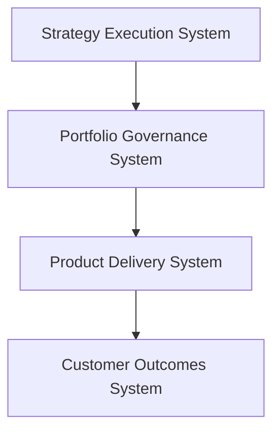
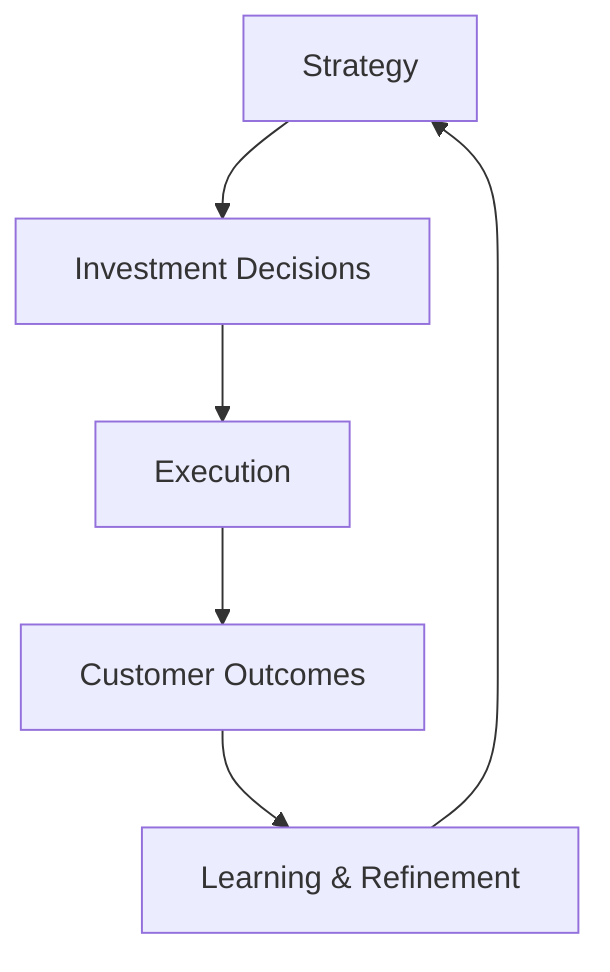

# Product Leadership Knowledge System Index

This document serves as the **navigation map for the Product Leadership Knowledge System**.

The repository is organized as a structured architecture library that explains how modern product organizations connect strategy, governance, delivery, outcomes, and decision intelligence.

Rather than reading the repository linearly, readers can use this index to explore the system through its major architectural layers and artifacts.

---

# System Architecture Overview

The Product Leadership Systems Architecture models product organizations as five coordinated operating systems.



Decision Intelligence System supports all layers.

The architecture forms a **closed-loop leadership system** that continuously connects:



---

# Core Architecture Artifacts

These artifacts define the foundational architecture of the Product Leadership Knowledge System.

They establish the system model, the operating logic, and the ownership boundaries that govern how modern product organizations connect strategy, governance, delivery, outcomes, and decision intelligence.

The three core architecture artifacts are:

• Unified Architecture  
• Operating System Overview  
• System Responsibilities Matrix  

Together, these documents form the architectural backbone of the repository.

---

# Unified Architecture

The Unified Architecture artifact defines the complete system model for the Product Leadership Systems Architecture.

It presents the five coordinated operating systems as a single integrated leadership architecture:

• Strategy Execution System  
• Portfolio Governance System  
• Product Delivery System  
• Customer Outcomes System  
• Decision Intelligence System  

Its purpose is to show how these systems connect as a closed-loop operating model that translates strategy into measurable outcomes.

Recommended location:

```text
architecture/UNIFIED_PRODUCT_LEADERSHIP_SYSTEMS_ARCHITECTURE.md
```
---

# Operating System Overview

The Operating System Overview artifact serves as the introductory view of the Product Leadership Systems Architecture.

It explains the overall operating model at a high level and provides the conceptual entry point into the rest of the repository.

Its purpose is to help readers understand:

- what the operating system is
- how the systems relate to each other
- why the architecture matters
- how to navigate the deeper artifacts

Recommended location: 
```text
frameworks/PRODUCT_LEADERSHIP_OPERATING_SYSTEM_OVERVIEW.md
```
---

# System Responsibilities Matrix

The System Responsibilities Matrix defines ownership boundaries across the five operating systems.

Its purpose is to clarify which system owns which responsibilities and which systems provide supporting input.

This artifact strengthens governance clarity by ensuring that:

- strategy remains strategic
- governance remains authoritative
- delivery remains execution-focused
- outcomes remain measurable
- intelligence remains enabling

Recommended location:  
```text
artifacts/SYSTEM_RESPONSIBILITIES_MATRIX.md
```

---

# Architecture Layers

The Product Leadership Systems Architecture is organized into five coordinated system layers.

These layers together create the operating logic of the repository and define how documentation should be interpreted.

The architecture layers are:

- Strategy Execution System
- Portfolio Governance System
- Product Delivery System
- Customer Outcomes System
- Decision Intelligence System

Each layer represents a distinct operating responsibility within the broader leadership model.

---

# Strategy Execution System

The Strategy Execution System defines strategic direction for the organization.

It establishes:

- strategic priorities
- investment themes
- opportunity focus areas
- leadership alignment mechanisms

This system provides the directional foundation for portfolio decisions and downstream execution.

Artifacts associated with this layer typically include:

- strategic planning frameworks
- prioritization logic
- leadership alignment models
- strategy execution playbooks

Recommended repository locations:
```text
frameworks/
playbooks/
```

---

# Portfolio Governance System

The Portfolio Governance System translates strategic direction into formal investment decisions.

It governs:

- initiative intake
- evaluation and prioritization
- sequencing
- resource allocation
- portfolio monitoring

This system ensures that the organization invests in the right work with the right level of governance discipline.

Artifacts associated with this layer typically include:

- intake models
- governance frameworks
- prioritization structures
- portfolio review mechanisms

Recommended repository locations:
```text
frameworks/
artifacts/
playbooks/
```

---

# Product Delivery System

The Product Delivery System executes the work approved through governance processes.

It is responsible for:

- roadmap execution
- product development coordination
- engineering alignment
- dependency management
- delivery predictability

This system transforms prioritized work into delivered products, capabilities, and operational improvements.

Artifacts associated with this layer typically include:

- delivery operating models
- roadmap management frameworks
- dependency coordination systems
- execution monitoring playbooks

Recommended repository locations:
```text
frameworks/
playbooks/
```

---

# Customer Outcomes System

The Customer Outcomes System measures whether delivered work creates meaningful value.

It is responsible for:

- adoption measurement
- value realization
- impact assessment
- customer feedback collection
- outcome validation

This system ensures the organization measures outcomes rather than stopping at delivery output.

Artifacts associated with this layer typically include:

- outcome measurement frameworks
- adoption models
- value realization artifacts
- impact assessment structures

Recommended repository locations:
```text
frameworks/
artifacts/
```

---

# Decision Intelligence System

The Decision Intelligence System is the cross-cutting analytical layer of the architecture.

It provides:

- metrics and KPI design
- analytics and reporting
- decision support
- governance insights
- feedback loop enablement

This system supports every other operating system by improving visibility, learning, and decision quality.

Artifacts associated with this layer typically include:

- KPI frameworks
- reporting models
- decision support structures
- feedback loop architectures

Recommended repository locations:
```text
frameworks/
artifacts/
```

--- 

# Repository Structure

The repository is organized into five primary documentation categories.


**architecture/**

Contains the canonical system architecture documents and top-level system models.

**frameworks/**

Contains conceptual operating models and structured architecture explanations.

**artifacts/**

Contains governance, ownership, and operational reference artifacts.

**playbooks/**

Contains applied implementation guides for running the operating system in practice.

**diagrams/**

Contains reusable visual models and architecture diagrams.

This structure ensures the repository reads like an architecture library rather than a collection of disconnected files.

---

# How to Navigate the Knowledge System

The recommended reading order for the repository is:

1. Product Leadership Operating System Overview  
   `frameworks/PRODUCT_LEADERSHIP_OPERATING_SYSTEM_OVERVIEW.md`

2. Unified Product Leadership Systems Architecture  
   `architecture/UNIFIED_PRODUCT_LEADERSHIP_SYSTEMS_ARCHITECTURE.md`

3. System Responsibilities Matrix  
   `artifacts/SYSTEM_RESPONSIBILITIES_MATRIX.md`

This sequence gives readers:

- the conceptual overview
- the canonical system model
- the ownership and governance logic

After reviewing these core artifacts, readers can navigate into deeper framework, artifact, and playbook content based on the layer or operating concern they want to explore.

Suggested progression:

- start with the overview
- move to the unified architecture
- review the responsibilities matrix
- then explore system-specific artifacts by layer

---

# Relationship to the Product Leadership Knowledge System

This repository represents the architectural foundation of the broader Product Leadership Knowledge System.

Additional repositories expand related domains such as:

• product leadership playbooks  
• AI product management  
• AI model libraries  
• innovation scaling  
• case studies  

Together these repositories form a comprehensive architecture library for modern product leadership.

---

# Architecture Evolution

Earlier design explorations of individual system components are preserved in archived repositories.

These repositories represent early architectural exploration prior to the unified Product Leadership Systems Architecture.

The concepts contained in these repositories have now been consolidated into the unified architecture documented in this repository.

Archived exploration repositories include:

• portfolio-governance-system  
• strategy-execution-system  
• decision-intelligence-system  
• product-delivery-system  

Readers should refer to the **Unified Product Leadership Systems Architecture** for the current system model.

---

# Summary

The Product Leadership Systems Architecture organizes product leadership into five coordinated operating systems:

- Strategy Execution System
- Portfolio Governance System
- Product Delivery System
- Customer Outcomes System
- Decision Intelligence System

These systems work together as a closed-loop leadership model that connects:

- strategic direction
- investment decisions
- delivery execution
- customer impact
- organizational learning

The repository structures these ideas into a coherent architecture library through core architecture artifacts, system-layer documentation, governance artifacts, playbooks, and diagrams.

This makes the repository function as a navigable internal-style architecture system for modern product leadership organizations.

---

# License

MIT License

Copyright (c) 2026 Chuck Ferrando

Permission is hereby granted, free of charge, to any person obtaining a copy
of this documentation and associated files to use, copy, modify, merge, publish,
distribute, sublicense, and/or sell copies of the materials, subject to the
terms and conditions of the MIT License.

The above copyright notice and this permission notice shall be included in all
copies or substantial portions of the documentation.

THE DOCUMENTATION IS PROVIDED "AS IS", WITHOUT WARRANTY OF ANY KIND, EXPRESS OR
IMPLIED, INCLUDING BUT NOT LIMITED TO THE WARRANTIES OF MERCHANTABILITY, FITNESS
FOR A PARTICULAR PURPOSE, AND NONINFRINGEMENT. IN NO EVENT SHALL THE AUTHORS OR
COPYRIGHT HOLDERS BE LIABLE FOR ANY CLAIM, DAMAGES, OR OTHER LIABILITY, WHETHER
IN AN ACTION OF CONTRACT, TORT OR OTHERWISE, ARISING FROM, OUT OF, OR IN
CONNECTION WITH THE DOCUMENTATION OR THE USE OR OTHER DEALINGS IN THE
DOCUMENTATION.


