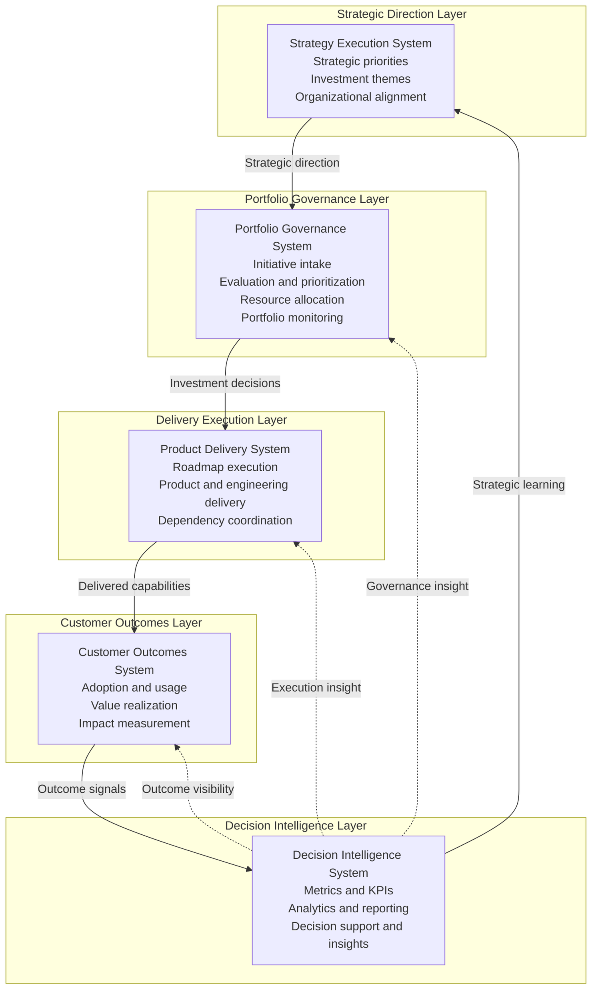
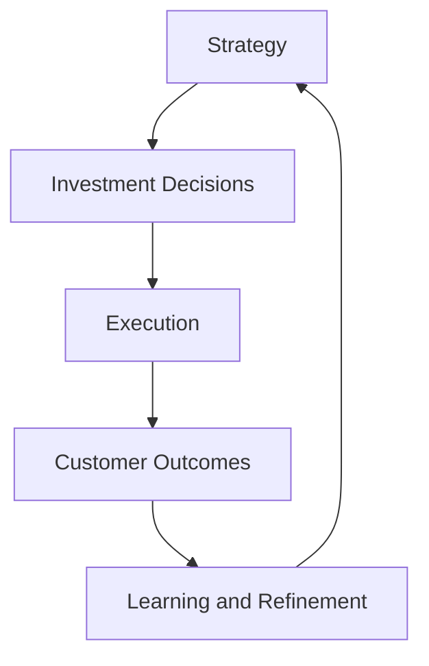

# Unified Product Leadership Systems Architecture

The **Unified Product Leadership Systems Architecture (PLSA)** defines the operating model used to run modern product organizations.

This architecture connects strategic direction, portfolio governance, product delivery, and customer outcomes into a coherent leadership system supported by decision intelligence.

The model separates responsibilities into distinct operating systems so that strategy, investment decisions, execution, and outcome measurement remain structurally aligned while operating as a coordinated whole.

---

# Purpose

The purpose of this artifact is to provide the **canonical architecture model** for the Product Leadership Systems Architecture.

While individual documents in the repository describe specific systems, artifacts, and frameworks, this document illustrates how the entire leadership architecture operates as a unified system.

The architecture provides clarity on:

• how strategy becomes investment decisions  
• how investment decisions become delivered capabilities  
• how delivered capabilities create measurable outcomes  
• how outcomes inform future strategic direction  

This artifact serves as the reference architecture for understanding how the systems interact.

---

# Diagram

The diagram below illustrates the **layered architecture of the Product Leadership Systems Architecture**.

---
## Diagram Interpretation

The diagram illustrates the structural organization of the **Product Leadership Systems Architecture** and the feedback signals that connect the systems into a continuous leadership operating loop.

The **Strategy Execution System** defines strategic direction, establishes investment themes, and aligns the organization around priority areas. It determines what matters most and where leadership attention should be focused.

The **Portfolio Governance System** translates strategic direction into structured investment decisions. It evaluates initiatives, prioritizes opportunities, allocates resources, and manages the portfolio to ensure work entering execution aligns with strategic intent.

The **Product Delivery System** coordinates execution across product, engineering, and cross-functional teams. It is responsible for planning, sequencing, and delivering approved work through a repeatable operating model.

The **Customer Outcomes System** measures whether delivered capabilities generated meaningful value. It captures adoption signals, usage patterns, customer impact, and broader indicators of value realization.

The **Decision Intelligence System** operates as a cross-cutting capability that supports the architecture through analytics, reporting, measurement infrastructure, and decision support. It helps leaders understand performance, identify patterns, and refine future decisions.

Together these systems form a closed-loop leadership architecture that connects strategy, governance, execution, outcomes, and learning.

---

## System Explanation

The Product Leadership Systems Architecture is composed of five coordinated systems, each with a distinct role in the operating model.

### Strategy Execution System

The Strategy Execution System defines the strategic direction of the organization. It establishes priorities, investment themes, and enterprise alignment so that leadership intent is explicit and actionable.

### Portfolio Governance System

The Portfolio Governance System governs how strategic priorities become funded and sequenced initiatives. It provides the decision structure for evaluating opportunities, making tradeoffs, allocating resources, and monitoring the portfolio over time.

### Product Delivery System

The Product Delivery System is responsible for execution. It coordinates product, engineering, and cross-functional teams to deliver approved initiatives through roadmaps, releases, and operational delivery mechanisms.

### Customer Outcomes System

The Customer Outcomes System measures whether delivered capabilities created meaningful value. It focuses on adoption, value realization, impact measurement, and customer feedback to determine whether investments produced the intended results.

### Decision Intelligence System

The Decision Intelligence System provides the analytical foundation for the architecture. It supplies metrics, dashboards, reporting, and decision support across all systems, enabling leadership teams to govern and refine the operating model using evidence rather than intuition alone.

---

## Operating Logic

The Product Leadership Systems Architecture functions as a coordinated operating model that translates strategy into measurable outcomes.

The operating logic begins with the **Strategy Execution System**, where leaders define strategic direction, identify investment themes, and align the organization around shared priorities.

These priorities move into the **Portfolio Governance System**, where initiatives are evaluated, compared, prioritized, and funded. Governance converts strategic intent into explicit investment decisions.

Approved work then moves into the **Product Delivery System**, where product, engineering, and cross-functional teams coordinate execution. This system is responsible for planning and delivering the capabilities that the portfolio has authorized.

Once capabilities are delivered, the **Customer Outcomes System** determines whether those investments created meaningful value. Adoption, usage, customer impact, and value realization provide the evidence of whether execution produced the intended results.

The **Decision Intelligence System** supports the entire architecture by collecting signals, analyzing performance, and generating insights that inform governance decisions and future strategic refinement.

This logic creates a closed-loop leadership model:

The architecture is effective because each system maintains clear responsibilities while remaining connected to the broader operating model.

---

## Why This Matters

Many organizations struggle to connect strategic intent to measurable outcomes because leadership responsibilities are not clearly structured.

Common failure patterns include:

- strategy that does not translate into explicit investment decisions
- governance processes that are disconnected from execution realities
- delivery organizations operating independently of portfolio priorities
- outcome measurement that fails to influence future leadership decisions

The Unified Product Leadership Systems Architecture addresses these challenges by separating leadership responsibilities into coordinated operating systems.

This matters because modern product organizations need more than strong teams and well-defined roadmaps. They need an operating architecture that connects strategy, governance, execution, customer value, and learning into a coherent leadership system.

By making those relationships explicit, the architecture improves clarity, accountability, and organizational scalability.

---

## How To Use This

This artifact can be used to assess, design, or explain a product leadership operating model.

Leadership teams can use the unified architecture to:

- evaluate whether strategy, governance, delivery, and outcomes are structurally connected
- identify responsibility gaps or overlap between systems
- clarify how investment decisions move through the organization
- improve traceability from strategic priorities to customer impact

This artifact is especially useful when:

- designing or redesigning product operating models
- clarifying executive decision ownership
- aligning delivery organizations with enterprise priorities
- building architecture documentation for product leadership systems

Used correctly, the unified architecture becomes a reference model for how modern product organizations should operate at scale.

---

## Relationship To The Operating System

This artifact represents the canonical architecture model for the **Product Leadership Systems Architecture**.

It defines how the major systems of the operating model connect and how leadership decisions move from strategic intent to measurable customer outcomes.

Within the repository, this document works alongside:

- the README, which introduces the overall architecture
- the System Responsibilities Matrix, which defines operating ownership across systems
- governance flow artifacts, which explain how portfolio decisions move through the model
- interaction diagrams, which show how systems exchange decisions, inputs, and signals
- implementation frameworks and playbooks, which describe how the architecture can be applied in practice

In this way, the unified architecture serves as the structural foundation for the broader knowledge system.

---

## Summary

The Unified Product Leadership Systems Architecture defines how modern product organizations translate strategy into governed investments, coordinated delivery, measurable customer outcomes, and continuous learning.

By separating strategic direction, portfolio governance, delivery execution, customer outcomes, and decision intelligence into distinct but connected systems, the architecture creates a scalable operating model for product leadership.

This artifact serves as the canonical reference for understanding how the architecture functions as a complete leadership system.

---

## Related Architecture Views

The Product Leadership Systems Architecture can be explored through several complementary diagrams:

- Layered Architecture Model  
- Executive Control Architecture  
- Architecture Metamodel  
- System Interaction Map  

The System Interaction Map illustrates how the architecture operates through the interaction of the five leadership systems.

See:

→ [PLSA System Interaction Map](../diagrams/PLSA_SYSTEM_INTERACTION_MAP.md)

---

## License

This repository is released under the **MIT License**.

The MIT License permits reuse, modification, and distribution of this material provided that the original copyright and license notice are included.

See the full license text in the repository:

[MIT License](../LICENSE)

