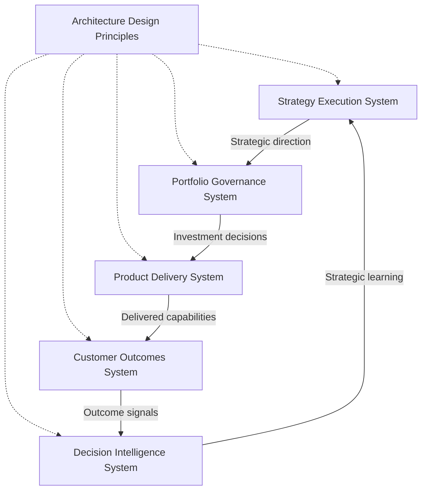
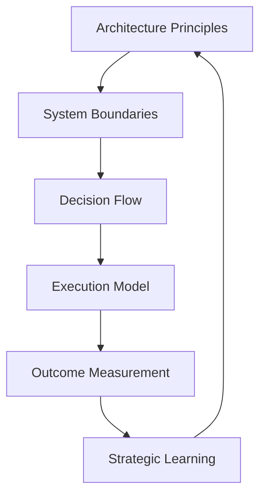

# Architecture Design Principles

The **Architecture Design Principles** define the foundational rules that govern the **Product Leadership Systems Architecture (PLSA)**.

These principles ensure that the architecture remains coherent, scalable, and structurally aligned as new diagrams, frameworks, artifacts, and playbooks are added to the repository.

Rather than describing a single workflow or system interaction, this document establishes the design logic that preserves architectural integrity across the full knowledge system.

---

# Purpose

The purpose of this artifact is to define the **architectural principles** that shape the Product Leadership Systems Architecture.

While the unified architecture describes the system model itself, this document explains the rules that determine how the model should be interpreted, extended, and maintained over time.

The principles provide clarity on:

- how system boundaries should be preserved
- how strategy, governance, delivery, outcomes, and intelligence should relate
- how architecture artifacts should reinforce the operating model
- how documentation should remain consistent as the repository evolves

This document helps ensure that the repository functions as a disciplined architecture library rather than a collection of disconnected materials.

---

# Diagram

The diagram below illustrates the design logic of the Product Leadership Systems Architecture by showing how architectural principles govern the relationship between strategy, governance, delivery, outcomes, and intelligence.

## Diagram Interpretation

The diagram shows that the **Architecture Design Principles** operate as governing rules across the full **Product Leadership Systems Architecture (PLSA)**.

The principles do not function as a sixth operating system. Instead, they define the structural rules that preserve the intended relationship between the five existing systems.

The **Strategy Execution System** must remain the source of strategic direction, investment themes, and organizational priorities.

The **Portfolio Governance System** must remain the decision layer that converts strategic direction into portfolio choices, funding decisions, sequencing, and resource allocation.

The **Product Delivery System** must remain responsible for execution. It should coordinate the delivery of approved work rather than define strategy or make portfolio investment decisions.

The **Customer Outcomes System** must remain responsible for measuring adoption, value realization, and impact. It should assess whether execution created meaningful value rather than manage delivery activity directly.

The **Decision Intelligence System** must remain a supporting capability that strengthens the architecture through analytics, reporting, measurement infrastructure, and decision support.

Together, these principles preserve the architecture by ensuring that systems remain distinct in responsibility while connected through a coherent strategy-to-outcomes operating model.

---

## Principle Explanation

The Product Leadership Systems Architecture is guided by a set of design principles that preserve structural clarity, system integrity, and long-term documentation consistency.

### 1. System Responsibility Clarity

Each system must have a distinct and limited role within the architecture. Strategy, governance, delivery, outcomes, and intelligence should not be collapsed into a single operating layer.

### 2. Strategy Before Governance

Strategic direction must shape governance criteria before investment decisions are made. Governance should translate strategic intent into decisions, not generate strategy independently.

### 3. Governance Before Execution

Delivery should execute approved work only after the Portfolio Governance System has evaluated and authorized the investment. This preserves prioritization discipline and prevents delivery from becoming the default decision layer.

### 4. Outcomes Over Activity

The architecture should evaluate effectiveness through adoption, value realization, and impact rather than delivery activity alone. Shipping work matters, but customer and organizational value are the true indicators of success.

### 5. Intelligence as a Supporting Capability

Decision Intelligence must improve decision quality across the architecture through analytics, measurement, and insight. It should support the operating model without replacing the primary strategy-to-outcomes flow.

### 6. Closed-Loop Learning

The architecture must operate as a closed loop. Strategic direction leads to investment decisions, investment leads to execution, execution leads to outcomes, and outcomes generate learning that informs future strategy.

### 7. Clear Interfaces Between Systems

Systems should exchange only the decisions, signals, and inputs appropriate to their role. Clear interfaces reduce ambiguity, improve alignment, and strengthen accountability.

### 8. Documentation Must Reinforce Architecture

Every artifact in the repository should reinforce the canonical architecture rather than introduce conflicting terminology, unclear ownership, or alternate system models.

---

## Operating Logic

The operating logic of the Architecture Design Principles is that **architectural quality depends on disciplined structure**.

Strong operating systems are not produced only by clear diagrams. They are produced by adherence to principles that preserve the meaning of those diagrams over time.

In the Product Leadership Systems Architecture, the principles govern how leadership responsibilities are distributed, how decisions move through the architecture, and how documentation artifacts should be created and maintained.

This logic ensures that:

- strategy defines direction
- governance makes investment decisions
- delivery executes authorized work
- outcomes measure realized value
- intelligence improves decision quality across all systems

The principles also govern how the repository evolves. New diagrams, frameworks, artifacts, and playbooks should clarify the architecture rather than create competing interpretations of it.

This creates a principle-driven operating logic:

The architecture remains effective when principles guide both the operating model and the documentation system that describes it.

---

## Why This Matters

Many architecture repositories become inconsistent over time because they add new documents faster than they maintain structural discipline.

Common failure patterns include:

- system responsibilities drifting across documents
- alternate terminology emerging in different artifacts
- governance and delivery responsibilities becoming blurred
- outcome measurement being treated as an execution detail rather than a separate system
- analytics being described as a replacement for leadership rather than a supporting capability

The Architecture Design Principles prevent these problems by defining the rules that all future artifacts should follow.

This matters because the long-term value of the repository depends not only on the quality of individual documents, but also on the consistency of the architecture as a whole. Clear principles preserve coherence, improve maintainability, and strengthen the credibility of the knowledge system.

---

## How To Use This

This artifact can be used to assess whether new or existing documentation remains aligned to the Product Leadership Systems Architecture.

Leaders, architects, and maintainers can use these principles to:

- evaluate whether artifacts preserve clear system boundaries
- detect architectural drift across diagrams and documents
- ensure that governance remains positioned between strategy and delivery
- verify that outcomes and intelligence are represented correctly
- guide the creation of new frameworks, diagrams, and playbooks

This artifact is especially useful when:

- reviewing new architecture documents
- expanding the repository into new artifact types
- checking consistency across multiple system descriptions
- maintaining architecture quality over time

Used correctly, the Architecture Design Principles become the rule set that keeps the knowledge system coherent as it grows.

---

## Relationship To The Operating System

This artifact supports the broader **Product Leadership Systems Architecture** by defining the design rules that preserve its structural integrity.

Within the repository, it works alongside:

- the README, which introduces the architecture at a portfolio level
- the Unified Product Leadership Systems Architecture, which defines the canonical system model
- the System Responsibilities Matrix, which defines ownership boundaries across systems
- the System Interaction Diagram, which explains how systems exchange signals and decisions
- the Governance Decision Flow, which explains how portfolio decisions move through the architecture
- future frameworks and playbooks, which operationalize the architecture in practice

In this way, the Architecture Design Principles act as the architectural guardrails for the full documentation library.

---

## Summary

The Architecture Design Principles define the rules that keep the Product Leadership Systems Architecture coherent, scalable, and structurally consistent.

By preserving clear system boundaries, reinforcing the strategy-to-outcomes model, and guiding how artifacts are created and maintained, these principles ensure that the repository functions as a disciplined architecture library rather than a loose collection of documents.

This artifact provides the architectural guardrails needed to sustain the integrity of the knowledge system over time.

---

## License

This repository is released under the **MIT License**.

The MIT License permits reuse, modification, and distribution of this material provided that the original copyright and license notice are included.

See the full license text in the repository:

[MIT License](../LICENSE)

