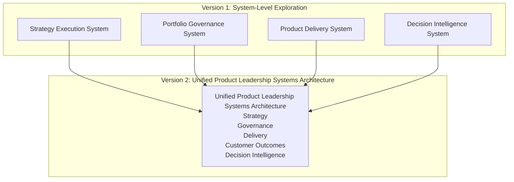
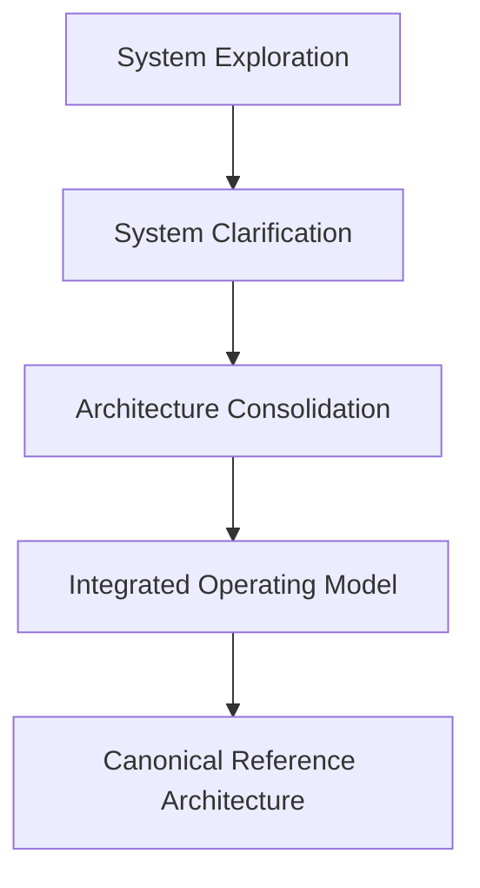

# Architecture Evolution

The **Architecture Evolution** artifact explains how the **Product Leadership Systems Architecture (PLSA)** developed from earlier repository-level explorations into a unified architecture model.

This document clarifies the progression from individual system-focused repositories toward a single integrated architecture that connects strategy, governance, delivery, outcomes, and intelligence into a coherent leadership system.

Rather than introducing a new architecture, this document explains how the current architecture emerged and why the unified model is now the canonical reference.

---

# Purpose

The purpose of this artifact is to document the **evolution of the Product Leadership Systems Architecture**.

While the unified architecture defines the current canonical model, this document explains how the architecture matured over time through earlier system-level exploration and consolidation.

The artifact provides clarity on:

- how the architecture evolved from separate system explorations
- why the unified model became necessary
- what changed between the earlier repository model and the current integrated architecture
- how architectural maturity improved through consolidation
- why the unified repository is now the primary reference point

This document helps readers understand that the current architecture is the result of deliberate refinement rather than a disconnected collection of ideas.

---

# Diagram

The diagram below illustrates the architectural evolution from earlier system-level repositories to the unified Product Leadership Systems Architecture.

---

## Diagram Interpretation

The diagram shows how the current **Product Leadership Systems Architecture (PLSA)** emerged from an earlier phase of system-level architectural exploration.

In the initial version, architecture thinking was developed through separate repositories focused on individual systems. These repositories explored important concepts such as strategy execution, portfolio governance, product delivery, and decision intelligence as distinct architectural areas.

That early structure was valuable because it allowed each system to be clarified independently. However, as the architecture matured, it became increasingly important to represent the organization not as a set of isolated systems, but as a **coordinated leadership operating model**.

The unified architecture therefore consolidated those separate explorations into a single system model.

This evolution introduced a more complete representation of how the systems work together, added explicit treatment of **Customer Outcomes** as a first-class system, and clarified **Decision Intelligence** as a supporting capability operating across the architecture.

The result is a more mature, coherent, and scalable architecture model.

---

## Evolution Explanation

The Product Leadership Systems Architecture evolved through two major stages of maturity.

### Version 1: System-Level Exploration

The first stage focused on exploring major product leadership systems as separate architectural domains.

This included repository-level thinking around:

- Strategy Execution
- Portfolio Governance
- Product Delivery
- Decision Intelligence

This phase was useful for clarifying the unique role of each system and for building early architectural language around product leadership.

However, the system-level approach also had limitations. It made it harder to see how the systems interacted as a unified operating model and did not yet fully express the closed-loop nature of leadership, especially the role of customer outcomes in shaping future direction.

### Version 2: Unified Architecture Model

The second stage consolidated the architecture into the **Product Leadership Systems Architecture** as a single integrated repository.

This shift introduced several important advances:

- the systems were organized into one coherent strategy-to-outcomes model
- Customer Outcomes became an explicit architectural system
- Decision Intelligence was positioned as a cross-cutting support capability
- the repository structure was redesigned as a documentation library rather than a set of separate explorations
- diagrams, artifacts, frameworks, and principles were brought into one consistent architecture narrative

This shift marked the transition from exploratory architecture thinking to a mature reference architecture.

---

## Operating Logic

The operating logic of the architecture evolution is that **architectural maturity increases when separate system concepts are integrated into a coherent operating model**.

In the early stage, architectural thinking emphasized separation of concerns. Individual systems could be described independently, which was useful for developing language and system clarity.

As the architecture matured, the more important challenge became integration. Strategy, governance, delivery, outcomes, and intelligence needed to be represented not just as distinct systems, but as parts of one leadership model.

This evolution improved the architecture in several ways:

- it made the strategy-to-outcomes flow explicit
- it clarified the role of governance between strategy and delivery
- it elevated customer outcomes into a first-class architectural system
- it positioned decision intelligence as a support layer rather than a competing system flow
- it organized the repository around architecture documentation rather than separate isolated domains

The architecture became stronger not by adding more disconnected concepts, but by integrating them into a clearer and more disciplined model.

## Maturity Progression Diagram

---

## Why This Matters

Architecture repositories often appear fully formed when viewed after the fact, but strong architecture usually emerges through iteration, refinement, and consolidation.

Documenting architectural evolution matters because it helps explain:

- why earlier repository structures existed
- how the architecture matured over time
- why the unified model is now the primary reference
- how current decisions reflect deliberate architectural refinement rather than arbitrary change

This matters especially in knowledge systems because without an evolution narrative, readers may interpret older structures as competing models rather than earlier stages of architectural development.

The Architecture Evolution artifact preserves that context and helps maintain clarity as the repository grows.

---

## How To Use This

This artifact can be used to explain how the Product Leadership Systems Architecture developed and why the current unified model should be treated as canonical.

Leaders, readers, and maintainers can use this document to:

- understand the relationship between earlier repositories and the unified architecture
- explain why Customer Outcomes and Decision Intelligence are positioned as they are in the current model
- clarify that the unified repository supersedes earlier exploratory structures
- preserve continuity between earlier architectural thinking and the current reference model
- reinforce the maturity of the knowledge system over time

This artifact is especially useful when:

- introducing the portfolio to new readers
- explaining the architecture's historical development
- reducing confusion about earlier repository structures
- documenting the transition from exploration to integration

Used correctly, the Architecture Evolution artifact becomes the narrative bridge between the repository's earlier phases and its current architecture maturity.

---

## Relationship To The Operating System

This artifact supports the broader **Product Leadership Systems Architecture** by explaining how the architecture itself matured into its current form.

Within the repository, it works alongside:

- the README, which introduces the portfolio and current architecture
- the Unified Product Leadership Systems Architecture, which defines the canonical system model
- the Architecture Design Principles, which define the rules preserving structural integrity
- the Product Leadership Operating System Overview, which explains how the architecture functions in practice
- the diagrams and artifacts, which explain responsibilities, interactions, governance flow, and learning loops

In this way, the Architecture Evolution artifact provides the historical and structural context that explains why the current architecture should be treated as the authoritative model.

---

## Summary

The Architecture Evolution artifact documents how the Product Leadership Systems Architecture matured from separate system-level explorations into a unified reference architecture.

By explaining the transition from isolated architectural domains to an integrated strategy-to-outcomes model, this document clarifies why the current repository structure exists and why the unified architecture is now the canonical reference.

This artifact helps readers understand not only what the architecture is, but how it became coherent over time.

---

## License

This repository is released under the **MIT License**.

The MIT License permits reuse, modification, and distribution of this material provided that the original copyright and license notice are included.

See the full license text in the repository:

[MIT License](../LICENSE)
