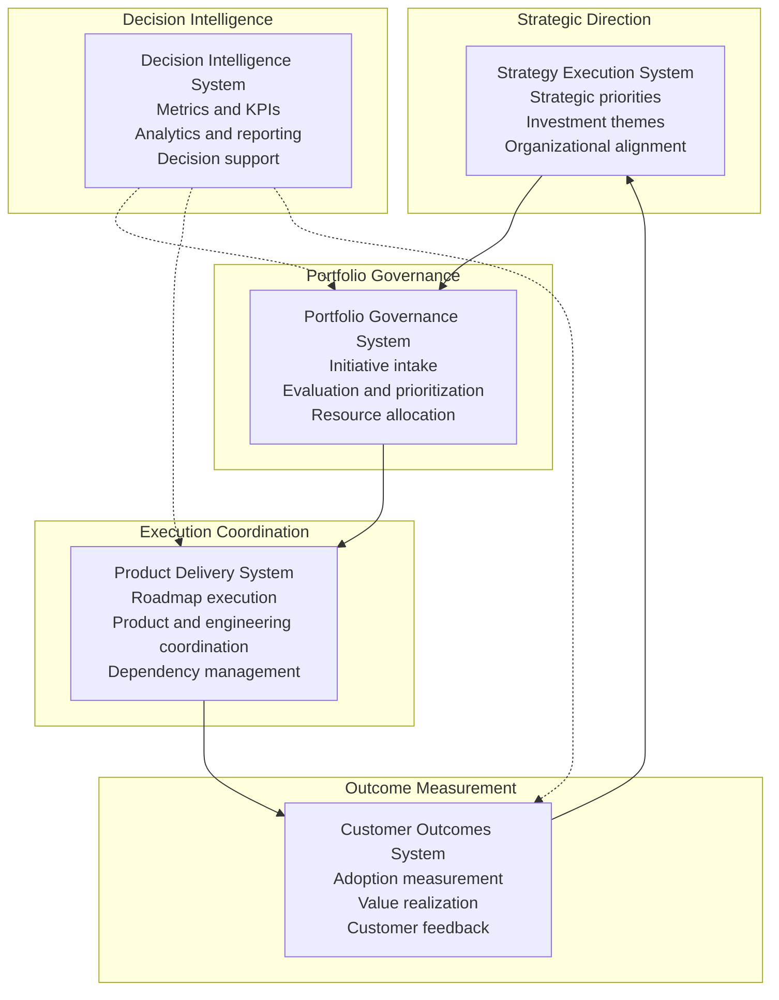
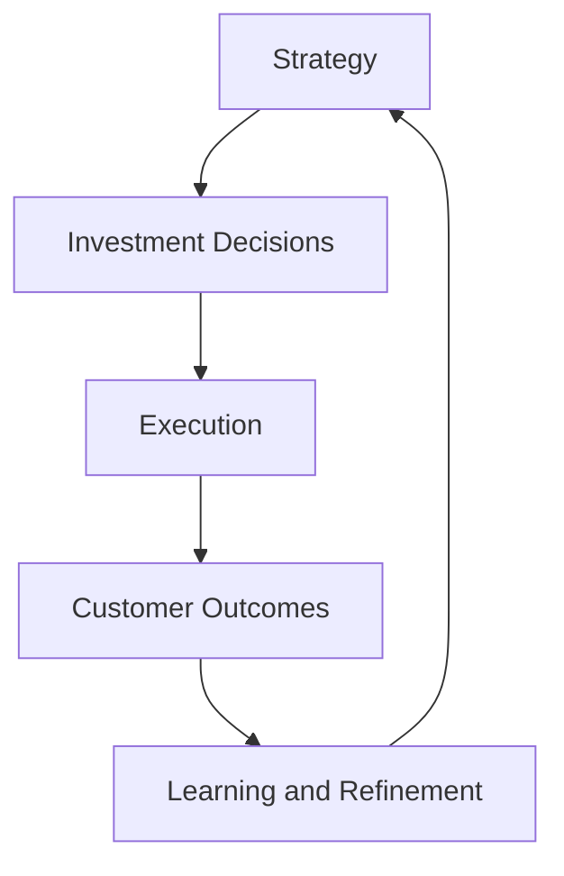

# System Responsibilities Matrix

The **System Responsibilities Matrix** defines the operating boundaries between the systems that compose the **Product Leadership Systems Architecture (PLSA)**.

This artifact clarifies the specific responsibilities of each system and prevents architectural drift where strategy, governance, execution, and outcomes become mixed within the same operating processes.

Maintaining clear system boundaries ensures that the architecture remains scalable, governable, and understandable across complex product organizations.

---

# Purpose

The purpose of this artifact is to define **clear system ownership within the Product Leadership Systems Architecture**.

Modern product organizations often struggle when strategy, prioritization, delivery, and measurement responsibilities become entangled. The System Responsibilities Matrix establishes explicit ownership for each system so that leadership teams can operate the architecture intentionally.

The matrix provides clarity on:

• which system performs each leadership function  
• where key decisions occur  
• what outputs each system produces  
• how systems interact without overlapping responsibilities

---

# Diagram

The diagram below illustrates the layered system responsibilities across the Product Leadership Systems Architecture.

---

## Diagram Interpretation

The diagram illustrates how the **Product Leadership Systems Architecture (PLSA)** separates leadership responsibilities into distinct but coordinated operating systems.

The **Strategy Execution System** establishes strategic direction, investment priorities, and organizational alignment. It defines what matters most and where leadership attention should focus.

The **Portfolio Governance System** translates strategic intent into structured investment decisions. It evaluates initiatives, prioritizes opportunities, allocates resources, and ensures that work entering execution aligns with enterprise priorities.

The **Product Delivery System** is responsible for coordinating execution. It manages roadmap delivery, product and engineering collaboration, dependency management, and the operational movement of approved work into delivered capabilities.

The **Customer Outcomes System** determines whether delivered capabilities generated real value. It measures adoption, usage, value realization, and customer impact.

The **Decision Intelligence System** operates as a cross-cutting capability. It provides analytics, measurement infrastructure, reporting, and decision support across the architecture, enabling leaders to learn from performance and refine future decisions.

Together, these systems form a closed-loop leadership model that connects strategy, governance, execution, outcomes, and learning.

---

## System Responsibilities Matrix

The table below defines the primary operating responsibilities of each system within the Product Leadership Systems Architecture.

| System | Primary Responsibility | Key Decisions | Typical Outputs |
|---|---|---|---|
| Strategy Execution System | Define strategic direction, investment themes, and organizational priorities | What strategic priorities matter most, where to focus, and how to align the organization | Strategic priorities, investment themes, enterprise direction |
| Portfolio Governance System | Evaluate initiatives, prioritize investments, and allocate resources | Which initiatives proceed, how investments are sequenced, and where resources are assigned | Approved initiatives, portfolio priorities, funding decisions, sequencing decisions |
| Product Delivery System | Execute approved work through coordinated product and engineering delivery | How approved work is planned, coordinated, and delivered | Roadmaps, releases, delivered capabilities, execution progress |
| Customer Outcomes System | Measure adoption, value realization, and customer impact | Whether delivered work created meaningful outcomes | Adoption metrics, value realization signals, outcome insights |
| Decision Intelligence System | Provide measurement, analytics, and decision support across the model | What performance data indicates, where risks or opportunities exist, and how leaders should adapt | KPIs, dashboards, governance insights, performance analysis, strategic learning |

This matrix reinforces a foundational architectural rule: each system has a distinct role and should not absorb the responsibilities of another system.

---

## Operating Logic

The Product Leadership Systems Architecture functions as a coordinated operating model that translates strategy into measurable outcomes.

The operating logic begins with the **Strategy Execution System**, where leaders define strategic direction, identify investment themes, and create organizational alignment around priorities.

These priorities move into the **Portfolio Governance System**, where initiatives are evaluated, compared, prioritized, and funded. Governance converts strategy into explicit investment decisions.

Approved work then moves into the **Product Delivery System**, which coordinates execution across product, engineering, and cross-functional teams. This system is responsible for delivering capabilities, managing dependencies, and advancing roadmap commitments.

Once capabilities are delivered, the **Customer Outcomes System** measures whether those capabilities produced meaningful value. This includes adoption, usage, customer benefit, and broader impact.

The **Decision Intelligence System** supports the full architecture by collecting performance signals, analyzing results, and generating insights that inform both governance and future strategic refinement.

This logic creates a closed-loop leadership model:

The architecture is effective because each system performs a distinct function while remaining connected to the broader leadership model.

---

## Why This Matters

Many organizations struggle because strategic intent, investment decisions, delivery execution, and outcome measurement are not clearly separated.

When responsibilities are blurred, several failure patterns emerge:

- strategy is defined without a mechanism for disciplined prioritization
- governance decisions are made inside delivery teams rather than through portfolio structures
- delivery is measured by activity rather than value
- customer outcomes fail to influence future strategy

The Product Leadership Systems Architecture addresses these issues by making system responsibilities explicit.

This matters because modern product organizations need more than good ideas and strong teams. They need an operating architecture that connects strategy to execution and execution to measurable outcomes.

The System Responsibilities Matrix helps preserve that architecture by preventing responsibility overlap, improving accountability, and making leadership decisions more structured and scalable.

---

## How To Use This

This artifact can be used to assess, design, or refine a product leadership operating model.

Leadership teams can use the matrix to:

- identify where strategic, governance, delivery, and outcome responsibilities currently reside
- detect overlapping responsibilities or architectural gaps
- clarify decision ownership across product organizations
- improve traceability from strategic intent to customer impact

This artifact is especially useful when:

- redesigning product operating models
- clarifying executive and cross-functional decision rights
- evaluating whether governance is functioning effectively
- scaling product organizations that have grown structurally inconsistent

Used correctly, the matrix becomes a diagnostic and design tool for strengthening leadership system integrity.

---

## Relationship To The Operating System

This artifact supports the broader **Product Leadership Systems Architecture** by defining the distinct responsibilities of each system within the operating model.

It complements the architecture by translating abstract system definitions into explicit operating ownership.

Within the repository, this artifact works alongside:

- the README, which introduces the overall architecture
- the unified architecture document, which defines the canonical system model
- governance flow artifacts, which explain portfolio decision movement
- interaction diagrams, which show how systems exchange inputs, decisions, and signals

In this way, the System Responsibilities Matrix acts as a structural bridge between the high-level architecture and the practical operating mechanisms of the product leadership system.

---

## Summary

The System Responsibilities Matrix defines the operating boundaries of the Product Leadership Systems Architecture.

It clarifies how strategic direction, portfolio governance, delivery execution, customer outcomes, and decision intelligence function as distinct but coordinated systems.

By making these boundaries explicit, the matrix helps organizations avoid responsibility overlap, improve leadership clarity, and build a more scalable strategy-to-outcomes operating model.

This artifact strengthens the architecture by ensuring that the repository documents not only what the systems are, but also what each system is responsible for doing.

---

## License

This repository is released under the **MIT License**.

The MIT License permits reuse, modification, and distribution of this material provided that the original copyright and license notice are included.

See the full license text in the repository:

[MIT License](../LICENSE)

