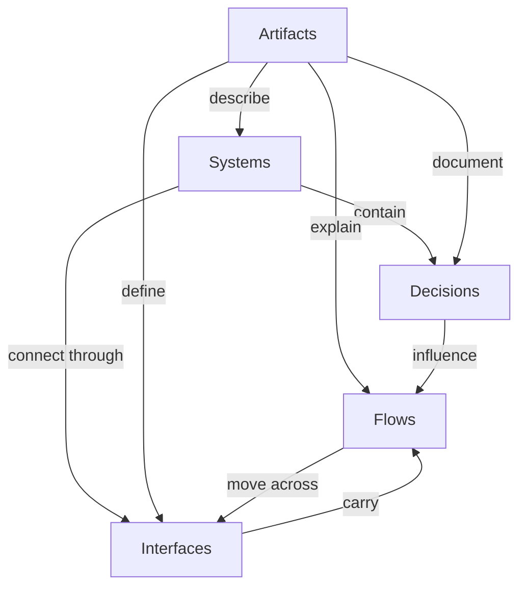
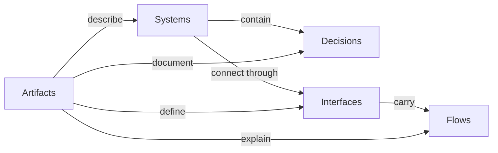

# Product Leadership Systems Architecture Metamodel
Product Leadership Systems Architecture (PLSA)

---

# Purpose

This document defines the **formal metamodel** for the **Product Leadership Systems Architecture (PLSA)**.

The metamodel describes the structural elements that make up the architecture and the relationships between them.

It explains the architecture in terms of:

- systems
- decisions
- interfaces
- flows
- artifacts

This provides a formal structure for understanding, extending, and governing the architecture consistently across the repository.

---

# Diagram

# Diagram Interpretation

The PLSA Metamodel defines the formal structure of the Product Leadership Systems Architecture through five concept types:

- Systems
- Decisions
- Interfaces
- Flows
- Artifacts

Each concept plays a distinct role in describing how the architecture is constructed and governed.

### Systems

Systems are the primary operating structures of the architecture. They represent the major leadership operating domains that organize product direction, governance, execution, customer value realization, and decision support.

In PLSA, the canonical systems are:

- Strategy Execution System
- Portfolio Governance System
- Product Delivery System
- Customer Outcomes System
- Decision Intelligence System

These systems form the structural backbone of the architecture.

### Decisions

Decisions are the authoritative choices made within systems. They determine priorities, investments, execution tradeoffs, governance actions, and evaluation outcomes.

Decisions are not separate from the architecture. They are embedded within systems and help explain how systems exercise control.

### Interfaces

Interfaces are the connection points between systems. They define where coordination occurs and where one system hands direction, constraints, or feedback to another.

Interfaces make the architecture operable by linking systems into a coherent whole.

### Flows

Flows represent the movement of strategic direction, portfolio priorities, execution commitments, customer signals, and learning feedback across the architecture.

Flows move through interfaces and connect decisions to action.

### Artifacts

Artifacts are the documents, diagrams, models, and reference materials that describe the architecture.

Artifacts do not operate the system directly. Instead, they explain, govern, and preserve the architecture so that it remains understandable, consistent, and extensible.

Together, these five concept types define the formal structure of the Product Leadership Systems Architecture.

---

# Metamodel Explanation

The metamodel explains what the architecture is made of.

Where the operating architecture describes how leadership systems work across strategy, governance, delivery, and customer outcomes, the metamodel describes the underlying structural concepts that make those systems legible and governable.

The metamodel exists to answer questions such as:

- What are the primary structural components of the architecture?
- Where do decisions live?
- How do systems connect?
- How do signals move?
- How is the architecture documented and maintained?

The answer in PLSA is that the architecture is composed of:

- systems that perform leadership functions
- decisions that define authority and control
- interfaces that connect operating domains
- flows that move signals across the architecture
- artifacts that document the architecture

This is what makes the metamodel different from a process diagram.

A process diagram shows sequence.  
A metamodel shows composition.

The PLSA Metamodel therefore serves as the structural reference model for the repository. It provides a consistent conceptual foundation for all other architecture artifacts.

---

# Operating Logic

The operating logic of the metamodel explains how the architecture behaves as a structured system of concepts.

### 1. Systems establish operating structure

The architecture begins with systems. Systems are the stable operating structures that organize leadership work and create clear domains of responsibility.

Without systems, the architecture would collapse into disconnected activities.

### 2. Decisions give systems authority

Each system contains decisions. These decisions determine how the system governs priorities, allocates attention, directs execution, or evaluates results.

Systems without decisions are descriptive only. Systems with decisions become operating mechanisms.

### 3. Interfaces connect system boundaries

Systems interact through interfaces. Interfaces define where responsibility crosses from one domain to another.

These interfaces are necessary because strategy, governance, delivery, and outcomes are interdependent but not identical.

### 4. Flows move through interfaces

Flows carry direction, priorities, commitments, learning, and feedback across the interfaces between systems.

Flows make the architecture dynamic. They are how the architecture translates leadership intent into coordinated action and then back into learning.

### 5. Artifacts preserve architecture integrity

Artifacts document the systems, decisions, interfaces, and flows that make up the architecture.

They preserve consistency, enable reuse, and support governance across the repository.

This means the metamodel operating logic is:

- systems define structure
- decisions define authority
- interfaces define connection
- flows define movement
- artifacts define architectural memory

That logic is what allows the PLSA repository to function as a formal architecture library rather than a loose collection of diagrams.

---

# Supporting Diagram

---

# Why This Matters

The PLSA Metamodel is one of the most important architecture artifacts in the repository because it formalizes the structure of the architecture itself.

It matters for several reasons.

First, it creates a shared structural language for the architecture. This prevents documentation drift across diagrams and written artifacts.

Second, it establishes a formal basis for evaluating new architecture documents. If a new artifact cannot be mapped to systems, decisions, interfaces, flows, or artifacts, it likely does not belong in the architecture library.

Third, it elevates the repository from a set of useful architecture documents into a more mature and governable architecture framework.

Finally, it supports architectural integrity. The metamodel gives the repository a stable conceptual structure that can be referenced whenever new diagrams, frameworks, or playbooks are added.

Without the metamodel, the repository explains the architecture.  
With the metamodel, the repository formally defines it.

---

# How To Use This

Use this document as the structural reference point for architecture maintenance and expansion.

It is especially useful when:

- creating new architecture artifacts
- validating whether a diagram fits the canonical model
- checking terminology consistency across documents
- explaining the architecture to executive or architecture-oriented audiences
- determining whether a new concept should be added to the repository

A practical way to use this document is to test each new artifact against the metamodel.

Ask:

- What systems does this artifact describe?
- What decisions does it clarify?
- What interfaces does it reference?
- What flows does it show?
- How does it function as an architecture artifact?

If those questions cannot be answered clearly, the artifact may be incomplete, misaligned, or outside the intended scope of the repository.

This makes the metamodel both a design tool and a governance tool.

---

# Relationship To The Operating System

The Product Leadership Operating System and the PLSA Metamodel serve different but complementary purposes.

The Product Leadership Operating System explains how the leadership model functions across strategy, governance, delivery, and customer outcomes.

The PLSA Metamodel explains how the architecture itself is structurally composed.

In simple terms:

- the operating system explains behavior
- the metamodel explains structure

The operating system answers:  
How does the leadership architecture work?

The metamodel answers:  
What is the leadership architecture made of?

Together, these two views provide both:

- an operational view of product leadership
- a structural architecture view of product leadership

That combination gives the PLSA repository the depth of a mature architecture framework.

---

# Summary

The Product Leadership Systems Architecture Metamodel defines the formal structure of the architecture through five concept types:

- Systems
- Decisions
- Interfaces
- Flows
- Artifacts

These concepts explain how the architecture is composed, how its parts relate, and how the repository maintains structural consistency across its documentation.

The metamodel strengthens the architecture by providing a formal reference model for architecture definition, validation, and governance.

It is a foundational artifact for preserving architectural integrity as the PLSA repository evolves.

---

# License

This architecture documentation is licensed under the MIT License.

See the repository LICENSE file for full details.

