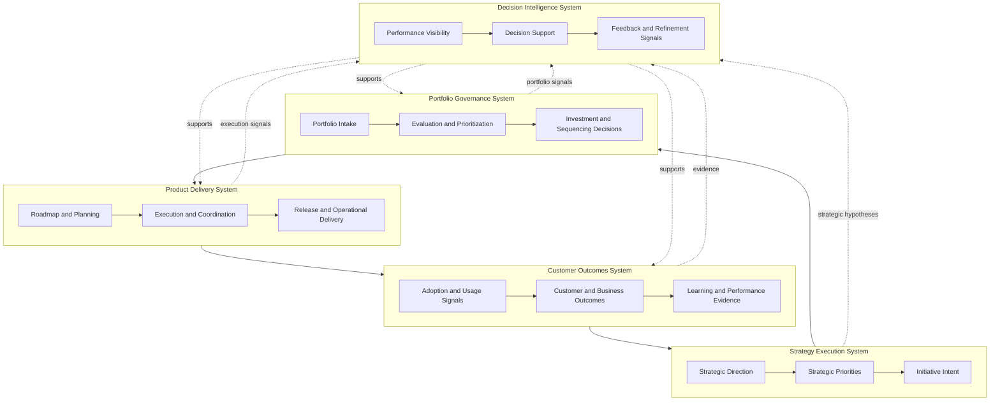

# Product Leadership Systems Architecture — Master Operating System Diagram

The Master Operating System Diagram is the primary visual representation of the Product Leadership Systems Architecture (PLSA). It shows how modern product organizations can be understood as a coordinated leadership system rather than as a collection of disconnected functions.

The diagram illustrates the relationship between the four core operating systems and the supporting Decision Intelligence System:

- Strategy Execution System
- Portfolio Governance System
- Product Delivery System
- Customer Outcomes System
- Decision Intelligence System

Together, these systems form a closed-loop operating model that connects direction setting, investment decisions, execution, outcome measurement, and organizational learning.

---

## Purpose

The purpose of the Master Operating System Diagram is to provide a single architectural view of how the Product Leadership Systems Architecture operates as an integrated system.

It is intended to help leaders understand:

- how product organizations translate strategy into execution
- how portfolio governance connects priorities to investment decisions
- how delivery systems convert approved work into execution
- how customer and business outcomes provide evidence of effectiveness
- how decision intelligence strengthens visibility, learning, and refinement across the system

This diagram should be used as the top-level visual anchor for the repository.

---

## Diagram

---

## Diagram Interpretation

The Master Operating System Diagram should be interpreted as a systems architecture view of product leadership rather than as a simple linear workflow.

At the highest level, the diagram shows how strategy is translated into governed priorities, how governed priorities move into coordinated delivery, and how delivery produces measurable customer and business outcomes. Those outcomes then feed back into strategic refinement, creating a closed-loop operating model.

The diagram also shows that the Product Leadership Systems Architecture is not composed of isolated functional domains. Each operating system influences the others:

- the **Strategy Execution System** sets direction and intent
- the **Portfolio Governance System** determines investment, prioritization, and sequencing
- the **Product Delivery System** converts approved work into execution
- the **Customer Outcomes System** measures whether execution creates meaningful value
- the **Decision Intelligence System** strengthens visibility, learning, and decision quality across the model

This means the diagram should be read both vertically and systemically. Vertically, it shows the strategy-to-outcomes flow. Systemically, it shows how leadership effectiveness depends on the quality of connections between systems rather than the performance of any single layer in isolation.

---

## System Explanation

The Product Leadership Systems Architecture is organized as five coordinated operating systems.

### Strategy Execution System

The Strategy Execution System defines the direction of the organization. It establishes strategic goals, priority areas, and the intended focus of the product organization. Its role is to ensure that leadership decisions begin with clear strategic intent rather than fragmented local activity.

### Portfolio Governance System

The Portfolio Governance System translates strategic intent into investment decisions. It governs intake, evaluation, prioritization, sequencing, and tradeoff decisions. Its purpose is to ensure that limited organizational capacity is allocated to the most important work.

### Product Delivery System

The Product Delivery System converts approved priorities into execution. It includes planning, team coordination, roadmap management, release practices, and the operating rhythms required to support predictable delivery across functions.

### Customer Outcomes System

The Customer Outcomes System evaluates whether delivered work creates measurable value. It focuses on adoption, user impact, customer outcomes, operational effectiveness, and business results. It provides the evidence required to assess whether strategy and delivery are working.

### Decision Intelligence System

The Decision Intelligence System supports all four primary systems. It improves leadership visibility, strengthens evidence-based decisions, and helps connect signals from strategy, governance, delivery, and outcomes into a more coherent operating model.

---

## Operating Logic

The operating logic of the Master Operating System Diagram is based on a closed-loop leadership model.

1. Strategy establishes direction.
2. Governance converts direction into investment and prioritization decisions.
3. Delivery executes approved work.
4. Outcomes reveal whether the work created the intended value.
5. Intelligence integrates signals to improve future decisions and strategic refinement.

This logic prevents common failure patterns such as disconnected strategy, unmanaged portfolio prioritization, output-driven delivery, and weak learning loops.

---

## Why This Diagram Matters

Many product organizations operate through fragmented leadership mechanisms:

- strategy disconnected from portfolio decisions
- governance disconnected from delivery realities
- delivery disconnected from outcome accountability
- outcome signals disconnected from strategic refinement

The Master Operating System Diagram provides a coherent leadership model that integrates strategy, governance, delivery, outcomes, and decision intelligence.

This makes it valuable for:

- executive alignment
- operating model design
- portfolio governance design
- product organization transformation
- product operations leadership
- strategy-to-execution improvement initiatives

---

## How To Use This

Use this diagram as the primary architectural entry point into the repository.

Recommended sequence:

1. Start with this diagram to understand the full operating system.
2. Review `architecture/` documents for system design and responsibilities.
3. Explore `frameworks/` for maturity models.
4. Use `artifacts/` for diagnostic and assessment tools.
5. Apply `playbooks/` for operational implementation.
6. Reference additional diagrams for specific system flows and feedback mechanisms.

---

## Relationship To The Operating System

This document is the top-level visual representation of the Product Leadership Systems Architecture.

It shows how the five operating systems integrate into a single leadership model.

Within the repository:

- `architecture/` defines system structure and design logic
- `frameworks/` explains operating system maturity
- `artifacts/` provides diagnostic tools
- `playbooks/` translate architecture into operational practice
- `diagrams/` visualize major flows and feedback mechanisms

This diagram therefore acts as the unifying architectural reference for the repository.

---

## Summary

The Master Operating System Diagram provides a comprehensive view of how modern product organizations operate as integrated leadership systems.

It demonstrates that effective product leadership requires coordinated interaction between strategy execution, portfolio governance, delivery execution, customer outcomes, and decision intelligence.

As the primary visual artifact in the Product Leadership Systems Architecture repository, it establishes the architectural logic that the rest of the documentation expands and operationalizes.

---

## License

This project is licensed under the MIT License.

See the [LICENSE](../LICENSE) file for full license details.

