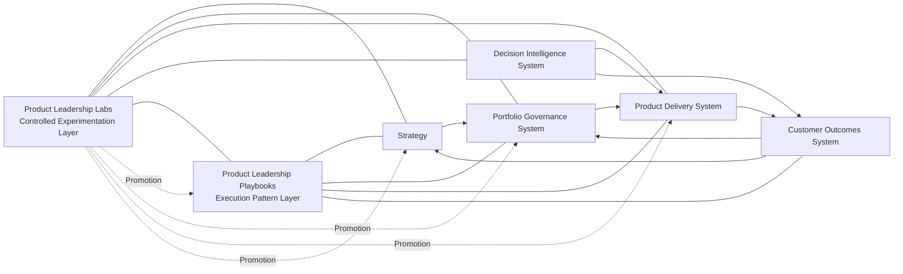

# Product Leadership Operating System Diagram

The **Product Leadership Operating System Diagram** defines the canonical system-level visualization of the **Product Leadership Operating System (PLOS)**.

It shows how all **eight pillars** operate together as a coherent system, preserving strict separation between:

- strategy  
- governance  
- delivery  
- outcomes  
- decision intelligence  
- execution patterns  
- experimentation  

This diagram is the **top-level visual representation of the entire operating system**.

---

# Diagram

---

# Diagram Interpretation

This diagram shows that the **Product Leadership Operating System (PLOS)** operates as a **closed-loop system** with clearly separated responsibilities.

It illustrates six critical architectural truths:

## 1. The System Operates as a Closed Loop

> **Strategy → Governance → Delivery → Outcomes → Strategy**

This loop defines how organizations translate intent into results and continuously adapt.

## 2. Decision Intelligence System Provides Evidence Only

The **Decision Intelligence System** supplies:

- signals  
- metrics  
- dashboards  
- analytics  

It does not:

- interpret  
- evaluate  
- decide  

## 3. Customer Outcomes System Owns Meaning and Learning

The **Customer Outcomes System** is the only layer that:

- interprets signals  
- evaluates outcomes  
- generates learning  

It is the required bridge between:

> **evidence → decisions**

## 4. Governance and Strategy Own Decisions

- **Strategy** defines direction  
- **Portfolio Governance System** defines priorities and commitments  

Neither may act on raw signals.

Both must rely on the **Customer Outcomes System** for meaning.

## 5. Playbooks Provide Execution Patterns

The **Product Leadership Playbooks** operate as a cross-cutting execution layer.

They:

- structure how work is carried out  
- enable consistency and scalability  

They do not:

- interpret  
- evaluate  
- decide  

## 6. Labs Enables Controlled System Evolution

The **Product Leadership Labs** provides a controlled environment for:

- experimentation  
- prototyping  
- system improvement  

Labs:

- does not have production authority  
- does not bypass system boundaries  
- requires formal promotion into canonical pillars  

---

# Operating Logic

The system operates through coordinated interaction between layers:

- **Strategy** sets direction  
- **Governance** converts direction into decisions  
- **Delivery** executes against those decisions  
- **Decision Intelligence System** provides evidence  
- **Customer Outcomes System** evaluates results and generates learning  
- **Playbooks** structure execution across all systems  
- **Labs** explores improvements and feeds validated changes back into the system  

The system is both:

- **operational** (running the business)  
- **adaptive** (learning and evolving over time)  

---

# Boundary Rules Shown by the Diagram

The diagram enforces the most critical architectural rules:

## Separation of Evidence, Meaning, and Decisions

- Evidence → **Decision Intelligence System**  
- Meaning → **Customer Outcomes System**  
- Decisions → **Strategy / Governance**  

## Mandatory Mediation Path

> **Decision Intelligence System → Customer Outcomes System → Strategy / Governance**

No system may bypass this path.

## No Responsibility Leakage

- No system may assume another system’s role  
- No hybrid layers may emerge  
- No direct signal-to-decision flows are allowed  

## Execution and Experimentation Are Separate

- **Playbooks** → execution  
- **Labs** → experimentation  

Neither may take on decision or evaluation responsibilities.

---

# How to Use This Diagram

Use this artifact to:

- explain the full PLOS architecture at executive level  
- onboard leaders and teams into the operating system  
- validate new artifacts against system boundaries  
- ensure cross-pillar alignment  
- anchor transformation and operating model discussions  

This diagram should be referenced alongside:

- **Product Leadership Systems Architecture (Pillar 1)**  
- **Portfolio Governance System (Pillar 3)**  
- **Customer Outcomes System (Pillar 5)**  
- **Decision Intelligence System (Pillar 6)**  
- **Product Leadership Playbooks (Pillar 7)**  
- **Product Leadership Labs (Pillar 8)**  

---

# Supporting Diagram Notes

This is a **system-level diagram**, not a process diagram.

It does not show:

- detailed workflows  
- individual playbooks  
- specific experiments  

Instead, it shows:

- system structure  
- system relationships  
- system boundaries  

All detailed behavior is defined within each pillar.

---

# Why This Matters

Without a unified system diagram, organizations typically:

- collapse data into decisions  
- bypass outcome evaluation  
- create inconsistent execution patterns  
- lose alignment across teams  
- struggle to scale operating maturity  

This diagram prevents those failures by making the system:

- visible  
- structured  
- enforceable  

---

# Summary

The **Product Leadership Operating System Diagram** provides the canonical visualization of how all eight pillars operate together.

It ensures that:

- responsibilities remain clearly separated  
- decisions are based on interpreted outcomes  
- execution is consistent and scalable  
- experimentation is controlled and governed  

It is the **top-level architectural anchor** of the PLOS portfolio.

---

## License

This repository is licensed under the MIT License. See the [LICENSE](LICENSE) file for details.
    class S,G,D,O,DI core;
    class P support;
    class L lab;
