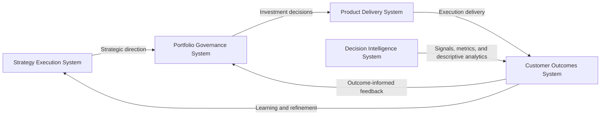
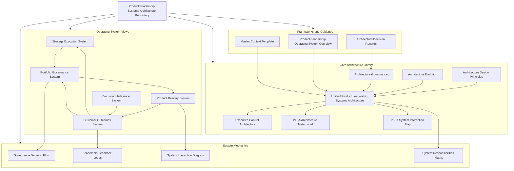

This repository documents the **Product Leadership Systems Architecture (PLSA)** — the canonical five-system architecture within the **Product Leadership Operating System (PLOS)** for how modern product organizations translate strategy into governed investments, coordinated delivery, evaluated customer outcomes, and continuous learning.

## Product Leadership Systems Architecture

The diagram below illustrates the **layered operating architecture** of the Product Leadership Systems Architecture (PLSA).

The model separates strategic direction, portfolio decision-making, execution, and outcome realization into distinct operating layers. The Decision Intelligence System operates as a cross-cutting evidence capability that provides measurement, metrics, dashboards, and descriptive analytics across the operating model.

```mermaid
flowchart TB

```mermaid
flowchart TB

subgraph L1["Strategic Direction Layer"]
    A["Strategy Execution System<br/>Strategic priorities<br/>Investment themes<br/>Organizational alignment"]
end

subgraph L2["Portfolio Decision Layer"]
    B["Portfolio Governance System<br/>Initiative intake<br/>Evaluation and prioritization<br/>Resource allocation"]
end

subgraph L3["Execution Layer"]
    C["Product Delivery System<br/>Roadmap execution<br/>Product and engineering delivery<br/>Dependency coordination"]
end

subgraph L4["Customer Outcomes Layer"]
    D["Customer Outcomes System<br/>Adoption and usage<br/>Value realization<br/>Impact evaluation<br/>Learning generation"]
end

subgraph L5["Decision Intelligence Layer"]
    E["Decision Intelligence System<br/>Signals and telemetry<br/>Metrics and KPIs<br/>Dashboards and descriptive analytics"]
end

A -->|"Sets strategic direction"| B
B -->|"Approves and sequences work"| C
C -->|"Delivers capabilities"| D
E -->|"Provides evidence inputs"| D
D -->|"Validated learning"| A
D -->|"Outcome-informed portfolio feedback"| B
```

---

## Decision Intelligence Boundary

The Decision Intelligence System produces signals, metrics, dashboards, and descriptive analytics.

It does not interpret evidence, evaluate value, recommend action, or make decisions.

All decision influence must be mediated through the Customer Outcomes System:

> Decision Intelligence → Customer Outcomes → Strategy / Governance

---

## Strategic Refinement Rule

The **Strategy Execution System** must not rely on raw metrics, dashboards, or unevaluated signal movement as primary inputs for strategic refinement.

Strategic adjustment must be informed by **validated learning** produced by the **Customer Outcomes System**.

The **Decision Intelligence System** supports strategic visibility, but it does not replace:

- signal interpretation  
- value qualification  
- outcome evaluation  
- learning generation  

> Strategy is refined through evaluated reality, not through raw signal observation alone.

---

## Architecture Overview

The Product Leadership Systems Architecture (PLSA) describes a set of integrated operating systems used to run modern product organizations.

The architecture connects five coordinated systems:

- Strategy Execution System  
- Portfolio Governance System  
- Product Delivery System  
- Customer Outcomes System  
- Decision Intelligence System  

Together these systems translate strategic direction into governed investments, coordinated delivery, measurable customer outcomes, and continuous strategic learning.

---

## 10-Second Overview

This portfolio presents a coherent **Product Leadership Systems Architecture**:

- Strategy is translated into investable initiatives
- Investments are governed through portfolio decision systems
- Delivery is executed through a repeatable product operating model
- Outcomes are measured and fed back into governance
- Decision Intelligence provides measurement, signals, dashboards, and descriptive analytics across the operating model

---

## Executive Leadership Control Loop

While the layered architecture diagram illustrates the **structural operating model**, the control loop below shows how **leadership decisions cycle through the Product Leadership Systems Architecture over time**.

This loop represents the operational rhythm of modern product organizations.

Strategic direction establishes organizational priorities and investment intent.  
Portfolio governance converts those priorities into concrete investment decisions.  
Product delivery executes the approved initiatives.  
Customer outcomes reveal whether those initiatives created real value.  
Decision Intelligence captures signals, metrics, and descriptive analytics from execution and outcomes, while the Customer Outcomes System converts evaluated results into learning that informs strategy and governance.



---

## Loop Integrity Rule

Learning entering **Strategy** must originate from the **Customer Outcomes System**.

No system may bypass the **Outcomes** layer to influence strategic direction through:

- raw signals  
- dashboards  
- unvalidated interpretation  
- direct metric escalation  

This preserves the canonical loop:

**Strategy → Governance → Delivery → Outcomes → Learning → Strategy**

---

## Architecture Knowledge Map


---

## Architecture Decision Records

The Product Leadership Systems Architecture includes a traceable history of architectural design decisions.

View the decision log:

→ [Architecture Decision Records](architecture/decisions/ADR_INDEX.md)

---

## Architecture System Components

### System Responsibilities Matrix

The Product Leadership Systems Architecture is composed of five coordinated systems with distinct responsibilities.  
Each system plays a specific role in translating strategic direction into measurable customer and organizational outcomes.

| System | Primary Responsibility | Key Decisions | Typical Outputs |
|---|---|---|---|
| **Strategy Execution System** | Define strategic direction, investment themes, and enterprise priorities | What matters most, where to invest, how to align the organization | Strategic priorities, investment themes, operating direction |
| **Portfolio Governance System** | Evaluate, prioritize, and sequence initiatives across the portfolio | Which initiatives move forward, how resources are allocated, what tradeoffs are made | Approved initiatives, portfolio priorities, funding and sequencing decisions |
| **Product Delivery System** | Execute approved work through coordinated product and engineering delivery | How work is planned, coordinated, and delivered | Roadmaps, releases, delivered capabilities, execution progress |
| **Customer Outcomes System** | Measure adoption, value realization, and customer impact | Whether delivered capabilities created meaningful value | Outcome signals, adoption patterns, value realization insights |
| **Decision Intelligence System** | Provide instrumentation, signals, metrics, dashboards, and descriptive analytics across the architecture | How evidence is captured, structured, measured, and made visible | KPIs, telemetry, dashboards, measurement outputs, descriptive analytics |

This matrix reinforces a core architectural principle: **systems must remain distinct in responsibility while operating as a coordinated leadership model**.

---

### Repository Structure

This repository functions as an architecture documentation library for the Product Leadership Systems Architecture.

Artifacts are organized into the following directories:

| Directory | Purpose |
|---|---|
| `architecture/` | Canonical architecture models and system diagrams |
| `frameworks/` | Conceptual operating models and leadership frameworks |
| `artifacts/` | Governance tools, ownership models, and responsibility matrices |
| `playbooks/` | Implementation guidance for applying the architecture |
| `diagrams/` | Reusable architecture diagrams used across documentation |

Together these materials describe how modern product organizations translate strategy into outcomes through structured leadership systems.

Detailed architecture artifacts are organized through the repository’s architecture library:

- `SYSTEM_INDEX.md`
- `frameworks/PRODUCT_LEADERSHIP_OPERATING_SYSTEM_OVERVIEW.md`
- `architecture/UNIFIED_PRODUCT_LEADERSHIP_SYSTEMS_ARCHITECTURE.md`
- `artifacts/SYSTEM_RESPONSIBILITIES_MATRIX.md`

---

### How the Systems Work Together

The Product Leadership Systems Architecture connects strategy definition, portfolio governance, delivery execution, and customer outcomes through coordinated operating systems.

**Strategy Execution System** defines strategic priorities, investment themes, and organizational direction.

**Portfolio Governance Systems** evaluate candidate initiatives, prioritize investments, allocate resources, and manage portfolio risk.

**Product Delivery Systems** coordinate product management, engineering, and cross-functional delivery to execute funded initiatives.

**Customer Outcomes Systems** measure adoption, value realization, and customer impact to determine whether delivered capabilities created meaningful results.

**Decision Intelligence Systems** provide signals, metrics, dashboards, reporting, and descriptive analytics across the architecture. The **Customer Outcomes System** interprets those signals, evaluates value realization, and generates the learning that informs future strategy and governance.

---

## Documentation Standard

All repositories in this portfolio follow these documentation principles:

- Executive-level tone (concise, authoritative, operational)
- Architecture-first framing (systems, interfaces, decision mechanisms)
- GitHub-compatible Mermaid diagrams (fully fenced ` ```mermaid ` blocks)
- Consistent naming and cross-repository navigation
- Artifact quality resembling internal operating documentation from a large technology organization

This portfolio is intentionally **not**:
- a coding project
- an engineering tutorial
- a PM playbook
- academic writing

---

## AI Architecture Collaboration

This repository includes a **Master Context Template** used to maintain
architectural consistency when collaborating with AI systems.

The template defines:

- system boundaries  
- documentation standards  
- diagram standards  
- architecture integrity rules  
- output formatting requirements  

See:

`MASTER_CONTEXT_TEMPLATE.md`

---

## License

This repository is released under the **MIT License**.

See the full license text in the repository:

[MIT License](LICENSE)
