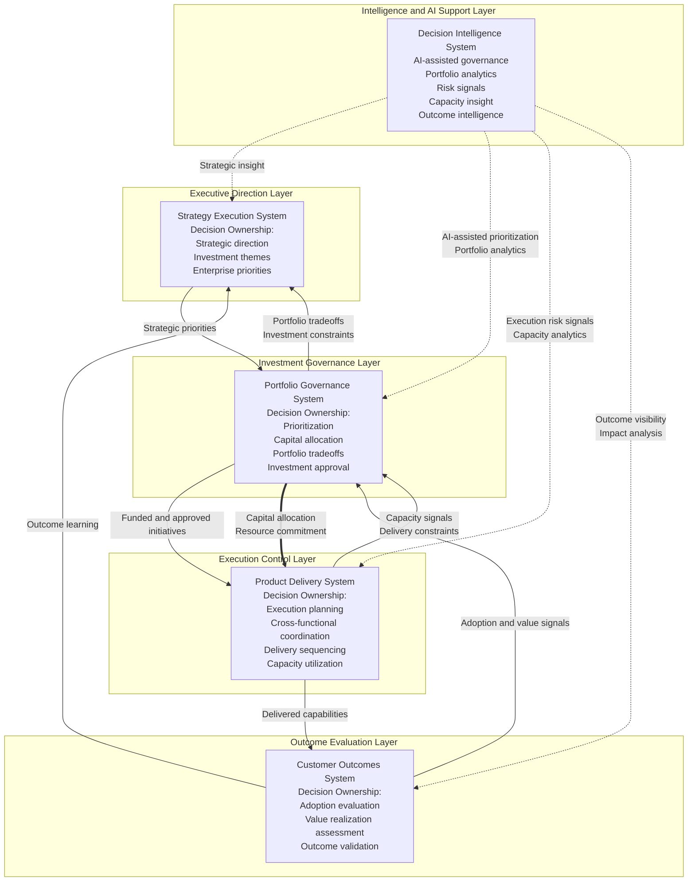
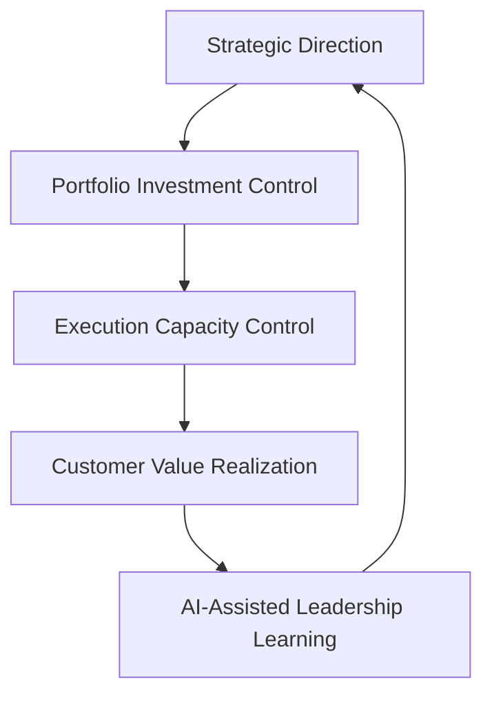

# Executive Control Architecture

The **Executive Control Architecture** illustrates how the **Product Leadership Systems Architecture (PLSA)** operates as an executive control model for modern product organizations.

This diagram extends the core operating architecture by showing not only the primary system flow, but also the layers of decision ownership, capital allocation, delivery capacity feedback, and AI-assisted governance that enable leadership teams to manage strategy-to-outcomes execution at scale.

Rather than showing only how work moves through the organization, this artifact explains how leadership controls, adapts, and improves the operating system over time.

---

# Purpose

The purpose of this artifact is to define the **executive control model** of the Product Leadership Systems Architecture.

While the unified architecture explains the system structure and other artifacts describe responsibilities, interactions, governance flow, and feedback loops, this document shows how executive leadership governs the full system through decisions, investment allocation, delivery constraints, and intelligence support.

The artifact provides clarity on:

- where major decision rights sit across the architecture
- how capital and resources flow through the portfolio
- how delivery capacity signals influence governance
- how customer and portfolio signals influence strategic refinement
- how Decision Intelligence enables AI-assisted governance and executive decision quality

This document helps explain how the architecture functions not only as an operating model, but as a leadership control system.

---

# Diagram

The diagram below illustrates the Executive Control Architecture of the Product Leadership Systems Architecture.

---

## Diagram Interpretation

The Executive Control Architecture shows how the **Product Leadership Systems Architecture (PLSA)** functions as a leadership control system rather than a simple delivery workflow.

The **Strategy Execution System** owns enterprise direction. This is where strategic priorities, investment themes, and leadership intent are defined.

The **Portfolio Governance System** owns investment control. It converts strategic direction into prioritized decisions, allocates capital, and manages tradeoffs across the portfolio.

The **Product Delivery System** owns execution control. It translates funded work into delivery plans, coordinates cross-functional execution, and generates capacity and delivery signals that affect future governance choices.

The **Customer Outcomes System** owns outcome evaluation. It determines whether delivered capabilities created measurable adoption, value realization, and customer impact.

The **Decision Intelligence System** strengthens every layer of the architecture. It enables AI-assisted governance through analytics, risk identification, capacity visibility, and outcome intelligence.

This architecture therefore shows four distinct but connected executive control mechanisms:

- strategic direction control
- investment control
- execution control
- outcome control

Decision Intelligence operates across all of them as the evidence and AI support layer.

---

## Executive Control Explanation

The Product Leadership Systems Architecture becomes significantly more powerful when viewed as an executive control model.

### Strategy Control

Leadership establishes strategic direction and defines the priorities that should govern portfolio decisions. This ensures that the organization begins with explicit intent rather than reacting only to local demand.

### Investment Control

Portfolio governance acts as the capital allocation mechanism of the architecture. It decides which initiatives receive funding, sequencing, and organizational attention.

### Execution Control

Execution is not unmanaged throughput. The Product Delivery System governs how approved work moves through planning, coordination, dependencies, and capacity constraints.

### Outcome Control

The Customer Outcomes System determines whether the organization is producing meaningful value, not just completing delivery activity.

### Intelligence-Augmented Control

Decision Intelligence improves control quality by surfacing patterns, identifying portfolio and delivery risks, revealing capacity constraints, and supporting executive decisions with analytics and AI-assisted governance.

Together these mechanisms explain how product leadership operates as a managed enterprise system rather than a collection of disconnected team practices.

---

## Operating Logic

The Executive Control Architecture operates on the principle that **leadership effectiveness depends on managing decisions, capital, execution capacity, and learning as one integrated control model**.

The operating logic begins with strategy, where enterprise priorities and investment themes are defined.

Those priorities move into portfolio governance, where leaders evaluate opportunities, allocate resources, and make portfolio tradeoffs.

Approved work moves into delivery, where execution occurs subject to coordination realities, capacity constraints, and delivery sequencing.

Delivered work then moves into outcomes, where value creation is assessed through adoption, impact, and realized benefit.

At every point in the model, signals flow backward:

- outcomes refine strategy
- portfolio tradeoffs reshape strategic direction
- capacity signals reshape governance decisions
- intelligence improves decision quality across every layer

This creates an executive control loop in which leadership continuously governs not only what to do, but also how much to fund, how much can realistically be delivered, and whether the outcomes justify future investment.

---

## Executive Control Loop Diagram

---

## Why This Matters

Many organizations have strategy documents, roadmap processes, analytics teams, and portfolio reviews, yet still lack a true executive control model.

Common failure patterns include:

- strategy being defined without capital discipline
- governance making investment choices without understanding delivery capacity
- execution teams absorbing prioritization problems that should be solved in governance
- customer outcome data failing to influence future investment decisions
- analytics being used for reporting rather than executive control

The Executive Control Architecture addresses these issues by making the control mechanisms of the operating model explicit.

This matters because large-scale product organizations succeed not only through good product management, but through disciplined executive control over direction, investment, execution, outcomes, and learning.

---

## How To Use This

This artifact can be used to explain, assess, or redesign the executive operating model of a product organization.

Leadership teams can use the architecture to:

- identify where decision rights sit across strategy, governance, execution, and outcomes
- evaluate whether portfolio capital allocation is explicit and disciplined
- determine whether capacity signals are influencing governance decisions
- assess whether customer outcomes are shaping strategic refinement
- understand how analytics and AI support leadership decisions rather than only reporting performance

This artifact is especially useful when:

- communicating the operating model to executive audiences
- evaluating organizational maturity
- redesigning portfolio and product governance structures
- clarifying the difference between operating flow and executive control
- presenting the repository as a reference architecture library rather than a documentation set

Used correctly, the Executive Control Architecture becomes the signature visual that explains how modern product leadership operates at enterprise scale.

---

## Relationship To The Operating System

This artifact complements the broader **Product Leadership Systems Architecture** by synthesizing the major structural, governance, interaction, and learning components into one executive architecture view.

Within the repository, it works alongside:

- the Unified Product Leadership Systems Architecture, which defines the canonical system model
- the System Responsibilities Matrix, which defines ownership boundaries
- the System Interaction Diagram, which explains interfaces between systems
- the Governance Decision Flow, which explains portfolio decision movement
- the Leadership Feedback Loops, which explain how learning improves the architecture over time
- the Product Leadership Operating System Overview, which explains the architecture as a practical operating model

In this way, the Executive Control Architecture acts as the signature diagram that unifies the full architecture library.

---

## Summary

The Executive Control Architecture defines how the Product Leadership Systems Architecture operates as an executive system of direction, investment control, execution control, outcome evaluation, and AI-assisted learning.

By combining decision ownership, capital flow, delivery capacity feedback, and intelligence support into one integrated model, this artifact elevates the architecture from a set of strong documents into a unified executive reference architecture.

This document provides the most complete visual explanation of how product leadership operates at enterprise scale.

---

## License

This repository is released under the **MIT License**.

The MIT License permits reuse, modification, and distribution of this material provided that the original copyright and license notice are included.

See the full license text in the repository:

[MIT License](../LICENSE)

