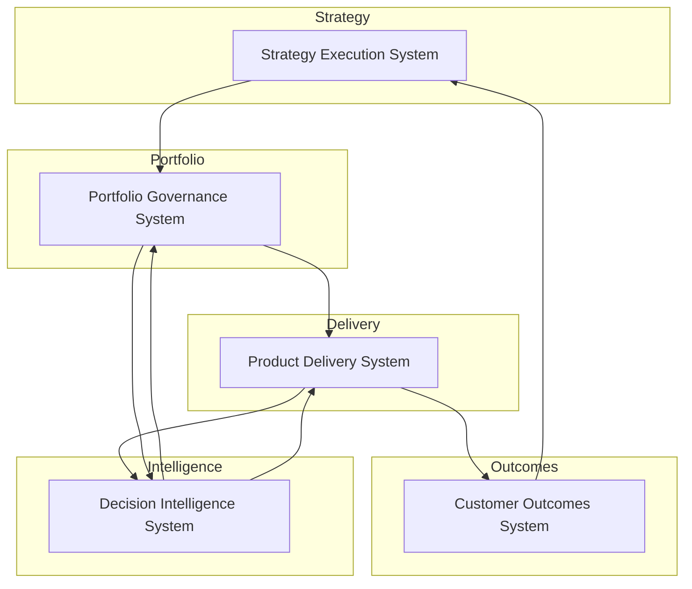
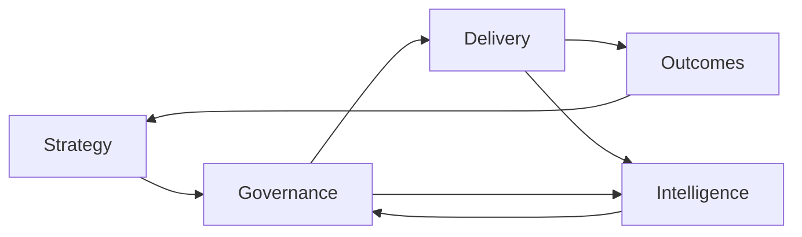

# Product Leadership Systems Architecture — Overview

The **Product Leadership Systems Architecture (PLSA)** defines how modern product organizations operate as integrated systems connecting strategy, investment governance, product delivery, and measurable customer outcomes.

Rather than treating product management, engineering, and leadership processes as separate disciplines, this architecture models the organization as a **coordinated operating system**.

The goal is to create predictable strategy execution, transparent investment decisions, governed delivery, and continuous learning through integrated feedback loops.

---

# Purpose

Most organizations struggle with connecting:

- Strategy
- Investment decisions
- Product delivery
- Customer outcomes

These functions often exist in separate processes, tools, and leadership structures.

The Product Leadership Systems Architecture defines a **system-of-systems model** that ensures alignment between these layers.

The architecture enables organizations to:

- Translate strategy into executable initiatives
- Govern portfolio investment decisions
- Deliver products through predictable operating models
- Measure real customer and mission outcomes
- Continuously improve through decision intelligence

---

## System Explanation

The Product Leadership Systems Architecture consists of four primary operating systems supported by a cross-cutting intelligence layer.

---

## Operating Logic

The Product Leadership Systems Architecture consists of five coordinated systems that together form a complete operating model for modern product organizations.

Each system performs a distinct function while remaining tightly integrated with the others through governance processes, delivery workflows, and feedback mechanisms.

The systems include:

- Strategy Execution System
- Portfolio Governance System
- Product Delivery System
- Customer Outcomes System
- Decision Intelligence System

Together these systems create a continuous loop connecting strategic direction, investment decisions, product development, and measurable outcomes.

---

## Strategy Execution System

The Strategy Execution System translates organizational strategy into clear priorities and initiatives that guide product investment and development.

This system ensures that leadership intent becomes actionable direction for product organizations.

### Responsibilities

- Defining strategic objectives
- Establishing investment themes
- Identifying strategic initiatives
- Aligning product roadmaps with strategy
- Communicating strategic priorities across the organization

### Key Outputs

The outputs of the Strategy Execution System include:

- Strategic roadmaps
- Initiative definitions
- Investment themes
- Executive strategic priorities

These outputs guide the Portfolio Governance System in determining where resources and investment should be allocated.

---

## Portfolio Governance System

The Portfolio Governance System determines **which initiatives receive investment, resources, and organizational focus**.

This system provides transparency and discipline around product investment decisions, ensuring that resources are directed toward the highest-impact opportunities.

### Responsibilities

- Initiative intake and evaluation
- Portfolio prioritization
- Capacity allocation
- Investment approval
- Portfolio performance monitoring
- Initiative continuation or termination decisions

### Key Outputs

The outputs of the Portfolio Governance System include:

- Approved initiatives
- Portfolio roadmaps
- Funding allocations
- Resource commitments
- Governance review decisions

These decisions determine which initiatives proceed into the Product Delivery System.

---

## Product Delivery System

The Product Delivery System executes approved initiatives through coordinated product, engineering, and design teams.

This system converts portfolio investments into real product capabilities that deliver value to customers and stakeholders.

### Responsibilities

- Product development
- Delivery planning and coordination
- Cross-functional team alignment
- Release management
- Product lifecycle management
- Continuous improvement of delivery processes

### Key Outputs

The outputs of the Product Delivery System include:

- Delivered product capabilities
- Product releases
- Operational improvements
- Product performance metrics

These outputs feed directly into the Customer Outcomes System for evaluation.

---

## Customer Outcomes System

The Customer Outcomes System measures the real-world impact of delivered products.

Rather than focusing solely on output metrics, this system evaluates whether products actually deliver value to customers, users, or mission stakeholders.

### Responsibilities

- Measuring product adoption
- Evaluating customer value delivery
- Tracking business and mission outcomes
- Monitoring product performance in the market
- Gathering qualitative and quantitative feedback

### Key Outputs

The outputs of the Customer Outcomes System include:

- Product adoption insights
- Customer satisfaction signals
- Outcome-based performance indicators
- Market feedback and user insights

These insights inform both strategy adjustments and portfolio investment decisions.

---

## Decision Intelligence System

The Decision Intelligence System provides the analytical and insight capabilities required to support informed leadership decisions across the entire architecture.

This system acts as the **data and insight layer** that connects strategy, governance, delivery, and outcomes.

### Responsibilities

- Data aggregation across product systems
- Product performance analysis
- Portfolio health monitoring
- Executive dashboards and reporting
- Predictive and diagnostic insights

### Key Outputs

The outputs of the Decision Intelligence System include:

- Product metrics dashboards
- Portfolio performance insights
- Initiative health indicators
- Executive decision support

Decision intelligence enables leadership teams to continuously refine strategy, governance, and delivery processes.

---

# How the Systems Work Together

The Product Leadership Systems Architecture functions as a continuous cycle that connects strategic direction with measurable outcomes.

The interaction between systems follows a structured flow:

1. Strategy defines the direction and priorities for the organization.
2. Portfolio governance determines which initiatives receive investment.
3. Product delivery executes approved initiatives through product development.
4. Customer outcomes measure the impact of delivered capabilities.
5. Decision intelligence provides insight and feedback across all systems.

This continuous loop allows organizations to adapt strategy based on real-world outcomes while maintaining disciplined execution.

This model creates a closed-loop system for strategy execution and continuous improvement.

---

# Why This Matters

Many organizations operate with disconnected processes:

- Strategy created independently from delivery teams
- Portfolio decisions made without reliable delivery visibility
- Product teams measured on output rather than outcomes
- Leadership decisions made without reliable data

The Product Leadership Systems Architecture replaces fragmented processes with an integrated operating system.

Benefits include:

- improved strategic alignment
- transparent investment decisions
- more predictable product delivery
- stronger outcome orientation
- better executive decision quality through integrated intelligence

---

# Relationship To The Operating System

This overview document defines the top-level structure of the Product Leadership Systems Architecture (PLSA) and serves as the architectural entry point for the broader repository.

Within the Product Leadership Systems Architecture:

- The **Strategy Execution System** establishes direction, priorities, and strategic intent.
- The **Portfolio Governance System** converts strategy into investment choices, sequencing decisions, and portfolio control mechanisms.
- The **Product Delivery System** translates approved priorities into coordinated execution through teams, delivery practices, and operating rhythms.
- The **Customer Outcomes System** evaluates whether delivery is producing measurable value for users, customers, and the business.
- The **Decision Intelligence System** supports all four primary systems by strengthening visibility, decision quality, learning, and adaptation.

This overview should be read as the anchor for the repository. The supporting documents in `architecture/`, `frameworks/`, `artifacts/`, `playbooks/`, and `diagrams/` expand specific parts of this model in greater operational detail.

---

# How To Use This

To continue exploring the architecture:

- Review the Design Principles
- Review the System Responsibilities Matrix
- Explore the Feedback Loops and Decision Support model
- Examine the Operating System Maturity Model

Use this document first to understand the operating model at the system level, then use the supporting documents to go deeper into responsibilities, design logic, diagnostic tools, maturity progression, and execution playbooks.

---

# Summary

The Product Leadership Systems Architecture provides a structured model for understanding product organizations as integrated operating systems rather than disconnected functional domains.

It shows how strategy, governance, delivery, and customer outcomes are connected through deliberate leadership architecture, with decision intelligence reinforcing coordination, learning, and refinement across the system.

This overview establishes the foundational logic for the repository and frames the rest of the documentation for senior product and technology leaders.

---

## License

This project is licensed under the MIT License.

You are free to use, modify, and distribute the materials in this repository with proper attribution.

See the [LICENSE](../LICENSE) file for full details.

