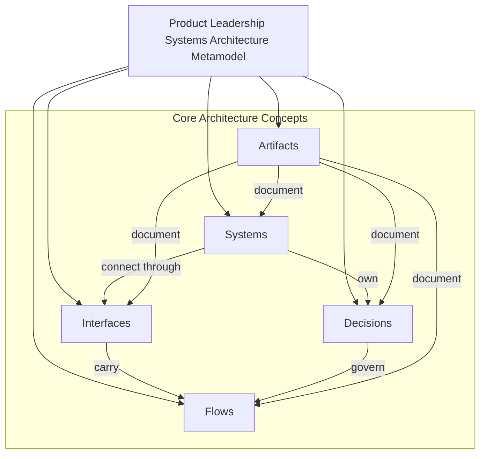
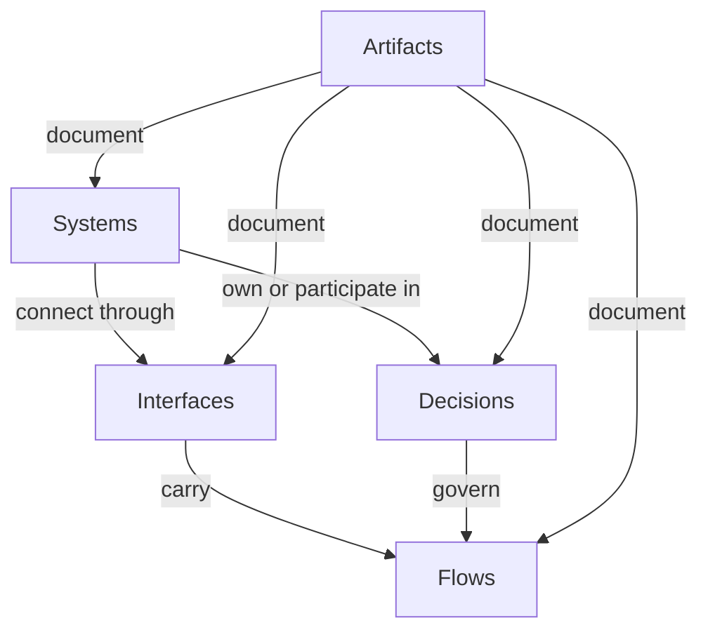

# Product Leadership Systems Architecture Metamodel

The **Product Leadership Systems Architecture Metamodel** defines the formal structure of the **Product Leadership Systems Architecture (PLSA)**.

This artifact explains how the core architectural elements of the repository relate to one another, including systems, decisions, interfaces, flows, and artifacts.

Rather than describing the operating model itself, this document describes the **architecture of the architecture**.

It provides the formal model used to understand how the Product Leadership Systems Architecture is organized, documented, and maintained as a coherent reference framework.

---

# Purpose

The purpose of this artifact is to define the **metamodel** of the Product Leadership Systems Architecture.

While the unified architecture explains the operating model and other artifacts describe responsibilities, interactions, governance, feedback loops, and executive control, this document defines the structural concepts that make up the architecture framework itself.

The metamodel provides clarity on:

- what kinds of architectural elements exist in the framework
- how systems relate to decisions
- how interfaces carry flows between systems
- how artifacts document the architecture
- how the architecture library remains internally coherent

This document helps establish the Product Leadership Systems Architecture as a formal architecture framework rather than only a collection of diagrams and documents.

---

# Diagram

The diagram below illustrates the formal metamodel of the Product Leadership Systems Architecture.

---

## Diagram Interpretation

The metamodel diagram shows the formal structure of the **Product Leadership Systems Architecture (PLSA)**.

At the center of the model is the idea that the architecture is composed of several distinct but connected concept types.

**Systems** are the primary operating entities of the architecture. They represent the major functional structures of the Product Leadership Systems Architecture, such as Strategy Execution, Portfolio Governance, Product Delivery, Customer Outcomes, and Decision Intelligence.

**Decisions** are the governing choices made within or across systems. These include strategic direction, portfolio prioritization, investment approval, execution planning, and outcome evaluation.

**Interfaces** define how systems connect with one another. They represent the boundaries across which information, authority, and signals are exchanged.

**Flows** are the movements that pass through interfaces. These include strategic priorities, investment decisions, execution outputs, capacity signals, outcome signals, learning signals, and intelligence support.

**Artifacts** formally describe and document the architecture. They provide the formal descriptions, diagrams, principles, and explanatory models that make the architecture understandable and maintainable.

Together, these concepts form the formal structure of the architecture framework.

---

## Metamodel Explanation

The Product Leadership Systems Architecture is not only an operating model. It is also a structured architecture framework composed of formal concept types.

### Systems

Systems are the core building blocks of the operating model. They define the major leadership structures of the architecture.

Examples include:

- Strategy Execution System
- Portfolio Governance System
- Product Delivery System
- Customer Outcomes System
- Decision Intelligence System

### Decisions

Decisions are the authoritative choices made within the architecture. They determine strategic direction, investment allocation, governance outcomes, execution priorities, and outcome interpretation.

Decisions are important because the architecture is not just a flow of work. It is a flow of controlled leadership choices.

### Interfaces

Interfaces are the structured connection points between systems. They define where systems exchange information, authority, and signals.

For example:

- strategy to governance
- governance to delivery
- delivery to outcomes
- outcomes to strategy
- intelligence to all systems

### Flows

Flows are the contents that move across interfaces.

Examples include:

- strategic priorities
- funded initiatives
- delivered capabilities
- adoption signals
- capacity constraints
- portfolio learning
- decision intelligence

Flows are what make the architecture dynamic rather than static.

### Artifacts

Artifacts are the documentation objects that describe, explain, and govern the architecture.

Examples include:

- unified architecture
- responsibilities matrix
- interaction diagrams
- governance flow diagrams
- leadership feedback loops
- executive control architecture
- design principles
- operating system overview
- architecture evolution

Artifacts make the architecture visible, maintainable, and reusable as a knowledge system.

---

## Operating Logic

The operating logic of the metamodel is that **architecture coherence depends on the disciplined relationship between formal concept types**.

A system is not just a box in a diagram. It must own or participate in decisions.

A decision is not just an abstract idea. It must exist within a system context and often move through interfaces.

An interface is not just a connection line. It carries flows between systems.

A flow is not just movement. It represents a meaningful transfer of direction, capital, execution, learning, or insight.

An artifact is not just documentation. It is the formal expression of the architecture and should document systems, decisions, interfaces, and flows in a consistent way.

This creates a formal architecture logic in which:

- systems define the operating structure
- decisions define control
- interfaces define connection points
- flows define movement
- artifacts define architectural expression

The architecture remains coherent when these concept types remain explicit and correctly related.

---

## Metamodel Logic Diagram

---

## Why This Matters

Most architecture repositories describe systems but do not define the formal structure of the architecture itself.

Without a metamodel, several problems emerge:

- diagrams may use inconsistent concept types
- documents may blur the difference between systems and decisions
- interfaces may be implied but not explicitly defined
- flows may appear without clear ownership or architectural meaning
- artifacts may grow without a consistent internal structure

The Product Leadership Systems Architecture Metamodel prevents these issues by defining the formal concept model of the framework.

This matters because mature architecture libraries are not only well explained — they are also formally structured.

A metamodel is one of the clearest indicators that the repository is functioning as a real architecture framework.

---

## How To Use This

This artifact can be used to assess, explain, or govern the internal structure of the Product Leadership Systems Architecture.

Leaders, architects, and maintainers can use the metamodel to:

- clarify the formal concept types used in the framework
- distinguish between systems, decisions, interfaces, flows, and artifacts
- evaluate whether new documents fit the architecture model correctly
- reduce ambiguity when extending the repository
- preserve architectural consistency as the framework grows

This artifact is especially useful when:

- creating new diagrams or architecture documents
- explaining the repository to architecture-oriented audiences
- reviewing artifact consistency
- positioning the repository as a reference architecture framework

Used correctly, the metamodel becomes the formal schema that preserves architecture quality over time.

---

## Relationship To The Operating System

This artifact complements the broader **Product Leadership Systems Architecture** by defining the formal schema of the architecture framework itself.

Within the repository, it works alongside:

- the Unified Product Leadership Systems Architecture, which defines the canonical operating model
- the Architecture Design Principles, which define the rules preserving architectural integrity
- the Executive Control Architecture, which defines the executive operating view
- the System Responsibilities Matrix, which defines ownership boundaries
- the System Interaction Diagram, which defines interfaces
- the Governance Decision Flow and Leadership Feedback Loops, which define decision and learning flows
- the Product Leadership Operating System Overview, which defines the practical operating model
- the Architecture Evolution artifact, which explains how the architecture matured over time

In this way, the metamodel acts as the formal structural layer above the architecture library.

---

## Summary

The Product Leadership Systems Architecture Metamodel defines the formal structure of the Product Leadership Systems Architecture.

By clarifying how systems, decisions, interfaces, flows, and artifacts relate to one another, this artifact elevates the repository from a strong documentation library into a formal architecture framework.

This document explains not only how the architecture operates, but how the architecture itself is constructed.

---

## License

This repository is released under the **MIT License**.

The MIT License permits reuse, modification, and distribution of this material provided that the original copyright and license notice are included.

See the full license text in the repository:

[MIT License](../LICENSE)

