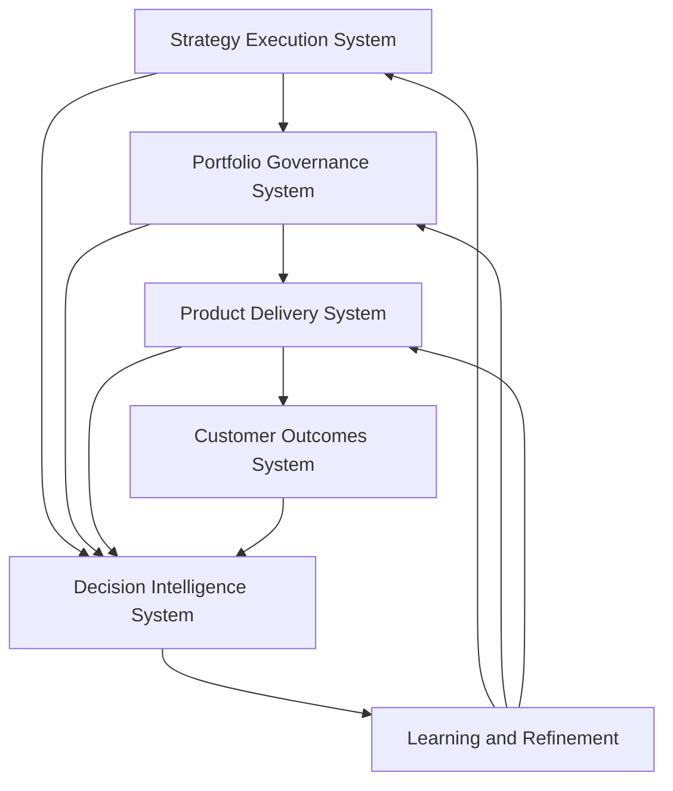

# Product Leadership Systems Architecture — Feedback Loops

The Feedback Loops document defines how learning, refinement, and adaptive decision-making operate across the Product Leadership Systems Architecture (PLSA).

The architecture assumes that effective product organizations do not improve through execution alone. They improve when signals from strategy, governance, delivery, and outcomes are captured, interpreted, and used to refine future decisions. Feedback loops therefore serve as the connective mechanism that transforms the operating system from a one-way execution model into a closed-loop leadership architecture.

Rather than treating feedback as a reporting byproduct, this document treats it as an explicit structural capability. Strong feedback loops improve decision quality, strengthen governance, increase delivery relevance, and help leadership refine strategic direction over time.

---

## Purpose

The purpose of the Feedback Loops document is to define how evidence, learning, and refinement should function across the Product Leadership Systems Architecture.

It is intended to help leaders:

- understand how signals should move across the operating system
- strengthen the connection between outcomes and future decisions
- design more adaptive governance and delivery mechanisms
- improve the quality of strategic and portfolio refinement
- build learning into the operating model rather than assuming it will emerge automatically

This document should be used as the architectural reference for how the operating system learns and improves over time.

---

## Feedback Loop Overview

---

## Diagram Interpretation

The Feedback Loop Overview should be interpreted as an adaptive learning architecture rather than a reporting pathway.

The top path shows how strategic direction flows through governance and delivery into customer and business outcomes. The lower path shows how signals from across the operating system are integrated through the Decision Intelligence System and then converted into learning and refinement.

This means the operating model does not end at delivery or outcomes. Instead, it closes the loop by using evidence to influence future strategic direction, governance decisions, and delivery behavior.

The diagram also shows that feedback is not limited to outcome measurement alone. Signals originate from multiple systems:

- strategy generates signals about clarity, direction, and hypothesis quality
- governance generates signals about prioritization quality, tradeoffs, and portfolio health
- delivery generates signals about execution predictability, dependency complexity, and operational performance
- outcomes generate signals about adoption, impact, and value realization

The Decision Intelligence System integrates those signals so that leadership can interpret them in context. Learning and refinement then convert that integrated evidence into future decisions and operating model improvements.

---

## System Explanation

Feedback loops operate across all five systems within the Product Leadership Systems Architecture.

### Strategy Execution System

The Strategy Execution System both shapes and receives feedback. It establishes the hypotheses, priorities, and intended outcomes that guide the operating model. It also must evolve when evidence indicates that strategic assumptions are incomplete, outdated, or ineffective.

### Portfolio Governance System

The Portfolio Governance System receives feedback about prioritization quality, sequencing effectiveness, portfolio balance, investment concentration, and execution confidence. Governance should adjust when evidence shows that current portfolio choices are no longer optimal.

### Product Delivery System

The Product Delivery System generates operational feedback about execution health. This includes signals related to pace, coordination, dependencies, quality, predictability, and implementation friction. These signals help leadership understand whether approved work can be delivered effectively.

### Customer Outcomes System

The Customer Outcomes System generates value feedback. It reveals whether delivered work created measurable customer, operational, or business impact. These signals are essential for testing whether strategic intent is translating into meaningful results.

### Decision Intelligence System

The Decision Intelligence System serves as the integrative layer for feedback across the architecture. It brings together signals from strategy, governance, delivery, and outcomes so leaders can interpret performance with context and make more informed decisions.

### Learning and Refinement

Learning and refinement convert integrated signals into updated decisions, changed assumptions, improved governance logic, better delivery practices, and stronger strategic alignment. This is the mechanism through which the operating system improves over time.

---

## Operating Logic

The operating logic of feedback loops in the Product Leadership Systems Architecture is based on evidence integration and decision refinement.

1. Strategy establishes intent and direction.
2. Governance translates that intent into prioritization and investment decisions.
3. Delivery executes approved work and generates operational signals.
4. Outcomes reveal whether delivery created meaningful value.
5. Decision intelligence integrates signals from across the system.
6. Learning and refinement convert those signals into updated strategy, governance, and delivery decisions.

This logic matters because organizations often collect data without creating real learning loops.

Common failure patterns include:

- strategic assumptions that persist despite weak evidence
- portfolio decisions that are never revisited after approval
- delivery issues that recur without systemic correction
- outcome signals that do not influence future prioritization
- reporting that describes performance without changing leadership behavior

The architecture is designed to avoid those failure modes by making feedback loops explicit, structured, and decision-relevant.

---

## Why This Architecture Matters

Many product organizations emphasize planning, prioritization, and execution but underinvest in learning mechanisms.

When feedback loops are weak:

- strategies remain static despite changing evidence
- governance decisions are repeated without reflection
- delivery problems recur across cycles
- customer signals remain disconnected from leadership choices
- performance reporting becomes passive instead of transformational

The Feedback Loops architecture addresses these issues by defining how evidence should move through the operating system and influence future action.

This makes the document useful for:

- strengthening product operating models
- improving strategic refinement
- increasing governance adaptability
- reinforcing outcome accountability
- designing evidence-based leadership mechanisms
- supporting organizational learning at scale

---

## How To Use This

Use this document to understand how learning and refinement should function across the Product Leadership Systems Architecture.

Recommended uses include:

- diagnosing weak or missing feedback loops across the operating model
- evaluating whether customer and delivery signals influence future decisions
- improving the role of reporting and intelligence in executive reviews
- strengthening the connection between outcomes and strategic refinement
- designing operating reviews that focus on learning rather than status alone

Recommended sequence:

1. Read this document after `overview.md` and `design-principles.md`.
2. Use it alongside `system-responsibilities.md` to understand which systems generate and receive feedback.
3. Review the diagrams to see how feedback operates across the architecture.
4. Use frameworks and artifacts to assess the maturity and strength of current learning loops.
5. Apply the playbooks to strengthen recurring refinement practices in real operating environments.

This document is most useful as an architectural guide for turning performance evidence into better leadership decisions.

---

## Relationship To The Operating System

This document defines the learning and refinement layer of the Product Leadership Systems Architecture.

While `overview.md` defines the structure of the operating system and `system-responsibilities.md` defines the role of each major system, this document explains how those systems learn from one another over time.

Within the broader repository:

- `overview.md` defines the overall operating system structure
- `design-principles.md` explains why explicit feedback loops are architecturally necessary
- `system-responsibilities.md` defines which systems generate and use feedback
- `frameworks/` applies feedback logic through maturity and diagnostic models
- `artifacts/` helps assess whether learning loops are functioning effectively
- `playbooks/` translates feedback logic into recurring management practice
- `diagrams/feedback-loop-diagram.md` provides the visual representation of this logic

This document should therefore be read as the learning-architecture layer of the repository.

---

## Summary

The Feedback Loops document defines how the Product Leadership Systems Architecture learns, adapts, and improves over time.

It establishes that strong product leadership depends not only on strategy, governance, delivery, and outcomes, but also on the explicit mechanisms that connect evidence back into future decisions. By making feedback loops visible and structural, the architecture helps organizations improve decision quality, strengthen adaptation, and operate as true closed-loop leadership systems.

As part of the Product Leadership Systems Architecture repository, this document provides the architectural logic for how learning and refinement should function across modern product organizations.

---

## License

This project is licensed under the MIT License.

See the [LICENSE](../LICENSE) file for full license details.

