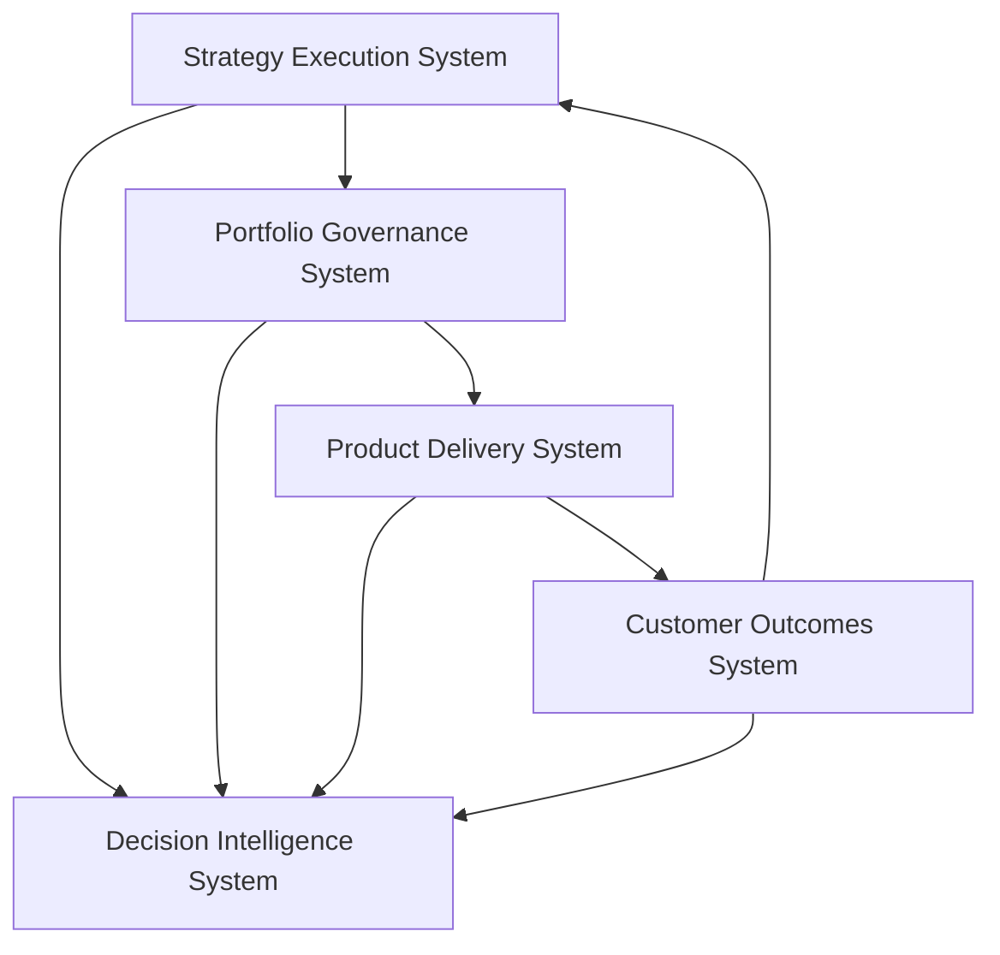

# Product Leadership Systems Architecture — System Responsibilities

The System Responsibilities document defines the distinct roles of each operating system within the Product Leadership Systems Architecture (PLSA).

The architecture assumes that modern product organizations function most effectively when leadership responsibilities are structured across coordinated systems rather than distributed informally across teams or individuals.

Each system has a clear purpose, a set of leadership responsibilities, and a specific role in translating strategy into outcomes and outcomes into learning.

The five systems defined in the architecture are:

- Strategy Execution System
- Portfolio Governance System
- Product Delivery System
- Customer Outcomes System
- Decision Intelligence System

Together, these systems form a coordinated leadership structure that supports strategy execution, disciplined investment decisions, coordinated delivery, outcome accountability, and organizational learning.

---

## Purpose

The purpose of the System Responsibilities document is to clarify how leadership responsibilities are distributed across the Product Leadership Systems Architecture.

It is intended to help leaders:

- understand the role of each operating system
- avoid overlapping or ambiguous leadership responsibilities
- improve coordination across strategy, governance, delivery, and outcomes
- design product operating models with clearer structural boundaries
- strengthen accountability across the leadership system

This document provides a reference point for interpreting the rest of the repository and for designing operating models based on the architecture.

---

## System Responsibility Overview

---

## Strategy Execution System

The Strategy Execution System defines the direction and strategic intent of the organization.

Its primary responsibilities include:

- establishing strategic direction
- defining strategic priorities and focus areas
- clarifying intended outcomes and success measures
- framing the strategic context for portfolio decisions
- refining strategic direction based on learning and outcomes

This system ensures that leadership decisions begin with clear strategic intent and that strategy remains connected to operational reality over time.

---

## Portfolio Governance System

The Portfolio Governance System translates strategic priorities into disciplined investment and prioritization decisions.

Its primary responsibilities include:

- managing initiative and investment intake
- evaluating proposals against strategic and operational criteria
- prioritizing and sequencing work across the portfolio
- governing tradeoffs between competing initiatives
- monitoring portfolio performance and adjusting investment decisions

This system ensures that limited organizational capacity is directed toward the most strategically important work.

---

## Product Delivery System

The Product Delivery System converts approved portfolio decisions into coordinated execution.

Its primary responsibilities include:

- planning delivery across initiatives and teams
- coordinating cross-functional execution
- managing dependencies and delivery risk
- maintaining delivery cadence and operational rhythms
- progressing initiatives toward completion

This system ensures that the work selected through governance can be delivered effectively and predictably.

---

## Customer Outcomes System

The Customer Outcomes System evaluates the real-world impact of delivered work.

Its primary responsibilities include:

- measuring customer adoption and product usage
- evaluating product impact on customer behavior and outcomes
- assessing business and operational results
- providing evidence of value creation
- informing strategic and governance refinement

This system ensures that delivery is evaluated against meaningful outcomes rather than simply against output completion.

---

## Decision Intelligence System

The Decision Intelligence System integrates signals from across the operating model and strengthens leadership decision-making.

Its primary responsibilities include:

- integrating signals from strategy, governance, delivery, and outcomes
- improving visibility into performance across the operating system
- providing contextual insight for leadership decisions
- supporting evidence-based prioritization and strategic refinement
- strengthening organizational learning loops

This system ensures that leadership decisions are informed by integrated evidence rather than fragmented reporting.

---

## Diagram Interpretation

The System Responsibility Overview diagram should be interpreted as a structural map of leadership responsibilities across the Product Leadership Systems Architecture.

The diagram shows how strategic direction flows into portfolio governance decisions, how governance decisions shape product delivery activity, and how delivery produces customer outcomes that inform future strategic direction.

The Decision Intelligence System sits across the operating model, integrating signals from all other systems and strengthening leadership visibility and decision-making.

This diagram should therefore be read as a leadership structure rather than a workflow diagram. It shows how responsibility is distributed across systems that must operate in coordination.

---

## System Explanation

Each operating system within the architecture serves a distinct leadership function.

The Strategy Execution System provides direction and intent.  
The Portfolio Governance System converts strategic intent into investment decisions.  
The Product Delivery System executes the work that governance approves.  
The Customer Outcomes System evaluates whether delivery created value.  
The Decision Intelligence System integrates evidence and strengthens decision quality across the system.

These responsibilities are intentionally distinct so that leadership roles remain clear and the operating model avoids structural ambiguity.

At the same time, the systems must remain closely connected. The effectiveness of the operating model depends on how well these responsibilities interact.

---

## Operating Logic

The operating logic of the System Responsibilities model is based on coordinated leadership roles.

1. Strategy establishes direction.
2. Governance translates direction into portfolio decisions.
3. Delivery executes governed work.
4. Outcomes reveal whether value was created.
5. Intelligence integrates signals and supports refinement.

This logic ensures that responsibility is distributed in a way that supports both execution and learning.

Without this structure, organizations often experience:

- unclear prioritization authority
- delivery disconnected from strategic context
- outcomes that do not influence future decisions
- fragmented reporting and decision-making
- leadership roles that overlap or conflict

The System Responsibilities model helps prevent these problems by clarifying how the operating system should function.

---

## Why This Architecture Matters

Many product organizations struggle with unclear leadership responsibilities across strategy, governance, delivery, and measurement.

Common symptoms include:

- strategy teams disconnected from delivery teams
- portfolio decisions made without clear criteria
- delivery teams overloaded with competing priorities
- limited visibility into outcomes
- reporting functions that do not influence leadership decisions

The System Responsibilities model addresses these issues by defining how leadership work should be distributed across coordinated systems.

This makes it useful for:

- designing product operating models
- clarifying leadership responsibilities
- improving cross-functional coordination
- strengthening portfolio governance
- supporting product operations leadership
- guiding product organization transformation

---

## How To Use This

Use this document to understand how leadership responsibilities should be structured within the Product Leadership Systems Architecture.

Recommended uses include:

- clarifying leadership roles across strategy, governance, delivery, and outcomes
- diagnosing structural gaps in the current operating model
- designing operating models for product organizations
- aligning executive teams around leadership responsibilities
- improving coordination between product, engineering, and operations functions

Recommended sequence:

1. Read this document after reviewing `overview.md`.
2. Use `design-principles.md` to understand the architectural logic behind the system responsibilities.
3. Review the diagrams to understand how the systems interact.
4. Use frameworks and artifacts to assess how well current responsibilities align to the architecture.
5. Apply playbooks to operationalize these responsibilities in recurring leadership practice.

This document is most useful as a structural reference when designing or evaluating product leadership operating models.

---

## Relationship To The Operating System

This document defines the leadership responsibility layer of the Product Leadership Systems Architecture.

While `overview.md` explains the structure of the operating system and `design-principles.md` explains the architectural logic, this document defines the specific responsibilities assigned to each system.

Within the broader repository:

- `overview.md` defines the overall architecture
- `design-principles.md` defines the guiding principles
- `feedback-loops.md` explains how learning occurs across the system
- `frameworks/` applies the architecture through maturity models
- `artifacts/` provides tools for diagnosing operating effectiveness
- `playbooks/` translate responsibilities into operational practice
- `diagrams/` visualize flows and interactions across the systems

This document should therefore be read as the responsibility framework for the Product Leadership Systems Architecture.

---

## Summary

The System Responsibilities document clarifies how leadership responsibilities are distributed across the Product Leadership Systems Architecture.

It defines the role of each operating system and explains how strategy, governance, delivery, outcomes, and intelligence interact to form a coherent leadership structure.

By making these responsibilities explicit, the architecture helps product organizations avoid fragmented leadership patterns and design operating models that translate strategy into outcomes with greater discipline and clarity.

---

## License

This project is licensed under the MIT License.

See the [LICENSE](../LICENSE) file for full license details.
