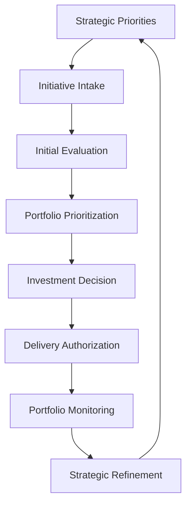
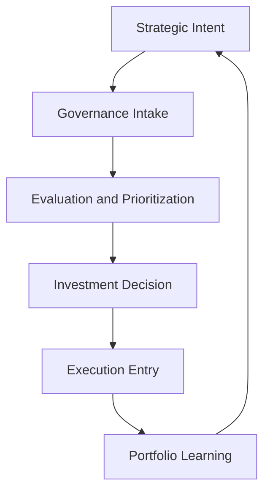

# Governance Decision Flow

The **Governance Decision Flow** illustrates how strategic priorities are translated into portfolio decisions within the **Product Leadership Systems Architecture (PLSA)**.

This artifact clarifies the sequence through which initiatives move from strategic relevance to evaluation, prioritization, authorization, execution entry, and portfolio monitoring.

By making governance decision flow explicit, the architecture preserves the boundary between **strategy definition**, **investment governance**, and **delivery execution**.

---

# Purpose

The purpose of this artifact is to define the **decision movement model** of the Portfolio Governance System.

While the unified architecture explains the structural relationship between systems, this document focuses specifically on how governance operates as a decision mechanism within the broader leadership architecture.

The artifact provides clarity on:

- how strategic priorities shape initiative intake  
- how initiatives are evaluated and prioritized  
- how investment decisions are made  
- how approved work enters execution  
- how portfolio monitoring informs future governance decisions  

This document helps explain governance not as a meeting structure, but as a repeatable operating flow.

---

# Diagram

The diagram below illustrates the Governance Decision Flow within the Product Leadership Systems Architecture.

---

## Diagram Interpretation

The Governance Decision Flow shows how the **Portfolio Governance System** converts strategic intent into explicit investment decisions within the **Product Leadership Systems Architecture (PLSA)**.

The flow begins with **Strategic Priorities**, where the direction established by the Strategy Execution System defines the themes, constraints, and leadership focus areas that shape portfolio demand.

Those priorities feed **Initiative Intake**, where candidate initiatives enter the governance process. Intake creates the entry point for proposals, opportunities, and potential investments.

During **Initial Evaluation**, initiatives are reviewed for strategic fit, expected value, feasibility, and relevance. This step helps remove weak or misaligned work before it consumes additional governance attention.

In **Portfolio Prioritization**, initiatives are compared against one another to determine relative importance, sequencing, and tradeoffs across the broader portfolio.

The **Investment Decision** stage formalizes which initiatives are approved, deferred, rejected, or reshaped. This is the core decision point of the governance model.

Approved work then moves into **Delivery Authorization**, where the initiative is allowed to enter the Product Delivery System with defined expectations, scope, and priority.

Once in motion, **Portfolio Monitoring** tracks progress, risk, and performance across the portfolio. This gives leaders visibility into whether decisions remain sound over time.

Finally, **Strategic Refinement** uses governance and portfolio signals to inform future strategic direction, closing the loop between governance outcomes and leadership learning.

---

## Flow Explanation

The Governance Decision Flow is the operational mechanism through which the **Portfolio Governance System** performs its role in the Product Leadership Systems Architecture.

### Strategic Priorities

Strategic Priorities define the criteria and intent that shape what kinds of initiatives should enter governance. This stage ensures that governance begins with strategic context rather than disconnected demand.

### Initiative Intake

Initiative Intake captures candidate investments entering the portfolio. These may include new initiatives, major enhancements, transformation efforts, or strategic proposals.

### Initial Evaluation

Initial Evaluation determines whether an initiative is sufficiently aligned, valuable, and feasible to continue through governance. This stage improves governance efficiency by filtering work early.

### Portfolio Prioritization

Portfolio Prioritization compares initiatives relative to one another. It introduces tradeoff discipline and helps leaders sequence work based on strategy, value, urgency, and capacity.

### Investment Decision

Investment Decision is the point at which governance explicitly chooses whether to fund, defer, reject, or reshape the initiative. This is where strategic intent becomes a real portfolio commitment.

### Delivery Authorization

Delivery Authorization marks the formal transition from governance into execution. At this point, work is permitted to enter structured delivery planning and coordination.

### Portfolio Monitoring

Portfolio Monitoring provides visibility into active investments. It tracks status, risk, execution performance, and continued strategic relevance.

### Strategic Refinement

Strategic Refinement ensures that governance remains a closed-loop system. Signals from portfolio performance inform how leadership adjusts priorities and future decision criteria.

---

## Operating Logic

The Governance Decision Flow is based on the principle that **governance must sit between strategy and delivery**.

The **Strategy Execution System** defines the priorities that shape what governance should evaluate.

The **Portfolio Governance System** then performs structured decision-making by receiving candidate initiatives, evaluating them, prioritizing them, and converting selected work into explicit investment decisions.

Only after those decisions are made does work move into the **Product Delivery System**.

This preserves an essential architectural boundary: delivery should execute approved work, not act as the primary mechanism for investment selection.

The governance flow also includes feedback. Portfolio Monitoring generates the information needed to determine whether prior investment decisions remain valid. Those signals support Strategic Refinement, which influences the next cycle of priorities and intake.

The architecture is effective because governance functions as a structured decision layer rather than an informal approval step.

---

## Closed-Loop Governance Operating Logic Diagram

The architecture is effective because governance functions as a structured decision layer rather than an informal approval step.

---

## Why This Matters

Many organizations appear to have governance, but in practice operate through fragmented approvals, local prioritization, or delivery-driven investment selection.

Common failure patterns include:

- initiatives entering execution without strategic evaluation
- prioritization occurring inconsistently across teams
- resource allocation decisions being made without portfolio tradeoffs
- portfolio monitoring existing as status reporting rather than decision support
- strategy changing without governance criteria changing with it

The Governance Decision Flow addresses these issues by making the decision path explicit.

This matters because product organizations scale more effectively when investment choices are made through a repeatable governance model rather than through ad hoc escalation, local urgency, or organizational noise.

---

## How To Use This

This artifact can be used to assess, design, or explain how portfolio governance operates inside a product organization.

Leadership teams can use the flow to:

- identify whether governance sits clearly between strategy and delivery
- assess whether initiative intake is structured or informal
- evaluate whether prioritization is explicit and comparable across initiatives
- clarify where investment decisions are actually made
- determine whether monitoring informs future decision quality

This artifact is especially useful when:

- redesigning portfolio governance models
- clarifying decision rights across product leadership teams
- diagnosing why execution is overloaded with low-value work
- documenting governance architecture for executive audiences

Used correctly, the Governance Decision Flow becomes a practical model for strengthening investment discipline and strategic alignment.

---

## Relationship To The Operating System

This artifact complements the broader **Product Leadership Systems Architecture** by explaining how the **Portfolio Governance System** functions as the decision layer between strategy and execution.

Within the repository, it works alongside:

- the README, which introduces the overall architecture
- the Unified Product Leadership Systems Architecture, which defines the canonical system model
- the System Responsibilities Matrix, which defines ownership boundaries across systems
- the System Interaction Diagram, which explains how systems exchange signals and decisions
- frameworks and playbooks, which describe how governance and delivery can be operationalized in practice

In this way, the Governance Decision Flow adds procedural clarity to the structural architecture.

---

## Summary

The Governance Decision Flow defines how strategic intent is translated into portfolio decisions within the Product Leadership Systems Architecture.

By showing how initiatives move from intake through evaluation, prioritization, authorization, monitoring, and refinement, the artifact clarifies the core operating logic of governance.

This document helps explain not only where governance sits in the architecture, but how governance decisions are actually made and sustained over time.

---

## License

This repository is released under the **MIT License**.

The MIT License permits reuse, modification, and distribution of this material provided that the original copyright and license notice are included.

See the full license text in the repository:

[MIT License](../LICENSE)

