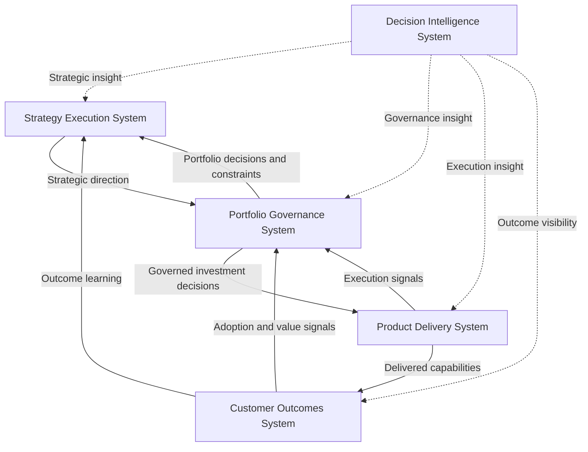
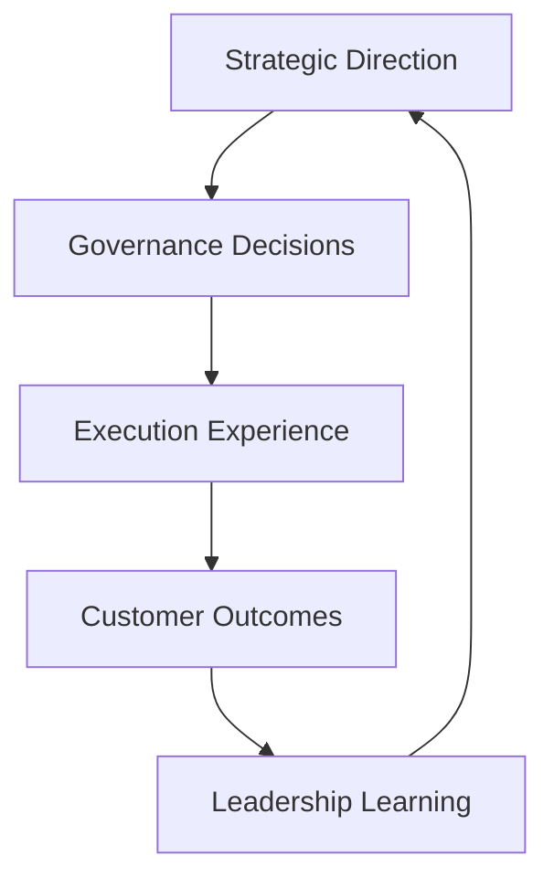

# Leadership Feedback Loops

The **Leadership Feedback Loops** artifact illustrates how learning signals move through the **Product Leadership Systems Architecture (PLSA)** to improve strategic direction, governance quality, execution effectiveness, and customer value realization.

This artifact explains how modern product organizations learn over time by connecting outcomes, analytics, governance signals, and execution insights back into leadership decision-making.

Rather than showing only structural flow, this document focuses on how the architecture functions as a **learning system**.

---

# Purpose

The purpose of this artifact is to define the **feedback and learning model** of the Product Leadership Systems Architecture.

While the unified architecture explains the system structure and other artifacts describe responsibilities, interfaces, governance movement, and operating model logic, this document explains how the architecture improves over time through recurring feedback loops.

The artifact provides clarity on:

- how customer outcomes shape future strategy
- how portfolio monitoring improves governance decisions
- how execution signals improve delivery effectiveness
- how decision intelligence strengthens learning across all systems
- how the architecture operates as a closed-loop leadership system rather than a one-way delivery chain

This document helps explain how leadership learning is built into the architecture.

---

# Diagram

The diagram below illustrates the major leadership feedback loops within the Product Leadership Systems Architecture.

---

## Diagram Interpretation

The Leadership Feedback Loops diagram shows that the **Product Leadership Systems Architecture (PLSA)** is not a one-way execution chain. It is a **closed-loop leadership system** that improves through recurring learning signals.

The **Strategy Execution System** provides direction to the **Portfolio Governance System**, which converts strategic priorities into investment choices.

The **Portfolio Governance System** then authorizes work for the **Product Delivery System**, where approved initiatives are executed through coordinated product and engineering delivery.

The **Product Delivery System** produces delivered capabilities that are then measured by the **Customer Outcomes System**.

From that point, multiple feedback loops begin.

The **Customer Outcomes System** sends outcome learning back to the **Strategy Execution System**, ensuring that strategy evolves based on adoption, value realization, and customer impact.

The **Product Delivery System** sends execution signals back into the **Portfolio Governance System**, allowing governance to learn from delivery constraints, dependencies, and execution realities.

The **Customer Outcomes System** also sends adoption and value signals into the **Portfolio Governance System**, improving future prioritization and investment quality.

The **Portfolio Governance System** shapes future strategy by surfacing portfolio-level tradeoffs, constraints, and investment learning back to leadership.

The **Decision Intelligence System** strengthens all of these loops through analytics, reporting, performance signals, and decision support.

Together, these loops show how leadership decisions improve over time through evidence rather than assumption alone.

---

## Feedback Loop Explanation

The Product Leadership Systems Architecture contains several distinct but connected learning loops.

### Strategy Learning Loop

Customer outcomes inform strategic refinement. Leadership learns whether strategic priorities translated into meaningful value and can adjust future direction accordingly.

### Governance Learning Loop

Portfolio monitoring, adoption signals, and investment outcomes improve governance quality. Leaders learn which initiatives should be expanded, deprioritized, re-scoped, or stopped.

### Delivery Learning Loop

Execution signals such as dependency constraints, delivery health, coordination friction, and throughput realities inform better governance decisions and more realistic execution planning.

### Outcome Learning Loop

Outcome measurement does more than report results. It generates evidence about adoption, value realization, and impact, which shapes both portfolio and strategic learning.

### Intelligence Amplification Loop

Decision Intelligence strengthens every loop by identifying patterns, surfacing weak signals, improving measurement quality, and enabling faster learning across the operating model.

Together these loops ensure that the architecture functions as a living leadership system rather than a static operating design.

---

## Operating Logic

The operating logic of Leadership Feedback Loops is that **effective product leadership depends on structured learning, not just structured execution**.

A product organization may have strategy, governance, and delivery in place, but if outcomes and execution signals do not influence future decisions, the system becomes rigid and progressively less effective.

In the Product Leadership Systems Architecture, feedback is not treated as an afterthought. It is embedded directly into the operating model.

This logic ensures that:

- strategy improves through outcome learning
- governance improves through portfolio and adoption signals
- delivery improves through insight into execution realities
- intelligence strengthens the speed and quality of learning across all systems

The architecture therefore operates as a learning system in which each cycle increases decision quality.

The architecture is effective because learning is built into the system rather than bolted on after execution is complete.

---

## Why This Matters

Many organizations execute work continuously but do not learn systematically from what they execute.

Common failure patterns include:

- outcome data being collected without influencing strategy
- governance decisions being repeated without learning from prior investments
- delivery issues being treated as isolated execution problems rather than governance signals
- customer impact being observed too late to change leadership decisions
- analytics teams producing reports without shaping executive action

The Leadership Feedback Loops artifact addresses these issues by making learning pathways explicit.

This matters because product leadership maturity depends not only on execution capability, but on how well leadership can learn, adapt, and improve decisions over time.

---

## How To Use This

This artifact can be used to assess, explain, or improve how learning occurs inside a product leadership operating model.

Leadership teams can use the diagram to:

- evaluate whether outcomes influence future strategy
- assess whether governance improves through portfolio learning
- identify whether delivery signals are reaching decision-makers
- determine whether analytics are improving decisions or only reporting activity
- diagnose where learning loops are weak, delayed, or missing

This artifact is especially useful when:

- improving product operating models
- evaluating leadership maturity
- diagnosing repeated prioritization or execution failures
- explaining how the architecture functions as a closed-loop system

Used correctly, the Leadership Feedback Loops artifact becomes a practical model for strengthening organizational learning and decision quality.

---

## Relationship To The Operating System

This artifact complements the broader **Product Leadership Systems Architecture** by explaining how leadership learning occurs across the operating model.

Within the repository, it works alongside:

- the README, which introduces the architecture at a portfolio level
- the Unified Product Leadership Systems Architecture, which defines the canonical system model
- the Architecture Design Principles, which define the rules preserving system integrity
- the System Responsibilities Matrix, which defines ownership boundaries
- the System Interaction Diagram, which explains interfaces between systems
- the Governance Decision Flow, which explains portfolio decision movement
- the Product Leadership Operating System Overview, which explains how the architecture functions as a practical leadership model

In this way, the Leadership Feedback Loops artifact adds the learning dimension that completes the operating system.

---

## Summary

The Leadership Feedback Loops artifact defines how the Product Leadership Systems Architecture learns over time.

By showing how outcome signals, execution realities, governance insight, and decision intelligence feed back into future leadership decisions, the artifact explains how the architecture functions as a true closed-loop operating system.

This document helps explain not only how the systems operate, but how they improve.

---

## License

This repository is released under the **MIT License**.

The MIT License permits reuse, modification, and distribution of this material provided that the original copyright and license notice are included.

See the full license text in the repository:

[MIT License](../LICENSE)
