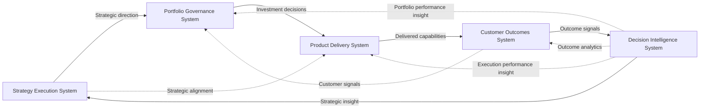

# PLSA System Interaction Map
Product Leadership Systems Architecture

---

# Diagram

---

# Diagram Interpretation

The PLSA System Interaction Map shows how the five systems of the Product Leadership Systems Architecture operate as an integrated leadership model.

The diagram illustrates both the **primary operating flow** and the **cross-cutting interaction patterns** that allow the architecture to function as a coherent system.

The primary operating flow is:

- Strategy Execution System
- Portfolio Governance System
- Product Delivery System
- Customer Outcomes System
- Decision Intelligence System

This sequence shows how strategic intent is translated into governed investments, coordinated execution, measurable outcomes, and strategic learning.

The diagram also shows that the architecture is not purely linear.

### Strategy Execution System

The Strategy Execution System establishes strategic direction, investment themes, and organizational priorities.

It defines what matters most and provides the leadership intent that shapes downstream decisions.

### Portfolio Governance System

The Portfolio Governance System converts strategy into funded and prioritized work.

It evaluates initiatives, manages sequencing, allocates resources, and balances tradeoffs across the portfolio.

### Product Delivery System

The Product Delivery System executes approved work through product, engineering, and cross-functional delivery mechanisms.

It turns portfolio decisions into delivered capabilities.

### Customer Outcomes System

The Customer Outcomes System evaluates whether delivered capabilities created real value.

It captures adoption, usage, value realization, and customer impact.

### Decision Intelligence System

The Decision Intelligence System provides the analytics, measurement, and decision support needed to strengthen every other system.

It captures signals from execution and outcomes, generates insight, and enables leadership refinement.

### Interaction Logic

The System Interaction Map also highlights important non-linear relationships:

- Decision Intelligence informs governance, delivery, and outcome evaluation
- Strategy influences delivery alignment, not only governance decisions
- Customer outcome signals can affect governance choices, not just strategic learning

This means the architecture operates as a **coordinated system of leadership interactions**, not just a step-by-step workflow.

---

# Why This Diagram Matters

This diagram matters because it shows how the architecture actually functions as a living operating model.

Other diagrams in the repository explain structure, control, governance, or composition.  
The System Interaction Map explains **interaction**.

It is important because it:

- shows how strategic intent moves through the architecture
- clarifies how governance and execution are connected
- reveals how outcomes influence future leadership decisions
- demonstrates the role of Decision Intelligence as a cross-cutting capability
- provides the clearest single-picture view of the operating architecture

Without this diagram, the architecture can still be understood.  
With this diagram, the architecture becomes easier to explain as an integrated system.

This is why System Interaction Maps are often the most recognizable diagrams in mature architecture libraries.

---

# Relationship to the Architecture

The PLSA System Interaction Map complements the other core architecture diagrams by providing the interaction view of the architecture.

Each major diagram serves a different purpose:

- the **Layered Architecture Diagram** shows structural organization
- the **Executive Control Architecture** shows the leadership control rhythm
- the **Architecture Governance** artifact defines how the architecture is protected
- the **Architecture Metamodel** defines the formal concept structure
- the **System Interaction Map** shows how the systems interact operationally

This means the System Interaction Map should not replace the other architecture diagrams.

Instead, it acts as the diagram that brings them together by showing the architecture in motion.

It is the most useful visual for explaining how strategy, governance, delivery, outcomes, and intelligence work together as one leadership system.

---

# Summary

The PLSA System Interaction Map visualizes how the five systems of the Product Leadership Systems Architecture operate together.

It shows the primary leadership flow from strategy to governance to delivery to outcomes, while also highlighting the cross-cutting role of Decision Intelligence and the feedback relationships that make the architecture adaptive.

This diagram is valuable because it provides the clearest operational view of the architecture as an integrated leadership model.

It is one of the most important visuals in the repository because it helps explain how the architecture actually works in practice.

---

# License

This architecture documentation is licensed under the MIT License.

See the repository LICENSE file for full details.
