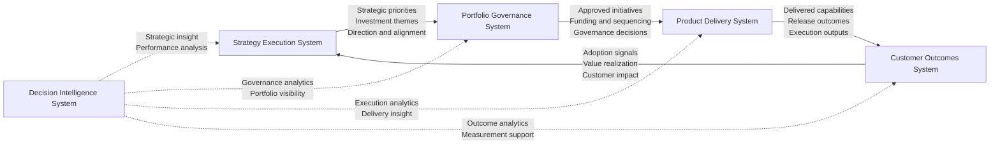
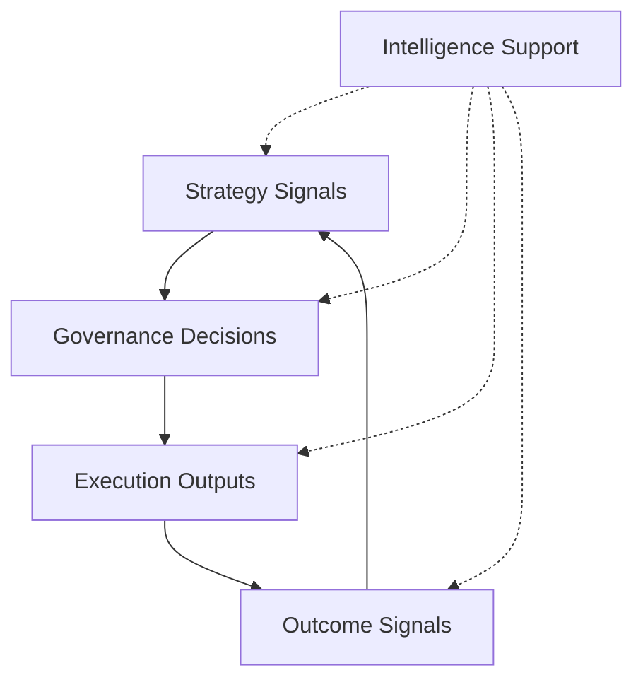

# System Interaction Diagram

The **System Interaction Diagram** illustrates how the systems within the **Product Leadership Systems Architecture (PLSA)** exchange decisions, inputs, outputs, and feedback signals.

This artifact clarifies the interfaces between systems so that strategy, governance, execution, outcomes, and intelligence remain structurally distinct while operating as a coordinated leadership model.

---

# Purpose

The purpose of this artifact is to define the **interaction model** of the Product Leadership Systems Architecture.

While the unified architecture describes the overall system structure, this diagram focuses specifically on how the systems connect in practice through information flow, decision flow, and learning signals.

The artifact provides clarity on:

• how strategy informs governance  
• how governance authorizes delivery  
• how delivery produces outcome signals  
• how outcomes and intelligence feed learning back into the architecture  

This document helps explain the architecture not only as a set of layers, but as a functioning operating system.

---

# Diagram

The diagram below illustrates the major interactions between the systems of the Product Leadership Systems Architecture.

---

## Diagram Interpretation

The System Interaction Diagram illustrates how the systems within the **Product Leadership Systems Architecture (PLSA)** exchange decisions, inputs, outputs, and feedback signals.

The **Strategy Execution System** provides strategic priorities, investment themes, and organizational direction to the **Portfolio Governance System**. This ensures that governance decisions are based on strategic intent rather than disconnected initiative demand.

The **Portfolio Governance System** converts that direction into explicit investment decisions. It evaluates initiatives, prioritizes opportunities, allocates resources, and sends approved work into the **Product Delivery System**.

The **Product Delivery System** executes the approved initiatives through coordinated product, engineering, and cross-functional delivery. Its outputs take the form of delivered capabilities, releases, and execution progress, which flow into the **Customer Outcomes System**.

The **Customer Outcomes System** measures whether those delivered capabilities generated meaningful value. It produces outcome signals such as adoption, usage, customer impact, and value realization, which inform future strategic direction.

The **Decision Intelligence System** operates as a cross-cutting capability that supports all systems through analytics, reporting, measurement infrastructure, and decision support. It does not replace the primary architecture flow, but strengthens each system's ability to make informed decisions.

Together these interactions create a coordinated strategy-to-outcomes leadership model in which direction, investment, execution, outcomes, and learning remain structurally connected.

---

## System Explanation

The Product Leadership Systems Architecture contains five coordinated systems, each with a distinct role in the interaction model.

### Strategy Execution System

The Strategy Execution System defines strategic direction and communicates enterprise priorities into governance. Its primary interaction is to provide the Portfolio Governance System with strategic guidance, investment themes, and alignment signals.

### Portfolio Governance System

The Portfolio Governance System receives strategic direction and converts it into funded, prioritized, and sequenced work. Its primary interaction is to authorize and structure the work that enters the Product Delivery System.

### Product Delivery System

The Product Delivery System receives approved initiatives and coordinates their execution. Its primary interaction is to transform governance decisions into delivered capabilities through structured product and engineering delivery.

### Customer Outcomes System

The Customer Outcomes System receives delivered capabilities and determines whether they created meaningful value. Its primary interaction is to generate outcome signals that inform leadership about adoption, impact, and value realization.

### Decision Intelligence System

The Decision Intelligence System supports all systems with metrics, analytics, reporting, and insight. Its role in the interaction model is to improve the quality of decisions across strategy, governance, delivery, and outcomes by supplying evidence and analytical support.

---

## Operating Logic

The operating logic of the System Interaction Diagram is based on the principle that each system should exchange only the information and decisions appropriate to its role.

The **Strategy Execution System** does not directly govern delivery or measure outcomes. Instead, it defines direction and communicates strategic intent into the governance process.

The **Portfolio Governance System** does not define enterprise strategy or execute work directly. Instead, it evaluates opportunities, makes investment decisions, and determines which initiatives move into execution.

The **Product Delivery System** does not independently set portfolio priorities. Instead, it receives approved work and coordinates execution through product, engineering, and cross-functional collaboration.

The **Customer Outcomes System** does not allocate resources or authorize delivery. Instead, it measures whether delivered work created meaningful value through adoption, usage, impact, and customer feedback.

The **Decision Intelligence System** does not replace the primary architecture flow. Instead, it provides insights, analytics, and measurement support that strengthen decision quality across all systems.

This interaction model creates a closed-loop operating logic:

The architecture is effective because the systems remain distinct in responsibility while still exchanging the signals required for coordinated leadership.

---

## Why This Matters

Many organizations struggle not because they lack strategy or execution capability, but because the interactions between leadership systems are weak, inconsistent, or undefined.

Common failure patterns include:

- strategy that does not reach governance in a usable form
- governance decisions that do not translate clearly into delivery
- delivery outputs that are measured by activity rather than value
- customer outcome signals that fail to inform future strategic direction
- analytics functions that generate data without improving leadership decisions

The System Interaction Diagram addresses these issues by making the interfaces between systems explicit.

This matters because scalable product leadership depends not only on strong individual systems, but also on the quality of the interactions between those systems. Clear interfaces improve alignment, reduce ambiguity, and strengthen the organization’s ability to translate strategy into measurable outcomes.

---

## How To Use This

This artifact can be used to assess, design, or explain how leadership systems interact within a product organization.

Leadership teams can use the diagram to:

- evaluate whether strategic intent flows clearly into governance
- assess whether governance decisions translate effectively into delivery
- determine whether delivery outputs are connected to outcome measurement
- identify whether customer and intelligence signals influence future strategy
- diagnose weak, missing, or overloaded handoffs between systems

This artifact is especially useful when:

- redesigning product operating models
- clarifying cross-functional interfaces
- diagnosing strategy-to-execution disconnects
- documenting architecture for executive audiences

Used correctly, the System Interaction Diagram becomes a practical tool for understanding how the product leadership architecture functions as a coordinated operating system.

---

## Relationship To The Operating System

This artifact complements the broader **Product Leadership Systems Architecture** by focusing on the interfaces between systems rather than only their structural placement.

Within the repository, it works alongside:

- the README, which introduces the architecture at a portfolio level
- the Unified Product Leadership Systems Architecture, which defines the canonical system model
- the System Responsibilities Matrix, which defines ownership boundaries across systems
- governance flow artifacts, which explain how portfolio decisions move through the model
- frameworks and playbooks, which describe how teams operationalize the architecture

In this way, the System Interaction Diagram helps translate the architecture from a layered model into a functioning system of connected leadership mechanisms.

---

## Summary

The System Interaction Diagram defines how the systems of the Product Leadership Systems Architecture exchange strategic direction, governance decisions, execution outputs, outcome signals, and analytical insight.

By clarifying these interactions, the artifact strengthens the architecture’s ability to function as a coordinated leadership system rather than a collection of disconnected operating components.

This document helps explain not only what the systems are, but how they work together to translate strategy into measurable outcomes.

---

## License

This repository is released under the **MIT License**.

The MIT License permits reuse, modification, and distribution of this material provided that the original copyright and license notice are included.

See the full license text in the repository:

[MIT License](../LICENSE)

