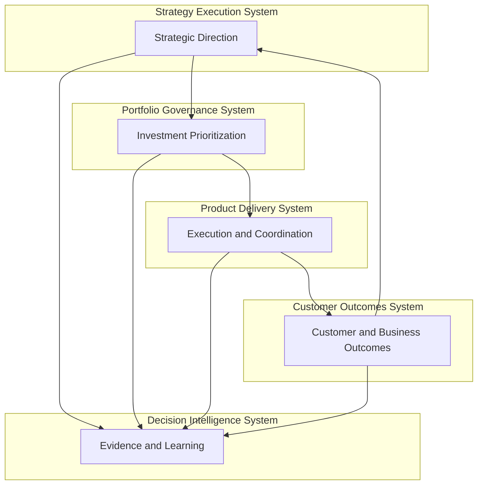

# Product Leadership Systems Architecture — Overview

The Product Leadership Systems Architecture (PLSA) defines a structured model for understanding how modern product organizations operate as coordinated leadership systems. Rather than treating strategy, governance, delivery, and outcomes as independent activities, the architecture shows how these capabilities interact as an integrated operating system.

The model emphasizes that successful product organizations do not rely solely on strong strategy or strong execution. They rely on the alignment of multiple operating systems that collectively translate intent into outcomes and outcomes into learning.

The Product Leadership Systems Architecture is composed of five coordinated systems:

- Strategy Execution System
- Portfolio Governance System
- Product Delivery System
- Customer Outcomes System
- Decision Intelligence System

Together, these systems form a closed-loop leadership model that connects strategic direction, investment decisions, coordinated delivery, measurable outcomes, and continuous learning.

---

## Purpose

The purpose of the Product Leadership Systems Architecture is to provide a clear and structured framework for understanding how product organizations design and operate their leadership systems.

It is intended to help leaders:

- connect strategic direction to operational execution
- govern portfolio investment decisions more effectively
- coordinate delivery across teams and initiatives
- measure outcomes that reflect real customer and business value
- strengthen learning loops that improve future decisions

The architecture also provides a shared language for discussing how product organizations operate, enabling more disciplined operating model design and improvement.

---

## Architecture Diagram

---

## Diagram Interpretation

The architecture diagram should be interpreted as a leadership operating model rather than a simple process flow.

The top sequence illustrates how strategic intent moves through governance and delivery to produce measurable outcomes. Strategic direction informs portfolio prioritization, governance decisions shape delivery execution, and delivery generates customer and business outcomes.

The return connection from outcomes back to strategy represents the closed-loop nature of the system. Outcomes provide evidence that should inform future strategic decisions and investment priorities.

The Decision Intelligence System integrates signals from across the operating model. It helps leadership teams interpret performance, understand tradeoffs, and make more informed decisions across strategy, governance, delivery, and outcomes.

For that reason, the diagram should be understood as a systems architecture for product leadership rather than a simple workflow diagram.

---

## System Explanation

The Product Leadership Systems Architecture is composed of five coordinated operating systems.

### Strategy Execution System

The Strategy Execution System establishes the direction and intent of the organization. It defines strategic priorities, clarifies the outcomes the organization seeks to achieve, and frames the decisions that governance and delivery systems must support.

### Portfolio Governance System

The Portfolio Governance System translates strategic priorities into investment decisions. It governs initiative intake, evaluation, prioritization, and sequencing so that resources are directed toward the most important work.

### Product Delivery System

The Product Delivery System converts approved work into coordinated execution. It aligns teams, manages delivery dependencies, and ensures that initiatives progress toward completion.

### Customer Outcomes System

The Customer Outcomes System measures the real-world impact of delivered work. It focuses on customer value, product adoption, operational improvement, and business performance.

### Decision Intelligence System

The Decision Intelligence System integrates signals from across the operating system. It provides visibility into performance, strengthens leadership decision-making, and supports learning across the organization.

---

## Operating Logic

The operating logic of the Product Leadership Systems Architecture is based on the interaction of five coordinated systems.

1. Strategy establishes direction and intent.
2. Governance translates strategy into investment and prioritization decisions.
3. Delivery converts those decisions into coordinated execution.
4. Outcomes reveal whether execution created meaningful value.
5. Intelligence integrates signals and supports learning across the system.

This operating logic ensures that strategy is not isolated from execution and that outcomes are not disconnected from future decision-making.

The strength of the operating model depends on the quality of the connections between these systems.

---

## Why This Architecture Matters

Many product organizations struggle not because they lack strategy or capable delivery teams, but because their operating systems are fragmented.

Common failure patterns include:

- strategic priorities that do not influence portfolio decisions
- portfolio decisions that do not align with delivery capacity
- delivery teams focused on output rather than outcomes
- outcome signals that do not influence future strategy
- leadership decisions made without integrated evidence

The Product Leadership Systems Architecture addresses these issues by defining a coherent operating model that connects strategy, governance, delivery, outcomes, and decision intelligence.

This makes the architecture useful for:

- designing product operating models
- improving portfolio governance
- strengthening product operations leadership
- diagnosing organizational execution challenges
- guiding transformation of product organizations

---

## How To Use This

This document serves as the entry point to the Product Leadership Systems Architecture repository.

Recommended reading sequence:

1. Review this overview to understand the operating model.
2. Explore the architecture documents to understand system responsibilities and design principles.
3. Review the diagrams to understand how the systems interact.
4. Use the frameworks and artifacts to assess organizational maturity and operating performance.
5. Apply the playbooks to operationalize the architecture within a real organization.

The overview should be used as the foundation for understanding how the repository’s documents connect together.

---

## Relationship To The Operating System

This document defines the high-level structure of the Product Leadership Systems Architecture and serves as the architectural anchor for the repository.

Within the repository:

- `architecture/` defines the structure and responsibilities of each operating system
- `frameworks/` describes maturity models and conceptual frameworks
- `artifacts/` provides diagnostic and assessment tools
- `playbooks/` translate architecture into operational practice
- `diagrams/` visualize key flows and relationships across the operating system

Together, these documents expand the core architecture defined in this overview.

---

## Summary

The Product Leadership Systems Architecture provides a systems-based model for understanding how modern product organizations operate.

It shows how strategy, governance, delivery, outcomes, and decision intelligence interact to create a coherent leadership system capable of translating intent into results and results into learning.

By framing product leadership as an integrated operating system, the architecture helps leaders design more effective organizations, improve execution quality, and strengthen their ability to adapt and learn over time.

---

## License

This project is licensed under the MIT License.

See the [LICENSE](../LICENSE) file for full license details.
