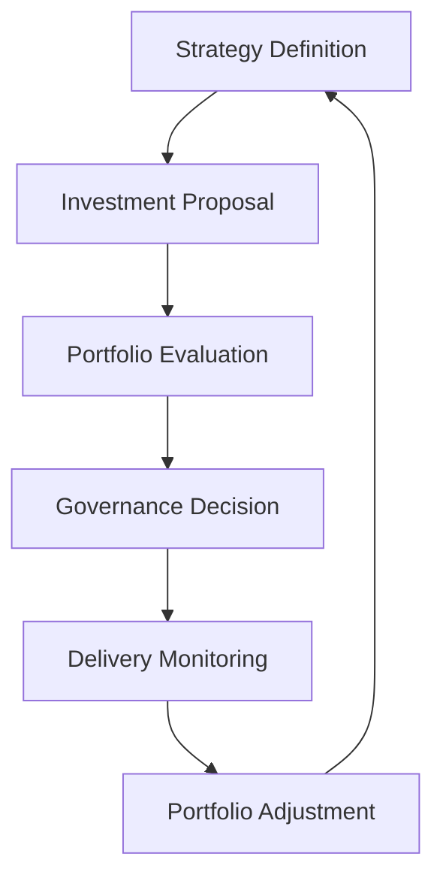

# Product Leadership Systems Architecture — Portfolio Governance Lifecycle

The Portfolio Governance Lifecycle illustrates how product organizations convert strategic priorities into governed investment decisions, monitored execution, and portfolio-level adjustment within the Product Leadership Systems Architecture (PLSA).

It provides a focused view of the governance operating cycle that sits between strategic intent and delivery execution. The lifecycle shows how organizations intake candidate work, evaluate options, make prioritization and investment decisions, monitor execution, and refine portfolio choices over time.

The lifecycle emphasizes that portfolio governance is not a one-time approval event. It is an ongoing leadership mechanism for managing tradeoffs, sequencing investment, monitoring performance, and adapting the portfolio as evidence emerges.

---

## Purpose

The purpose of the Portfolio Governance Lifecycle is to provide a clear visual model of how modern product organizations govern investment decisions across a portfolio of initiatives, products, or programs.

It is intended to help leaders understand:

- how strategic priorities enter governance
- how initiatives are evaluated and compared
- how prioritization and investment decisions are made
- how portfolio execution is monitored over time
- how governance decisions are refined based on evidence and changing conditions

This diagram should be used to explain how portfolio governance operates as a repeatable leadership discipline rather than an ad hoc approval process.

---

## Diagram

---

## Diagram Interpretation

The Portfolio Governance Lifecycle should be interpreted as a recurring governance loop rather than a linear approval chain.

The lifecycle begins with strategy definition, where leadership establishes the priorities, constraints, and directional intent that should shape investment decisions. From there, candidate initiatives or product investments are expressed as proposals that can be reviewed through a governance process.

Portfolio evaluation is the comparative stage of the lifecycle. This is where proposals are assessed against strategic fit, expected value, delivery feasibility, dependency complexity, organizational capacity, and portfolio balance. The purpose is not simply to approve ideas, but to evaluate them in relation to one another.

Governance decision is the point at which leadership commits to action. This includes prioritization, sequencing, funding, deferral, rejection, or conditional approval. The decision stage converts evaluation into portfolio commitments.

Delivery monitoring ensures that governance remains active after approval. Leaders track progress, emerging risks, execution signals, and changes in context to determine whether current portfolio decisions remain valid.

Portfolio adjustment closes the loop. It reflects the principle that governance must adapt as new evidence appears. Work may be accelerated, slowed, re-sequenced, expanded, or stopped based on strategic changes, delivery realities, or outcome signals.

For that reason, the lifecycle should be read as a continuous governance mechanism that connects strategic intent, decision-making, and portfolio adaptation.

---

## System Explanation

The Portfolio Governance Lifecycle spans the central operating elements of the Portfolio Governance System within the Product Leadership Systems Architecture.

### Strategy Definition

Strategy definition establishes the decision frame for portfolio governance. It clarifies what matters most, where investment should be concentrated, and what strategic constraints or priorities should guide evaluation.

### Investment Proposal

Investment proposal translates strategic opportunities, problems, or initiatives into candidate items for governance review. This is the stage where potential work becomes visible to the portfolio process.

### Portfolio Evaluation

Portfolio evaluation assesses proposals against explicit decision criteria. These may include strategic alignment, expected impact, implementation complexity, cost, dependencies, timing, and organizational readiness.

### Governance Decision

Governance decision determines the disposition of each proposal. This includes approval, prioritization, sequencing, conditional advancement, deferral, or rejection.

### Delivery Monitoring

Delivery monitoring tracks the execution health of approved work. It provides ongoing visibility into progress, risk, timeline shifts, dependency issues, and other signals that may affect portfolio confidence.

### Portfolio Adjustment

Portfolio adjustment updates the portfolio based on the evidence generated through monitoring and the broader business context. This ensures the portfolio remains aligned to strategy and organizational reality over time.

---

## Operating Logic

The operating logic of the Portfolio Governance Lifecycle is based on governed investment with continuous review.

1. Strategy establishes the decision frame.
2. Proposals translate opportunities into governable items.
3. Evaluation compares candidate work against explicit criteria.
4. Governance decisions determine investment and sequencing.
5. Monitoring provides evidence about execution and emerging risk.
6. Adjustment refines the portfolio based on new information.

This logic matters because portfolio governance often fails when organizations treat approval as the end of leadership involvement.

Common failure patterns include:

- strategy that does not meaningfully influence portfolio decisions
- too many proposals moving forward without comparative evaluation
- governance decisions made without delivery realism
- approved work continuing despite weak execution signals
- portfolio commitments remaining static even as conditions change

The Portfolio Governance Lifecycle is designed to make those governance transitions visible, explicit, and repeatable.

---

## Why This Diagram Matters

This diagram matters because portfolio governance is one of the most important and most inconsistently designed mechanisms in product organizations.

Many organizations have strategic plans and active delivery teams, but the middle layer of portfolio decision-making is weak. As a result:

- investment choices become inconsistent
- prioritization becomes politicized or reactive
- teams are overloaded with too much approved work
- leadership lacks visibility into tradeoffs
- portfolio commitments drift away from strategy

The Portfolio Governance Lifecycle provides a disciplined alternative. It helps leaders treat governance as an operating system with explicit stages, decision logic, and adaptation mechanisms.

It is especially useful for:

- product operations leaders
- portfolio governance leaders
- heads of product and strategy
- PMO and transformation leaders
- executive teams managing investment tradeoffs across multiple initiatives

---

## How To Use This

Use this diagram to explain how portfolio governance should operate as a recurring leadership discipline.

Recommended usage includes:

- aligning leadership teams on the governance cycle
- clarifying the stages of portfolio decision-making
- diagnosing where governance breakdowns are occurring
- improving the transition from strategic priorities to investment decisions
- strengthening monitoring and adjustment practices after approval

Recommended sequence:

1. Start with this diagram to establish the governance lifecycle.
2. Use the Master Operating System Diagram to place governance in the broader operating model.
3. Use the Strategy to Execution Flow to understand how governance connects strategy and delivery.
4. Apply the portfolio review playbook to operationalize recurring governance practice.
5. Use diagnostic artifacts and outcome signals to identify governance weaknesses and improvement priorities.

This diagram is most valuable when used as both a design model and an operating review tool.

---

## Relationship To The Operating System

This document provides the governance-cycle view within the Product Leadership Systems Architecture.

It shows how the Portfolio Governance System translates strategic direction into investment decisions, connects those decisions to delivery monitoring, and supports ongoing portfolio refinement.

Within the broader repository:

- `architecture/overview.md` defines the full operating system structure
- `diagrams/master-operating-system-diagram.md` provides the highest-level system view
- `diagrams/strategy-to-execution-flow.md` shows how governance fits into the broader execution pathway
- `playbooks/portfolio-review-playbook.md` translates this lifecycle into operational governance practice
- `artifacts/system-diagnostic-scorecard.md` supports assessment of governance maturity and decision quality

This document should therefore be read as the governance operating loop within the broader Product Leadership Systems Architecture.

---

## Summary

The Portfolio Governance Lifecycle provides a clear model for how product organizations evaluate initiatives, make investment decisions, monitor execution, and adapt the portfolio over time.

It shows that effective governance is not a single meeting or approval event. It is a repeatable leadership cycle that connects strategy, evaluation, decision-making, monitoring, and adjustment.

As part of the Product Leadership Systems Architecture repository, this diagram helps leaders understand and improve the portfolio mechanisms that shape strategic execution across modern product organizations.

---

## License

This project is licensed under the MIT License.

See the [LICENSE](../LICENSE) file for full license details.

