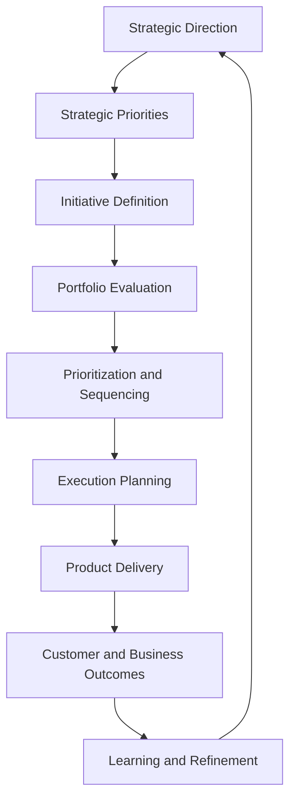

# Product Leadership Systems Architecture — Strategy to Execution Flow

The Strategy to Execution Flow illustrates how strategic intent is translated into governed priorities, coordinated delivery, and measurable outcomes within the Product Leadership Systems Architecture (PLSA).

It provides a focused view of the path from strategic direction to execution and shows how product organizations operationalize strategy through portfolio governance, product delivery, and feedback-driven refinement.

The flow emphasizes that strategy execution is not simply the act of delivering work. It is the process of converting intent into decisions, decisions into delivery, and delivery into measurable evidence that informs future action.

---

## Purpose

The purpose of the Strategy to Execution Flow is to provide a clear visual model of how modern product organizations translate strategic direction into operational execution.

It is intended to help leaders understand:

- how strategic intent becomes actionable work
- how governance shapes prioritization and investment decisions
- how delivery systems convert priorities into execution
- how outcomes provide evidence of effectiveness
- how feedback supports ongoing refinement

This diagram should be used to explain the operating path that connects leadership direction to execution and learning.

---

## Diagram

---

## Diagram Interpretation

The Strategy to Execution Flow should be interpreted as an operating path rather than a simple planning sequence.

At the front of the flow, leadership defines strategic direction and translates that direction into a smaller set of strategic priorities. Those priorities are then expressed as initiatives or candidate investments that can be evaluated through portfolio governance.

From there, the flow moves into prioritization and sequencing. This is the transition point where strategic intent becomes governed action. Not every initiative moves forward equally, and the purpose of governance is to make those tradeoffs explicit.

Once work is prioritized, the organization moves into execution planning and delivery. This reflects the shift from decision-making into operational activity. Delivery is not treated as the end of the process. The flow continues into customer and business outcomes, where execution is evaluated against intended value.

The final stage, learning and refinement, closes the loop. The model assumes that outcomes should inform future strategy, priority setting, and investment decisions.

For that reason, the diagram should be read as a closed-loop strategy execution system rather than a one-way handoff model.

---

## System Explanation

The Strategy to Execution Flow spans multiple components of the Product Leadership Systems Architecture.

### Strategic Direction

Strategic direction defines the high-level intent of the organization. It establishes where the organization is trying to go, what matters most, and what kinds of outcomes are important to achieve.

### Strategic Priorities

Strategic priorities convert broad direction into a more bounded set of focus areas. They help leadership identify where attention, resources, and investment should be concentrated.

### Initiative Definition

Initiative definition translates priorities into candidate actions, programs, or product investments. This is the stage where strategic intent becomes expressible as concrete work.

### Portfolio Evaluation

Portfolio evaluation determines whether initiatives should move forward. It introduces governance, comparative assessment, and tradeoff discipline into the operating model.

### Prioritization and Sequencing

Prioritization and sequencing establish what gets done, in what order, and with what level of investment. This is where strategic choices become operational commitments.

### Execution Planning

Execution planning prepares approved work for delivery. It aligns teams, timelines, dependencies, and operating rhythms to support disciplined implementation.

### Product Delivery

Product delivery converts approved plans into shipped work, operational execution, and coordinated cross-functional progress.

### Customer and Business Outcomes

Customer and business outcomes reveal whether delivered work created the intended value. This includes adoption, performance, operational impact, and business results.

### Learning and Refinement

Learning and refinement integrate the evidence generated by outcomes and use it to improve future strategic decisions, prioritization, and execution choices.

---

## Operating Logic

The operating logic of the Strategy to Execution Flow is based on sequential translation with closed-loop refinement.

1. Strategy establishes direction.
2. Priorities narrow focus.
3. Initiatives express strategic intent as candidate work.
4. Governance evaluates the available options.
5. Prioritization determines what moves forward.
6. Planning prepares work for delivery.
7. Delivery executes approved work.
8. Outcomes reveal whether value was created.
9. Learning informs future strategy and execution.

This logic matters because many organizations fail at strategy execution not because strategy is absent, but because translation breaks down between stages.

Common failure patterns include:

- strategy that never becomes concrete priorities
- priorities that never enter disciplined governance
- too many initiatives moving forward without sequencing
- delivery disconnected from measurable outcomes
- outcome evidence that never informs future decisions

The Strategy to Execution Flow is designed to make those transition points visible and manageable.

---

## Why This Diagram Matters

This diagram matters because strategy execution is one of the most common breakdown points in product organizations.

Many organizations can define strategy, but far fewer can reliably convert strategy into governed, coordinated, and measurable execution.

Without a clear strategy-to-execution model:

- priorities become ambiguous
- portfolio decisions become inconsistent
- delivery teams receive conflicting signals
- execution volume increases without strategic clarity
- outcomes fail to shape future choices

The Strategy to Execution Flow provides a disciplined alternative. It helps leaders see where strategic intent must be translated, where governance must intervene, and where execution must be evaluated against real outcomes.

It is especially useful for:

- product operations leaders
- strategy and execution leaders
- portfolio governance leaders
- heads of product
- executive teams improving operating model effectiveness

---

## How To Use This

Use this diagram to explain how the organization should convert strategy into operational execution.

Recommended usage includes:

- aligning leadership teams on the strategy-to-execution path
- diagnosing where execution breakdowns are occurring
- clarifying the role of governance in moving from priorities to action
- improving handoffs between strategy, governance, and delivery
- supporting strategy reviews, portfolio reviews, and operating model redesign

Recommended sequence:

1. Start with this diagram to establish the end-to-end execution path.
2. Use the Master Operating System Diagram to place this flow in the broader architecture.
3. Review the portfolio governance lifecycle to understand the governance portion in greater detail.
4. Use the relevant playbooks to operationalize the model.
5. Use outcomes and diagnostic tools to identify where improvement is needed.

This diagram is most valuable when used as both a communication tool and a diagnostic tool.

---

## Relationship To The Operating System

This document provides the strategy execution path within the Product Leadership Systems Architecture.

It shows how the Strategy Execution System connects to the Portfolio Governance System, how governance decisions shape the Product Delivery System, and how delivered work is evaluated through the Customer Outcomes System.

Within the broader repository:

- `architecture/overview.md` defines the full operating system structure
- `diagrams/master-operating-system-diagram.md` provides the highest-level system view
- `diagrams/portfolio-governance-lifecycle.md` expands the governance portion of this flow
- `playbooks/strategy-to-execution-playbook.md` translates this logic into operational practice
- `artifacts/system-diagnostic-scorecard.md` can be used to assess breakdowns in the execution path

This document should therefore be read as the execution pathway view of the broader operating system.

---

## Summary

The Strategy to Execution Flow provides a clear model for how strategic direction becomes governed priorities, coordinated delivery, measurable outcomes, and learning-driven refinement.

It shows that strategy execution is not a single leadership act, but a structured operating path that depends on translation, governance, sequencing, delivery discipline, and outcome visibility.

As part of the Product Leadership Systems Architecture repository, this diagram helps leaders understand and improve the way strategy becomes action across modern product organizations.

---

## License

This project is licensed under the MIT License.

See the [LICENSE](../LICENSE) file for full license details.
