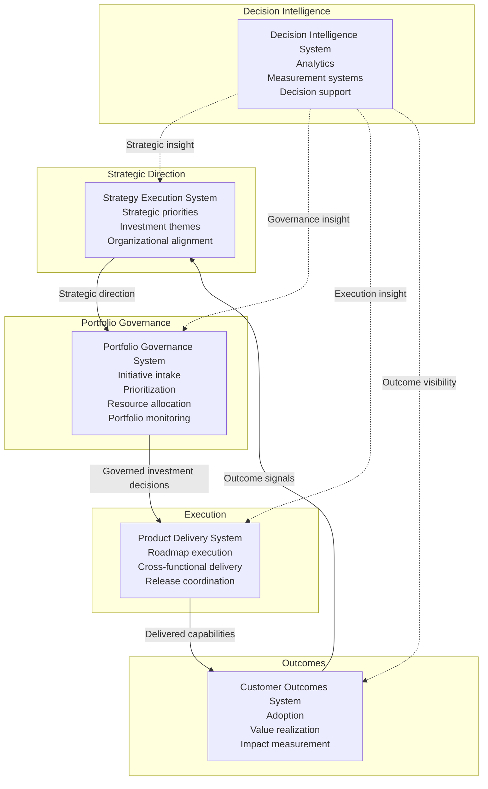
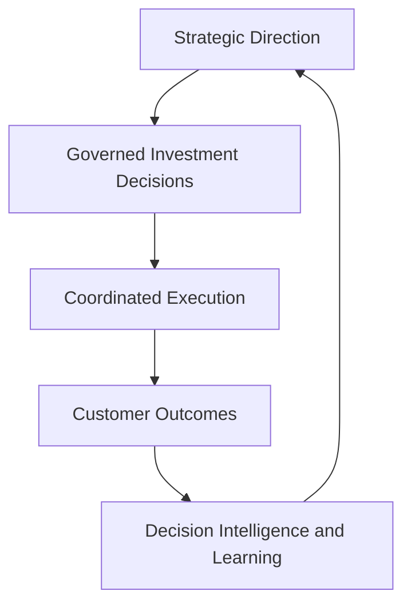

# Product Leadership Operating System Overview

The **Product Leadership Operating System Overview** explains how the **Product Leadership Systems Architecture (PLSA)** functions as an integrated operating model for modern product organizations.

This artifact translates the architecture into an executive-level framework for understanding how strategy, governance, delivery, outcomes, and intelligence work together as a coordinated leadership system.

Rather than focusing on a single system or flow, this document provides the conceptual overview of how the full operating system works.

---

# Purpose

The purpose of this artifact is to describe the **Product Leadership Systems Architecture as an operating system** for product leadership.

While the unified architecture defines the structural model and other artifacts describe responsibilities, interfaces, and governance flow, this document explains how those elements combine into a repeatable leadership operating model.

The framework provides clarity on:

- how strategic direction becomes governed execution
- how portfolio governance connects strategy and delivery
- how customer outcomes inform leadership decisions
- how decision intelligence strengthens the operating model
- how the architecture functions as a coherent leadership system rather than a collection of isolated practices

This document helps readers understand not just what the architecture contains, but how it works as a product leadership operating system.

---

# Diagram

The diagram below illustrates the Product Leadership Operating System as a coordinated strategy-to-outcomes model supported by decision intelligence.

---

## Diagram Interpretation

The diagram shows how the **Product Leadership Systems Architecture (PLSA)** functions as an integrated operating system for modern product organizations.

The **Strategy Execution System** defines strategic direction, investment themes, and leadership priorities. It provides the intent that shapes the rest of the operating model.

The **Portfolio Governance System** acts as the decision layer between strategy and execution. It receives strategic priorities, evaluates initiatives, makes investment choices, and determines what work should move forward.

The **Product Delivery System** executes the work that governance has approved. It coordinates product, engineering, and cross-functional delivery through structured planning and execution mechanisms.

The **Customer Outcomes System** measures whether delivered capabilities produced meaningful value. It captures adoption, value realization, and impact signals that inform future leadership decisions.

The **Decision Intelligence System** supports all layers through analytics, reporting, measurement infrastructure, and insight. It improves decision quality without replacing the primary strategy-to-outcomes flow.

Together, these systems form a coherent operating system for product leadership in which direction, decisions, execution, outcomes, and learning remain structurally connected.

---

## Framework Explanation

The Product Leadership Operating System is the practical expression of the **Product Leadership Systems Architecture**.

### Strategy as Direction

The operating system begins with strategic direction. Leaders define priorities, investment themes, and organizational intent to establish where the organization should focus.

### Governance as Decision Discipline

Governance translates strategy into choices. Rather than allowing work to enter execution informally, the operating system uses portfolio governance to evaluate, prioritize, sequence, and authorize investments.

### Delivery as Coordinated Execution

Execution occurs through the Product Delivery System. Approved work is planned, coordinated, and delivered through product and engineering operating mechanisms.

### Outcomes as Value Measurement

The operating system does not stop at delivery. It measures adoption, value realization, and impact through the Customer Outcomes System to determine whether investments created real value.

### Intelligence as Decision Support

Decision Intelligence strengthens the operating model by supplying analytics, measurement systems, and insights across every layer. It enables leaders to evaluate performance and refine future decisions using evidence.

Together these elements create a repeatable operating model that connects strategy, governance, delivery, outcomes, and learning.

---

## Operating Logic

The Product Leadership Operating System functions as a closed-loop leadership model.

The logic begins with **strategy**, where leadership defines direction and investment intent.

That direction moves into **governance**, where initiatives are evaluated and transformed into explicit investment decisions.

Approved work moves into **delivery**, where teams execute through coordinated product and engineering mechanisms.

Delivered capabilities then move into **outcomes**, where the organization measures whether the work created meaningful adoption, value, and impact.

Finally, **decision intelligence** strengthens every stage of the model by supplying the information needed to improve both decisions and future strategic refinement.

The operating system is effective because it connects leadership intent to customer value through explicit decision and execution mechanisms.

This operating logic creates a repeatable executive system:

---

## Why This Matters

Many organizations have product teams, roadmaps, and planning rituals, but lack a true operating system that connects strategic intent to measurable outcomes.

Common failure patterns include:

- strategy existing without governance discipline
- execution becoming the default prioritization mechanism
- roadmaps being managed without clear portfolio tradeoffs
- delivery success being measured without customer value
- analytics existing as reporting rather than decision support

The Product Leadership Operating System addresses these issues by framing product leadership as an integrated system rather than a set of disconnected practices.

This matters because organizations scale more effectively when strategy, governance, execution, outcomes, and intelligence are designed as parts of the same operating model.

---

## How To Use This

This artifact can be used to explain, assess, or design a product leadership operating model.

Leadership teams can use the framework to:

- evaluate whether strategy, governance, delivery, and outcomes are structurally connected
- identify missing operating mechanisms between leadership intent and execution
- assess whether customer outcomes inform future strategic decisions
- clarify the role of intelligence and analytics in supporting leadership
- explain the operating model to executives, cross-functional leaders, and architecture stakeholders

This artifact is especially useful when:

- introducing the architecture to new audiences
- aligning leadership teams around a common operating model
- diagnosing structural gaps in product organizations
- connecting architecture documents to practical operating model discussions

Used correctly, the Product Leadership Operating System Overview becomes the conceptual bridge between architecture documentation and real organizational application.

---

## Relationship To The Operating System

This artifact describes the **Product Leadership Systems Architecture** as a practical operating system for modern product organizations.

Within the repository, it works alongside:

- the README, which introduces the portfolio and architecture at a high level
- the Unified Product Leadership Systems Architecture, which defines the canonical system model
- the Architecture Design Principles, which define the guardrails that preserve architectural integrity
- the System Responsibilities Matrix, which defines ownership boundaries across systems
- the System Interaction Diagram, which explains interfaces between systems
- the Governance Decision Flow, which explains how portfolio decisions move through the architecture

In this way, the framework provides the conceptual overview that links the architecture model to how product leadership actually operates in practice.

---

## Summary

The Product Leadership Operating System Overview explains how the Product Leadership Systems Architecture functions as an integrated leadership model.

By connecting strategic direction, portfolio governance, delivery execution, customer outcomes, and decision intelligence into a coherent system, the framework shows how modern product organizations can translate strategy into measurable results.

This artifact provides the high-level operating model view that helps readers understand how the architecture works in practice.

---

## License

This repository is released under the **MIT License**.

The MIT License permits reuse, modification, and distribution of this material provided that the original copyright and license notice are included.

See the full license text in the repository:

[MIT License](../LICENSE)

