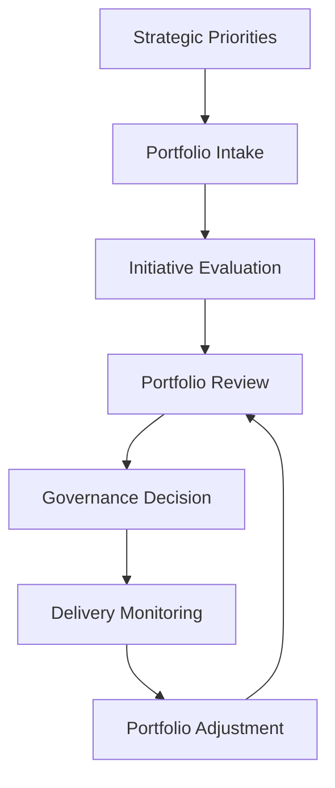

# Product Leadership Systems Architecture — Portfolio Review Playbook

The Portfolio Review Playbook defines how leadership teams should conduct structured portfolio governance reviews within the Product Leadership Systems Architecture (PLSA).

Portfolio reviews are the primary operating mechanism through which organizations evaluate active initiatives, assess portfolio balance, make investment adjustments, and ensure that strategic priorities remain aligned with execution reality.

Rather than treating portfolio review as a status meeting, this playbook defines it as a recurring governance discipline that connects strategic priorities, portfolio decisions, delivery signals, and outcome evidence.

---

## Purpose

The purpose of the Portfolio Review Playbook is to provide a structured method for conducting recurring portfolio governance reviews.

It is intended to help leadership teams:

- maintain visibility across the full initiative portfolio
- evaluate whether investments remain aligned with strategic priorities
- identify delivery risks and execution constraints
- rebalance the portfolio when conditions change
- ensure that portfolio decisions remain evidence-based

This playbook translates the Portfolio Governance System into a repeatable leadership practice.

---

## Portfolio Governance Flow

---

## Diagram Interpretation

The Portfolio Governance Flow illustrates how portfolio decisions evolve through recurring review cycles.

Strategic priorities define the context for portfolio governance. Initiatives enter the portfolio through an intake mechanism and are evaluated against strategic alignment, expected value, delivery feasibility, and portfolio balance.

The portfolio review itself serves as the decision forum where leadership evaluates the health of the portfolio and determines whether adjustments are required. Governance decisions may include prioritization changes, sequencing adjustments, scope refinement, investment reallocation, or initiative cancellation.

Delivery monitoring ensures that portfolio decisions remain connected to execution reality. As delivery signals emerge, the portfolio may be adjusted to reflect new constraints, opportunities, or outcome evidence.

This cycle repeats regularly so that the portfolio remains aligned with strategy while adapting to execution conditions.

---

## System Explanation

The portfolio review process connects several operating systems within the Product Leadership Systems Architecture.

### Strategy Execution System

Strategic priorities establish the decision frame for portfolio reviews. They define what kinds of initiatives should receive attention and how leadership evaluates tradeoffs across competing investments.

### Portfolio Governance System

Portfolio governance provides the mechanisms for evaluating initiatives, prioritizing investments, sequencing work, and making portfolio decisions.

### Product Delivery System

Delivery signals inform portfolio reviews by revealing execution progress, emerging risks, dependency complexity, and resource constraints.

### Customer Outcomes System

Outcome signals provide evidence about whether delivered work is producing meaningful value, which may influence future portfolio prioritization.

### Decision Intelligence System

Decision intelligence integrates signals from across the operating system and presents a contextual view of portfolio performance to leadership teams.

---

## Operating Logic

The operating logic of the Portfolio Review Playbook is based on recurring governance cycles.

1. Strategic priorities establish the investment frame.
2. Initiatives enter the portfolio through intake.
3. Proposals are evaluated against strategic and operational criteria.
4. Leadership reviews the active portfolio in a governance forum.
5. Decisions are made regarding prioritization, sequencing, investment levels, or initiative disposition.
6. Delivery signals and outcome evidence inform future review cycles.

This logic ensures that portfolio decisions remain connected to strategy, execution reality, and measurable outcomes.

Without this structure, portfolio governance often degrades into reactive prioritization, fragmented investment decisions, and overloaded delivery systems.

---

## Why This Playbook Matters

Portfolio governance is one of the most important and most commonly mismanaged elements of product leadership.

Without structured portfolio reviews:

- strategic priorities may not influence investment decisions
- too many initiatives may be approved simultaneously
- delivery teams may be overloaded with conflicting commitments
- emerging execution risks may remain invisible to leadership
- investment decisions may persist despite weak outcome signals

The Portfolio Review Playbook addresses these challenges by establishing a disciplined governance forum where portfolio decisions can be evaluated, challenged, and refined.

It is particularly useful for:

- product operations leaders
- heads of product and engineering
- portfolio governance leaders
- executive leadership teams managing complex initiative portfolios
- organizations scaling product delivery across multiple teams

---

## How To Use This

Use this playbook to structure recurring portfolio review meetings.

Recommended implementation approach:

1. Establish a recurring portfolio review cadence, typically monthly or quarterly.
2. Prepare a consolidated portfolio view that includes active initiatives, delivery status, and outcome signals.
3. Evaluate portfolio alignment with strategic priorities.
4. Identify initiatives requiring governance decisions.
5. Make prioritization, sequencing, investment, or cancellation decisions as necessary.
6. Communicate decisions clearly to delivery teams and stakeholders.
7. Monitor execution signals and revisit decisions in the next review cycle.

This playbook works best when portfolio reviews focus on decision-making rather than status reporting.

---

## Relationship To The Operating System

This document operationalizes the Portfolio Governance System within the Product Leadership Systems Architecture.

While `architecture/system-responsibilities.md` defines the role of portfolio governance, this playbook defines how governance should function as a recurring leadership practice.

Within the broader repository:

- `architecture/overview.md` defines the overall operating system
- `diagrams/portfolio-governance-lifecycle.md` visualizes the governance cycle
- `diagrams/strategy-to-execution-flow.md` shows how governance connects strategy to delivery
- `frameworks/operating-system-maturity-model.md` describes how governance practices mature
- `artifacts/system-diagnostic-scorecard.md` provides tools for assessing governance effectiveness

This playbook should therefore be used as the operational implementation of the Portfolio Governance System.

---

## Summary

The Portfolio Review Playbook defines how leadership teams govern investment decisions across the product initiative portfolio.

By establishing a recurring review cycle that connects strategy, portfolio evaluation, delivery signals, and outcome evidence, the playbook helps organizations maintain alignment between strategic priorities and operational execution.

As part of the Product Leadership Systems Architecture repository, this playbook translates governance architecture into a practical leadership discipline that supports more effective strategy execution.

---

## License

This project is licensed under the MIT License.

See the [LICENSE](../LICENSE) file for full license details.
