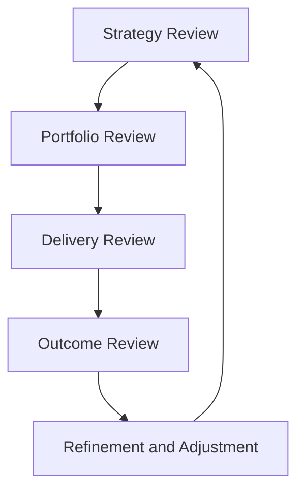

# Product Leadership Systems Architecture — Product Operating Rhythm Playbook

The Product Operating Rhythm Playbook defines the recurring leadership cadence that enables the Product Leadership Systems Architecture (PLSA) to function as a coordinated operating system.

While architecture defines the structure of the operating model, the operating rhythm defines how the organization runs the system in practice. These rhythms ensure that strategy, portfolio governance, delivery coordination, outcome evaluation, and learning occur in a predictable and disciplined manner.

The operating rhythm connects the Strategy Execution System, Portfolio Governance System, Product Delivery System, Customer Outcomes System, and Decision Intelligence System through recurring leadership forums and review cycles.

---

## Purpose

The purpose of the Product Operating Rhythm Playbook is to define the recurring leadership cadence required to operate the Product Leadership Systems Architecture effectively.

It is intended to help leaders:

- maintain alignment between strategy and execution
- create predictable decision and review cycles
- improve cross-functional coordination across product and engineering organizations
- ensure that portfolio and delivery decisions are revisited regularly
- strengthen feedback loops between outcomes and future priorities

This playbook translates the architecture into a practical set of leadership rhythms that enable the operating system to function consistently over time.

---

## Operating Rhythm Overview

---

## Diagram Interpretation

The Operating Rhythm Overview diagram illustrates how leadership forums create a recurring cycle of strategy alignment, portfolio governance, delivery monitoring, and outcome evaluation.

The cycle begins with strategy review, where leadership examines strategic direction and confirms priority focus areas. Portfolio review then evaluates how investments and initiatives align with those priorities.

Delivery review examines the operational health of ongoing initiatives, including progress, risks, dependencies, and execution signals. Outcome review evaluates whether delivered work is producing meaningful customer and business results.

The final stage, refinement and adjustment, integrates evidence from across the operating model and updates strategy, portfolio decisions, or delivery priorities as needed.

This cycle repeats continuously so that the organization maintains alignment between strategic intent and operational execution.

---

## System Explanation

The product operating rhythm connects multiple operating systems within the Product Leadership Systems Architecture.

### Strategy Execution System

Strategy reviews ensure that leadership regularly revisits strategic direction, validates assumptions, and clarifies priorities.

### Portfolio Governance System

Portfolio reviews govern how resources are allocated across initiatives and ensure that investments remain aligned with strategy.

### Product Delivery System

Delivery reviews provide visibility into execution health and allow leadership to address delivery risks or coordination challenges.

### Customer Outcomes System

Outcome reviews evaluate the real-world impact of delivered work and determine whether initiatives are producing meaningful value.

### Decision Intelligence System

Decision intelligence supports all review forums by integrating signals across the operating system and presenting contextual insights to leadership teams.

---

## Operating Logic

The operating logic of the Product Operating Rhythm Playbook is based on recurring leadership review cycles.

1. Strategy reviews clarify direction and priorities.
2. Portfolio reviews translate priorities into investment decisions.
3. Delivery reviews monitor the execution of approved initiatives.
4. Outcome reviews assess whether delivered work creates measurable value.
5. Refinement integrates evidence and updates strategy, portfolio decisions, or delivery plans.

This logic ensures that leadership decisions remain connected across the operating model and that evidence from delivery and outcomes influences future decisions.

Without this rhythm, organizations often experience misalignment between strategy, portfolio investment, and execution activity.

---

## Why This Playbook Matters

Product organizations often struggle not because they lack strategy or capable teams, but because they lack disciplined leadership rhythms.

Without a consistent operating cadence:

- strategic priorities may drift or become unclear
- portfolio decisions may not be revisited regularly
- delivery risks may remain invisible to leadership
- outcome evidence may not influence future decisions
- leadership forums may become reactive rather than structured

The Product Operating Rhythm Playbook addresses these challenges by defining a predictable leadership cadence that keeps the operating system aligned and adaptive.

It is particularly useful for:

- product operations leaders
- heads of product and engineering
- executive leadership teams
- organizations scaling product delivery across multiple teams
- companies seeking to improve strategy-to-execution alignment

---

## How To Use This

Use this playbook to establish recurring leadership forums that support the Product Leadership Systems Architecture.

Recommended implementation approach:

1. Establish a quarterly strategy review to evaluate direction and priorities.
2. Conduct monthly portfolio reviews to govern initiative investment and prioritization.
3. Hold regular delivery reviews to monitor execution progress and coordination risks.
4. Schedule outcome reviews to evaluate adoption, value realization, and customer impact.
5. Use integrated intelligence dashboards to support evidence-based decision-making across all forums.
6. Document decisions and feed insights into the next review cycle.

These rhythms should be predictable, structured, and focused on decision-making rather than passive reporting.

---

## Relationship To The Operating System

This document operationalizes the leadership cadence required to run the Product Leadership Systems Architecture.

While the architecture defines the structural components of the operating model, the operating rhythm defines how leadership interacts with those components through recurring governance and review mechanisms.

Within the broader repository:

- `architecture/overview.md` defines the operating system structure
- `system-responsibilities.md` defines the role of each system
- `diagrams/` visualize key flows across the operating model
- `frameworks/operating-system-maturity-model.md` describes how operating rhythms mature
- `artifacts/system-diagnostic-scorecard.md` helps assess the effectiveness of leadership forums

This playbook should therefore be used as the operational cadence for running the product leadership operating system.

---

## Summary

The Product Operating Rhythm Playbook defines the recurring leadership cadence required to operate the Product Leadership Systems Architecture.

By establishing structured review cycles across strategy, portfolio governance, delivery execution, and customer outcomes, the playbook ensures that leadership decisions remain connected across the operating model.

As part of the Product Leadership Systems Architecture repository, this playbook translates the architecture into a practical leadership rhythm that supports alignment, visibility, and continuous improvement.

---

## License

This project is licensed under the MIT License.

See the [LICENSE](../LICENSE) file for full license details.
