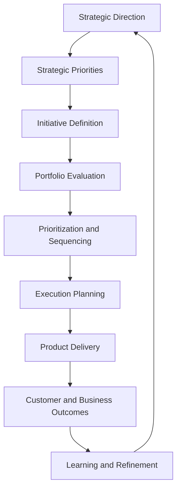

# Product Leadership Systems Architecture — Strategy to Execution Playbook

The Strategy to Execution Playbook defines how leadership teams translate strategic direction into governed priorities, coordinated delivery, measurable outcomes, and ongoing refinement within the Product Leadership Systems Architecture (PLSA).

This playbook operationalizes the path from strategy to execution by connecting the Strategy Execution System, Portfolio Governance System, Product Delivery System, Customer Outcomes System, and Decision Intelligence System through a structured leadership practice.

Rather than treating execution as a downstream activity that begins after strategy is defined, this playbook treats strategy execution as an integrated operating discipline. It ensures that strategic priorities are translated into explicit portfolio decisions, that delivery remains connected to intended value, and that outcome evidence informs future refinement.

---

## Purpose

The purpose of the Strategy to Execution Playbook is to provide a structured method for converting strategic intent into operational execution.

It is intended to help leadership teams:

- translate strategy into actionable priorities and initiatives
- connect governance decisions to strategic intent
- coordinate delivery against approved priorities
- evaluate whether delivered work creates meaningful outcomes
- refine future decisions based on evidence and learning

This playbook translates the strategy-to-execution logic of the architecture into a repeatable leadership practice.

---

## Strategy to Execution Flow

---

## Diagram Interpretation

The Strategy to Execution Flow should be interpreted as a closed-loop operating path rather than a one-way planning sequence.

The flow begins with strategic direction, where leadership defines the high-level intent of the organization. That direction is translated into a narrower set of strategic priorities, which help determine where resources, attention, and investment should be concentrated.

Those priorities are then expressed as initiatives or candidate investments that can be evaluated through governance. Portfolio evaluation and prioritization ensure that strategic intent is translated into explicit decisions rather than diffuse activity.

Once priorities are approved, the organization moves into execution planning and product delivery. This is where strategic choices become operational commitments. Delivery is not treated as the endpoint. The flow continues into customer and business outcomes, where the organization evaluates whether delivery created meaningful value.

The final stage, learning and refinement, closes the loop. Strategic assumptions, prioritization decisions, and delivery choices should all be updated based on outcome and execution evidence.

This means the strategy-to-execution path should be understood as a recurring leadership system for turning intent into outcomes and outcomes into future action.

---

## System Explanation

The Strategy to Execution Playbook connects all five operating systems within the Product Leadership Systems Architecture.

### Strategy Execution System

The Strategy Execution System establishes direction, defines priorities, and frames the intent that the rest of the operating model must support. It ensures that execution begins with clarity about what matters most.

### Portfolio Governance System

The Portfolio Governance System evaluates candidate initiatives, applies prioritization criteria, governs sequencing, and translates strategic priorities into investment commitments.

### Product Delivery System

The Product Delivery System converts approved priorities into coordinated execution. It aligns teams, plans delivery, manages dependencies, and ensures that work progresses in a disciplined way.

### Customer Outcomes System

The Customer Outcomes System evaluates whether delivered work produced measurable customer, product, operational, or business value. It helps determine whether execution is producing the intended results.

### Decision Intelligence System

The Decision Intelligence System integrates signals from strategy, governance, delivery, and outcomes. It provides the contextual evidence needed to assess whether execution is aligned, effective, and worth refining.

---

## Operating Logic

The operating logic of the Strategy to Execution Playbook is based on translation, governance, execution, measurement, and refinement.

1. Strategy defines direction and intent.
2. Priorities narrow the focus of organizational effort.
3. Initiatives express strategic intent as candidate work.
4. Governance evaluates and prioritizes those initiatives.
5. Approved work is planned and delivered through coordinated execution.
6. Outcomes reveal whether the work created meaningful value.
7. Learning and intelligence inform future strategy and execution decisions.

This logic matters because many organizations struggle not at the level of strategic definition, but at the level of translation between stages.

Common failure patterns include:

- strategy that is too abstract to guide prioritization
- too many initiatives advancing without real sequencing discipline
- delivery disconnected from intended outcomes
- outcomes that are observed but not used to refine decisions
- execution activity that creates volume without strategic impact

This playbook is designed to create a disciplined path that keeps strategy, governance, delivery, and outcomes connected.

---

## Why This Playbook Matters

Strategy execution is one of the most common breakdown points in product organizations.

Many organizations can define strategy, but far fewer can reliably turn strategy into governed action, coordinated execution, and measurable outcomes.

Without a structured strategy-to-execution discipline:

- priorities remain ambiguous
- portfolio decisions become inconsistent
- delivery teams receive conflicting signals
- too much work is launched without clear sequencing
- outcome evidence fails to influence future action

The Strategy to Execution Playbook addresses these issues by establishing a repeatable leadership practice for moving from intent to value creation.

It is especially useful for:

- product operations leaders
- strategy and execution leaders
- heads of product and engineering
- portfolio governance leaders
- executive teams improving operating model effectiveness

---

## How To Use This

Use this playbook to structure the leadership practices that connect strategy to execution.

Recommended implementation approach:

1. Establish a clear strategic direction and define the highest-priority focus areas.
2. Translate priorities into a set of candidate initiatives or investment options.
3. Evaluate those initiatives through portfolio governance.
4. Make explicit prioritization and sequencing decisions.
5. Convert approved work into coordinated delivery plans.
6. Monitor execution and evaluate resulting customer and business outcomes.
7. Use outcome and execution evidence to refine future strategy and priorities.

This playbook works best when strategy execution is treated as a leadership operating discipline rather than a one-time annual planning exercise.

---

## Relationship To The Operating System

This document operationalizes the strategy-to-execution pathway within the Product Leadership Systems Architecture.

While `architecture/overview.md` defines the full operating model and `system-responsibilities.md` defines the role of each operating system, this playbook explains how those systems work together to convert strategy into action.

Within the broader repository:

- `diagrams/strategy-to-execution-flow.md` provides the visual representation of this path
- `diagrams/master-operating-system-diagram.md` places this path in the broader architecture
- `diagrams/portfolio-governance-lifecycle.md` expands the governance portion of this operating path
- `artifacts/system-diagnostic-scorecard.md` helps assess breakdowns in strategy execution
- `frameworks/operating-system-maturity-model.md` provides a maturity lens for evaluating execution capability

This playbook should therefore be read as the practical operating method for the strategy-to-execution layer of the Product Leadership Systems Architecture.

---

## Summary

The Strategy to Execution Playbook defines how leadership teams translate strategic direction into governed priorities, coordinated delivery, measurable outcomes, and evidence-based refinement.

It establishes that strategy execution is not a downstream operational activity, but a structured leadership discipline that depends on clear translation, governance, sequencing, delivery coordination, outcome visibility, and learning.

As part of the Product Leadership Systems Architecture repository, this playbook helps organizations operationalize strategy execution as an integrated operating system rather than a disconnected planning exercise.

---

## License

This project is licensed under the MIT License.

See the [LICENSE](../LICENSE) file for full license details.
