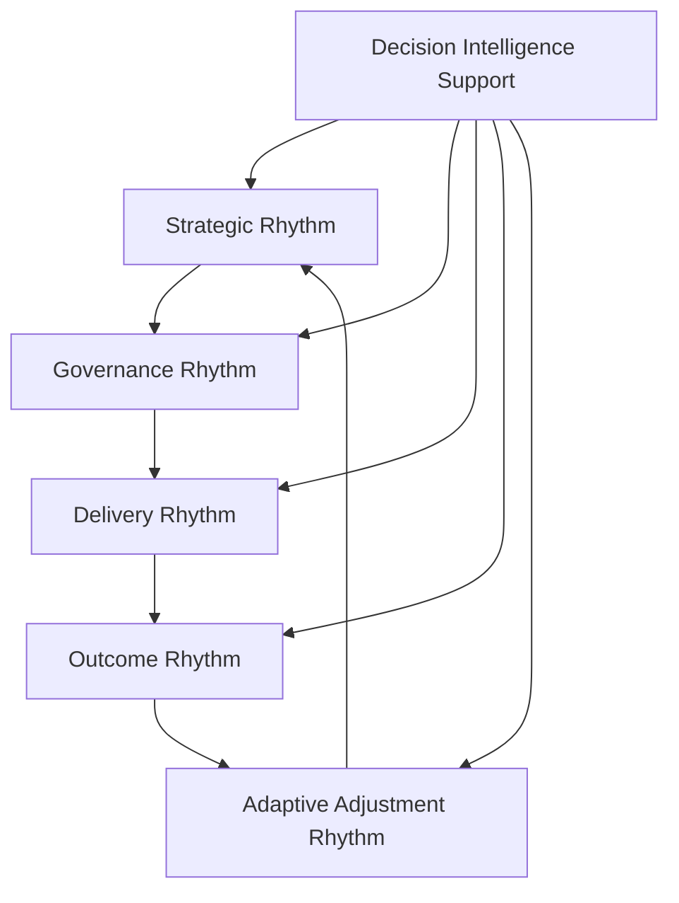
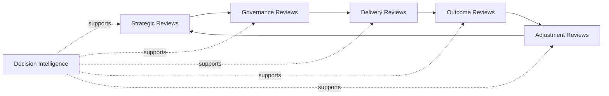

# Executive Operating Rhythm

The **Executive Operating Rhythm** defines the recurring leadership cadence used to run the **Product Leadership Operating Model** across the **Product Leadership Operating System (PLOS)**.

Where the **Product Leadership Systems Architecture (PLSA)** defines the canonical five-system structure of the operating system, and the **Product Leadership Operating Model** defines the leadership mechanisms used to run that architecture, this artifact defines the recurring executive review rhythm through which those mechanisms are sustained in practice.

It explains how leadership teams sequence strategic reviews, governance reviews, delivery reviews, outcome reviews, and adaptive adjustment across a disciplined recurring cadence rather than through disconnected meetings or reactive escalation.

This artifact is a canonical supporting Pillar 2 artifact. It remains subordinate to the canonical **Product Leadership Operating Model** and to the higher-precedence **Product Leadership Systems Architecture (PLSA)** artifacts. It does not redefine the five-system model.

---

# Purpose

The purpose of this artifact is to define the recurring executive rhythm used to sustain the **Product Leadership Operating System** over time.

This artifact clarifies how leadership teams:

- establish a recurring cadence for strategic, governance, delivery, and outcome review
- connect decision forums into an integrated operating rhythm
- sequence review activity across the broader leadership loop
- create predictable timing for escalation, intervention, and adjustment
- reinforce executive discipline, visibility, and adaptability across the operating model

This artifact does **not** redefine the canonical systems architecture or replace the **Product Leadership Operating Model**.

Instead, it defines the recurring review rhythm through which leadership operates the model in practice across the canonical five-system architecture.

---

# Diagram

---

# Diagram Interpretation

This diagram shows the recurring executive operating rhythm used to run the **Product Leadership Operating Model**.

The stages shown here are rhythm constructs used to explain how leadership cadence is organized across the operating model. They are not replacement names for the canonical systems defined in the **Product Leadership Systems Architecture**.

Instead, they show how executive review and operating cadence move across strategy, governance, delivery, outcomes, and learning as part of a recurring leadership loop.

The rhythm begins with **Strategic Rhythm**, where leadership reaffirms enterprise direction, reviews strategic priorities, evaluates changing constraints, and refreshes the intent that shapes downstream portfolio and operating decisions.

Those signals move into **Governance Rhythm**, where leadership evaluates investment choices, reviews prioritization, manages resource allocation, and governs portfolio tradeoffs through recurring executive review.

Approved priorities then move into **Delivery Rhythm**, where leadership monitors progress, reviews risks, addresses dependencies, resolves escalations, and maintains execution confidence through a structured cadence of oversight.

From there, leadership enters **Outcome Rhythm**, where delivered work is evaluated against customer outcomes, business performance, operating measures, and strategic intent through recurring review forums.

Those findings then inform **Adaptive Adjustment Rhythm**, where leadership translates review findings, escalation signals, and learning into corrective action, portfolio rebalancing, operating changes, or strategic refinement before the next cycle begins.

**Decision Intelligence Support** informs every stage by supplying telemetry, evidence, performance signals, and analysis needed to improve review quality, timing, and decision effectiveness.

---

# Operating Logic

The **Executive Operating Rhythm** functions as the recurring cadence layer of the **Product Leadership Operating Model**.

Its operating logic is based on five rhythm responsibilities:

## 1. Strategic Rhythm Responsibility

Leadership maintains a recurring rhythm for reviewing strategic direction, enterprise priorities, market or mission shifts, and value expectations.

This rhythm ensures that the operating system remains anchored to evolving enterprise intent rather than running on stale assumptions.

## 2. Governance Rhythm Responsibility

Leadership maintains a recurring rhythm for portfolio review, prioritization, investment governance, resource allocation, and tradeoff management.

This rhythm ensures that strategic intent is regularly converted into governed portfolio action through an explicit review cadence.

## 3. Delivery Rhythm Responsibility

Leadership maintains a recurring rhythm for reviewing execution progress, delivery risks, dependencies, escalation signals, and operating constraints.

This rhythm ensures that execution remains visible, governable, and aligned to leadership intent over time.

## 4. Outcome Rhythm Responsibility

Leadership maintains a recurring rhythm for reviewing customer results, business performance, operational effects, and realized value.

This rhythm ensures that outcome evaluation remains part of executive discipline rather than a downstream reporting afterthought.

## 5. Adaptive Adjustment Responsibility

Leadership maintains a recurring rhythm for converting review findings and evidence into strategic refinement, portfolio rebalancing, operating improvements, and leadership intervention.

This rhythm ensures that learning closes the loop and that executive cadence remains adaptive rather than static.

Together, these responsibilities create the recurring operating rhythm that sustains the leadership system across strategy, governance, delivery, outcomes, and learning.

---

# Supporting Diagram

---

# Why This Matters

This artifact matters because leadership systems often fail not from lack of strategy, but from lack of disciplined executive rhythm.

Without a defined operating rhythm, strategy becomes episodic, governance becomes reactive, delivery oversight becomes inconsistent, outcome evaluation becomes fragmented, and learning fails to shape future action.

The **Executive Operating Rhythm** makes explicit the recurring review structure through which leadership keeps the operating model active, visible, and governable over time.

It shows that operating quality depends not only on what leadership reviews, but on whether review activity is sequenced, repeated, and connected across the full operating loop.

By defining this rhythm explicitly, the artifact helps prevent disconnected meetings, ad hoc escalation, and leadership drift across the broader **Product Leadership Operating System**.

---

# How To Use This

Use this artifact to define the recurring executive review rhythm that sustains the **Product Leadership Operating Model**.

It is most useful when:

- designing executive review cadences
- connecting strategy, governance, delivery, outcomes, and adjustment into one leadership loop
- aligning decision forums to recurring review intervals
- validating that leadership oversight is structured rather than reactive
- reinforcing cadence discipline across Pillar 2 artifacts

This artifact should be read alongside the canonical **Product Leadership Operating Model**, the **Product Leadership Operating Cadence** artifact, and the higher-precedence **Product Leadership Systems Architecture** artifacts.

It clarifies executive rhythm within the broader cadence model. It does not replace that broader cadence model.

---

# Relationship to the Product Leadership Operating System

Within the broader **Product Leadership Operating System (PLOS)**, this artifact belongs to **Pillar 2: Product Leadership Operating Model**.

Its role is to define the recurring executive review rhythm through which leadership teams sustain the operating model over time.

That distinction must remain explicit:

- **PLOS** is the overall operating system and portfolio
- **PLSA** is the canonical systems architecture within Pillar 1
- **Pillar 2** defines how leadership runs that canonical architecture
- **Product Leadership Operating Cadence** defines the broader recurring timing structure
- **Executive Operating Rhythm** defines the executive review rhythm within that broader timing structure

Accordingly, this artifact must remain subordinate to higher-precedence architecture sources, especially:

1. **Unified Product Leadership Systems Architecture**
2. **Product Leadership Systems Architecture Metamodel**
3. **Product Leadership Operating Model**
4. **Product Leadership Operating Cadence**

This artifact may define executive rhythm, but it may not redefine the canonical five-system architecture, alter the operating loop, or introduce alternate core system structures.

---

# Summary

The **Executive Operating Rhythm** defines the recurring executive review cadence through which leadership teams sustain the **Product Leadership Operating Model** over time.

It sequences strategic, governance, delivery, outcome, and adaptive-adjustment reviews into one recurring leadership loop.

It also preserves the role of **Decision Intelligence** as a cross-cutting support layer that improves timing, review quality, and decision effectiveness across the rhythm.

Used correctly, this artifact strengthens executive discipline, improves operating visibility, and helps ensure that Pillar 2 remains aligned to the broader **Product Leadership Operating System**.

---

# License

This repository is licensed under the MIT License. See the [LICENSE](../LICENSE) file for details.
