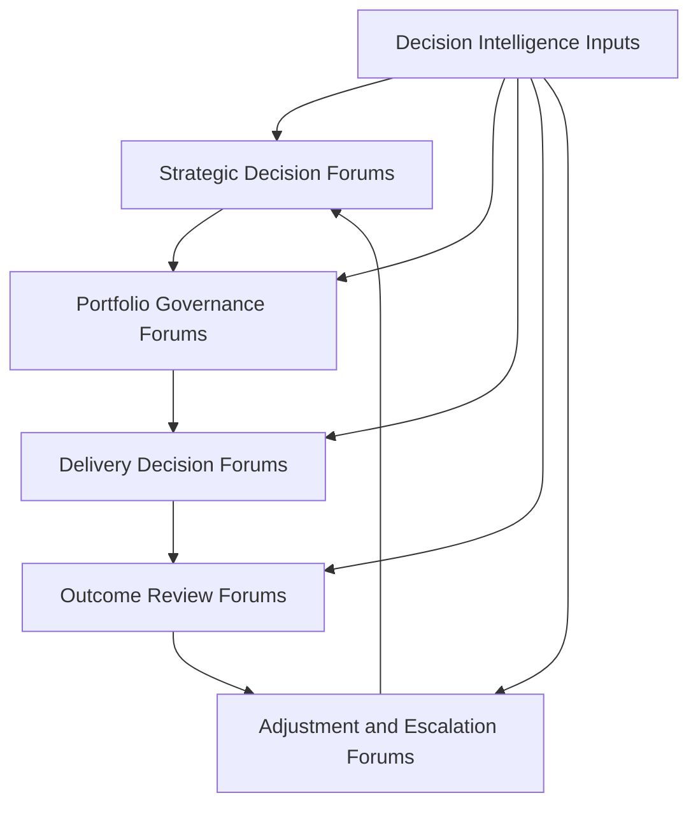
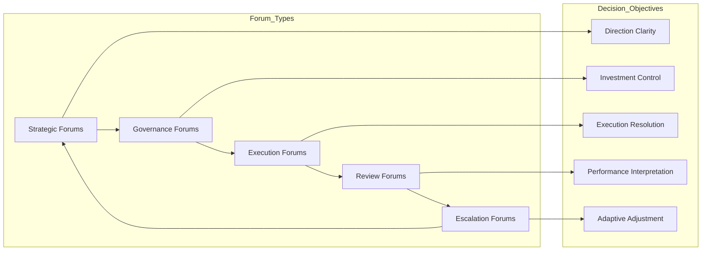

# Decision Forum Structure

The **Decision Forum Structure** defines how executive and leadership decisions are organized, sequenced, escalated, and governed across the **Product Leadership Operating Model**.

Where the **Product Leadership Operating Model** defines how leadership teams run the **Product Leadership Operating System (PLOS)**, and the **Executive Operating Rhythm** defines the recurring cadence used to sustain that model, this artifact defines the **forum structure through which leadership decisions are made in practice**.

It explains how decision-making is distributed across recurring leadership forums rather than left to informal escalation, disconnected meetings, or ambiguous ownership.

---

## Purpose

The purpose of this artifact is to define the **decision forum structure** used to govern the Product Leadership Operating System.

This artifact clarifies how leadership teams:

- organize decision-making into explicit forums
- distinguish decision types by scope, timing, and authority
- route strategic, governance, delivery, outcome, and adjustment decisions through the right forums
- create predictable escalation paths for issues that exceed local decision boundaries
- reinforce decision clarity, accountability, and operating discipline across the leadership model

This artifact does **not** redefine the canonical systems architecture or replace the Product Leadership Operating Model.

Instead, it explains how decision authority is exercised through structured forums that support the operating model in practice.

---

## Diagram

---

## Diagram Interpretation

This diagram shows the decision forum structure used to operate the Product Leadership Operating Model.

The stages shown here are **forum constructs** used to explain how leadership decisions are distributed across the operating model. They are not replacement names for the canonical systems defined in the Product Leadership Systems Architecture. Instead, they show how decisions are routed through recurring leadership forums across strategy, governance, delivery, outcomes, and learning.

The structure begins with **Strategic Decision Forums**, where leadership defines strategic direction, clarifies enterprise priorities, sets investment themes, and establishes the constraints that shape downstream decisions.

Those signals move into **Portfolio Governance Forums**, where leadership evaluates proposals, governs prioritization, approves or defers investments, allocates resources, and manages portfolio tradeoffs.

Approved commitments then move into **Delivery Decision Forums**, where leaders resolve execution tradeoffs, address dependencies, remove blockers, assess delivery risk, and make decisions needed to sustain progress.

From there, leadership enters **Outcome Review Forums**, where delivered work is evaluated against customer value, business performance, operating measures, and strategic intent.

Those findings then inform **Adjustment and Escalation Forums**, where unresolved issues, cross-cutting risks, structural tensions, and learning signals are elevated for correction, rebalancing, or strategic adjustment before the next cycle begins.

**Decision Intelligence Inputs** support every forum by supplying evidence, telemetry, metrics, and analysis needed to improve decision quality and timing.

---

## Operating Logic

The Decision Forum Structure functions as the decision-governance layer of the Product Leadership Operating Model.

Its operating logic is based on five forum responsibilities:

### 1. Strategic Decision Responsibility

Leadership maintains forums where strategic direction, enterprise priorities, and investment intent are established.

These forums ensure that higher-order directional decisions are made explicitly and provide the basis for downstream portfolio and execution choices.

### 2. Governance Decision Responsibility

Leadership maintains forums where portfolio decisions are made regarding prioritization, sequencing, resource allocation, approval, deferral, and stopping decisions.

These forums convert strategic intent into governed investment action.

### 3. Delivery Decision Responsibility

Leadership maintains forums where execution decisions are made regarding dependencies, risk response, tradeoffs, escalation handling, and delivery confidence.

These forums ensure that execution remains governable and that unresolved delivery issues do not remain trapped below the level of authority required to address them.

### 4. Outcome Decision Responsibility

Leadership maintains forums where performance is reviewed and decisions are made about value realization, adoption response, operational correction, and business impact interpretation.

These forums ensure that results are interpreted through structured review rather than informal opinion.

### 5. Adjustment Decision Responsibility

Leadership maintains forums where accumulated signals, unresolved tensions, and learning findings are translated into corrective action, structural adjustment, portfolio rebalancing, or strategic refinement.

These forums close the loop and ensure that decision-making remains adaptive over time.

These responsibilities map across the broader leadership loop: strategic forums shape direction, governance forums allocate and authorize, delivery forums sustain execution, outcome forums interpret results, and adjustment forums drive refinement back into the next cycle.

Together, these responsibilities form the decision structure that keeps the operating model governed, explicit, and repeatable.

---

## Supporting Diagram

---

## Why This Matters

An operating model is only as effective as the quality of the decision structures that sustain it.

Without explicit decision forums:

- strategic direction can fail to translate into governed decisions
- portfolio governance can become inconsistent or personality-driven
- delivery escalations can surface too late or in the wrong forum
- outcome reviews can become descriptive rather than decision-oriented
- corrective action can become fragmented across disconnected meetings
- decision rights can blur across executive and operating layers

This artifact matters because it makes decision-making structure explicit.

It defines where decisions should happen, what kinds of decisions belong in each forum, and how escalation and adjustment should move through the leadership operating system.

---

## How To Use This

This artifact should be used as the reference for designing and evaluating the decision forums used to run the Product Leadership Operating Model.

Use it to:

- define the major decision forums across the leadership operating loop
- clarify decision rights and forum ownership
- route issues to the appropriate level of authority
- distinguish recurring governance forums from escalation forums
- align forum purpose to decision type rather than meeting habit
- reduce ambiguity about where strategic, portfolio, delivery, outcome, and adjustment decisions belong
- align supporting forum and review artifacts to one decision structure

This artifact is especially useful when:

- designing executive decision forums
- restructuring portfolio and review meetings
- clarifying escalation paths
- diagnosing decision bottlenecks
- reducing overlap between leadership forums
- improving decision clarity across strategy, governance, delivery, and outcomes

---

## Relationship to the Operating System

This artifact is part of the **Product Leadership Operating System (PLOS)** and is a **canonical supporting artifact for Pillar 2: Product Leadership Operating Model**.

Its role is specific:

- **PLOS** is the overall portfolio and leadership operating system
- **PLSA** is the canonical systems architecture defined in Pillar 1
- the **Product Leadership Operating Model** is the canonical Pillar 2 source artifact defining how the architecture is run
- the **Executive Operating Rhythm** defines the recurring cadence used to sustain that model
- the **Decision Forum Structure** defines where and how leadership decisions are made within that cadence

This artifact supports the operating model without replacing it and reinforces decision discipline across strategy, governance, delivery, outcomes, and learning.

It should remain aligned to:

- **Unified Product Leadership Systems Architecture**
- **Product Leadership Systems Architecture Metamodel**
- **Product Leadership Operating Model**
- **Executive Operating Rhythm**
- **Executive Control Architecture**

It also supports downstream artifacts related to:

- operating forums
- leadership communication
- portfolio review structures
- executive council models
- cadence diagrams
- escalation pathways and review mechanisms

---

## Summary

The **Decision Forum Structure** defines how leadership decisions are organized and governed across the Product Leadership Operating Model.

It explains how strategic, governance, delivery, outcome, and adjustment decisions are distributed across explicit forums rather than informal or disconnected decision pathways.

This artifact is not the canonical operating model itself.

It is a canonical supporting Pillar 2 governance artifact that explains how decision authority, escalation, and review are structured across the broader leadership operating loop.

---

## License

This project is licensed under the MIT License - see the [LICENSE](../LICENSE) file for details.
