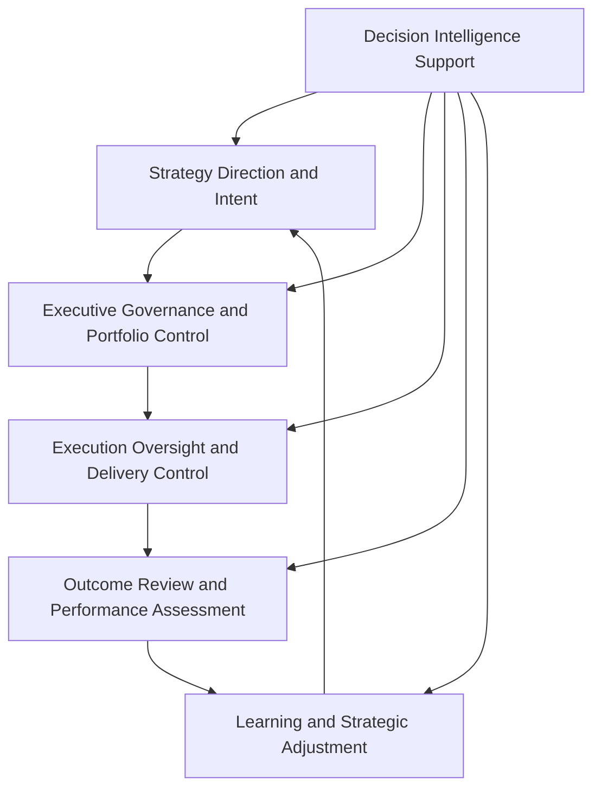
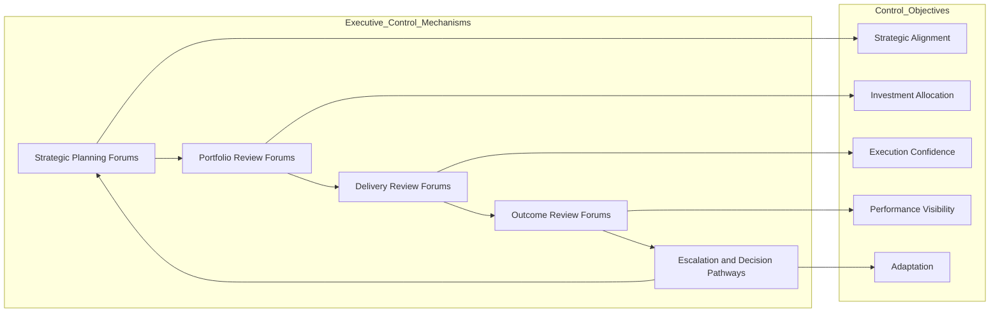

# Executive Control Architecture

The **Executive Control Architecture** defines the control structures, decision pathways, escalation mechanisms, and governance controls used to operate the **Product Leadership Operating Model**.

Where the **Product Leadership Systems Architecture (PLSA)** defines the canonical structure of the five core systems, and the **Product Leadership Operating Model** defines the leadership cadence used to run that architecture, this artifact defines the **executive control layer** that keeps the operating model aligned, governed, and effective over time.

It explains how leadership teams maintain direction, govern execution, review performance, manage tradeoffs, and apply corrective action across the Product Leadership Operating System.

---

## Purpose

The purpose of this artifact is to define the **executive control model** for the **Product Leadership Operating System (PLOS)**.

This artifact clarifies how executive leaders:

- maintain strategic alignment
- govern portfolio investment decisions
- direct cross-functional execution
- review customer and business outcomes
- intervene when performance deviates from intent
- reinforce learning and course correction across the operating loop

This artifact does **not** redefine the canonical architecture.

Instead, it explains how leadership control is exercised **across** the canonical five-system architecture through governance mechanisms, operating reviews, escalation pathways, and decision forums.

The control stages used in this artifact are executive operating constructs mapped across the canonical architecture systems; they are not replacement system names for the five-system model defined in the Product Leadership Systems Architecture.

---

## Diagram

---

## Diagram Interpretation

This diagram shows the executive control cycle used to operate the Product Leadership Operating Model.

The stages shown here represent executive control constructs mapped across the canonical five-system architecture. They are used to explain how leadership control is exercised across strategy, governance, delivery, outcomes, and learning without redefining the underlying architecture systems.

The control architecture begins with **Strategy Direction and Intent**, where executive leadership establishes priorities, strategic focus, constraints, and expected outcomes. These signals shape the portfolio decisions that follow.

Those signals move into **Executive Governance and Portfolio Control**, where leadership determines which investments move forward, how resources are allocated, which tradeoffs are accepted, and where governance authority is exercised.

Approved work then enters **Execution Oversight and Delivery Control**, where leaders monitor progress, remove blockers, manage dependencies, assess delivery risk, and ensure execution remains aligned to portfolio intent.

From there, leadership moves into **Outcome Review and Performance Assessment**, where delivered work is evaluated against customer outcomes, business impact, operating performance, and strategic intent.

Those findings then drive **Learning and Strategic Adjustment**, where leadership identifies corrective actions, strategic refinements, and control improvements that feed back into the next cycle of strategic direction.

**Decision Intelligence Support** informs every stage by supplying evidence, telemetry, performance signals, and insight needed to make better executive decisions.

---

## Operating Logic

The Executive Control Architecture operates as the leadership control layer for the Product Leadership Operating Model.

Its core logic is based on five control responsibilities:

### 1. Direction Control

Executive leadership establishes strategic intent, operating priorities, enterprise constraints, and expected value targets.

This control responsibility ensures that downstream portfolio and execution decisions remain anchored to enterprise direction rather than local optimization.

### 2. Investment Control

Executive leadership governs which initiatives are approved, sequenced, funded, deferred, accelerated, or stopped.

This is the principal control point connecting strategic ambition to governed investment action.

### 3. Execution Control

Executive leadership does not manage day-to-day delivery directly, but it maintains oversight through operating reviews, risk visibility, dependency management, and intervention mechanisms.

This control responsibility ensures that execution remains coordinated, transparent, and responsive to executive priorities.

### 4. Performance Control

Executive leadership reviews delivered results through customer, business, operational, and portfolio performance signals.

This creates an explicit control point between delivered output and realized value.

### 5. Adaptive Control

Executive leadership uses review signals, decision intelligence, and governance feedback to refine strategy, rebalance the portfolio, strengthen operating forums, and improve future decisions.

This ensures the operating model remains adaptive rather than static.

These control responsibilities map directly to the broader leadership operating loop: **Direction Control** reinforces strategy, **Investment Control** governs portfolio decisions, **Execution Control** oversees delivery, **Performance Control** evaluates outcomes, and **Adaptive Control** closes the learning loop back into strategy.

Together, these five control responsibilities form the executive control loop that governs the broader leadership operating system.

---

## Supporting Diagram

---

## Why This Matters

The Product Leadership Operating Model requires more than recurring meetings and review cadence.

It requires a clear control architecture that explains how executive authority is applied across strategy, governance, delivery, outcomes, and learning.

Without an explicit executive control model:

- operating forums can become disconnected ceremonies
- governance can become inconsistent across decision points
- escalation can become reactive instead of structured
- delivery reviews can drift away from portfolio intent
- outcome reviews can fail to produce meaningful adjustment
- leadership teams can lose control without realizing it

This artifact matters because it makes the control logic of the operating model explicit.

It clarifies how executive leadership maintains alignment, governs tradeoffs, reinforces accountability, and drives adaptation across the Product Leadership Operating System.

---

## How To Use This

This artifact should be used as a reference for designing, evaluating, and refining executive control structures across the Product Leadership Operating System.

Use it to:

- define executive governance pathways across the operating model
- clarify portfolio decision rights and control boundaries
- formalize escalation and intervention pathways
- align delivery oversight with portfolio and strategic intent
- connect outcome review mechanisms to adaptive strategic adjustment
- evaluate whether leadership forums are operating as control structures rather than reporting ceremonies

This artifact is especially useful when:

- standing up a leadership operating model
- redesigning executive review structures
- diagnosing governance inconsistency
- improving strategy-to-execution control
- clarifying ownership across executive and delivery layers
- strengthening learning and adaptation across the operating loop

---

## Relationship to the Operating System

This artifact is part of the **Product Leadership Operating System (PLOS)** and belongs to **Pillar 2: Product Leadership Operating Model**.

Its role is specific:

- **PLOS** is the overall portfolio and leadership operating system
- **PLSA** is the canonical systems architecture defined in Pillar 1
- the **Product Leadership Operating Model** defines the cadence, governance rhythms, and operating mechanisms used to run the system
- the **Executive Control Architecture** defines the control structures and decision pathways used to govern that operating model

This artifact supports the operating model without replacing it and reinforces the canonical five-system architecture without redefining it.

It is a **canonical supporting Pillar 2 control model**, not a canonical source artifact, and should be interpreted as a governance and control layer that operates across the established architecture rather than redefining it.

It should remain aligned to:

- **Unified Product Leadership Systems Architecture**
- **Product Leadership Systems Architecture Metamodel**
- **Product Leadership Operating Model**
- **Executive Operating Rhythm Architecture**

It also supports downstream artifacts related to executive governance, decision forums, operating cadence, leadership communication, and review mechanisms across portfolio, delivery, and outcomes.

---

## Summary

The **Executive Control Architecture** defines how executive leadership governs the Product Leadership Operating Model through direction setting, investment control, execution oversight, performance review, and adaptive adjustment.

It provides the executive control layer that connects strategy direction, portfolio decisions, execution oversight, outcome review, and adaptive adjustment across the leadership operating loop.

This artifact is not a separate architecture system.

It is a **supporting control model** that explains how leadership maintains alignment, governance, responsiveness, and accountability across the Product Leadership Operating System.

---

## License

This project is licensed under the MIT License - see the [LICENSE](../LICENSE) file for details.

