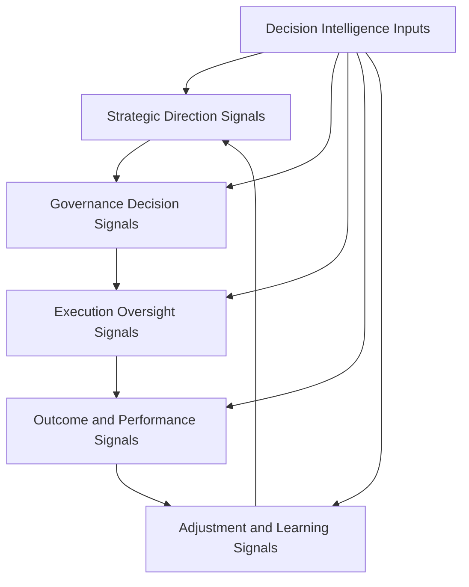
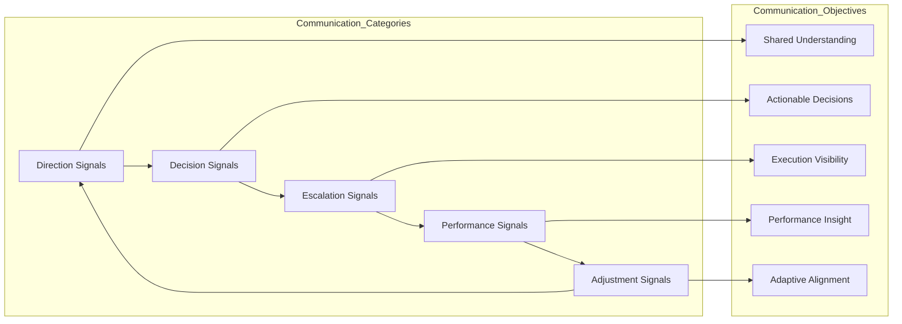

# Leadership Communication Model

The **Leadership Communication Model** defines how leadership signals, decisions, escalations, performance insights, and adjustment guidance move across the **Product Leadership Operating Model**.

Where the **Product Leadership Operating Model** defines how leadership teams run the **Product Leadership Operating System (PLOS)**, the **Executive Operating Rhythm** defines the recurring cadence used to sustain that model, the **Decision Forum Structure** defines how decision authority is organized across that cadence, and the **Operating Forums** artifact defines the recurring forum landscape through which leadership interaction occurs, this artifact defines the **communication pathways that connect those structures into one coherent operating system**.

It explains how leadership communication should function as a disciplined operating mechanism rather than a fragmented stream of disconnected updates, informal escalation, and inconsistent messaging.

---

## Purpose

The purpose of this artifact is to define the **leadership communication model** used to operate the Product Leadership Operating System.

This artifact clarifies how leadership teams:

- communicate strategic direction across the operating model
- transmit governance decisions into portfolio and delivery action
- surface escalations and execution risks through structured pathways
- communicate performance signals and outcome insights through recurring review mechanisms
- translate learning and adjustment into updated operating guidance
- maintain alignment across forums, decisions, cadence, and execution through disciplined signal flow

This artifact does **not** redefine the canonical systems architecture or replace the Product Leadership Operating Model.

Instead, it explains the communication pathways through which the operating model is sustained, coordinated, and adapted in practice.

---

## Diagram

---

## Diagram Interpretation

This diagram shows the leadership communication pathways used to sustain the Product Leadership Operating Model over time.

The stages shown here are **communication constructs** used to explain how leadership signals move across the broader operating loop. They are not replacement names for the canonical systems defined in the Product Leadership Systems Architecture. Instead, they show how leadership intent, governance decisions, execution status, performance insights, and learning signals are communicated across strategy, governance, delivery, outcomes, and adjustment.

The structure begins with **Strategic Direction Signals**, where leadership communicates priorities, enterprise intent, planning guidance, operating constraints, and investment direction across the operating model.

Those signals move into **Governance Decision Signals**, where portfolio decisions, prioritization outcomes, resource allocations, approval decisions, and tradeoff choices are communicated into the broader portfolio and delivery environment.

Approved commitments then move into **Execution Oversight Signals**, where progress status, dependency issues, risk signals, escalation needs, and execution confidence are surfaced through recurring leadership communication pathways.

From there, leadership enters **Outcome and Performance Signals**, where delivered work is evaluated and communicated through customer, business, operational, and strategic performance measures.

Those findings then inform **Adjustment and Learning Signals**, where corrective actions, updated assumptions, portfolio changes, operating refinements, and strategic adjustments are communicated back into the next cycle.

**Decision Intelligence Inputs** inform each stage through telemetry, analysis, evidence, and insight that strengthen signal quality, communication clarity, and leadership understanding.

---

## Operating Logic

The Leadership Communication Model functions as the signal-flow layer of the Product Leadership Operating Model.

Its operating logic is based on five communication responsibilities:

### 1. Direction Communication

Leadership communicates strategic intent, enterprise priorities, operating guidance, planning assumptions, and directional constraints.

These communications ensure that governance and execution are aligned to shared strategic context rather than fragmented interpretation.

### 2. Governance Communication

Leadership communicates portfolio decisions, resource commitments, prioritization outcomes, approval status, and tradeoff direction.

These communications ensure that strategic intent is converted into clear and actionable portfolio signals.

### 3. Oversight Communication

Leadership communicates execution health, delivery risks, dependency issues, escalation needs, and progress signals through recurring review pathways.

These communications ensure that delivery remains visible, governable, and responsive to leadership direction.

### 4. Performance Communication

Leadership communicates outcome results, customer signals, business impact, operational performance, and review findings.

These communications ensure that results are interpreted through structured signals rather than anecdotal updates or informal perception.

### 5. Adjustment Communication

Leadership communicates corrective actions, operating refinements, portfolio changes, and updated strategic guidance based on review findings and learning signals.

These communications ensure that the operating model remains adaptive and that learning is translated into real action.

These communication responsibilities map across the broader leadership loop: direction signals guide governance, governance signals shape execution, execution signals inform outcome interpretation, performance signals drive learning, and adjustment signals update the next cycle of leadership direction.

Together, these responsibilities form the communication model that keeps the operating system aligned, transparent, and responsive over time.

---

## Supporting Diagram

---

## Why This Matters

Leadership operating models often fail not because decisions are absent, but because the communication pathways that carry those decisions and signals are unclear, delayed, fragmented, or inconsistent.

Without an explicit leadership communication model:

- strategic direction can be interpreted inconsistently across teams
- governance decisions can fail to translate into coordinated action
- escalation signals can surface too late or through the wrong channels
- delivery visibility can degrade across leadership layers
- performance signals can remain disconnected from decision-making
- learning can fail to translate into updated operating guidance

This artifact matters because it makes leadership communication explicit as an operating mechanism.

It defines how signals should move across the leadership operating system so that direction, decisions, performance insight, and adjustment remain coherent over time.

---

## How To Use This

This artifact should be used as the reference for designing and evaluating the communication pathways used to run the Product Leadership Operating Model.

Use it to:

- define the major communication signal types across the leadership operating loop
- clarify how strategic, governance, oversight, performance, and adjustment signals should flow
- reduce ambiguity in how leadership decisions are communicated
- strengthen escalation and visibility pathways across leadership layers
- align communication pathways to the operating rhythm and forum structure
- assess whether current leadership communication supports coherent operating control
- align supporting Pillar 2 artifacts to one communication model

This artifact is especially useful when:

- designing leadership communication pathways
- restructuring executive review and escalation channels
- diagnosing signal loss across strategy and execution
- improving visibility across portfolio and delivery layers
- clarifying how review findings should translate into updated direction
- reducing communication fragmentation across leadership forums

---

## Relationship to the Operating System

This artifact is part of the **Product Leadership Operating System (PLOS)** and is a **canonical supporting artifact for Pillar 2: Product Leadership Operating Model**.

Its role is specific:

- **PLOS** is the overall portfolio and leadership operating system
- **PLSA** is the canonical systems architecture defined in Pillar 1
- the **Product Leadership Operating Model** is the canonical Pillar 2 source artifact defining how the architecture is run
- the **Executive Operating Rhythm** defines the recurring cadence used to sustain that model
- the **Decision Forum Structure** defines where and how decisions are organized within that cadence
- the **Operating Forums** artifact defines the recurring forum landscape through which leadership interaction occurs
- the **Leadership Communication Model** defines how leadership signals move across those structures in practice

This artifact supports the operating model without replacing it and reinforces communication discipline across strategy, governance, delivery, outcomes, and learning.

It should remain aligned to:

- **Unified Product Leadership Systems Architecture**
- **Product Leadership Systems Architecture Metamodel**
- **Product Leadership Operating Model**
- **Executive Operating Rhythm**
- **Decision Forum Structure**
- **Operating Forums**
- **Executive Control Architecture**

It also supports downstream artifacts related to:

- executive council models
- portfolio review structures
- operating cadence models
- escalation pathways
- leadership review mechanisms
- supporting Pillar 2 diagrams

---

## Summary

The **Leadership Communication Model** defines how leadership signals move across the Product Leadership Operating Model in practice.

It explains how strategic direction, governance decisions, execution oversight, performance insight, and adaptive adjustment are communicated through structured pathways rather than fragmented or informal channels.

This artifact is not the canonical operating model itself.

It is a **supporting Pillar 2 communication artifact** that explains how leadership signal flow sustains alignment, visibility, control, and adaptation across the broader operating loop.

---

## License

This project is licensed under the MIT License - see the [LICENSE](../LICENSE) file for details.
