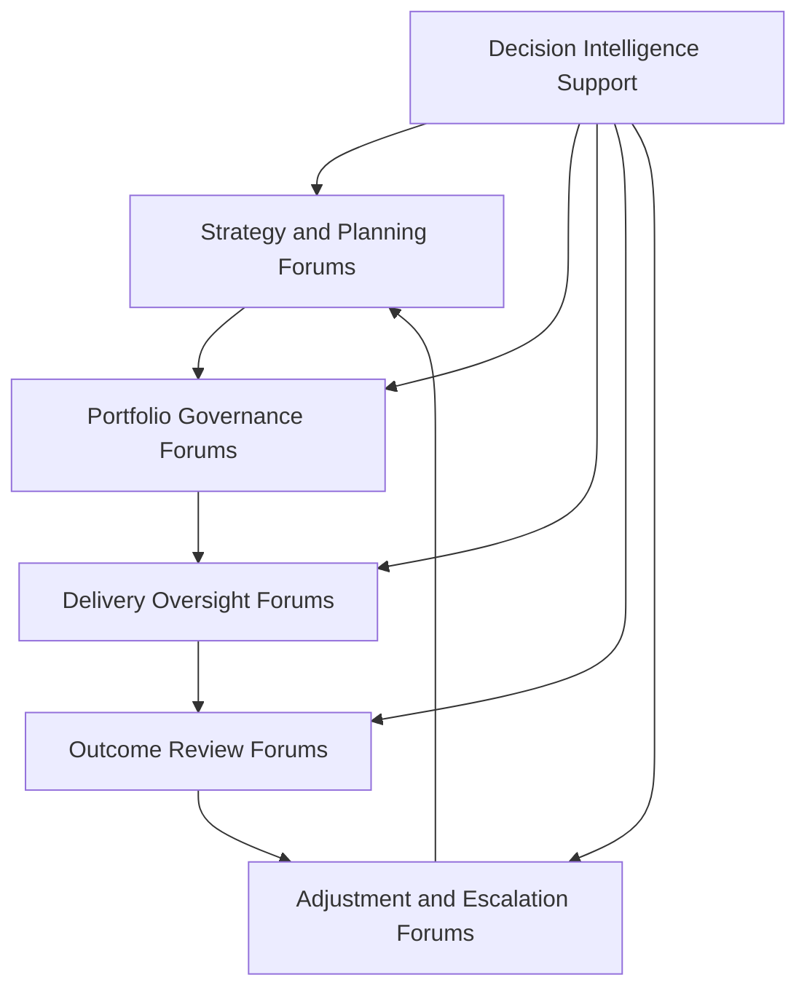
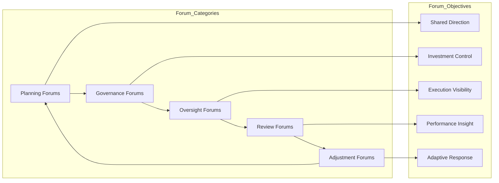

# Operating Forums

The **Operating Forums** artifact defines the recurring leadership forums used to run the **Product Leadership Operating Model** across strategy, governance, delivery, outcomes, and learning.

Where the **Product Leadership Operating Model** defines the canonical operating logic for how leadership teams run the **Product Leadership Operating System (PLOS)**, the **Executive Operating Rhythm** defines the recurring cadence used to sustain that model, and the **Decision Forum Structure** defines how decision authority is organized across that cadence, this artifact defines the **forum landscape through which the operating model is enacted in practice**.

It explains the major leadership forums, their role, their boundaries, and how they function together as an integrated operating structure rather than a disconnected set of meetings.

---

## Purpose

The purpose of this artifact is to define the **operating forums** used to run the Product Leadership Operating System.

This artifact clarifies how leadership teams:

- organize recurring leadership interaction into explicit forums
- distinguish forum purpose by operating role rather than meeting habit
- connect strategy, governance, delivery, outcomes, and adjustment through a coherent forum structure
- reduce overlap, ambiguity, and duplication across leadership meetings
- create predictable spaces for alignment, decisions, escalation, review, and adaptation

This artifact does **not** redefine the canonical systems architecture or replace the Product Leadership Operating Model.

Instead, it explains the recurring forums through which the operating model is enacted and sustained in practice.

---

## Diagram

---

## Diagram Interpretation

This diagram shows the core operating forums used to sustain the Product Leadership Operating Model over time.

The stages shown here are **forum constructs** used to explain how recurring leadership forums are organized across the broader operating loop. They are not replacement names for the canonical systems defined in the Product Leadership Systems Architecture. Instead, they show how leadership interaction is structured across strategy, governance, delivery, outcomes, and learning through explicit recurring forums.

The structure begins with **Strategy and Planning Forums**, where leadership aligns on direction, strategic priorities, planning assumptions, and operating intent for the next cycle.

Those signals move into **Portfolio Governance Forums**, where leadership evaluates proposals, governs prioritization, approves or defers investments, allocates resources, and manages portfolio tradeoffs.

Approved commitments then move into **Delivery Oversight Forums**, where leadership reviews execution health, resolves blockers, manages dependencies, monitors risk, and maintains confidence in delivery progress.

From there, leadership enters **Outcome Review Forums**, where delivered work is assessed against customer value, business performance, operational effectiveness, and strategic goals.

Those findings then inform **Adjustment and Escalation Forums**, where unresolved tensions, risks, structural issues, and learning signals are elevated for correction, rebalancing, or strategic refinement before the next cycle begins.

**Decision Intelligence Support** informs each forum through telemetry, metrics, evidence, and analysis that improve decision quality, review quality, and operating visibility.

---

## Operating Logic

The Operating Forums artifact functions as the forum-structure layer of the Product Leadership Operating Model.

Its operating logic is based on five forum responsibilities:

### 1. Alignment Forums

Leadership maintains forums that align enterprise direction, strategic intent, planning assumptions, and operating priorities.

These forums ensure that downstream governance and execution are anchored to shared context rather than fragmented interpretation.

### 2. Governance Forums

Leadership maintains forums that govern portfolio decisions, prioritization, investment tradeoffs, sequencing, and resource allocation.

These forums ensure that strategic intent is translated into governed decisions through explicit review structures.

### 3. Oversight Forums

Leadership maintains forums that monitor execution progress, surface dependencies, address escalations, and sustain delivery confidence.

These forums ensure that execution remains visible, coordinated, and governable without collapsing into operational micromanagement.

### 4. Review Forums

Leadership maintains forums that evaluate delivered work against customer, business, operational, and strategic outcomes.

These forums ensure that performance is interpreted through structured review rather than anecdotal reaction.

### 5. Adjustment Forums

Leadership maintains forums that translate learning, accumulated issues, and unresolved tensions into corrective action, portfolio rebalancing, operating improvement, or strategic refinement.

These forums ensure that the operating model remains adaptive rather than static.

These forum responsibilities map across the broader leadership loop: alignment forums reinforce strategy, governance forums govern investments, oversight forums sustain delivery, review forums evaluate outcomes, and adjustment forums close the loop back into the next cycle of direction-setting.

Together, these responsibilities form the recurring forum structure that keeps the operating model visible, coordinated, and actionable over time.

---

## Supporting Diagram

---

## Why This Matters

Leadership operating models often fail not because the strategy is unclear, but because the recurring forums used to run the model are fragmented, duplicative, or poorly defined.

Without explicit operating forums:

- leadership meetings can drift into overlapping purposes
- governance can occur inconsistently across different groups
- escalation can happen in the wrong forum or too late
- delivery visibility can become uneven
- outcome reviews can become descriptive rather than actionable
- learning can fail to translate into real operating adjustment

This artifact matters because it makes the forum landscape explicit.

It defines the recurring spaces in which leadership alignment, governance, oversight, review, and adjustment should happen so that the operating model functions as a coherent system rather than a loose meeting calendar.

---

## How To Use This

This artifact should be used as the reference for designing and evaluating the recurring forums used to run the Product Leadership Operating Model.

Use it to:

- define the core forum categories across the leadership operating loop
- distinguish forum purpose by role, not just by title
- reduce overlap across strategy, governance, delivery, and review meetings
- align forum structure to the operating rhythm and decision structure
- identify where escalation and adjustment should occur
- assess whether current leadership meetings function as an integrated operating system
- align supporting Pillar 2 artifacts to one forum architecture

This artifact is especially useful when:

- designing a product leadership meeting architecture
- restructuring executive and portfolio forums
- diagnosing meeting duplication and forum sprawl
- clarifying how governance and review forums should differ
- improving operating discipline across leadership teams
- aligning recurring meetings to the broader strategy-to-learning loop

---

## Relationship to the Operating System

This artifact is part of the **Product Leadership Operating System (PLOS)** and is a **canonical supporting artifact for Pillar 2: Product Leadership Operating Model**.

Its role is specific:

- **PLOS** is the overall portfolio and leadership operating system
- **PLSA** is the canonical systems architecture defined in Pillar 1
- the **Product Leadership Operating Model** is the canonical Pillar 2 source artifact defining how the architecture is run
- the **Executive Operating Rhythm** defines the recurring cadence used to sustain that model
- the **Decision Forum Structure** defines where and how decisions are organized within that cadence
- the **Operating Forums** artifact defines the recurring forum landscape through which those decisions, reviews, and adjustments are enacted in practice

This artifact supports the operating model without replacing it and reinforces forum discipline across strategy, governance, delivery, outcomes, and learning.

It should remain aligned to:

- **Unified Product Leadership Systems Architecture**
- **Product Leadership Systems Architecture Metamodel**
- **Product Leadership Operating Model**
- **Executive Operating Rhythm**
- **Decision Forum Structure**
- **Executive Control Architecture**

It also supports downstream artifacts related to:

- leadership communication
- executive council models
- portfolio review structures
- operating cadence models
- escalation pathways
- supporting Pillar 2 diagrams

---

## Summary

The **Operating Forums** artifact defines the recurring forums through which leadership teams enact the Product Leadership Operating Model in practice.

It explains how strategy and planning forums, governance forums, delivery oversight forums, outcome review forums, and adjustment forums work together as one integrated operating structure.

This artifact is not the canonical operating model itself.

It is a **supporting Pillar 2 operating structure artifact** that explains how the leadership forum landscape sustains coordination, governance, visibility, and adaptation across the broader operating loop.

---

## License

This project is licensed under the MIT License - see the [LICENSE](../LICENSE) file for details.
