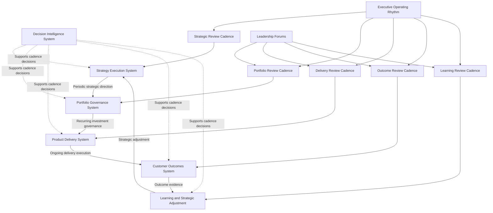
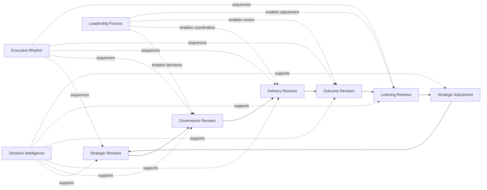

# Operating Cadence Diagram

The **Operating Cadence Diagram** is a supporting visual artifact for **Pillar 2: Product Leadership Operating Model** within the **Product Leadership Operating System (PLOS)**.

It illustrates the recurring timing architecture through which leadership teams review strategy, govern investments, coordinate delivery, evaluate outcomes, and feed learning back into strategic adjustment across a disciplined executive cadence.

This artifact is subordinate to the canonical **Product Leadership Operating Model**, the canonical supporting **Product Leadership Operating Cadence** artifact, and the higher-precedence **Product Leadership Systems Architecture (PLSA)** artifacts. It does not redefine the five-system model. It visualizes how the cadence of leadership activity sustains that model in practice.

---

# Purpose

The purpose of this artifact is to provide a clear visual representation of the recurring cadence structure through which the **Product Leadership Operating Model** is executed over time.

It is intended to help leaders, reviewers, and readers quickly understand how product leadership activity is organized across recurring review layers, including:

- strategic review cadence
- portfolio governance cadence
- delivery review cadence
- customer outcome review cadence
- learning and strategic adjustment cadence
- decision support across the full operating loop

This artifact exists to improve interpretation, alignment, and operating clarity by showing how the operating model is sustained through recurring leadership rhythm rather than one-time planning or ad hoc review.

---

# Diagram

---

# Diagram Interpretation

This diagram shows how the **Product Leadership Operating Model** is sustained through recurring cadence rather than through isolated events, one-time plans, or disconnected leadership meetings.

The primary operating flow preserves the canonical progression:

**Strategy Execution System → Portfolio Governance System → Product Delivery System → Customer Outcomes System → Learning and Strategic Adjustment → Strategy Execution System**

This loop shows that the operating cadence is not simply a calendar of meetings. It is the time-based structure through which leadership repeatedly moves the organization from strategic direction to governed investment, through coordinated execution, into measurable outcomes, and back into learning-driven strategic adjustment.

Each canonical stage is supported by a corresponding cadence layer:

- **Strategic Review Cadence** sustains periodic strategic direction and adjustment
- **Portfolio Review Cadence** sustains investment governance and prioritization
- **Delivery Review Cadence** sustains execution coordination and progress management
- **Outcome Review Cadence** sustains evaluation of customer and business results
- **Learning Review Cadence** sustains reflection, adaptation, and strategic correction

The **Decision Intelligence System** appears as a cross-cutting support layer because it informs decisions at every point in the cadence rather than acting as a separate sequential phase.

The **Executive Operating Rhythm** structures the overall leadership tempo across all cadence layers, while **Leadership Forums** provide the decision environments through which governance, review, coordination, and adjustment are enacted.

Together, these elements show that operating cadence is the recurring timing architecture that keeps the operating model functioning as a disciplined leadership system.

---

# Operating Logic

The operating logic of the **Operating Cadence Diagram** is based on the idea that effective product leadership depends on recurring review and decision cycles across the full operating loop.

The cadence begins with the **Strategy Execution System**, where leadership periodically reviews strategic direction, priorities, and organizational intent. Those strategic inputs flow into the **Portfolio Governance System**, where investments are reviewed, prioritized, sequenced, and governed through recurring decision intervals.

Governed investments then proceed through the **Product Delivery System**, where execution is monitored through recurring delivery reviews that surface progress, dependencies, risks, and operational issues. Delivery activity produces evidence that can be evaluated through the **Customer Outcomes System**, where leaders assess performance against intended customer, product, and business outcomes.

That evaluation produces signals, evidence, and learning. Rather than ending the process at outcome review, the operating cadence explicitly includes **Learning and Strategic Adjustment**, where leadership interprets results, identifies implications, and feeds those insights back into future strategic direction.

This means the cadence is not linear reporting. It is a closed-loop operating system that sustains strategy execution through recurring governance, delivery review, outcome interpretation, and adaptation.

Throughout the cycle, the **Decision Intelligence System** improves cadence quality by supplying evidence, signals, metrics, trend analysis, and insight across every stage.

The cadence is further structured through supporting Pillar 2 mechanisms:

- the **Executive Operating Rhythm** establishes the overall timing and sequencing of recurring reviews
- **Leadership Forums** provide the governance and coordination environments through which cadence is enacted

The result is a disciplined operating pattern that ensures leadership attention is distributed across the full operating loop rather than concentrating only on planning or delivery status.

---

# Supporting Diagram

---

# Why This Matters

This artifact matters because many organizations treat cadence as a scheduling exercise rather than as a core part of operating system design.

When cadence is reduced to a collection of recurring meetings, leadership attention often becomes fragmented. Strategy reviews become disconnected from governance, governance becomes disconnected from delivery, delivery becomes disconnected from outcomes, and learning becomes inconsistent or absent. The result is drift, reactive management, and weak strategic adjustment.

The **Operating Cadence Diagram** makes visible that cadence is the recurring timing architecture through which the broader product leadership system is sustained. It shows that effective leadership requires structured review intervals across every major stage of the operating loop, not only planning sessions or delivery status checks.

This matters because operating quality depends not only on what decisions are made, but on when decisions are revisited, how often evidence is reviewed, and whether the organization has a disciplined mechanism for converting outcomes into learning and strategic adjustment.

By making the cadence architecture explicit, this artifact strengthens leadership discipline, improves repository consistency, and reinforces that Pillar 2 is responsible for running the canonical architecture through recurring executive rhythm.

---

# How To Use This

Use this artifact as a visual and explanatory orientation layer for the cadence dimension of the **Product Leadership Operating Model**.

It is most useful when:

- explaining how leadership activity is distributed across recurring review cycles
- distinguishing cadence architecture from static organizational structure
- aligning supporting Pillar 2 artifacts to the recurring operating loop
- validating that review forums and timing mechanisms cover the full leadership system
- assessing whether an organization is over-indexed on planning or delivery while under-managing outcomes and learning

This artifact should be read alongside the canonical **Product Leadership Operating Model**, the supporting **Product Leadership Operating Cadence** artifact, and the higher-precedence **Product Leadership Systems Architecture** artifacts.

When reusing this content in READMEs, supporting documentation, or review materials, preserve the canonical system names and the operating loop exactly.

This artifact should clarify how cadence operates. It should not replace or redefine the underlying architecture.

---

# Relationship to the Operating System

Within the broader **Product Leadership Operating System (PLOS)**, this artifact belongs to **Pillar 2: Product Leadership Operating Model**.

Its role is to visualize the recurring timing architecture through which leadership teams operate the canonical five-system architecture defined in **Pillar 1: Product Leadership Systems Architecture (PLSA)**.

That distinction must remain explicit:

- **PLOS** is the overall operating system and portfolio
- **PLSA** is the canonical systems architecture within Pillar 1
- **Pillar 2** defines how leadership runs that canonical architecture
- **Product Leadership Operating Cadence** defines the recurring timing structure
- this artifact is a supporting diagram that visualizes that cadence structure

Accordingly, this artifact must remain subordinate to higher-precedence architecture sources, especially:

1. **Unified Product Leadership Systems Architecture**
2. **Product Leadership Systems Architecture Metamodel**
3. **Product Leadership Operating Model**
4. **Product Leadership Operating Cadence**

This artifact may clarify cadence logic, but it may not redefine the canonical five-system architecture, alter the operating loop, or introduce alternate structural models.

---

# Summary

The **Operating Cadence Diagram** provides a supporting visual explanation of how recurring leadership review cycles sustain the canonical operating model over time.

It reinforces the core operating loop:

**Strategy → Governance → Delivery → Outcomes → Learning → Strategy**

It also preserves the role of the **Decision Intelligence System** as a cross-cutting support system that informs every stage of the cadence rather than acting as a separate sequential phase.

Used correctly, this artifact strengthens architectural clarity, clarifies the timing logic of the operating model, improves repository consistency, and helps ensure that Pillar 2 remains aligned to the broader **Product Leadership Operating System**.

---

# License

This repository is licensed under the MIT License. See the [LICENSE](../LICENSE) file for details.
