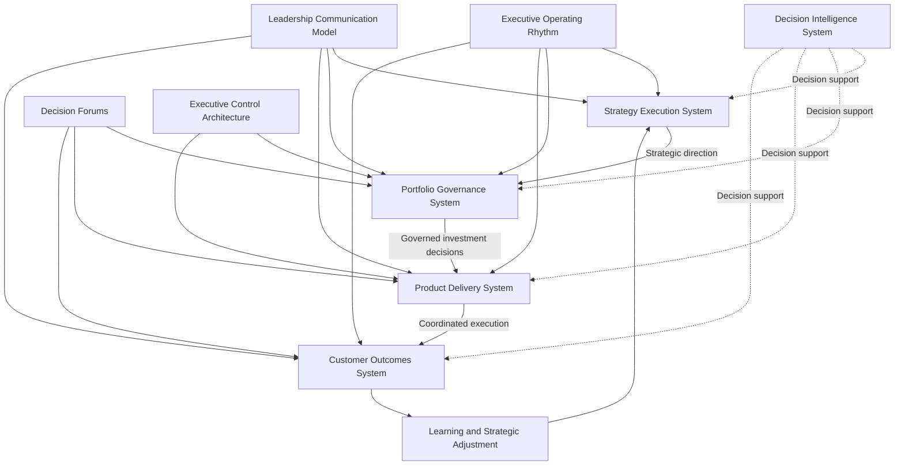
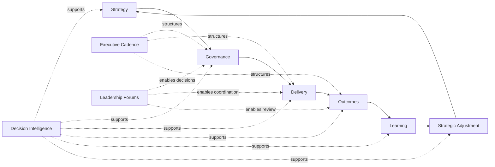

# Product Leadership Operating Model Diagram

The **Product Leadership Operating Model Diagram** is a supporting visual artifact for **Pillar 2: Product Leadership Operating Model** within the **Product Leadership Operating System (PLOS)**.

It illustrates how leadership teams operate across the canonical architecture by translating strategy into governed investment, coordinating delivery, evaluating outcomes, and feeding learning back into strategic adjustment through a recurring executive operating rhythm.

This artifact is subordinate to the canonical **Product Leadership Operating Model** and to the higher-precedence **Product Leadership Systems Architecture (PLSA)** artifacts. It does not redefine the five-system model. It visualizes how that model is operated in practice.

---

# Purpose

The purpose of this artifact is to provide a clear visual representation of how the **Product Leadership Operating Model** runs the canonical five-system architecture through executive cadence, governance mechanisms, leadership forums, and feedback loops.

It is intended to help leaders, reviewers, and readers quickly understand how the operating model connects:

- strategy direction
- portfolio governance
- product delivery coordination
- customer outcome evaluation
- learning and adaptation
- decision support through intelligence

This diagram exists to improve navigation, interpretation, and operating clarity. It is not a substitute for the canonical operating model artifact.

---

# Diagram

---

# Diagram Interpretation

This diagram shows how the **Product Leadership Operating Model** activates the canonical architecture through leadership mechanisms rather than through static organizational structure alone.

The primary operating path follows the canonical progression:

**Strategy Execution System → Portfolio Governance System → Product Delivery System → Customer Outcomes System**

This path represents the core flow through which strategic intent is translated into investment decisions, delivery execution, and measurable outcomes.

The loop then returns through:

**Customer Outcomes System → Learning and Strategic Adjustment → Strategy Execution System**

This reflects the architectural requirement that learning closes the loop and informs future strategic direction. Learning is therefore part of the operating loop, but it is not a separate canonical system.

The **Decision Intelligence System** appears as a supporting cross-cutting system because it informs each stage of the operating model rather than replacing or interrupting the primary flow.

The remaining elements represent Pillar 2 operating mechanisms:

- **Executive Operating Rhythm** sustains the recurring cadence of review and adjustment
- **Decision Forums** structure governance and coordination conversations
- **Leadership Communication Model** ensures alignment across the operating loop
- **Executive Control Architecture** provides control logic, escalation structure, and management discipline

Together, these mechanisms show how leadership teams run the architecture as an operating system rather than treating it as a conceptual framework only.

---

# Operating Logic

The operating logic of the **Product Leadership Operating Model** is based on disciplined leadership orchestration across the five canonical systems.

The model begins with the **Strategy Execution System**, where organizational direction, priorities, and strategic intent are established. That strategic intent is translated into governed investment decisions through the **Portfolio Governance System**, where leadership evaluates priorities, sequencing, allocation, and tradeoffs.

Approved investments then move into the **Product Delivery System**, where teams coordinate execution, delivery management, dependency handling, and operational progress. Delivery produces changes in product, service, capability, or experience that can be assessed through the **Customer Outcomes System**, where leaders evaluate whether intended outcomes are being achieved.

The outcomes stage generates evidence, signals, and learning. That learning does not create a sixth system. Instead, it feeds back into strategy refinement, allowing the operating loop to continue with better information and improved alignment.

Throughout this cycle, the **Decision Intelligence System** supports better judgment by supplying metrics, evidence, performance signals, and analytical insight across every stage.

Pillar 2 supporting mechanisms operationalize this flow:

- the **Executive Operating Rhythm** determines when review and adjustment occur
- **Decision Forums** determine where decisions are made
- the **Leadership Communication Model** determines how alignment is sustained
- the **Executive Control Architecture** determines how governance discipline is maintained

The result is a repeatable executive operating system that allows product leadership teams to move from strategic intent to measurable outcomes with structured feedback and controlled adaptation.

---

# Supporting Diagram

---

# Why This Matters

This artifact matters because many organizations describe product leadership through fragmented activities such as planning, governance, execution, and reporting without showing how those activities function together as a coherent operating model.

The **Product Leadership Operating Model Diagram** makes that coherence visible. It shows that effective product leadership is not simply a collection of meetings, decisions, or management routines. It is a structured operating system that connects strategic direction, governed investment, coordinated delivery, measurable outcomes, and learning-driven adjustment.

This matters because leadership effectiveness depends not only on defining strategy, but on whether the organization has the governance structure, decision forums, operating cadence, communication pathways, and control mechanisms needed to carry strategy through execution and back into refinement.

By making that operating logic explicit, this artifact helps prevent fragmented leadership behavior, disconnected governance, delivery drift, and loss of alignment across the Product Leadership Operating System.

It also strengthens consistency across repositories by reinforcing that Pillar 2 exists to operationalize the canonical architecture rather than reinterpret it.

---

# How To Use This

Use this artifact as a visual and explanatory orientation layer for the **Product Leadership Operating Model**.

It is most useful when:

- introducing the Pillar 2 operating model to executive stakeholders
- aligning supporting artifacts to the canonical operating model
- validating that diagrams and repository documentation preserve the canonical five-system structure
- explaining how leadership cadence, governance forums, and communication mechanisms operate across the architecture
- reviewing whether a repository, README, or artifact is drifting from the intended operating loop

This artifact should be read alongside the canonical **Product Leadership Operating Model** and the higher-precedence **Product Leadership Systems Architecture** artifacts.

When reusing this content in READMEs, supporting documentation, or review materials, preserve the canonical system names and the operating loop exactly.

This artifact should clarify the operating model, not replace or redefine it.

---

# Relationship to the Operating System

Within the broader **Product Leadership Operating System (PLOS)**, this artifact belongs to **Pillar 2: Product Leadership Operating Model**.

Its role is to visualize how leadership teams operate the canonical five-system architecture defined in **Pillar 1: Product Leadership Systems Architecture (PLSA)**.

That distinction must remain explicit:

- **PLOS** is the overall portfolio and operating system
- **PLSA** is the canonical systems architecture within Pillar 1
- **Pillar 2** defines how leadership runs that canonical architecture
- this artifact is a supporting diagram that visualizes that operating logic

Accordingly, this artifact must remain subordinate to higher-precedence architecture sources, especially:

1. **Unified Product Leadership Systems Architecture**
2. **Product Leadership Systems Architecture Metamodel**
3. **Product Leadership Operating Model**

This artifact may clarify the operating model, but it may not redefine the canonical five-system architecture, alter the operating loop, or introduce alternate system structures.

---

# Summary

The **Product Leadership Operating Model Diagram** provides a supporting visual explanation of how leadership teams run the canonical architecture through governance, cadence, communication, control, and feedback.

It reinforces the core operating loop:

**Strategy → Governance → Delivery → Outcomes → Learning → Strategy**

It also preserves the role of the **Decision Intelligence System** as a cross-cutting support system that informs every stage of the operating model rather than acting as a separate sequential phase.

Used correctly, this artifact strengthens architectural clarity, improves repository consistency, supports executive interpretation, and helps ensure that Pillar 2 remains aligned to the broader **Product Leadership Operating System**.

---

# License

This repository is licensed under the MIT License. See the [LICENSE](../LICENSE) file for details.
