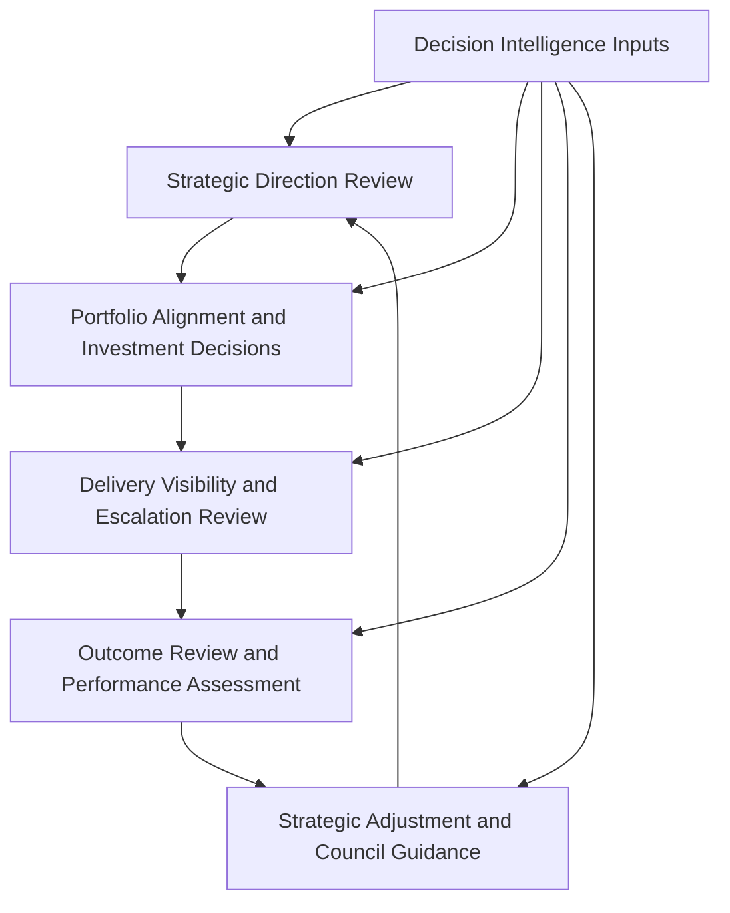
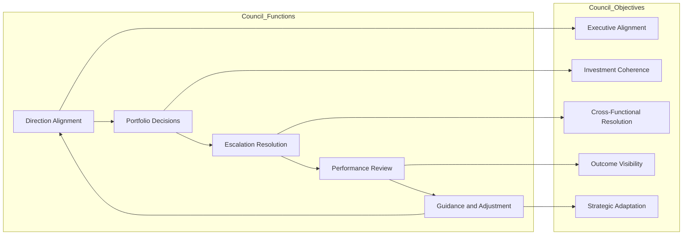

# Executive Product Council Model

The **Executive Product Council Model** defines the role, structure, purpose, and operating logic of the senior cross-functional council used to govern the **Product Leadership Operating Model** at the executive level.

Where the **Product Leadership Operating Model** defines how leadership teams run the **Product Leadership Operating System (PLOS)**, the **Executive Operating Rhythm** defines the recurring cadence used to sustain that model, the **Decision Forum Structure** defines how decision authority is organized, the **Operating Forums** artifact defines the recurring forum landscape, and the **Leadership Communication Model** defines how leadership signals move across those structures, this artifact defines the **executive council forum through which the highest-level product leadership decisions are coordinated in practice**.

It explains how the executive product council functions as a governing leadership forum for alignment, portfolio direction, escalation resolution, performance review, and strategic adjustment.

---

## Purpose

The purpose of this artifact is to define the **executive product council model** used within the Product Leadership Operating System.

This artifact clarifies how leadership teams:

- establish a senior cross-functional forum for product leadership governance
- align strategic direction, portfolio decisions, delivery visibility, and outcome review at the executive level
- create a structured venue for resolving cross-cutting issues that exceed lower forum authority
- reinforce alignment across product, technology, operations, and business leadership
- connect executive review, escalation handling, and strategic adjustment through one high-authority council model

This artifact does **not** redefine the canonical systems architecture or replace the Product Leadership Operating Model.

Instead, it defines the executive council structure through which senior leadership governs, aligns, and adjusts the operating model in practice.

---

## Diagram

---

## Diagram Interpretation

This diagram shows the executive product council operating cycle used to support the Product Leadership Operating Model.

The stages shown here are **council operating constructs** used to explain how the executive council functions across the broader leadership loop. They are not replacement names for the canonical systems defined in the Product Leadership Systems Architecture. Instead, they show how the executive council provides senior leadership coordination across strategy, governance, delivery, outcomes, and learning.

The cycle begins with **Strategic Direction Review**, where council members align on enterprise priorities, strategic intent, planning guidance, and operating context.

Those signals move into **Portfolio Alignment and Investment Decisions**, where the council reviews major portfolio choices, investment tradeoffs, prioritization issues, and resource implications requiring executive-level coordination.

Approved commitments and portfolio direction then move into **Delivery Visibility and Escalation Review**, where the council reviews cross-cutting execution health, delivery risks, dependencies, and escalations that require senior intervention.

From there, the council enters **Outcome Review and Performance Assessment**, where major customer, business, portfolio, and operational results are reviewed in relation to expected outcomes and strategic intent.

Those findings then inform **Strategic Adjustment and Council Guidance**, where the council provides updated direction, resolves structural tensions, reinforces operating priorities, and shapes the next cycle of executive oversight.

**Decision Intelligence Inputs** support every stage through telemetry, evidence, metrics, and analysis that improve executive review quality and decision confidence.

---

## Operating Logic

The Executive Product Council Model functions as the senior coordination and escalation forum within the Product Leadership Operating Model.

Its operating logic is based on five council responsibilities:

### 1. Direction Alignment Responsibility

The council aligns senior leadership around enterprise priorities, strategic direction, planning guidance, and operating intent.

This ensures that major product leadership decisions begin from shared executive context rather than fragmented interpretation across functions.

### 2. Portfolio Decision Responsibility

The council reviews major portfolio tradeoffs, investment choices, prioritization questions, and resourcing tensions that require executive-level coordination.

This ensures that significant portfolio decisions are handled through an explicit executive forum rather than through fragmented side-channel decisions.

### 3. Escalation Resolution Responsibility

The council reviews cross-functional issues, unresolved dependencies, structural blockers, and delivery risks that exceed the authority of lower-level forums.

This ensures that escalations are addressed at the right level with the right visibility and cross-functional context.

### 4. Performance Review Responsibility

The council reviews major performance signals across customer outcomes, business results, operational health, and portfolio effectiveness.

This ensures that executive oversight remains connected to actual results rather than status reporting alone.

### 5. Guidance and Adjustment Responsibility

The council issues updated direction, reinforces priorities, authorizes corrective action, and shapes strategic or operating adjustments based on review findings.

This ensures that executive leadership closes the loop between review, learning, and future action.

These council responsibilities map across the broader leadership loop: direction review reinforces strategy, portfolio decisions support governance, escalation review supports delivery oversight, performance review evaluates outcomes, and guidance closes the loop back into the next cycle of strategic direction.

Together, these responsibilities form the executive council model that keeps senior leadership aligned, decision-capable, and responsive over time.

---

## Supporting Diagram

---

## Why This Matters

Leadership operating models often require a senior forum that can integrate strategy, portfolio, delivery, outcomes, and adjustment without collapsing into scattered executive conversations.

Without an explicit executive product council model:

- major portfolio tradeoffs can be handled inconsistently
- cross-functional escalations can remain unresolved too long
- executive alignment can degrade across product, technology, and business leadership
- performance review can become disconnected from strategic adjustment
- leadership forums can multiply without clear authority boundaries
- executive decision-making can become reactive rather than structured

This artifact matters because it makes the executive council role explicit.

It defines how a high-authority product leadership forum should function within the operating model so that senior decisions, escalations, and strategic adjustments are coordinated through one disciplined structure.

---

## How To Use This

This artifact should be used as the reference for designing and evaluating the executive product council used within the Product Leadership Operating Model.

Use it to:

- define the purpose and scope of the executive product council
- clarify which issues belong at the council level rather than in lower forums
- align executive council activity to the broader operating rhythm
- distinguish council responsibilities from portfolio reviews, delivery reviews, and outcome forums
- strengthen cross-functional executive coordination
- reduce ambiguity around senior escalation and adjustment decisions
- align related Pillar 2 artifacts to one council model

This artifact is especially useful when:

- designing an executive product council
- restructuring senior product leadership forums
- clarifying executive decision and escalation boundaries
- diagnosing fragmented senior governance
- improving alignment between product, technology, and business leadership
- strengthening the link between executive review and strategic adjustment

---

## Relationship to the Operating System

This artifact is part of the **Product Leadership Operating System (PLOS)** and is a **canonical supporting artifact for Pillar 2: Product Leadership Operating Model**.

Its role is specific:

- **PLOS** is the overall portfolio and leadership operating system
- **PLSA** is the canonical systems architecture defined in Pillar 1
- the **Product Leadership Operating Model** is the canonical Pillar 2 source artifact defining how the architecture is run
- the **Executive Operating Rhythm** defines the recurring cadence used to sustain that model
- the **Decision Forum Structure** defines where and how decisions are organized within that cadence
- the **Operating Forums** artifact defines the recurring forum landscape through which leadership interaction occurs
- the **Leadership Communication Model** defines how leadership signals move across those structures
- the **Executive Product Council Model** defines the senior council forum through which executive coordination, escalation, and adjustment are enacted in practice

This artifact supports the operating model without replacing it and reinforces executive governance discipline across strategy, governance, delivery, outcomes, and learning.

It should remain aligned to:

- **Unified Product Leadership Systems Architecture**
- **Product Leadership Systems Architecture Metamodel**
- **Product Leadership Operating Model**
- **Executive Operating Rhythm**
- **Decision Forum Structure**
- **Operating Forums**
- **Leadership Communication Model**
- **Executive Control Architecture**

It also supports downstream artifacts related to:

- portfolio review structures
- operating cadence models
- escalation pathways
- leadership review mechanisms
- executive governance patterns
- supporting Pillar 2 diagrams

---

## Summary

The **Executive Product Council Model** defines how a senior cross-functional leadership council operates within the Product Leadership Operating Model.

It explains how executive alignment, portfolio decisions, escalation resolution, performance review, and strategic adjustment are coordinated through one structured council forum.

This artifact is not the canonical operating model itself.

It is a **supporting Pillar 2 council artifact** that explains how senior leadership governance is enacted across the broader operating loop.

---

## License

This project is licensed under the MIT License - see the [LICENSE](../LICENSE) file for details.
