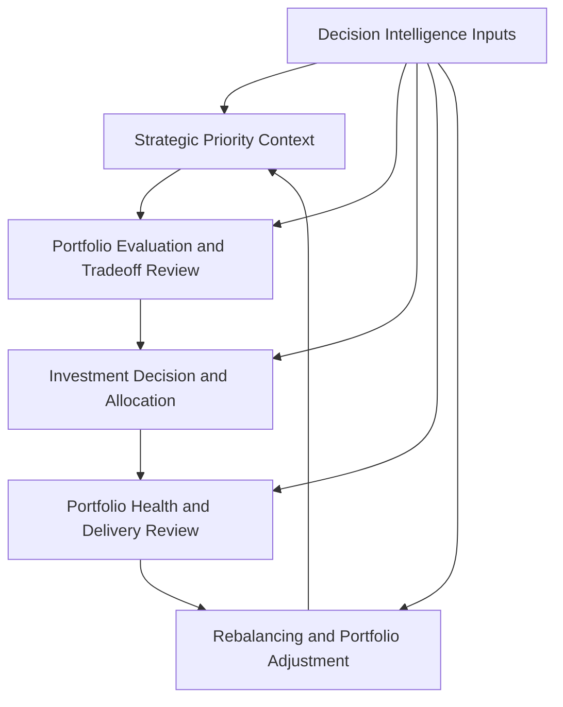
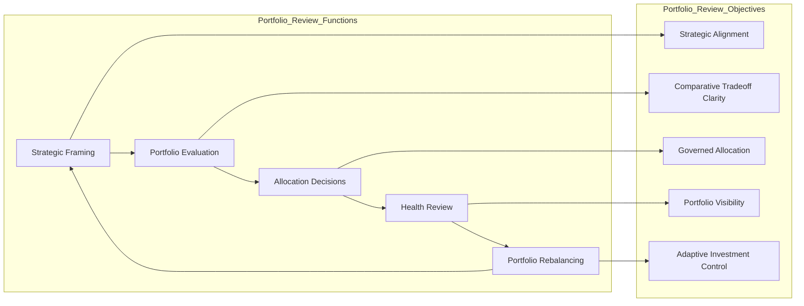

# Portfolio Review Model

The **Portfolio Review Model** defines the purpose, structure, operating logic, and review responsibilities of the recurring portfolio review forum used to govern investments within the **Product Leadership Operating Model**.

Where the **Product Leadership Operating Model** defines how leadership teams run the **Product Leadership Operating System (PLOS)**, the **Executive Operating Rhythm** defines the cadence that sustains that model, the **Decision Forum Structure** defines how decision authority is organized, the **Operating Forums** artifact defines the recurring forum landscape, the **Leadership Communication Model** defines how leadership signals move across those structures, and the **Executive Product Council Model** defines the senior executive coordination forum, this artifact defines the **portfolio review forum through which governed investment choices are evaluated, prioritized, adjusted, and monitored in practice**.

It explains how portfolio review functions as a disciplined leadership mechanism for evaluating priorities, governing tradeoffs, maintaining investment coherence, and reinforcing strategic alignment over time.

---

## Purpose

The purpose of this artifact is to define the **portfolio review model** used within the Product Leadership Operating System.

This artifact clarifies how leadership teams:

- evaluate portfolio priorities through recurring structured review
- govern investment choices, tradeoffs, sequencing, and allocation decisions
- assess portfolio health, delivery confidence, and outcome trajectory at the portfolio level
- create a repeatable mechanism for rebalancing work as conditions change
- reinforce alignment between strategic intent, governed investment, and operating execution

This artifact does **not** redefine the canonical systems architecture or replace the Product Leadership Operating Model.

Instead, it defines the recurring portfolio review structure through which investment governance is enacted and sustained in practice.

---

## Diagram

---

## Diagram Interpretation

This diagram shows the recurring portfolio review cycle used to support the Product Leadership Operating Model.

The stages shown here are **portfolio review constructs** used to explain how investment governance is carried out across the broader leadership loop. They are not replacement names for the canonical systems defined in the Product Leadership Systems Architecture. Instead, they show how portfolio-level review connects strategy, governance, delivery visibility, outcomes, and adjustment into one recurring review mechanism.

The cycle begins with **Strategic Priority Context**, where leadership reviews the strategic environment, portfolio themes, enterprise intent, and planning constraints that shape portfolio choices.

Those signals move into **Portfolio Evaluation and Tradeoff Review**, where initiatives, investments, capacity demands, dependencies, and competing priorities are reviewed in relation to strategic value and portfolio fit.

From there, leadership enters **Investment Decision and Allocation**, where approval, deferral, sequencing, funding, resourcing, and tradeoff decisions are made to govern the portfolio explicitly.

Approved commitments then move into **Portfolio Health and Delivery Review**, where leadership assesses execution confidence, portfolio risk, dependency exposure, capacity pressure, and delivery progress across the active portfolio.

Those findings then inform **Rebalancing and Portfolio Adjustment**, where priorities are refined, investments are rebalanced, decisions are revisited, and portfolio guidance is updated before the next cycle begins.

**Decision Intelligence Inputs** support every stage through portfolio metrics, delivery signals, outcome evidence, scenario analysis, and comparative insight that improve review quality and decision confidence.

---

## Operating Logic

The Portfolio Review Model functions as the governed investment review layer of the Product Leadership Operating Model.

Its operating logic is based on five portfolio review responsibilities:

### 1. Strategic Framing Responsibility

The portfolio review establishes shared understanding of strategic direction, portfolio themes, planning assumptions, and enterprise constraints.

This ensures that portfolio decisions are made in context rather than as isolated prioritization exercises.

### 2. Evaluation Responsibility

The portfolio review evaluates investment options, priorities, dependencies, capacity demands, and competing needs across the portfolio.

This ensures that options are reviewed comparatively and that tradeoffs are made explicitly rather than implicitly.

### 3. Allocation Responsibility

The portfolio review makes or recommends decisions regarding approval, sequencing, resourcing, funding, deferral, acceleration, or stopping work.

This ensures that portfolio choices are governed through a structured mechanism rather than through fragmented side-channel decisions.

### 4. Portfolio Health Responsibility

The portfolio review monitors the health of the active portfolio through execution visibility, dependency awareness, risk signals, throughput confidence, and delivery progress.

This ensures that the portfolio is managed as an active governed system rather than as a static set of commitments.

### 5. Rebalancing Responsibility

The portfolio review uses evidence from execution and outcomes to rebalance priorities, revise commitments, update sequencing, and adjust the portfolio as conditions change.

This ensures that the portfolio remains adaptive and strategically coherent over time.

These responsibilities map across the broader leadership loop: strategic framing reinforces direction, evaluation and allocation govern investment choices, portfolio health connects review to delivery visibility, and rebalancing closes the loop back into the next cycle of strategic and portfolio guidance.

Together, these responsibilities form the portfolio review model that keeps investment governance explicit, disciplined, and adaptive.

---

## Supporting Diagram

---

## Why This Matters

Leadership operating models often fail at the portfolio layer when investment decisions are made inconsistently, tradeoffs remain implicit, or active commitments are not revisited as conditions change.

Without an explicit portfolio review model:

- strategic priorities can fail to translate into governed portfolio choices
- prioritization can become subjective or personality-driven
- allocation decisions can be made without enough comparative context
- delivery health can become disconnected from portfolio decisions
- portfolio drift can accumulate as conditions change
- rebalancing can occur reactively rather than through structured review

This artifact matters because it makes portfolio governance explicit as a recurring review mechanism.

It defines how investments should be evaluated, governed, monitored, and adjusted so that the product leadership operating system remains strategically aligned and operationally credible over time.

---

## How To Use This

This artifact should be used as the reference for designing and evaluating the recurring portfolio review used within the Product Leadership Operating Model.

Use it to:

- define the purpose and operating scope of the portfolio review forum
- clarify how investment options should be evaluated comparatively
- align allocation decisions to strategic context and portfolio constraints
- connect portfolio review to delivery health and outcome signals
- strengthen rebalancing discipline as conditions change
- distinguish portfolio review from executive council, delivery review, and outcome review forums
- align related Pillar 2 artifacts to one portfolio review model

This artifact is especially useful when:

- designing a portfolio review forum
- restructuring investment governance processes
- clarifying prioritization and allocation decision logic
- diagnosing portfolio drift or review inconsistency
- improving the link between strategy, governed investment, and delivery oversight
- strengthening adaptive portfolio management across the operating loop

---

## Relationship to the Operating System

This artifact is part of the **Product Leadership Operating System (PLOS)** and is a **canonical supporting artifact for Pillar 2: Product Leadership Operating Model**.

Its role is specific:

- **PLOS** is the overall portfolio and leadership operating system
- **PLSA** is the canonical systems architecture defined in Pillar 1
- the **Product Leadership Operating Model** is the canonical Pillar 2 source artifact defining how the architecture is run
- the **Executive Operating Rhythm** defines the recurring cadence used to sustain that model
- the **Decision Forum Structure** defines where and how decisions are organized within that cadence
- the **Operating Forums** artifact defines the recurring forum landscape through which leadership interaction occurs
- the **Leadership Communication Model** defines how leadership signals move across those structures
- the **Executive Product Council Model** defines the senior executive coordination forum
- the **Portfolio Review Model** defines the recurring forum through which governed investment choices are reviewed, allocated, monitored, and adjusted in practice

This artifact supports the operating model without replacing it and reinforces portfolio governance discipline across strategy, investment, delivery visibility, and adaptive adjustment.

It should remain aligned to:

- **Unified Product Leadership Systems Architecture**
- **Product Leadership Systems Architecture Metamodel**
- **Product Leadership Operating Model**
- **Executive Operating Rhythm**
- **Decision Forum Structure**
- **Operating Forums**
- **Leadership Communication Model**
- **Executive Product Council Model**
- **Executive Control Architecture**

It also supports downstream artifacts related to:

- operating cadence models
- escalation pathways
- delivery review structures
- portfolio governance patterns
- supporting Pillar 2 diagrams

---

## Summary

The **Portfolio Review Model** defines how portfolio investments are evaluated, governed, monitored, and adjusted within the Product Leadership Operating Model.

It explains how strategic framing, portfolio evaluation, allocation decisions, health review, and rebalancing are coordinated through one structured portfolio review mechanism.

This artifact is not the canonical operating model itself.

It is a **supporting Pillar 2 review artifact** that explains how governed investment review is enacted across the broader leadership operating loop.

---

## License

This project is licensed under the MIT License - see the [LICENSE](../LICENSE) file for details.
