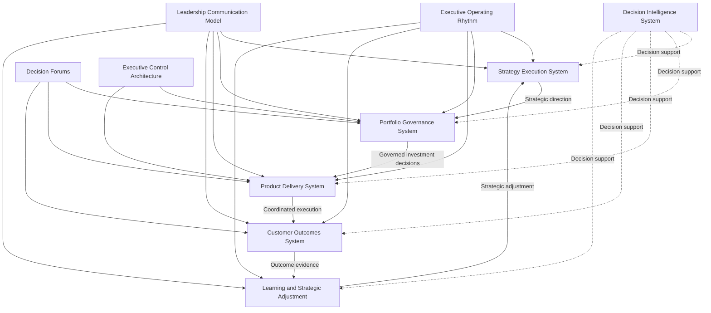
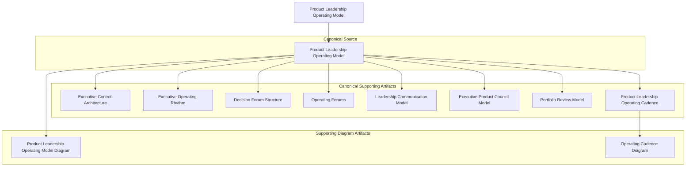

# Product Leadership Operating Model

This repository documents **Pillar 2** of the **Product Leadership Operating System (PLOS)** and defines how leadership teams operate the **Product Leadership Systems Architecture (PLSA)** through governance forums, executive review rhythms, operating cadence, communication pathways, and control mechanisms.

Where **PLSA** defines the canonical five-system architecture, the **Product Leadership Operating Model** defines how leadership runs that architecture in practice.

This repository is a navigation and orientation layer for the Pillar 2 operating model library. It summarizes the purpose of the repository, shows how the major artifacts relate to one another, and helps readers understand how to navigate the supporting architecture.

---

---

# Operating Model Overview

The **Product Leadership Operating Model** explains how product leadership teams run the canonical architecture through disciplined leadership mechanisms rather than through ad hoc coordination.

It shows how organizations translate:

**strategy → governed investment → coordinated delivery → measurable outcomes → learning → strategic adjustment**

through a structured executive operating rhythm.

Within the broader **Product Leadership Operating System**, Pillar 2 is responsible for the leadership mechanisms that sustain the operating loop:

**Strategy → Governance → Delivery → Outcomes → Learning → Strategy**

Decision Intelligence supports every stage of that loop.

---

# Top-Level Operating Model Diagram

---

# Repository Purpose

The purpose of this repository is to define the leadership operating mechanisms required to run the canonical product leadership architecture.

These mechanisms include:

- executive cadence
- decision forums
- governance structures
- review models
- control logic
- communication pathways
- portfolio review mechanisms
- operating rhythm diagrams

Taken together, these artifacts explain how leadership teams sustain strategic alignment, govern investments, coordinate delivery, evaluate outcomes, and adapt based on learning.

This repository does **not** redefine the architecture. It operates subordinate to the higher-precedence Pillar 1 architectural sources.

---

# 10-Second Overview

This repository explains how leadership teams run the product organization through a disciplined operating model:

- strategy establishes direction and priorities
- governance converts strategy into investment decisions
- delivery coordinates execution across teams and dependencies
- outcomes evaluate realized customer and business value
- learning informs strategic adjustment
- decision intelligence supports every stage

The operating model ensures that these mechanisms function as a coherent leadership system rather than as disconnected meetings or reporting routines.

---

# Pillar 2 Artifact Map

---

# Core Repository Artifacts

This repository contains the core artifacts that define how leadership teams operate the product organization through governance, cadence, communication, control, and review mechanisms.

## Canonical Source Artifact

- **Product Leadership Operating Model**  
  Defines the canonical Pillar 2 operating model used to run the five-system architecture.

## Canonical Supporting Artifacts

- **Executive Control Architecture**  
  Defines the control logic, escalation structure, and governance discipline used to sustain the operating model.

- **Executive Operating Rhythm**  
  Defines the recurring executive review rhythm through which leadership teams sustain strategic and operational oversight.

- **Decision Forum Structure**  
  Defines the hierarchy and role of decision environments used to govern strategy, investments, and execution.

- **Operating Forums**  
  Defines the recurring leadership forums that coordinate governance, delivery, review, and adjustment.

- **Leadership Communication Model**  
  Defines how strategic direction, governance decisions, operating priorities, and feedback move across the leadership system.

- **Executive Product Council Model**  
  Defines the executive-level leadership forum responsible for strategic alignment and portfolio-level coordination.

- **Portfolio Review Model**  
  Defines the recurring review structure used to evaluate portfolio performance, investment decisions, and delivery progress.

- **Product Leadership Operating Cadence**  
  Defines the recurring timing architecture through which the operating model is executed over time.

## Supporting Diagram Artifacts

- **Product Leadership Operating Model Diagram**  
  Visualizes how the Product Leadership Operating Model runs the canonical architecture in practice.

- **Operating Cadence Diagram**  
  Visualizes the recurring cadence structure through which leadership sustains the operating model.

---

# Repository Structure

This repository functions as an executive architecture library for **Pillar 2: Product Leadership Operating Model**.

Artifacts are organized into the following directories:

| Directory | Purpose |
|---|---|
| `architecture/` | Canonical operating model definitions, structural Pillar 2 architecture artifacts, and foundational operating-model descriptions |
| `frameworks/` | Reference structures, cadence frameworks, and supporting conceptual models |
| `artifacts/` | Governance mechanisms, review structures, communication models, councils, forums, and control artifacts |
| `diagrams/` | Reusable visual artifacts that support interpretation of the operating model |

This structure keeps the repository navigable while preserving the distinction between canonical architecture, supporting frameworks, operating artifacts, and visual documentation.

---

# Relationship to the Product Leadership Operating System

Within the broader **Product Leadership Operating System (PLOS)**, this repository defines **Pillar 2: Product Leadership Operating Model**.

That distinction is essential:

- **PLOS** is the overall operating system and portfolio
- **PLSA** is the canonical systems architecture defined in Pillar 1
- **Pillar 2** defines how leadership runs that architecture

In simple terms:

- **Architecture** defines the system
- **Operating Model** defines how leadership operates the system

This repository should therefore be read together with the Pillar 1 architecture repository:

- the architecture repository explains the canonical five-system structure
- the operating model repository explains the governance, cadence, communication, and review mechanisms used to run it

---

# Documentation Standard

All repositories in this portfolio follow a common architecture-documentation standard.

Key principles include:

- executive-level tone
- architecture-first framing
- canonical terminology preservation
- GitHub-compatible Mermaid diagrams
- clear distinction between canonical, supporting, derivative, and experimental artifacts
- README content that supports navigation without redefining architecture

This repository is intentionally **not**:

- a coding tutorial
- a software implementation guide
- a product management handbook
- agile training content
- a blog-style thought piece

It is an executive operating model architecture library within the **Product Leadership Operating System**.

---

# How To Navigate This Repository

Use this repository in the following order:

1. Start with **Product Leadership Operating Model** for the canonical Pillar 2 definition.
2. Review **Executive Control Architecture**, **Executive Operating Rhythm**, and **Product Leadership Operating Cadence** to understand the operating structure.
3. Review **Decision Forum Structure**, **Operating Forums**, **Executive Product Council Model**, and **Portfolio Review Model** to understand leadership decision environments.
4. Review **Leadership Communication Model** to understand how alignment is maintained across the operating loop.
5. Use the supporting diagram artifacts for visual orientation and cross-repository consistency.

This sequence preserves architectural precedence while improving interpretability.

---

# License

This repository is licensed under the MIT License. See the [LICENSE](LICENSE) file for details.
