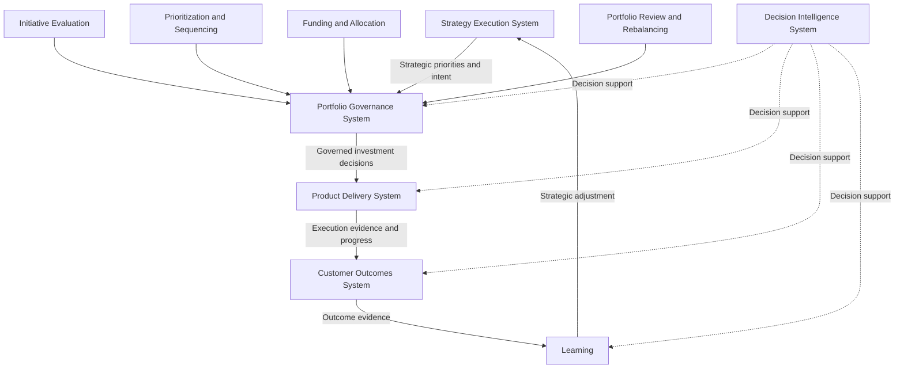
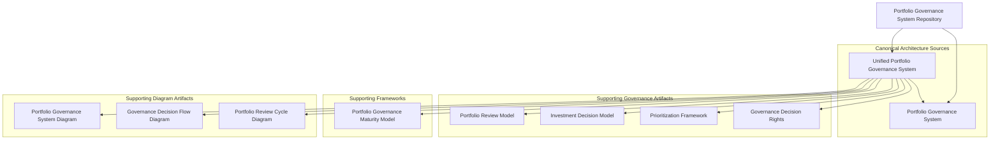

  
 
 
 

# Portfolio Governance System 

This repository documents **Pillar 3** of the **Product Leadership Operating System (PLOS)** and defines how organizations govern investment decisions through evaluation, prioritization, sequencing, funding, review, and rebalancing across the portfolio. 

Where the **Product Leadership Systems Architecture (PLSA)** defines the canonical five-system architecture, the **Portfolio Governance System** defines the system responsible for converting strategic intent into governed portfolio action. 

This repository is a navigation and orientation layer for the Pillar 3 governance library. 

It summarizes the purpose of the repository, shows how the major artifacts relate to one another, and helps readers understand how to navigate the supporting governance architecture. 

--- 

# Portfolio Governance Overview 

The **Portfolio Governance System** explains how organizations translate strategy into governed investment rather than relying on ad hoc prioritization or disconnected planning activity. 

It shows how organizations govern the movement from **strategic direction → initiative evaluation → prioritization → funding → portfolio review → rebalancing** through a disciplined governance system.

Within the broader **Product Leadership Operating System**, Pillar 3 is responsible for the system that governs investment decisions across the operating loop. 

In practical terms: **Strategy defines direction → Governance governs investment → Delivery executes work → Outcomes evaluate results → Learning informs adjustment** 

Decision Intelligence supports every stage of that loop. 

--- 

# Top-Level Portfolio Governance Diagram

---

# Repository Purpose

The purpose of this repository is to define the system through which strategic priorities become governed portfolio investment.

This repository focuses on the governance mechanisms required to:

- evaluate proposed initiatives
- prioritize competing investment options
- sequence work across portfolio constraints
- allocate funding and capacity
- govern tradeoffs and commitments
- review portfolio performance
- rebalance investments based on evidence

Taken together, these artifacts explain how organizations maintain disciplined investment governance across the broader operating system.

This repository does **not** redefine the architecture. It operates subordinate to the higher-precedence Pillar 1 architectural sources.

---

# Pillar 3 Artifact Map

---

# Core Repository Artifacts

This repository contains the core artifacts that define how organizations govern portfolio investment through evaluation, prioritization, sequencing, funding, review, and rebalancing.

## Canonical Architecture Sources

- **Unified Portfolio Governance System**  
  Defines the canonical internal architecture of the **Portfolio Governance System** and serves as the highest-precedence Pillar 3 source for governance system structure.

- **Portfolio Governance System**  
  Defines the canonical Pillar 3 governance system in repository-facing form and operates subordinate to the unified architecture source.

## Supporting Governance Artifacts

- **Portfolio Review Model**  
  Defines the recurring review structure used to assess portfolio commitments, performance, and change decisions.

- **Investment Decision Model**  
  Defines the governing logic used to evaluate, approve, defer, stage, reshape, or reject investment choices.

- **Prioritization Framework**  
  Defines the comparative logic used to rank and sequence competing portfolio investments.

- **Governance Decision Rights**  
  Defines decision authority allocation across major portfolio governance decisions.

## Supporting Frameworks

- **Portfolio Governance Maturity Model**  
  Defines the staged progression through which portfolio governance matures from fragmented governance activity to integrated and adaptive portfolio control.

## Supporting Diagram Artifacts

- **Portfolio Governance System Diagram**  
  Visualizes the structure of the **Portfolio Governance System** within the broader operating system.

- **Governance Decision Flow Diagram**  
  Visualizes the end-to-end movement of portfolio decisions through intake, evaluation, prioritization, commitment, review, and rebalance.

- **Portfolio Review Cycle Diagram**  
  Visualizes the recurring review loop used to sustain active portfolio governance over time.

---

# Repository Structure

This repository functions as an executive architecture library for **Pillar 3: Portfolio Governance System**.

Artifacts are organized into the following directories:

| Directory | Purpose |
|---|---|
| `architecture/` | Canonical governance system definitions, structural system artifacts, and foundational Pillar 3 architecture documents |
| `frameworks/` | Governance reference structures, maturity models, and supporting conceptual frameworks |
| `artifacts/` | Governance mechanisms, decision structures, prioritization artifacts, review models, and decision-rights definitions |
| `diagrams/` | Reusable visual artifacts that support interpretation of the governance system |

This structure keeps the repository navigable while preserving the distinction between canonical architecture, supporting frameworks, operating artifacts, and visual documentation.

---

# Relationship to the Product Leadership Operating System

Within the broader **Product Leadership Operating System (PLOS)**, this repository defines **Pillar 3: Portfolio Governance System**.

That distinction is essential:

- **PLOS** is the overall operating system and portfolio
- **PLSA** is the canonical systems architecture defined in Pillar 1
- **Pillar 3** defines the system responsible for governed investment and portfolio decision-making

In simple terms:

- **Strategy Execution System** defines direction
- **Portfolio Governance System** governs investment
- **Product Delivery System** executes approved work
- **Customer Outcomes System** evaluates realized results
- **Decision Intelligence System** supports decisions across the full architecture

This repository should therefore be read together with the Pillar 1 architecture repository and, where relevant, alongside Pillar 2 operating-model artifacts that explain how governance is run in practice.

---

## Outcome Input Rule

The **Portfolio Governance System** does not act directly on raw outcome signals, dashboards, or unevaluated metric movement.

Governance decisions must be informed through **structured learning** and **intervention framing** originating from the **Customer Outcomes System**.

The **Customer Outcomes System** provides:

- evaluated outcome understanding  
- identified gaps  
- learning signals  
- routed intervention inputs  

The **Portfolio Governance System** determines:

- prioritization  
- tradeoffs  
- sequencing  
- investment decisions  

> Outcomes informs governance through structured learning and framed response inputs. Governance retains decision ownership.

---

# Documentation Standard

All repositories in this portfolio follow a common architecture-documentation standard.

Key principles include:

- executive-level tone
- architecture-first framing
- canonical terminology preservation
- GitHub-compatible Mermaid diagrams
- clear distinction between canonical, supporting, derivative, and experimental artifacts
- README content that supports navigation without redefining architecture

This repository is intentionally **not**:

- a budgeting tutorial
- a project intake handbook
- a PMO process manual
- agile portfolio training content
- a blog-style governance essay

It is an executive portfolio governance architecture library within the **Product Leadership Operating System**.

---

# How To Navigate This Repository

Use this repository in the following order:

1. Start with **Unified Portfolio Governance System** for the highest-precedence Pillar 3 architecture source.
2. Then review **Portfolio Governance System** for the repository-facing canonical Pillar 3 definition.
3. Review **Investment Decision Model** and **Prioritization Framework** to understand how investment choices are evaluated and ordered.
4. Review **Governance Decision Rights** to understand how authority is distributed across governance decisions.
5. Review **Portfolio Review Model** to understand how portfolio commitments are reassessed and adjusted over time.
6. Review **Portfolio Governance Maturity Model** to understand governance capability progression.
7. Use the supporting diagram artifacts for visual orientation and cross-repository consistency.

This sequence preserves architectural precedence while improving interpretability.

---

# License

This repository is licensed under the MIT License. See the [LICENSE](LICENSE) file for details.
