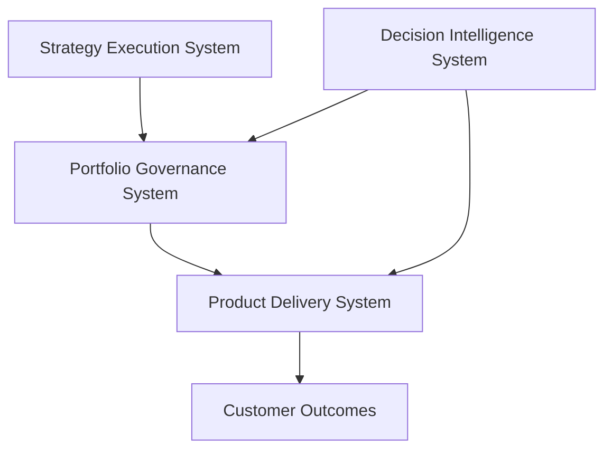

# ADR-000: Portfolio Governance System Architecture

## Status

Accepted

---

## Context

Product organizations require structured mechanisms for prioritizing investments, allocating capital, and managing portfolio risk.

Without a clear governance framework, investment decisions often become fragmented across teams, resulting in inconsistent prioritization and reduced delivery predictability.

The Portfolio Governance System provides an operating model for evaluating proposed initiatives, allocating investment capacity, and maintaining portfolio visibility.

---

## Decision

Adopt the **Portfolio Governance System** as the central operating system for product investment governance within the Product Leadership Systems Architecture (PLSA).

This system defines governance mechanisms for:

- evaluating proposed investments
- prioritizing initiatives
- allocating product and engineering capacity
- monitoring portfolio execution health

The system integrates with:

- the **Strategy Execution System**, which defines candidate initiatives
- the **Product Delivery System**, which executes funded initiatives
- the **Decision Intelligence System**, which provides analytics supporting governance decisions

---

## Architecture Model

---

## Consequences

Adopting this architecture provides:

- structured portfolio prioritization
- improved capital allocation transparency
- improved traceability from strategy to delivery
- improved executive decision support

This system forms the **governance layer of the Product Leadership Systems Architecture**.
