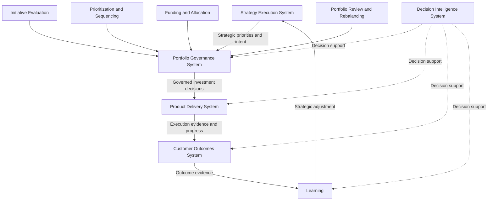
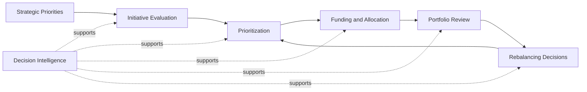

# Portfolio Governance System

The **Portfolio Governance System** defines how organizations govern investment decisions across prioritization, sequencing, funding, review, and adjustment within the **Product Leadership Operating System (PLOS)**.

Within the canonical five-system architecture, the **Portfolio Governance System** is the system responsible for converting strategic intent into governed portfolio decisions. It determines how initiatives are evaluated, how investment choices are made, how tradeoffs are managed, how resources are allocated, and how portfolio direction is adjusted over time.

Where the **Strategy Execution System** defines direction, the **Portfolio Governance System** governs how that direction becomes funded, prioritized, sequenced, and monitored across the portfolio. This artifact defines the repository-facing canonical Pillar 3 governance system and operates subordinate to the higher-precedence **Unified Portfolio Governance System**. It defines the governing logic of portfolio decision-making, but it does not redefine the broader five-system architecture.

This artifact serves as the repository-facing canonical Pillar 3 governance definition and operates subordinate to the higher-precedence **Unified Portfolio Governance System**.

---

# Purpose

The purpose of this artifact is to define the canonical governance system through which strategic priorities are translated into controlled portfolio action.

This system provides the structure required to:

- evaluate proposed investments
- prioritize competing initiatives
- allocate capacity and funding
- govern portfolio tradeoffs
- review portfolio performance
- rebalance investment based on changing evidence
- maintain decision discipline across the operating system

This artifact clarifies how organizations move from strategic direction to governed investment rather than relying on ad hoc prioritization, disconnected planning, or unstructured escalation.

---

# Diagram

---

# Diagram Interpretation

This diagram shows the role of the **Portfolio Governance System** within the broader **Product Leadership Operating System**.

The governance system sits between strategic direction and delivery execution. It does not create strategy, and it does not execute delivery. Instead, it governs how strategic intent is converted into portfolio-level investment decisions.

The incoming flow from the **Strategy Execution System** represents strategic priorities, enterprise direction, and decision intent that require portfolio translation. The governance system evaluates those priorities, compares competing demands, and determines how resources, sequencing, and funding should be applied across the portfolio.

The outgoing flow into the **Product Delivery System** represents governed investment decisions. These decisions include what will be funded, what will be deferred, what will be accelerated, what tradeoffs will be accepted, and how execution capacity will be directed.

The supporting governance components represent the core responsibilities of the system:

- **Initiative Evaluation** determines whether proposed work is sufficiently aligned, justified, and ready for governance consideration
- **Prioritization and Sequencing** determines relative order, importance, dependency handling, and timing across competing initiatives
- **Funding and Allocation** determines how resources, capital, and capacity are assigned
- **Portfolio Review and Rebalancing** determines how decisions are revisited as evidence changes over time

The **Decision Intelligence System** supports governance by supplying evidence, signals, portfolio data, performance insights, and comparative analysis needed to improve judgment quality across all major decisions.

The downstream flow through outcomes and learning reinforces that portfolio governance is not a one-time approval mechanism. It is a recurring system of review and adjustment that must respond to portfolio evidence over time.

---

# Operating Logic

The operating logic of the **Portfolio Governance System** is based on the principle that strategic intent should become governed investment through explicit decision structures rather than informal influence or unmanaged prioritization.

The system begins when strategic direction from the **Strategy Execution System** produces investment demands, initiative proposals, or portfolio choices that require evaluation. Those demands enter the governance system, where they are assessed for strategic alignment, value potential, urgency, feasibility, dependency implications, and resource impact.

Once evaluated, proposed investments move through prioritization and sequencing logic. At this stage, leadership determines relative importance, timing, tradeoffs, and portfolio order across competing initiatives. The governance system is therefore responsible not only for choosing what matters, but also for deciding what happens first, what waits, and what should not proceed at all.

Funding and allocation logic then translate those governance decisions into practical portfolio commitment. This includes assigning capital, capacity, attention, and operating support in ways consistent with strategic priorities and portfolio constraints.

Governed investments proceed into the **Product Delivery System**, where execution begins. However, governance responsibility does not end at approval. As execution progresses and outcomes emerge, portfolio evidence returns through review mechanisms that allow leadership to reassess the portfolio, rebalance commitments, intervene when assumptions fail, and adjust investment direction over time.

This means the **Portfolio Governance System** is not merely an approval gate. It is the controlled decision system through which organizations continually shape portfolio direction in response to strategy, evidence, constraints, and learning.

Throughout this cycle, the **Decision Intelligence System** improves governance quality by supplying comparative evidence, portfolio metrics, performance signals, scenario insight, and decision support across evaluation, prioritization, allocation, and rebalancing.

---

## Relationship to the Customer Outcomes System

The **Portfolio Governance System** may be informed by outcome learning, but it must not respond directly to raw metrics or unevaluated outcome signals.

Inputs from Pillar 5 should arrive as:

- structured learning  
- outcome gap framing  
- intervention inputs requiring governance consideration  

This preserves the distinction between:

- **Outcomes** → evaluation and learning generation  
- **Governance** → prioritization and tradeoff decisions

---

# Supporting Diagram

---

# Why This Matters

This artifact matters because many organizations struggle not with having too few ideas, but with lacking a disciplined system for deciding which ideas deserve investment, in what order, under what constraints, and with what degree of continuing commitment.

Without a defined governance system, portfolio decisions become inconsistent. Priorities are reset informally, resources are spread too thinly, political influence displaces disciplined judgment, and funding decisions drift away from strategic intent.

The **Portfolio Governance System** makes explicit that governed investment is a distinct system responsibility within the operating model. It shows that prioritization, sequencing, funding, and portfolio review require structured decision logic rather than periodic opinion-based planning exercises.

This matters because organizations cannot reliably translate strategy into outcomes unless investment decisions are governed with clarity, repeatability, and evidence-based adjustment.

By defining this system explicitly, the artifact helps prevent portfolio sprawl, decision ambiguity, resource fragmentation, and weak strategic follow-through across the broader **Product Leadership Operating System**.

---

# How To Use This

Use this artifact as the repository-facing canonical definition of **Pillar 3: Portfolio Governance System**, subordinate to the higher-precedence **Unified Portfolio Governance System**.

It is most useful when:

- defining how portfolio investment decisions are governed
- distinguishing governance from strategy definition and delivery execution
- aligning supporting governance artifacts to a common system model
- validating that portfolio review structures and prioritization methods serve a coherent governance system
- assessing whether portfolio decisions are disciplined, evidence-informed, and adaptable over time

This artifact should be read alongside the higher-precedence **Product Leadership Systems Architecture** artifacts and the supporting operating-model artifacts that explain how governance is run in practice.

When reusing this content in READMEs, frameworks, diagrams, or supporting materials, preserve the canonical system name and maintain the distinction between governed investment and surrounding system responsibilities.

---

# Relationship to the Product Leadership Operating System

Within the broader **Product Leadership Operating System (PLOS)**, this artifact defines **Pillar 3: Portfolio Governance System**.

Its role is to define how organizations govern investment decisions within the canonical five-system architecture established in **Pillar 1: Product Leadership Systems Architecture (PLSA)**.

That distinction must remain explicit:

- **PLOS** is the overall operating system and portfolio
- **PLSA** is the canonical systems architecture within Pillar 1
- **Pillar 3** defines the system responsible for governed investment and portfolio decision-making

In practical terms:

- **Strategy Execution System** defines direction
- **Portfolio Governance System** governs investment
- **Product Delivery System** executes approved work
- **Customer Outcomes System** evaluates realized results
- **Decision Intelligence System** supports decisions across the system

Accordingly, this artifact must remain subordinate to higher-precedence architecture sources, especially:

1. **Unified Product Leadership Systems Architecture**
2. **Product Leadership Systems Architecture Metamodel**

This artifact may define governance system logic, but it may not redefine the canonical five-system architecture, alter the operating loop, or absorb the responsibilities of adjacent systems.

---

# Summary

The **Portfolio Governance System** defines how strategic priorities are translated into governed portfolio investment through evaluation, prioritization, sequencing, funding, review, and rebalancing.

It serves as the repository-facing canonical Pillar 3 source artifact for portfolio decision-making within the **Product Leadership Operating System**, subordinate to the higher-precedence **Unified Portfolio Governance System**.

It reinforces that governed investment is a distinct system responsibility rather than an informal planning activity or a downstream delivery concern.

Used correctly, this artifact strengthens architectural clarity, improves portfolio decision discipline, and ensures that Pillar 3 remains aligned to the broader canonical operating system.

---

# License

This repository is licensed under the MIT License. See the [LICENSE](../LICENSE) file for details.
