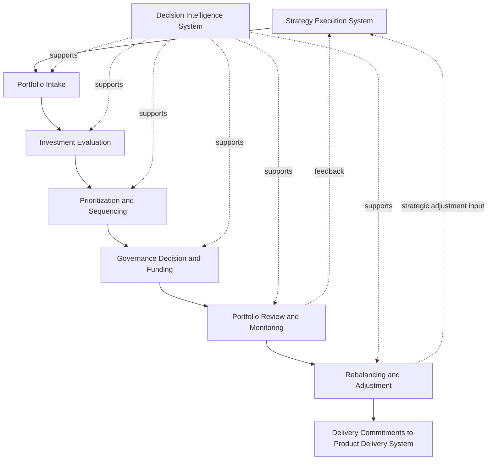
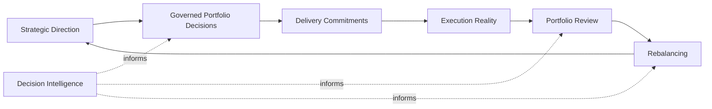

# Unified Portfolio Governance System

The **Unified Portfolio Governance System** defines the canonical governance architecture for how product organizations evaluate, prioritize, sequence, fund, review, and rebalance investments across the portfolio.

Where the **Product Leadership Systems Architecture (PLSA)** defines the five-system structure of the overall **Product Leadership Operating System (PLOS)**, this artifact defines the internal architecture of the **Portfolio Governance System** as the system responsible for governed investment decision-making between strategy and delivery.

It explains how organizations translate strategic intent into governed portfolio action through structured investment evaluation, decision rights, prioritization logic, review mechanisms, and adaptive portfolio rebalancing.

This artifact is the **canonical source** for the internal architecture of the Portfolio Governance System.

---

## Purpose

The purpose of this artifact is to define the **unified governance architecture** of the **Portfolio Governance System** within the **Product Leadership Operating System**.

It establishes the canonical model for how product organizations govern investments across a portfolio by connecting:

- strategy inputs
- initiative intake
- evaluation logic
- prioritization mechanisms
- decision authority
- funding and sequencing choices
- portfolio review structures
- reallocation and rebalance actions

This artifact exists to ensure that portfolio governance is treated as a **coherent operating system**, not as a disconnected set of review meetings, prioritization exercises, intake processes, or funding decisions.

It provides the integrated architecture that aligns all governance mechanisms into a single decision-making system.

Specifically, this artifact is intended to:

- define the scope and purpose of the Portfolio Governance System
- identify the major governance components that make up the system
- explain how those components operate together
- clarify the role of governance between strategy and product delivery
- preserve consistency across supporting governance artifacts, diagrams, and playbooks
- prevent fragmentation, duplication, or conflicting interpretations of portfolio governance across the repository

Within the operating model of PLOS, the **Portfolio Governance System** is the system that converts strategic direction into governed portfolio commitments.

It does this by creating a repeatable structure for deciding:

- which investments should move forward
- which should be deferred
- which should be accelerated
- which should be funded, resized, re-sequenced, or stopped
- how tradeoffs are resolved across the total portfolio

This artifact therefore defines the **governance backbone** that connects strategic intent to coordinated delivery execution.

---

## Diagram

---

## Diagram Interpretation

The diagram illustrates the internal operating flow of the **Portfolio Governance System** as the mechanism that converts strategic direction into governed portfolio commitments.

The flow begins with the **Strategy Execution System**, which provides the strategic context, enterprise priorities, objectives, and directional constraints that shape portfolio investment decisions. Those inputs enter the governance system through **Portfolio Intake**, where investment proposals, initiatives, opportunities, and change requests are introduced into the portfolio decision structure.

From intake, proposals move into **Investment Evaluation**, where opportunities are assessed using defined governance criteria such as strategic alignment, expected value, feasibility, risk, urgency, dependency impact, capacity implications, and decision readiness. Evaluation creates a structured basis for comparing potential investments rather than relying on ad hoc advocacy or organizational politics.

Once evaluated, initiatives move into **Prioritization and Sequencing**, where governance determines relative importance, timing, ordering, and portfolio fit. This is the point at which tradeoffs become explicit across competing demands, finite resources, strategic themes, and operational constraints.

Those prioritization outputs inform **Governance Decision and Funding**, where authorized decision-makers determine whether initiatives should be approved, deferred, resized, staged, rejected, funded, or otherwise conditioned before commitment. This stage formalizes decision rights and converts analysis into portfolio action.

Approved investments then enter **Portfolio Review and Monitoring**, where the active portfolio is periodically assessed to determine whether investments remain aligned, viable, properly sequenced, and worthy of continued support. Review ensures governance does not end at approval, but continues throughout the life of portfolio commitments.

Review outcomes feed **Rebalancing and Adjustment**, where leaders may change priorities, reallocate funding, adjust sequencing, stop underperforming work, introduce new constraints, or reweight portfolio emphasis based on new information.

The final output of the governance system is **Delivery Commitments to the Product Delivery System**. This makes clear that governance is the controlled bridge between strategic intent and execution commitment. Delivery should receive governed commitments rather than raw demand.

The diagram also shows that the **Decision Intelligence System** supports every stage of governance. It does not replace governance judgment, but improves governance quality by supplying the signals, data, evidence, and analytical support needed for better portfolio decisions.

Finally, the feedback paths from **Portfolio Review and Monitoring** and **Rebalancing and Adjustment** back to the **Strategy Execution System** show that governance is not a one-way approval process. It is part of a broader adaptive operating loop in which portfolio learning informs future strategic refinement.

---

## Outcome Interface Rule

The **Portfolio Governance System** does not act directly on raw signals or dashboards.

All outcome-driven inputs must be routed through the **Customer Outcomes System** as:

- structured learning  
- evaluated outcomes  
- framed intervention inputs  

This ensures governance decisions are based on evaluated reality rather than unprocessed signal movement.

---

## Operating Logic

The **Portfolio Governance System** operates as the disciplined decision layer between strategic direction and delivery execution.

Its core logic is that strategy alone does not determine delivery, and demand alone should not determine investment. Between those two, organizations require a structured governance system capable of evaluating opportunities, resolving tradeoffs, assigning authority, sequencing work, reviewing active commitments, and adapting the portfolio as conditions change.

This system begins with the intake of potential investments. Intake ensures that portfolio demand is made visible, structured, and governable rather than emerging through informal escalation, executive preference, or uncoordinated local prioritization.

Once visible, proposed investments must be evaluated. Evaluation is necessary because portfolio decisions are comparative. Governance does not decide whether a proposal is good in isolation, but whether it is more or less valuable, urgent, feasible, strategic, and viable relative to other possible uses of constrained organizational capacity.

Prioritization and sequencing then convert evaluation into portfolio structure. This is where governance determines not only what matters, but when it should happen, under what conditions, and with what relative precedence. Sequencing matters because organizations do not execute investments in a vacuum. They operate within real capacity, dependency, and timing constraints.

Governance decision-making formalizes commitment. At this stage, authorized leaders or forums determine whether evaluated and prioritized opportunities should become active portfolio investments. This includes not only go or no-go decisions, but also partial approval, staged funding, conditional release, deferment, resizing, and termination.

Once decisions have been made, governance remains active through ongoing review. Portfolio governance is not complete at the moment of approval. Because strategy evolves, evidence changes, delivery realities shift, and outcomes become clearer over time, governance must periodically reassess whether existing commitments still deserve priority, funding, and support.

That reassessment enables portfolio rebalancing. Rebalancing is the adaptive capability of the system: the ability to reallocate attention and resources, change sequencing, modify commitments, stop low-value work, and introduce new investments without collapsing into reactive chaos.

The operating logic of the system therefore depends on five principles:

1. **Governance is comparative.** Investments are judged relative to alternative uses of finite capacity.
2. **Governance is continuous.** It does not end at intake or approval, but persists through review and rebalance.
3. **Governance is authoritative.** Decision rights must be explicit, not implied.
4. **Governance is evidence-informed.** Decision Intelligence strengthens portfolio judgment at every stage.
5. **Governance is adaptive.** The portfolio must be rebalanced as conditions, learning, and strategy evolve.

Within the full **Product Leadership Operating System**, this means the Portfolio Governance System performs the essential function of turning strategic intent into disciplined investment commitments that delivery can execute and outcomes can later validate.

---

## Supporting Diagram

---

## Why This Matters

Portfolio governance is one of the most commonly fragmented parts of modern product organizations.

In many organizations, intake exists without disciplined evaluation. Evaluation exists without clear decision rights. Prioritization exists without review. Review exists without rebalancing authority. Funding decisions occur separately from sequencing decisions. Delivery absorbs demand that was never properly governed. Strategy sets direction but lacks a reliable mechanism for converting intent into managed portfolio commitments.

The result is predictable: too many initiatives, weak tradeoff discipline, hidden political prioritization, low confidence in decision quality, poor sequencing, overcommitment, execution thrash, and weak linkage between strategy and delivery.

The **Unified Portfolio Governance System** matters because it prevents governance from becoming a collection of disconnected practices. It defines portfolio governance as an integrated operating system with clear internal logic and clear interfaces to the broader product leadership architecture.

This artifact matters for five reasons.

First, it creates consistency. Supporting governance artifacts such as decision rights, prioritization frameworks, review models, and maturity models can only remain coherent if they anchor to a shared canonical governance architecture.

Second, it improves decision quality. When intake, evaluation, prioritization, sequencing, authority, review, and rebalancing are treated as part of one system, organizations make better investment decisions and can explain those decisions more clearly.

Third, it improves execution quality. Delivery teams are more effective when they receive governed commitments instead of unstable, weakly justified, or politically driven demand.

Fourth, it improves strategic adaptability. A portfolio can only be adjusted intelligently if governance includes review and rebalance mechanisms, not just front-end approval structures.

Fifth, it strengthens architectural integrity across the **Product Leadership Operating System**. Without a canonical governance architecture, the connection between strategy and delivery becomes unstable, and the operating system loses coherence.

---

## How To Use This

This artifact should be used as the **canonical reference** for understanding and maintaining the **Portfolio Governance System** within the **Product Leadership Operating System**.

It is intended to be used in five primary ways.

First, it should be used as the **anchor artifact** for all governance-related documentation in the repository. Supporting artifacts such as decision-rights models, investment decision structures, prioritization frameworks, review models, and governance diagrams should align to this document rather than redefining the system independently.

Second, it should be used as a **classification reference** when creating or reviewing governance artifacts. Before adding new content, the maintainer should determine whether the proposed artifact belongs to intake, evaluation, prioritization, decision authority, review, rebalancing, or a related supporting function. This helps prevent duplication and keeps the repository structurally disciplined.

Third, it should be used as a **consistency validator** during signoff review. If a supporting artifact introduces terminology, stages, flows, or governance logic that conflict with this unified model, that inconsistency should be corrected before approval.

Fourth, it should be used as a **navigation aid** for readers who need to understand how portfolio governance works as a system rather than as an isolated practice. It provides the conceptual map required to interpret more detailed governance documents correctly.

Fifth, it should be used as a **boundary definition** for the Portfolio Governance System’s role within the overall operating system. It clarifies that governance is neither strategy itself nor delivery itself, but the governed investment system that connects the two.

In practice, this artifact should be consulted whenever:
- a new governance document is proposed
- a governance README is updated
- a diagram is created or revised
- a prioritization or funding model is defined
- decision rights are being clarified
- the relationship between strategy and delivery needs explanation
- signoff requires confirmation of canonical governance alignment

---

## Relationship to the Operating System

The **Unified Portfolio Governance System** is a pillar-level architecture artifact within the broader **Product Leadership Operating System (PLOS)**.

At the highest level, PLOS describes how product organizations operate through the recurring loop of:

**Strategy → Governance → Delivery → Outcomes → Learning → Strategy**

Within that operating loop, the **Portfolio Governance System** is the system responsible for converting strategy into governed investment commitments.

Its upstream dependency is the **Strategy Execution System**, which supplies the strategic direction, objectives, themes, and prioritization context that shape investment choices.

Its downstream dependency is the **Product Delivery System**, which receives approved and sequenced commitments for execution.

Its effectiveness is further shaped by information from the **Customer Outcomes System**, since governance quality improves when investment decisions are later informed by evidence about actual customer and business outcomes.

Across all of these systems, the **Decision Intelligence System** provides enabling support by improving visibility, evidence quality, comparability, and decision confidence.

This artifact should therefore be understood as the canonical internal architecture of one of the five core systems defined by the **Product Leadership Systems Architecture (PLSA)**.

It does not redefine the overall operating system, and it does not replace the broader canonical architecture. Instead, it explains the internal structure of the governance system in a way that remains fully aligned to the five-system model.

This distinction matters.

- **PLOS** is the overall operating system and portfolio.
- **PLSA** is the canonical architecture of that operating system.
- The **Unified Portfolio Governance System** is the canonical internal architecture of Pillar 3 within that larger structure.

It should always be maintained in a way that preserves those distinctions.

---

## Summary

The **Unified Portfolio Governance System** defines the canonical governance architecture for how product organizations evaluate, prioritize, sequence, fund, review, and rebalance investments across the portfolio.

It establishes portfolio governance as a coherent operating system rather than a loose collection of intake processes, prioritization exercises, funding decisions, and review meetings.

By connecting strategy inputs, initiative intake, evaluation logic, prioritization and sequencing, decision authority, funding logic, portfolio review, and adaptive rebalancing, this artifact defines how governed portfolio commitments are created, maintained, and adjusted before and during delivery execution.

It also clarifies the role of the **Decision Intelligence System** as a cross-cutting support layer that improves governance quality without changing governance authority.

Within the broader **Product Leadership Operating System**, this artifact serves as the canonical source for the internal architecture of the **Portfolio Governance System** and provides the reference point to which all supporting governance artifacts should align.

Its purpose is both explanatory and architectural: to preserve consistency, reduce fragmentation, strengthen decision discipline, and maintain coherence between strategy, governance, and delivery across the portfolio.

---

## License

This repository is licensed under the MIT License. See [LICENSE](LICENSE) for full terms.
