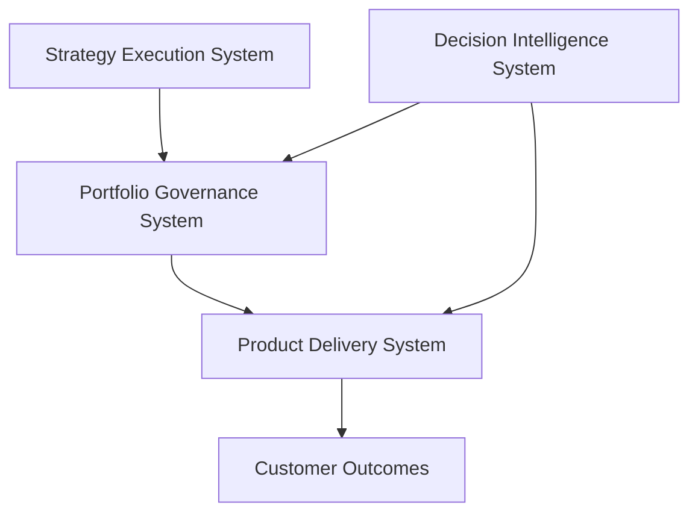

# Portfolio Governance System Architecture

The Portfolio Governance System provides the operating framework used to evaluate investments, prioritize initiatives, and maintain visibility across the product portfolio.

This system connects enterprise strategy with product delivery by establishing structured decision processes for allocating resources and managing portfolio risk.

---

## Role in the Product Leadership Systems Architecture

Within the Product Leadership Systems Architecture (PLSA), the Portfolio Governance System sits between strategy definition and delivery execution.

The system translates strategic initiatives into prioritized investments and ensures that funded initiatives are executed with appropriate governance oversight.

---

## Core Architecture Components

The Portfolio Governance System consists of several interacting components.

### Portfolio Evaluation Frameworks

Frameworks used to evaluate and prioritize investment opportunities.

Examples include:

- portfolio scoring models
- capital allocation models
- risk evaluation models
- scenario modeling approaches

These frameworks provide structured criteria for comparing competing investments.

---

### Governance Processes

Governance processes define how decisions are made and how portfolio oversight is maintained.

Examples include:

- stage-gate investment governance
- portfolio review cadence
- executive decision authorities
- initiative escalation processes

---

### Governance Artifacts

Governance artifacts are documents used during investment evaluation and decision making.

Examples include:

- investment memos
- decision logs
- portfolio review materials

These artifacts ensure that portfolio decisions are documented and transparent.

---

### Portfolio Visualization

Visualization tools help leadership understand portfolio health and investment tradeoffs.

Examples include:

- portfolio heatmaps
- delivery predictability dashboards
- investment distribution charts

These visualizations allow leaders to quickly identify delivery risk and investment imbalance.

---

## Governance Flow

The governance system typically follows a structured decision flow.

1. Strategy Execution Systems define candidate initiatives.

2. Portfolio Governance evaluates those initiatives using scoring frameworks and governance processes.

3. Leadership allocates investment capacity to prioritized initiatives.

4. Product Delivery Systems execute funded initiatives.

5. Decision Intelligence Systems provide analytics supporting governance decisions.

This flow ensures traceability from enterprise strategy to delivered outcomes.

---

## Relationship to Other Systems

The Portfolio Governance System operates as part of the broader Product Leadership Systems Architecture.

| System | Role |
|---|---|
Strategy Execution System | Defines strategic initiatives and candidate investments |
Product Delivery System | Executes funded initiatives |
Decision Intelligence System | Provides analytics and AI-assisted insights supporting governance decisions |

Together these systems connect strategy, governance, delivery, and decision intelligence into a unified product operating model.
