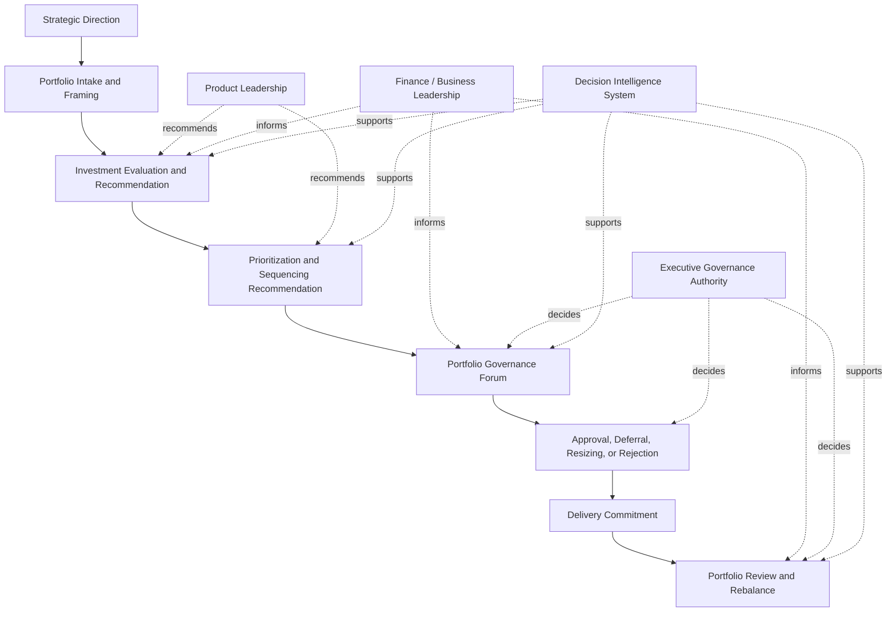
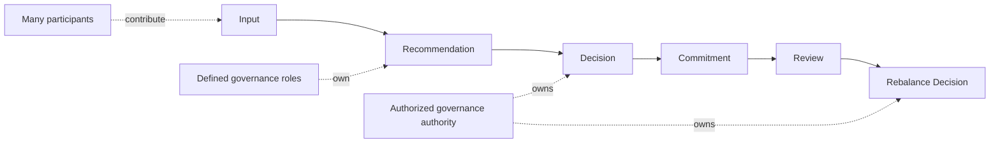

# Governance Decision Rights

The **Governance Decision Rights** artifact defines the canonical allocation of decision authority within the **Portfolio Governance System**.

Where the **Unified Portfolio Governance System** defines the internal architecture of portfolio governance as a whole, this artifact defines **who holds authority to make which categories of portfolio decisions, under what conditions, and with what governance intent**.

It explains how decision rights are distributed across leadership roles and governance forums so that portfolio decisions are made explicitly, consistently, and with clear accountability rather than through informal influence, implicit hierarchy, or organizational ambiguity.

This artifact is a **canonical supporting governance artifact** within Pillar 3 of the **Product Leadership Operating System (PLOS)**.

---

## Purpose

The purpose of this artifact is to define the **decision-rights model** of the **Portfolio Governance System**.

Within a governed portfolio, strong evaluation and prioritization logic are not sufficient by themselves. Organizations also need explicit authority structures that determine:

- who can approve investments
- who can recommend investments
- who can challenge assumptions
- who can defer, resize, or stop work
- who can commit delivery capacity
- who can authorize funding shifts
- who can resolve tradeoffs across competing investments
- who can trigger portfolio review and rebalance actions

Without defined decision rights, governance becomes inconsistent. Decisions drift toward escalation, executive preference, role ambiguity, or hidden power structures. The result is not simply slower governance, but weaker governance.

This artifact exists to ensure that the **Portfolio Governance System** includes an explicit authority model rather than relying on assumed organizational norms.

Specifically, this artifact is intended to:

- define the major categories of portfolio governance decisions
- assign clear decision ownership to appropriate governance roles or forums
- distinguish between recommendation authority and approval authority
- distinguish between operating input and decision accountability
- prevent duplication, conflict, and ambiguity across governance mechanisms
- support consistency across investment models, prioritization frameworks, review models, and governance diagrams

Within the broader operating model, this artifact clarifies that **governance quality depends not only on good logic, but on clear authority**.

---

## Diagram

---

## Diagram Interpretation

The diagram shows how decision authority operates within the **Portfolio Governance System** from strategic context through portfolio commitment and ongoing rebalance.

The flow begins with **Strategic Direction**, which defines the context in which portfolio decisions must be made. Strategy establishes objectives, themes, constraints, and decision boundaries, but it does not itself constitute portfolio approval authority.

Potential investments then move into **Portfolio Intake and Framing**, where proposals are shaped into a governable form. At this stage, the organization determines whether an item is sufficiently structured to enter the governance process. Intake is therefore an entry point into governance, not a commitment point.

From there, initiatives move into **Investment Evaluation and Recommendation**. This is where product leadership and other informed contributors assess the proposal using evidence, strategic alignment, risk, feasibility, expected value, and dependency considerations. The output of this stage is a recommendation rather than a binding decision.

That recommendation feeds **Prioritization and Sequencing Recommendation**, where proposals are compared against one another and positioned relative to competing investments. This stage determines proposed ordering, timing, and relative importance across the portfolio. It remains recommendatory in nature and does not, by itself, authorize execution.

Recommendations then move into the **Portfolio Governance Forum**, which is the structured decision point where formal governance authority is exercised. This forum exists to convert analysis and recommendations into explicit portfolio decisions rather than to simply review information or discuss preferences.

The decision stage produces one of several outcomes: **Approval, Deferral, Resizing, or Rejection**. This makes clear that governance authority is broader than simple approval. Decision-makers may modify investment scope, condition a commitment, delay progression, or deny progression entirely.

Once approved, work becomes a **Delivery Commitment**. This transition is important because it marks the point at which a portfolio decision becomes an execution obligation for the **Product Delivery System**. Delivery should receive governed commitments rather than unofficial requests or implied priorities.

After commitment, work enters **Portfolio Review and Rebalance**, where governance authority continues through the life of the investment. Review makes it possible to confirm continuation, intervene, resequence, resize, pause, or stop work as portfolio conditions evolve.

The role labels in the diagram clarify the distinction between governance participants and governance authority:
- **Product Leadership** contributes structured recommendations.
- **Finance / Business Leadership** provides input relevant to economics, enterprise tradeoffs, and commercial impact.
- **Executive Governance Authority** holds formal approval and rebalance rights.
- The **Decision Intelligence System** supports each governance stage by improving the quality of information available to decision-makers.

The central point of the diagram is that governance works only when the organization clearly separates **input**, **recommendation**, and **decision authority**.

---

## Operating Logic

The operating logic of governance decision rights is based on a simple rule: **portfolio decisions must be made by explicitly authorized actors through structured governance mechanisms**.

In many organizations, decision authority is assumed rather than designed. Product leaders may believe they own prioritization, executives may intervene episodically, finance may assume veto power through budget control, and delivery leaders may accept work before governance has formally committed the portfolio. This creates ambiguity about both accountability and decision validity.

The **Governance Decision Rights** model prevents that ambiguity by separating governance participation into distinct layers of authority.

The first layer is **input authority**. Many participants contribute to governance by supplying analysis, constraints, tradeoff perspectives, customer considerations, technical realities, financial implications, and dependency awareness. Their role is essential to decision quality, but contribution does not equal decision ownership.

The second layer is **recommendation authority**. Certain roles or forums are responsible for synthesizing inputs into a proposed direction. Recommendation authority creates a structured point of view about what should happen, in what order, and under what conditions. It strengthens governance by turning broad input into decision-ready options.

The third layer is **decision authority**. This is the formal right to approve, defer, resize, stage, reject, pause, stop, or rebalance portfolio commitments. Decision authority must be explicit because it determines which portfolio outcomes are binding on the organization.

The fourth layer is **commitment authority**. Once a governance decision has been made, the organization must convert that decision into an execution commitment. This means delivery capacity, sequencing, and expectations should align to governed commitments rather than bypass governance through informal escalation.

The model also assumes that decision rights recur across multiple governance categories, not just at the initial approval point. These include:
1. **Intake qualification**
2. **Evaluation readiness**
3. **Priority and sequencing recommendation**
4. **Funding and commitment approval**
5. **Conditional progression**
6. **Review continuation or intervention**
7. **Rebalance action**

This operating logic matters because governance failure often occurs when these categories blur together. If recommendation is mistaken for approval, teams act too early. If input is mistaken for authority, decisions become political. If no one clearly owns rebalance rights, the active portfolio becomes resistant to change even when evidence shifts.

The structural purpose of this artifact is therefore to ensure that governance authority remains visible, differentiated, and enforceable across the full portfolio lifecycle.

In this model:
- many people may inform a decision,
- fewer people may recommend a direction,
- and only explicitly authorized actors may bind the portfolio.

That distinction is what allows governance to remain disciplined, accountable, and adaptive rather than informal, reversible, or personality-driven.

---

## Supporting Diagram

---

## Why This Matters

Decision rights are one of the most important and least well-defined elements of portfolio governance.

Many organizations believe they have governance when in reality they only have meetings, opinions, and escalation paths. Proposals are discussed, priorities are debated, and investments are announced, but the authority structure behind those actions remains unclear. As a result, decisions become slow, reversible, political, or implicitly owned by the loudest or most senior participant in the room.

This artifact matters because portfolio governance cannot function reliably without explicit decision rights.

First, it creates accountability. When authority is defined, leaders know which decisions they are responsible for making and defending.

Second, it reduces ambiguity. Teams can distinguish between recommendation, consultation, and binding approval.

Third, it improves decision quality. Clear authority makes it easier to structure forums, inputs, and evidence around the actual decisions that need to be made.

Fourth, it protects delivery. Delivery organizations are less likely to absorb unstable or unofficial commitments when governance authority is explicit.

Fifth, it enables rebalance. A portfolio cannot be adaptively managed unless someone clearly holds the authority to change active commitments.

Without decision rights, governance appears to exist but does not reliably govern. This artifact prevents that failure mode by making authority an explicit part of the operating system.

---

## How To Use This

This artifact should be used as the canonical reference for **decision authority within the Portfolio Governance System**.

It should be used in five primary ways.

First, it should be used to define the authority structure behind portfolio review forums, investment councils, prioritization meetings, and executive governance bodies.

Second, it should be used to distinguish clearly between roles that provide input and roles that make decisions.

Third, it should be used as a validation tool when reviewing governance documents, diagrams, and operating models. If a governance mechanism implies authority without defining it, this artifact should be used to correct that ambiguity.

Fourth, it should be used to align supporting artifacts such as the **Investment Decision Model**, **Portfolio Review Model**, and **Prioritization Framework** so that each reflects the same underlying authority structure.

Fifth, it should be used during signoff review to confirm that governance logic is backed by clear decision ownership rather than implied hierarchy or informal escalation.

In practice, this artifact should be consulted whenever:
- a governance forum is being defined
- portfolio approval logic is being documented
- rebalancing authority is being clarified
- prioritization rights are being described
- delivery commitment authority is being discussed
- signoff requires confirmation of explicit governance accountability

---

## Relationship to the Operating System

The **Governance Decision Rights** artifact is a canonical supporting artifact within Pillar 3 of the **Product Leadership Operating System (PLOS)**.

Within the overall operating loop of:

**Strategy → Governance → Delivery → Outcomes → Learning → Strategy**

this artifact clarifies the authority logic inside the **Governance** stage.

Its parent architecture is the **Unified Portfolio Governance System**, which defines the internal structure of intake, evaluation, prioritization, decision, review, and rebalance across the portfolio. This artifact does not replace that architecture. Instead, it specifies who holds authority within that architecture.

Its upstream dependency is the **Strategy Execution System**, which shapes the decision context but does not by itself define governance authority.

Its downstream relationship is to the **Product Delivery System**, which depends on explicit governance decisions before commitments should be treated as active delivery obligations.

Its cross-system relevance also touches the **Customer Outcomes System**, because governance decisions should later be revisited in light of real outcome evidence.

Across all of these interactions, the **Decision Intelligence System** strengthens but does not own governance authority. It informs decision quality, not decision rights.

This artifact should therefore be maintained as a supporting governance-control document aligned to the canonical five-system model and subordinate to the higher-order unified governance architecture.

---

## Summary

The **Governance Decision Rights** artifact defines who has the authority to recommend, approve, modify, review, and rebalance portfolio investments within the **Portfolio Governance System**.

It establishes that governance depends not only on evaluation and prioritization logic, but on explicit authority structures that distinguish input, recommendation, decision, commitment, and rebalance rights.

By clarifying where authority sits and how it should operate, this artifact strengthens accountability, reduces ambiguity, improves portfolio discipline, and protects delivery from unofficial or unstable commitments.

Within the broader **Product Leadership Operating System**, it serves as the canonical supporting artifact for decision authority inside the governance system and provides a reference point for all related governance mechanisms and supporting documents.

---

## License

This repository is licensed under the MIT License. See [LICENSE](LICENSE) for full terms.
