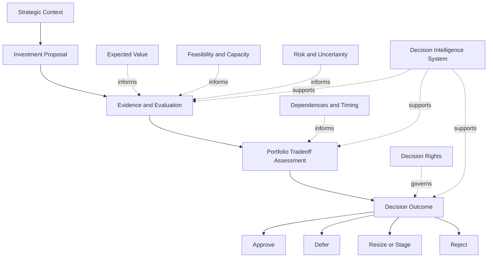
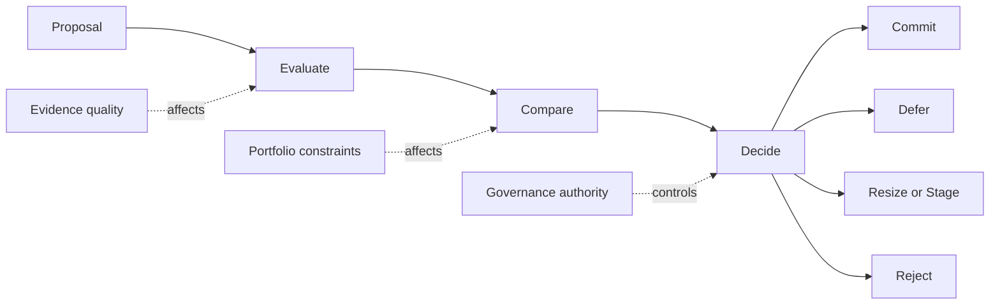

# Investment Decision Model

The **Investment Decision Model** defines the canonical decision structure used by the **Portfolio Governance System** to determine whether proposed investments should be approved, deferred, resized, staged, or rejected.

Where the **Unified Portfolio Governance System** defines the internal architecture of portfolio governance as a whole, and **Governance Decision Rights** defines who holds authority within that system, this artifact defines **how portfolio investment decisions are made in a structured, repeatable, and governable way**.

It explains the decision logic through which strategic intent, evidence, expected value, feasibility, risk, sequencing constraints, and portfolio tradeoffs are converted into explicit investment outcomes.

This artifact is a **canonical supporting governance artifact** within Pillar 3 of the **Product Leadership Operating System (PLOS)**.

---

## Purpose

The purpose of this artifact is to define the **decision model** used by the **Portfolio Governance System** to evaluate and determine portfolio investment outcomes.

In a governed portfolio, investment decisions cannot rely on enthusiasm, local advocacy, executive preference, or isolated business cases alone. Organizations require a structured model that determines how investment proposals are assessed, compared, challenged, and ultimately decided.

This artifact exists to provide that model.

It defines the logic by which the organization decides:

- whether an investment should move forward
- whether it should be deferred
- whether it should be resized or staged
- whether it should be rejected
- whether conditions must be met before further commitment
- how competing investments should be weighed against one another
- how uncertainty, risk, and evidence quality should affect decision confidence

This artifact is intended to:

- define the major decision dimensions used in portfolio investment governance
- clarify how those dimensions combine into a decision structure
- distinguish evaluation inputs from final decision outcomes
- support consistency across governance forums and investment reviews
- reduce ad hoc or personality-driven investment decisions
- strengthen comparability across competing portfolio choices

Within the broader operating model, this artifact clarifies that **good governance requires not only decision authority, but a repeatable decision method**.

---

## Diagram

---

## Diagram Interpretation

The diagram shows the operating flow of the **Investment Decision Model** within the **Portfolio Governance System**.

The process begins with **Strategic Context**, which defines the broader conditions under which an investment should be considered. Strategy establishes priorities, themes, constraints, and directional intent, but does not itself decide which individual proposals should be committed.

Potential investments enter the model as an **Investment Proposal**. This proposal may represent a new initiative, a material expansion of existing work, a major portfolio tradeoff decision, or a request for additional commitment. The proposal is the object of decision, not the decision itself.

From there, the proposal moves into **Evidence and Evaluation**. This stage assembles the core decision inputs required to assess whether the proposal is strong enough to justify action. These inputs include expected value, feasibility, capacity implications, risk, uncertainty, and other evidence necessary to evaluate the investment on a comparative basis.

The model then moves into **Portfolio Tradeoff Assessment**, where the proposal is considered in relation to competing demands, sequencing realities, dependency constraints, timing implications, and the portfolio’s current composition. This is a critical step because investments are not decided in isolation. Governance must determine whether the proposal is the right use of constrained organizational attention and capacity relative to alternatives.

The outputs of evaluation and tradeoff assessment flow into **Decision Outcome**, which is governed by explicit decision rights rather than implied preference or informal influence.

The model identifies four primary decision outcomes:

- **Approve** — the proposal is authorized to move forward as an active portfolio commitment.
- **Defer** — the proposal is not approved now, but remains viable for later reconsideration.
- **Resize or Stage** — the proposal is modified, narrowed, phased, or conditioned before full commitment.
- **Reject** — the proposal is not approved to proceed.

The supporting input nodes clarify that:
- **Expected Value** informs the quality and importance of the opportunity.
- **Feasibility and Capacity** inform whether the organization can realistically execute it.
- **Risk and Uncertainty** influence confidence and decision conditions.
- **Dependencies and Timing** affect whether the proposal fits the current portfolio sequence.
- **Decision Rights** govern who may determine the final outcome.
- The **Decision Intelligence System** improves the quality of evidence and comparison throughout the process.

The central architectural point is that an investment decision should be based on **structured evaluation plus portfolio tradeoff logic plus explicit authority**, not on raw demand alone.

---

## Operating Logic

The operating logic of the **Investment Decision Model** is that portfolio decisions must be made through a repeatable sequence of evaluation, comparison, and governed outcome selection.

Organizations often mistake investment decisions for approvals of individual proposals. In reality, an investment decision is a comparative portfolio judgment. The question is not simply whether a proposal is attractive on its own terms, but whether it is the best use of constrained organizational capacity when compared with other possible commitments.

The model begins by framing the proposal in strategic context. This matters because no investment should be assessed independently of the direction the organization is trying to pursue. Strategic context defines the relevance of the opportunity and the boundaries within which it should be judged.

Once framed, the proposal must be evaluated using evidence. Evidence does not guarantee certainty, but it improves decision quality by making assumptions visible and by enabling structured comparison. This includes expected value, customer or business impact, feasibility, capacity requirements, risk exposure, dependency implications, and the level of confidence that decision-makers should place in the proposal.

Evaluation alone, however, is not sufficient. A proposal may appear attractive and still be the wrong investment because it conflicts with existing commitments, arrives at the wrong time, depends on unavailable capacity, introduces excessive concentration risk, or displaces a stronger opportunity. For this reason, the model requires explicit portfolio tradeoff assessment before a decision is made.

Only after evaluation and tradeoff assessment should the proposal move into formal decision-making. At this point, authorized governance actors apply the decision model to determine which of four outcomes is appropriate.

**Approve** is appropriate when the proposal demonstrates sufficient strategic relevance, evidence strength, portfolio value, feasibility, and timing fit to justify commitment.

**Defer** is appropriate when the proposal may have merit, but is not the right commitment under current portfolio conditions. Deferral preserves optionality without creating premature obligation.

**Resize or Stage** is appropriate when the opportunity is directionally valid but should not be committed in its full proposed form. This allows governance to reduce risk, phase exposure, test assumptions, or align the investment more realistically with available capacity and sequencing constraints.

**Reject** is appropriate when the proposal does not justify portfolio commitment, either because its value is insufficient, its timing is poor, its risk is too high, its feasibility is weak, or its fit relative to other investments is not strong enough.

This model also assumes that decisions may be conditional. A proposal may advance only if further evidence is produced, dependencies are resolved, or predefined thresholds are met. This allows governance to preserve rigor without forcing false binary choices too early.

The operating logic therefore depends on five principles:

1. **Investment decisions are comparative.** Proposals must be judged relative to alternative uses of capacity.
2. **Investment decisions are evidence-informed.** Confidence should rise or fall with the quality of the supporting case.
3. **Investment decisions are portfolio-dependent.** Timing, sequencing, and tradeoffs matter.
4. **Investment decisions are governed.** Final outcomes must be determined through explicit authority.
5. **Investment decisions may be conditional.** Staging and resizing are valid governance outcomes, not signs of indecision.

Within the broader operating system, this model ensures that portfolio governance remains disciplined, explainable, and aligned to strategy rather than reactive, inconsistent, or personality-driven.

---

## Supporting Diagram

---

## Why This Matters

Investment decisions sit at the center of portfolio governance.

If those decisions are made inconsistently, every downstream part of the operating system becomes unstable. Strategy loses credibility because priorities do not translate into disciplined commitments. Delivery loses focus because work enters execution without sufficient governance. Portfolio reviews lose force because earlier decisions were not made through a clear model in the first place.

This artifact matters because it prevents investment decision-making from becoming ad hoc.

First, it creates comparability. Proposals can be judged against shared decision dimensions rather than against whichever narrative is most persuasive in the moment.

Second, it improves governance quality. Decision-makers can distinguish between strong opportunities, weak opportunities, mistimed opportunities, and opportunities that require staged commitment.

Third, it protects the portfolio from false precision. Not all decisions should be binary. The presence of defer and resize-or-stage outcomes allows governance to act with discipline even when uncertainty remains.

Fourth, it strengthens accountability. Decisions can be explained in terms of evidence, tradeoffs, timing, and explicit governance logic rather than personality or influence.

Fifth, it increases portfolio adaptability. The organization can make more nuanced commitments without losing control of sequencing, capacity, or risk exposure.

Without a decision model, governance forums often devolve into debate without structure. This artifact prevents that failure mode by giving the portfolio a repeatable way to turn proposals into governed outcomes.

---

## How To Use This

This artifact should be used as the canonical reference for **how investment decisions are structured within the Portfolio Governance System**.

It should be used in five primary ways.

First, it should be used to define the logic applied within portfolio investment reviews, approval forums, and governance checkpoints.

Second, it should be used to align proposal evaluation practices so that evidence, value, feasibility, risk, and tradeoffs are considered in a consistent way.

Third, it should be used to distinguish clearly between evaluation inputs and decision outcomes. Strong analysis should inform the decision, but should not be mistaken for the decision itself.

Fourth, it should be used to align supporting governance artifacts such as **Governance Decision Rights**, **Portfolio Review Model**, and **Prioritization Framework** so that all portfolio decision mechanisms operate from the same underlying model.

Fifth, it should be used during signoff review to confirm that portfolio decisions are being framed as governed outcomes rather than informal approvals or reactive executive choices.

In practice, this artifact should be consulted whenever:
- an investment approval process is being designed
- portfolio review logic is being documented
- decision outcomes are being standardized
- staged funding or conditional progression is being defined
- governance criteria are being clarified
- signoff requires confirmation of decision-model consistency

---

## Relationship to the Operating System

The **Investment Decision Model** is a canonical supporting artifact within Pillar 3 of the **Product Leadership Operating System (PLOS)**.

Within the overall operating loop of:

**Strategy → Governance → Delivery → Outcomes → Learning → Strategy**

this artifact defines the decision logic used inside the **Governance** stage to convert proposals into governed portfolio outcomes.

Its parent architecture is the **Unified Portfolio Governance System**, which defines the full internal structure of intake, evaluation, prioritization, decision, review, and rebalance. This artifact does not replace that architecture. Instead, it defines the model by which specific investment decisions are made within it.

Its authority relationship is governed by **Governance Decision Rights**, which defines who may apply this model and determine final decision outcomes.

Its upstream dependency is the **Strategy Execution System**, which provides the strategic context against which investment relevance is judged.

Its downstream relationship is to the **Product Delivery System**, which should receive only those commitments that have passed through governed investment decision logic.

Its cross-system relevance also extends to the **Customer Outcomes System**, since the quality of investment decisions should later be evaluated against actual customer and business results.

Across all of these interactions, the **Decision Intelligence System** strengthens the evidence base, improves comparability, and increases decision confidence, but does not itself determine decision outcomes.

This artifact should therefore be maintained as a supporting governance-control document aligned to the canonical five-system model and subordinate to the higher-order unified governance architecture.

---

## Summary

The **Investment Decision Model** defines the canonical structure used by the **Portfolio Governance System** to determine whether investments should be approved, deferred, resized, staged, or rejected.

It establishes that investment decisions must be based on structured evaluation, portfolio tradeoff assessment, and explicit decision authority rather than on raw demand, isolated business cases, or informal executive preference.

By clarifying how proposals move from strategic context through evidence, comparison, and decision outcome, this artifact strengthens governance consistency, improves portfolio discipline, and supports more adaptive and explainable investment choices.

Within the broader **Product Leadership Operating System**, it serves as the canonical supporting artifact for portfolio investment decision logic inside the governance system and provides a reference point for related governance mechanisms and supporting documents.

---

## License

This repository is licensed under the MIT License. See [LICENSE](LICENSE) for full terms.
