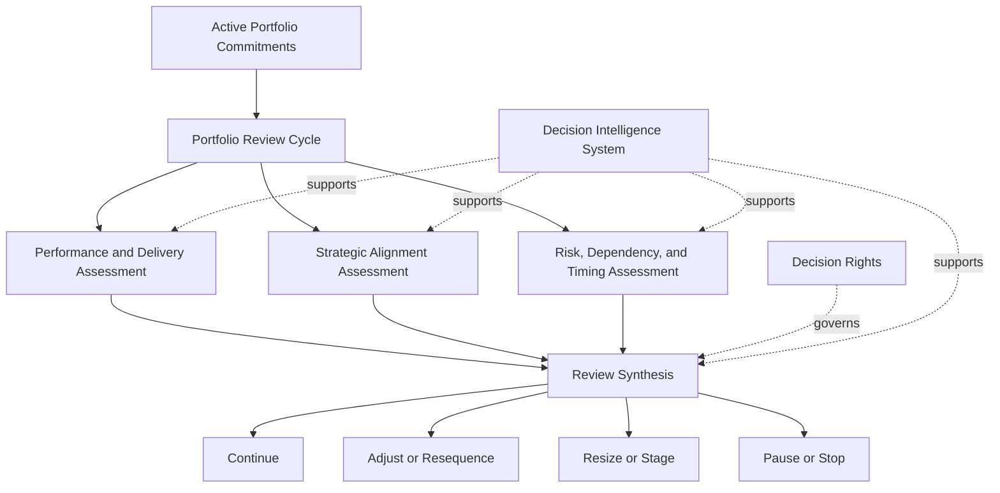
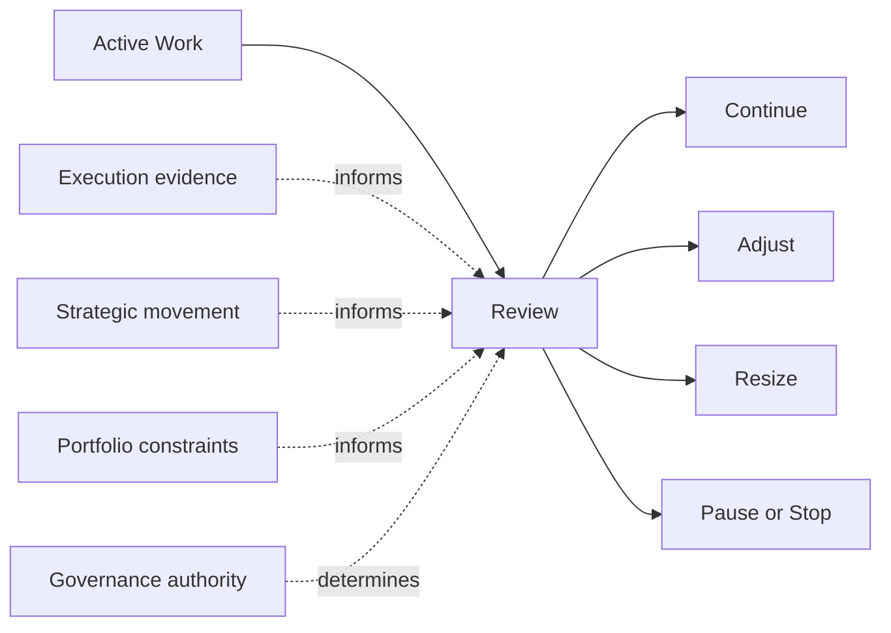

# Portfolio Review Model

The **Portfolio Review Model** defines the canonical review structure used by the **Portfolio Governance System** to assess active investments, confirm portfolio health, evaluate continuation logic, and trigger rebalance actions over time.

Where the **Unified Portfolio Governance System** defines the internal architecture of portfolio governance as a whole, **Governance Decision Rights** defines who holds decision authority, and the **Investment Decision Model** defines how investment commitments are initially determined, this artifact defines **how the active portfolio is reviewed after commitment so governance remains continuous rather than front-loaded**.

It explains the recurring review logic through which portfolio commitments are monitored, challenged, continued, adjusted, or stopped in response to execution reality, changing conditions, strategic movement, and new evidence.

This artifact is a **canonical supporting governance artifact** within Pillar 3 of the **Product Leadership Operating System (PLOS)**.

---

## Purpose

The purpose of this artifact is to define the **review model** used by the **Portfolio Governance System** to govern active investments after initial approval.

Portfolio governance does not end when an investment is approved. Once commitments enter the active portfolio, organizations need a structured mechanism for determining whether those commitments should continue as planned, be adjusted, be resequenced, be resized, or be stopped.

This artifact exists to provide that mechanism.

It defines the logic by which the organization reviews:

- whether active investments remain strategically aligned
- whether they remain viable relative to evidence and delivery reality
- whether portfolio sequencing still makes sense
- whether funding and capacity commitments should continue
- whether risk, dependency, or timing conditions have materially changed
- whether interventions or rebalance actions are required
- whether portfolio decisions should be reaffirmed, modified, or reversed

This artifact is intended to:

- define the major review dimensions used in portfolio governance
- clarify how review differs from initial approval
- establish the recurring structure of continuation and intervention decisions
- support consistent portfolio review across governance forums
- reduce passive continuation of weak or outdated commitments
- strengthen the portfolio’s ability to adapt without losing control

Within the broader operating model, this artifact clarifies that **good governance requires recurring review, not just initial decision quality**.

---

## Diagram

---

## Diagram Interpretation

The diagram shows how the **Portfolio Review Model** operates once investments have already become active portfolio commitments.

The model begins with **Active Portfolio Commitments**, which represent work that has already passed through governed investment decision-making and entered the portfolio as authorized commitments. The purpose of review is not to re-run intake or initial approval logic, but to assess whether those commitments still warrant continuation under current conditions.

Those commitments enter the **Portfolio Review Cycle**, which is the recurring governance mechanism through which the active portfolio is reassessed over time. This reinforces the principle that governance is continuous. Approval is not the endpoint of governance; it is the beginning of governed execution oversight.

The review cycle examines three core dimensions.

The first is **Performance and Delivery Assessment**. This looks at execution reality, progress, operating health, delivery confidence, and whether the investment is advancing in a way that still justifies continued commitment.

The second is **Strategic Alignment Assessment**. This determines whether the investment remains relevant to current strategic priorities, portfolio themes, and organizational direction. An investment may be executing competently and still deserve intervention if its strategic relevance has materially changed.

The third is **Risk, Dependency, and Timing Assessment**. This evaluates whether shifts in dependencies, concentration risk, sequencing constraints, timing windows, or external conditions have altered the case for continuation.

These three assessments flow into **Review Synthesis**, where the organization integrates execution evidence, strategic fit, and portfolio conditions into a governed continuation judgment. This is the point where review becomes a portfolio decision rather than a status discussion.

The model identifies four primary review outcomes:

- **Continue** — the investment remains valid and should proceed substantially as planned.
- **Adjust or Resequence** — the investment remains viable, but timing, ordering, or operating conditions should change.
- **Resize or Stage** — the investment should continue in altered form, with scope, commitment level, or phasing adjusted.
- **Pause or Stop** — the investment should no longer continue under current portfolio conditions.

The supporting nodes clarify that:
- **Decision Rights** govern who may determine the review outcome.
- The **Decision Intelligence System** supports every review dimension by improving visibility, evidence quality, and decision confidence.

The central architectural point is that portfolio review is not merely a reporting ritual. It is the mechanism by which the organization determines whether existing commitments should still hold.

---

## Operating Logic

The operating logic of the **Portfolio Review Model** is that active portfolio commitments must be periodically reassessed through a structured review process that can confirm, modify, or reverse earlier decisions.

Organizations often treat portfolio approval as the decisive governance moment and portfolio review as a lightweight status exercise. That pattern weakens governance. It assumes that earlier decisions remain valid by default, even when execution reality, strategic direction, timing conditions, or portfolio constraints have materially changed.

This model prevents that failure by defining review as a continuation decision structure rather than a reporting ceremony.

The model begins from a simple premise: every active investment is consuming scarce organizational capacity. Because capacity is finite, continuation should be governed as deliberately as entry. The question in review is not whether work was once approved, but whether it still deserves to remain an active commitment now.

To answer that question, the review model examines three integrated dimensions.

The first is **delivery and performance reality**. This includes execution confidence, progress, operating health, and whether the investment is producing sufficient evidence of forward viability. Delivery struggles do not automatically mean an investment should stop, but they do require governance attention.

The second is **strategic alignment**. Priorities shift, market conditions move, enterprise constraints evolve, and the relative importance of initiatives changes over time. Review must therefore test whether an investment still fits the direction the organization is trying to pursue.

The third is **portfolio condition**. Even if an investment is strategically sound and operationally viable, it may still need intervention because of dependency conflicts, capacity bottlenecks, sequencing pressure, concentration risk, timing changes, or the arrival of a stronger competing opportunity.

These review dimensions are then synthesized into a continuation judgment. At that point, authorized governance actors determine which review outcome is most appropriate.

**Continue** is appropriate when the investment still demonstrates sufficient execution health, strategic fit, and portfolio validity to proceed without material change.

**Adjust or Resequence** is appropriate when the investment remains worthwhile, but its ordering, timing, dependencies, or operating context should change.

**Resize or Stage** is appropriate when the organization should preserve the investment in altered form by narrowing scope, reducing commitment size, phasing progression, or introducing tighter conditions.

**Pause or Stop** is appropriate when the investment no longer justifies continued commitment under current evidence and portfolio conditions.

This model also assumes that review decisions may be intervention-based rather than purely evaluative. A review outcome may require corrective action, tighter conditions, altered sequencing, or active rebalance rather than passive monitoring.

The operating logic therefore depends on five principles:

1. **Continuation must be governed.** Active work should not persist by inertia alone.
2. **Review is distinct from reporting.** Governance review must produce decision-ready synthesis, not just status visibility.
3. **Review is multidimensional.** Execution, strategic fit, and portfolio condition must all be considered together.
4. **Review outcomes must be actionable.** Continue, adjust, resize, pause, and stop are all valid governance results.
5. **Review sustains adaptability.** A portfolio can only remain aligned if active commitments can be meaningfully revisited over time.

Within the broader operating system, this model ensures that the **Portfolio Governance System** retains control over active commitments instead of only controlling entry into the portfolio.

---

## Supporting Diagram

---

## Why This Matters

Portfolio review is where governance proves whether it is continuous or merely performative.

Many organizations approve work rigorously and then allow it to continue with weak challenge, fragmented oversight, or passive status reporting. As a result, investments persist beyond their strategic value, sequencing conflicts remain unresolved, delivery risk compounds unnoticed, and the portfolio becomes increasingly resistant to adaptation.

This artifact matters because it prevents approved work from becoming self-perpetuating.

First, it creates continuation discipline. Active investments must continue to justify their consumption of scarce capacity.

Second, it improves portfolio adaptability. The organization can change sequencing, scope, or commitment levels without waiting for failure or crisis.

Third, it strengthens strategic coherence. Review creates a structured way to test whether active work still aligns to current priorities.

Fourth, it improves governance quality. Review forums become decision mechanisms rather than reporting rituals.

Fifth, it protects the portfolio from inertia. Pause, stop, resize, and adjust become legitimate governance outcomes rather than signals of dysfunction.

Without a review model, portfolio governance often becomes front-loaded and brittle. This artifact prevents that failure mode by making continuation itself a governed decision.

---

## How To Use This

This artifact should be used as the canonical reference for **how active investments are reviewed within the Portfolio Governance System**.

It should be used in five primary ways.

First, it should be used to define the logic applied within recurring portfolio review forums and active-investment governance checkpoints.

Second, it should be used to align review practices so that execution evidence, strategic fit, and portfolio conditions are assessed in a consistent way.

Third, it should be used to distinguish clearly between status reporting and review-based decision-making. Visibility should inform governance, but should not be mistaken for governance itself.

Fourth, it should be used to align supporting governance artifacts such as the **Investment Decision Model**, **Governance Decision Rights**, and **Prioritization Framework** so that the active portfolio is reviewed using the same disciplined logic used to create commitments.

Fifth, it should be used during signoff review to confirm that portfolio review mechanisms are structured to produce governed continuation outcomes rather than passive updates.

In practice, this artifact should be consulted whenever:
- a recurring portfolio review cadence is being defined
- continuation or intervention logic is being documented
- rebalance actions are being standardized
- active investment checkpoints are being designed
- governance forums are drifting into status-only reporting
- signoff requires confirmation of review-model consistency

---

## Relationship to the Operating System

The **Portfolio Review Model** is a canonical supporting artifact within Pillar 3 of the **Product Leadership Operating System (PLOS)**.

Within the overall operating loop of:

**Strategy → Governance → Delivery → Outcomes → Learning → Strategy**

this artifact defines the recurring review logic used inside the **Governance** stage to reassess active portfolio commitments after they have entered delivery.

Its parent architecture is the **Unified Portfolio Governance System**, which defines the full internal structure of intake, evaluation, prioritization, decision, review, and rebalance. This artifact does not replace that architecture. Instead, it defines the model by which active investments are re-evaluated over time within it.

Its authority relationship is governed by **Governance Decision Rights**, which defines who may determine continuation, intervention, and rebalance outcomes.

Its upstream relationship includes the **Investment Decision Model**, since the commitments under review were originally created through governed investment decision logic.

Its downstream relationship is to the **Product Delivery System**, whose active commitments may be affirmed, altered, resequenced, narrowed, paused, or stopped based on review outcomes.

Its cross-system relevance also extends to the **Customer Outcomes System**, since outcome evidence should increasingly influence whether active investments continue to deserve support.

Across all of these interactions, the **Decision Intelligence System** strengthens review quality by improving visibility, comparability, and evidence synthesis, but does not itself determine review outcomes.

This artifact should therefore be maintained as a supporting governance-control document aligned to the canonical five-system model and subordinate to the higher-order unified governance architecture.

---

## Summary

The **Portfolio Review Model** defines the canonical structure used by the **Portfolio Governance System** to review active investments and determine whether they should continue, be adjusted, be resized, or be paused or stopped.

It establishes that portfolio governance must remain active after approval and that continuation decisions should be based on structured review of execution reality, strategic alignment, portfolio condition, and explicit decision authority.

By clarifying how active commitments are reassessed over time, this artifact strengthens governance continuity, improves portfolio adaptability, and helps ensure that scarce organizational capacity remains aligned to the most valid current commitments.

Within the broader **Product Leadership Operating System**, it serves as the canonical supporting artifact for recurring portfolio review logic inside the governance system and provides a reference point for related governance mechanisms and supporting documents.

---

## License

This repository is licensed under the MIT License. See [LICENSE](LICENSE) for full terms.
