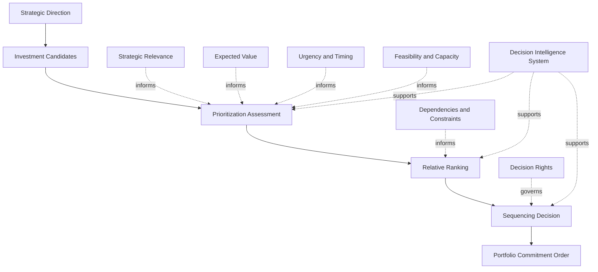
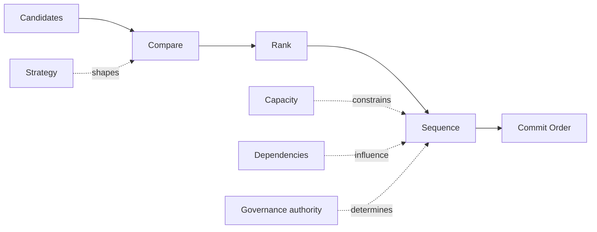

# Prioritization Framework

The **Prioritization Framework** defines the canonical structure used by the **Portfolio Governance System** to compare competing investments, determine relative importance, and sequence portfolio commitments under conditions of constrained capacity.

Where the **Unified Portfolio Governance System** defines the internal architecture of portfolio governance as a whole, **Governance Decision Rights** defines who holds authority, the **Investment Decision Model** defines how individual investment outcomes are determined, and the **Portfolio Review Model** defines how active commitments are reassessed over time, this artifact defines **how competing portfolio options are comparatively ranked and ordered before and during commitment**.

It explains the prioritization logic through which strategic relevance, expected value, urgency, feasibility, dependency structure, risk, and capacity constraints are translated into explicit portfolio ordering and sequencing decisions.

This artifact is a **canonical supporting governance artifact** within Pillar 3 of the **Product Leadership Operating System (PLOS)**.

---

## Purpose

The purpose of this artifact is to define the **prioritization framework** used by the **Portfolio Governance System** to compare, rank, and sequence portfolio investments.

In a governed portfolio, organizations do not merely decide whether an initiative is good. They decide whether it is more important, more urgent, more viable, or more valuable than alternative uses of constrained organizational attention and capacity.

This artifact exists to provide that comparative structure.

It defines the logic by which the organization determines:

- which investments should take precedence over others
- how sequencing decisions should be made across competing commitments
- how strategic relevance and expected value should influence ranking
- how urgency, risk, dependencies, and timing should affect relative priority
- how capacity constraints should shape what can realistically be pursued
- how prioritization should inform both new commitments and active portfolio adjustments

This artifact is intended to:

- define the major prioritization dimensions used in portfolio governance
- clarify how prioritization differs from binary approval logic
- establish a common structure for relative ranking and sequencing
- support comparability across competing portfolio options
- reduce political, ad hoc, or personality-driven prioritization
- strengthen portfolio discipline under constrained capacity

Within the broader operating model, this artifact clarifies that **good governance requires comparative ordering logic, not just approval decisions**.

---

## Diagram

---

## Diagram Interpretation

The diagram shows how the **Prioritization Framework** operates within the **Portfolio Governance System** to determine the relative order of competing investments.

The process begins with **Strategic Direction**, which defines the broader priorities, objectives, and constraints that shape how investments should be compared. Strategy does not by itself rank every initiative, but it establishes the criteria context within which prioritization should occur.

Potential initiatives enter the framework as **Investment Candidates**. These candidates may include proposed new investments, requests for expanded commitment, items competing for scarce capacity, or initiatives whose position in the portfolio needs to be reconsidered.

Those candidates move into **Prioritization Assessment**, where the organization evaluates each option using a common comparative structure. This stage considers dimensions such as strategic relevance, expected value, urgency, timing, feasibility, and capacity implications. The purpose is not to approve or reject in isolation, but to create a basis for relative comparison.

The outputs of assessment move into **Relative Ranking**, where competing options are compared against one another. This stage determines which opportunities should hold higher, lower, or conditional priority relative to alternatives. It is the point at which prioritization becomes explicitly comparative rather than merely evaluative.

Ranking then informs **Sequencing Decision**, where the organization determines not only what matters most, but in what order commitments should occur. Sequencing matters because even high-priority initiatives may need to wait due to dependency structure, timing windows, capacity limits, or portfolio balance considerations.

The result is **Portfolio Commitment Order**, which represents the governed ordering of work across the portfolio. This ordering informs which commitments should proceed first, which should follow later, and which should remain behind higher-priority alternatives.

The supporting nodes clarify that:
- **Strategic Relevance** influences whether an investment is important to the current direction of the organization.
- **Expected Value** informs the magnitude and significance of the opportunity.
- **Urgency and Timing** affect whether the investment should happen now, later, or conditionally.
- **Feasibility and Capacity** determine whether the organization can realistically support the commitment.
- **Dependencies and Constraints** shape how ranking translates into actual sequence.
- **Decision Rights** govern who may determine sequencing outcomes.
- The **Decision Intelligence System** improves evidence quality, comparability, and prioritization confidence throughout the process.

The central architectural point is that prioritization is not the same as approval. It is the comparative mechanism by which the portfolio determines **relative importance and executable order**.

---

## Operating Logic

The operating logic of the **Prioritization Framework** is that portfolio commitments must be comparatively ordered before capacity is consumed.

Organizations often confuse prioritization with endorsement. In practice, many initiatives may appear worthy, but not all worthy initiatives can be pursued at once. Capacity, timing, dependencies, and strategic concentration limits require the organization to decide not only what has value, but what should come first, what should follow later, and what should remain behind stronger alternatives.

This framework prevents prioritization from collapsing into opinion, escalation, or superficial scoring.

The model begins by recognizing that prioritization is a comparative judgment. A proposal does not become high priority because it has internal merit alone. It becomes high priority because, relative to competing options, it represents a stronger current use of constrained organizational resources.

To make that comparison, the framework evaluates candidates across several integrated dimensions.

The first is **strategic relevance**. Investments that more directly support current strategic direction, core priorities, or critical operating goals should generally hold stronger priority than those with weaker alignment.

The second is **expected value**. Priority should reflect the scale and significance of the outcome that the organization expects to create, whether in customer impact, business value, risk reduction, strategic enablement, or portfolio leverage.

The third is **urgency and timing**. Some opportunities are more time-sensitive than others. Market windows, contractual requirements, enterprise deadlines, regulatory constraints, or dependency windows may increase or reduce priority irrespective of pure value.

The fourth is **feasibility and capacity**. An investment cannot hold executable priority if the organization lacks the realistic means to pursue it. Feasibility and capacity do not always determine whether something matters, but they materially affect when and how it should be sequenced.

The fifth is **dependency and constraint structure**. Even when two initiatives are similarly valuable, one may need to precede the other because it unlocks later work, removes a structural bottleneck, or fits the portfolio’s current dependency order more effectively.

These dimensions are then synthesized into a relative ranking. That ranking is not an end in itself. It must be translated into sequence. This matters because portfolios operate over time, not just in abstract lists. Sequencing turns comparative priority into executable order.

The framework therefore assumes that prioritization outcomes may include:
- a higher relative position
- a lower relative position
- conditional priority
- deferred sequencing despite strong value
- temporary elevation based on timing or dependency conditions

The operating logic therefore depends on five principles:

1. **Prioritization is comparative.** Initiatives must be judged relative to competing options.
2. **Prioritization is multidimensional.** Value alone is insufficient; timing, feasibility, and dependency matter.
3. **Prioritization must be sequenced.** Ranking without executable order is incomplete.
4. **Prioritization is governed.** Final sequencing must be determined through explicit authority.
5. **Prioritization must remain adaptive.** Relative priority can change as strategy, evidence, and portfolio conditions shift.

Within the broader operating system, this framework ensures that the **Portfolio Governance System** can convert many valid demands into a disciplined and executable order of commitment.

---

## Supporting Diagram

---

## Why This Matters

Prioritization is where governance proves whether it can make tradeoffs rather than simply endorse demand.

Many organizations claim to prioritize, but in practice they accumulate initiatives, label too many things as high priority, and rely on informal influence to determine what actually gets attention first. The result is predictable: overcommitment, weak sequencing, unstable delivery expectations, hidden political ordering, and poor translation of strategy into executable portfolio focus.

This artifact matters because it prevents prioritization from becoming rhetorical.

First, it creates comparative discipline. Initiatives must compete against alternatives rather than being judged in isolation.

Second, it improves sequencing quality. The organization can translate relative importance into executable order rather than into static ranked lists.

Third, it strengthens strategic coherence. Priority can be tied back to direction, timing, and portfolio relevance rather than to noise or escalation.

Fourth, it improves execution realism. Capacity and dependency constraints are treated as part of prioritization rather than as after-the-fact delivery problems.

Fifth, it increases adaptability. Priorities can change as evidence, timing, strategy, and portfolio conditions evolve.

Without a prioritization framework, governance forums often mistake approval for order. This artifact prevents that failure mode by giving the portfolio a repeatable way to compare competing options and convert them into disciplined sequencing decisions.

---

## How To Use This

This artifact should be used as the canonical reference for **how competing investments are comparatively prioritized within the Portfolio Governance System**.

It should be used in five primary ways.

First, it should be used to define the logic applied within prioritization forums, sequencing decisions, and comparative portfolio tradeoff discussions.

Second, it should be used to align prioritization practices so that strategy, value, urgency, feasibility, capacity, and dependencies are considered in a consistent way.

Third, it should be used to distinguish clearly between approval decisions and prioritization decisions. An initiative may be viable without being first in sequence.

Fourth, it should be used to align supporting governance artifacts such as the **Investment Decision Model**, **Portfolio Review Model**, and **Governance Decision Rights** so that relative ordering is governed with the same discipline as commitment and review.

Fifth, it should be used during signoff review to confirm that prioritization logic is structured, comparative, and executable rather than political, ad hoc, or list-driven.

In practice, this artifact should be consulted whenever:
- prioritization criteria are being documented
- sequencing logic is being defined
- too many initiatives are being treated as equally important
- governance forums are struggling to make tradeoffs
- dependency-aware ordering is being clarified
- signoff requires confirmation of prioritization-model consistency

---

## Relationship to the Operating System

The **Prioritization Framework** is a canonical supporting artifact within Pillar 3 of the **Product Leadership Operating System (PLOS)**.

Within the overall operating loop of:

**Strategy → Governance → Delivery → Outcomes → Learning → Strategy**

this artifact defines the comparative ordering logic used inside the **Governance** stage to rank and sequence competing portfolio commitments.

Its parent architecture is the **Unified Portfolio Governance System**, which defines the full internal structure of intake, evaluation, prioritization, decision, review, and rebalance. This artifact does not replace that architecture. Instead, it defines the framework by which competing options are comparatively ordered within it.

Its authority relationship is governed by **Governance Decision Rights**, which defines who may determine prioritization and sequencing outcomes.

Its adjacent relationship is to the **Investment Decision Model**, since prioritization influences which viable opportunities should move forward first and under what conditions.

Its downstream relationship is to the **Product Delivery System**, which depends on governed sequencing rather than ambiguous or conflicting notions of priority.

Its cross-system relevance also extends to the **Customer Outcomes System**, since prioritization quality should later be judged in part by whether the chosen sequence produced the intended customer and business effects.

Across all of these interactions, the **Decision Intelligence System** strengthens prioritization quality by improving evidence quality, comparability, and tradeoff clarity, but does not itself determine priority.

This artifact should therefore be maintained as a supporting governance-control document aligned to the canonical five-system model and subordinate to the higher-order unified governance architecture.

---

## Summary

The **Prioritization Framework** defines the canonical structure used by the **Portfolio Governance System** to compare competing investments, determine relative priority, and sequence commitments under constrained capacity.

It establishes that prioritization must be based on comparative assessment of strategic relevance, expected value, urgency, feasibility, dependencies, timing, and explicit decision authority rather than on isolated merit, informal escalation, or raw demand volume.

By clarifying how portfolio candidates move from comparative assessment through ranking and sequencing into commitment order, this artifact strengthens governance discipline, improves execution realism, and helps ensure that limited organizational capacity is directed toward the most valid current priorities in the right order.

Within the broader **Product Leadership Operating System**, it serves as the canonical supporting artifact for prioritization and sequencing logic inside the governance system and provides a reference point for related governance mechanisms and supporting documents.

---

## License

This repository is licensed under the MIT License. See [LICENSE](LICENSE) for full terms.
