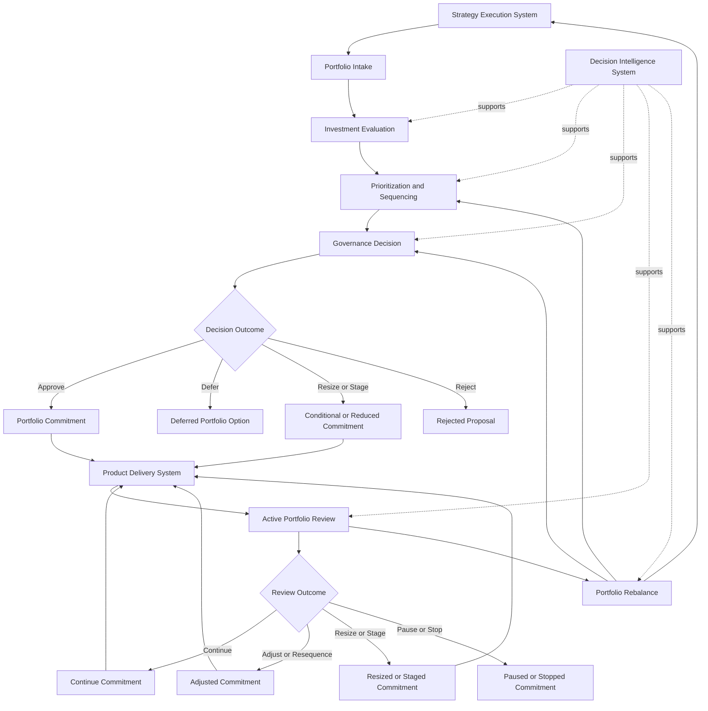
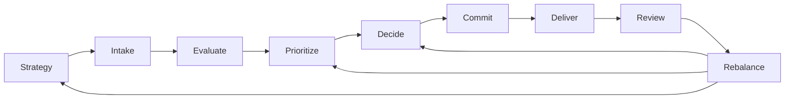

# Governance Decision Flow Diagram

The **Governance Decision Flow Diagram** defines the canonical end-to-end decision flow through which the **Portfolio Governance System** converts strategic direction into governed portfolio commitments and recurring rebalance actions.

Where the **Unified Portfolio Governance System** defines the full internal architecture of portfolio governance, and supporting artifacts define decision rights, investment logic, review logic, and prioritization structure, this artifact provides the **integrated visual flow** showing how those governance elements operate together across the portfolio lifecycle.

It explains how investment candidates move from strategic context through intake, evaluation, prioritization, decision, commitment, review, and rebalance in a single governed flow.

This artifact is a **canonical supporting governance diagram** within Pillar 3 of the **Product Leadership Operating System (PLOS)**.

---

## Purpose

The purpose of this artifact is to provide the **canonical visual decision flow** for the **Portfolio Governance System**.

Portfolio governance contains multiple distinct mechanisms: intake, evaluation, prioritization, approval, review, and rebalance. When these are described separately, organizations may understand the components but still fail to understand the integrated governance flow that links them.

This artifact exists to solve that problem.

It provides a single end-to-end view of how the organization governs portfolio decisions by showing:

- how strategic direction enters the governance system
- how investment candidates are introduced and structured
- how proposals are evaluated and compared
- how relative priority and sequence are determined
- how formal governance decisions are made
- how commitments move into delivery
- how active work returns into governance through review
- how rebalance actions alter the portfolio over time

This artifact is intended to:

- visualize the full operating flow of portfolio governance
- connect the major supporting governance artifacts into one coherent sequence
- reduce fragmentation across separate governance models
- support README, architecture, and diagram consistency
- provide an executive-level reference visual for the governance system
- preserve canonical alignment across downstream governance documentation

Within the broader operating model, this artifact clarifies that **portfolio governance is a continuous governed flow rather than a series of disconnected decisions**.

---

## Diagram

---

## Diagram Interpretation

The diagram shows the full governance flow through which the **Portfolio Governance System** converts strategic intent into active commitments and then continuously reassesses those commitments over time.

The flow begins with the **Strategy Execution System**, which provides the strategic direction, priorities, themes, and constraints that shape the decision environment. Strategy establishes the context for governance, but does not itself determine which specific investments enter the portfolio.

From there, opportunities enter **Portfolio Intake**, where investment candidates are introduced into the governance system in a form that can be evaluated, compared, and governed. Intake creates structured visibility into potential demand rather than allowing commitments to emerge informally.

Those candidates then move into **Investment Evaluation**, where the organization assesses expected value, feasibility, risk, readiness, and other decision inputs required for sound governance judgment.

After evaluation, candidates enter **Prioritization and Sequencing**, where they are comparatively ranked and positioned relative to other competing uses of constrained organizational capacity. This stage determines relative order, not just isolated merit.

The flow then moves into **Governance Decision**, where authorized decision-makers apply explicit governance authority to determine the appropriate portfolio outcome. The model identifies four primary decision outcomes:

- **Approve**
- **Defer**
- **Resize or Stage**
- **Reject**

Approved commitments move into the active portfolio as **Portfolio Commitment**. Conditionally approved or reduced investments move forward as **Conditional or Reduced Commitment**, reflecting the governance principle that commitment need not always be binary or full-scale.

Those active commitments flow into the **Product Delivery System**, where governed work enters execution.

Once active, work re-enters governance through **Active Portfolio Review**. This shows that governance does not end with initial approval. Active commitments remain subject to structured reassessment.

The review process results in one of four primary review outcomes:

- **Continue**
- **Adjust or Resequence**
- **Resize or Stage**
- **Pause or Stop**

Continue, adjusted, and resized commitments may return to delivery in altered or reaffirmed form. The review process also informs **Portfolio Rebalance**, which represents broader portfolio-level intervention and reallocation logic.

Rebalance can affect multiple parts of the governance system:
- it may alter **prioritization and sequencing**
- it may require renewed **governance decisions**
- it may provide feedback into the **Strategy Execution System**

The diagram also shows that the **Decision Intelligence System** supports all major decision stages by improving evidence quality, tradeoff clarity, comparability, and governance confidence.

The central architectural point is that portfolio governance is not a one-time approval gate. It is a continuous decision flow connecting strategy, commitment, execution, review, and rebalance.

---

## Operating Logic

The operating logic of the **Governance Decision Flow Diagram** is that portfolio governance must function as an integrated end-to-end operating flow.

Organizations often understand individual governance mechanisms in isolation. They may have intake processes, prioritization meetings, approval forums, and portfolio reviews, but still lack a coherent model of how these mechanisms fit together. When that happens, governance becomes fragmented. Decisions are made locally, transitions between stages are weak, and the portfolio loses coherence.

This artifact addresses that problem by showing the full governance lifecycle as a continuous structured flow.

The flow begins with strategy because governance should always be contextualized by enterprise direction. Portfolio decisions must be anchored in a broader sense of what the organization is trying to achieve.

From there, demand enters through intake. Intake matters because unstructured demand cannot be governed consistently. The system must first make opportunities visible before it can compare or decide them.

Once visible, opportunities require evaluation. Evaluation creates the evidence base for governance by testing expected value, feasibility, risk, timing, and other key decision dimensions.

But evaluation is not enough. In a constrained portfolio, initiatives must also be compared against one another. That is why prioritization and sequencing sit between evaluation and decision. Governance does not merely ask, “Is this good?” It asks, “Is this the right thing to do now relative to alternatives?”

Only then should the organization reach a formal decision point. At this stage, explicit governance authority determines whether the proposal becomes a commitment, remains deferred, moves forward conditionally, or is rejected.

Once committed, the investment enters delivery. But governance does not end there. Active commitments must be reviewed because strategy changes, evidence evolves, execution reality shifts, and portfolio conditions change over time.

This is why review sits inside the active lifecycle of the portfolio rather than outside it. Review is the mechanism through which the organization decides whether a commitment should continue, be altered, or stop.

Review outcomes, in turn, inform portfolio rebalance. Rebalance is the adaptive mechanism that allows the organization to alter ordering, reallocate attention, adjust commitments, and feed learning back into the broader portfolio and strategy environment.

The operating logic therefore depends on five principles:

1. **Governance is continuous.** It does not stop at approval.
2. **Governance is sequential.** Intake, evaluation, prioritization, decision, review, and rebalance each play distinct roles.
3. **Governance is comparative.** Portfolio choices are made relative to alternatives.
4. **Governance is adaptive.** Active commitments can and should be altered when conditions change.
5. **Governance is system-linked.** Strategy, governance, delivery, and review are part of one operating loop.

Within the broader **Product Leadership Operating System**, this flow shows how the governance system serves as the controlled bridge between strategic direction and delivery commitment while remaining continuously connected to learning and strategic adjustment.

---

## Supporting Diagram

---

## Why This Matters

Portfolio governance often fails not because individual mechanisms are absent, but because the organization does not understand how those mechanisms connect.

Teams may have prioritization criteria, review meetings, or approval forums, but still lack a coherent operating flow linking strategy, commitment, execution, and rebalance. When that happens, governance becomes fragmented, responsibility diffuses, and portfolio decisions lose consistency over time.

This artifact matters because it provides that missing integrated view.

First, it creates flow clarity. Readers can see how governance moves from strategic context through commitment and back into review and rebalance.

Second, it reduces fragmentation. Separate governance artifacts can now be interpreted as parts of one system rather than as isolated practices.

Third, it improves communication. Leaders, reviewers, and maintainers can use a single diagram to explain how portfolio governance works end to end.

Fourth, it strengthens architectural integrity. The governance system is visualized in a way that aligns to the broader five-system operating model.

Fifth, it supports disciplined maintenance. Future governance artifacts and diagrams can be checked against this integrated flow to prevent drift or contradiction.

Without a canonical end-to-end decision-flow diagram, portfolio governance documentation often becomes accurate in pieces but incoherent as a system. This artifact prevents that failure mode.

---

## How To Use This

This artifact should be used as the canonical reference diagram for **the end-to-end operating flow of the Portfolio Governance System**.

It should be used in five primary ways.

First, it should be used as the top-level visual reference for how portfolio governance operates across intake, evaluation, prioritization, decision, review, and rebalance.

Second, it should be used to align supporting artifacts so they can be understood as distinct parts of one integrated governance flow.

Third, it should be used in READMEs, executive summaries, and architecture overviews where a single governance-system visual is needed.

Fourth, it should be used during signoff review to confirm that downstream governance documentation remains consistent with the canonical end-to-end flow.

Fifth, it should be used to prevent drift between initial commitment logic and active portfolio review logic by showing both within one continuous model.

In practice, this artifact should be consulted whenever:
- a governance overview diagram is needed
- supporting governance artifacts are being cross-checked
- README-level governance visuals are being updated
- the relationship between approval and review needs clarification
- architecture drift is suspected across portfolio-governance artifacts
- signoff requires confirmation of end-to-end governance coherence

---

## Relationship to the Operating System

The **Governance Decision Flow Diagram** is a canonical supporting diagram within Pillar 3 of the **Product Leadership Operating System (PLOS)**.

Within the overall operating loop of:

**Strategy → Governance → Delivery → Outcomes → Learning → Strategy**

this artifact visualizes the internal operating flow of the **Governance** stage and its direct relationship to strategy, delivery, review, and rebalance.

Its parent architecture is the **Unified Portfolio Governance System**, which defines the full internal structure of the governance system. This diagram does not replace that architecture. Instead, it provides an integrated visual rendering of how the governance flow operates across the major supporting artifacts.

It incorporates logic defined across:
- **Governance Decision Rights**
- **Investment Decision Model**
- **Portfolio Review Model**
- **Prioritization Framework**

Its upstream dependency is the **Strategy Execution System**, which supplies the strategic context for portfolio decisions.

Its downstream relationship is to the **Product Delivery System**, which receives governed commitments.

Its feedback relationship supports broader operating-system learning because review and rebalance outcomes may alter future prioritization, future decisions, and strategic direction.

Across all of these interactions, the **Decision Intelligence System** supports but does not govern the decision flow itself.

This artifact should therefore be maintained as a canonical governance-system diagram aligned to the five-system model and subordinate to the higher-order unified governance architecture.

---

## Summary

The **Governance Decision Flow Diagram** defines the canonical end-to-end decision flow through which the **Portfolio Governance System** converts strategy into governed commitments and continuously reassesses those commitments over time.

It establishes that portfolio governance is not a disconnected set of approval and review moments, but a continuous governed flow linking intake, evaluation, prioritization, decision, commitment, delivery, review, and rebalance.

By visualizing these stages in one integrated model, this artifact strengthens architectural coherence, improves executive understanding, and provides a shared diagrammatic reference point for all major governance-supporting artifacts.

Within the broader **Product Leadership Operating System**, it serves as the canonical supporting diagram for the internal flow of the governance system and helps preserve cross-artifact consistency across Pillar 3.

---

## License

This repository is licensed under the MIT License. See [LICENSE](LICENSE) for full terms.
