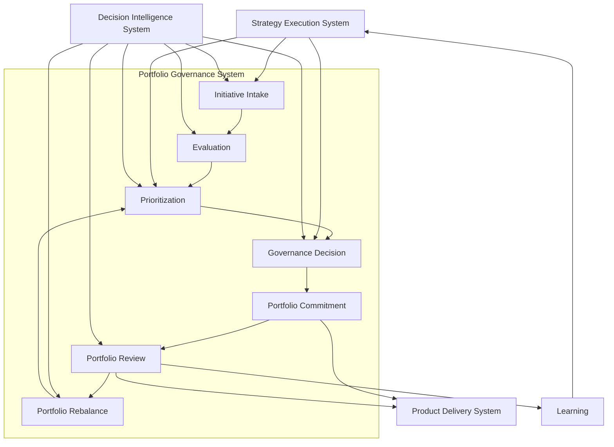
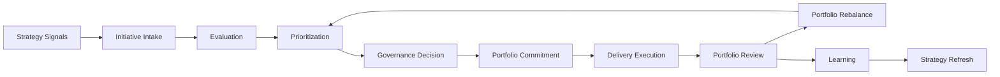

# Portfolio Governance System Diagram

The **Portfolio Governance System Diagram** defines the canonical system-level visual representation of the **Portfolio Governance System** within the **Product Leadership Operating System (PLOS)**.

Where the **Unified Product Leadership Systems Architecture** defines the full five-system architecture of the operating system, and the **Governance Decision Flow Diagram** visualizes the end-to-end movement of portfolio decisions, this artifact provides the **high-level system diagram** that shows the major governance components, their relationships, and the position of portfolio governance between strategy and delivery.

It explains how portfolio governance operates as a coherent system of intake, evaluation, prioritization, decision-making, review, and rebalancing rather than as an isolated funding meeting, intake queue, or periodic steering committee.

---

# Purpose

The purpose of this artifact is to provide the **canonical visual model** of the **Portfolio Governance System**.

This diagram helps leaders understand:

- how strategic direction is translated into governed investment decisions
- how initiatives move from intake through evaluation and prioritization into portfolio commitment
- how governance continues after approval through review, adjustment, and rebalance
- how portfolio governance connects upstream to strategy and downstream to delivery
- how **Decision Intelligence** supports governance decisions throughout the operating loop

This artifact is intended to anchor portfolio governance as a **system**, not a single event or forum.

---

# Diagram

---

# Diagram Interpretation

The diagram shows the **Portfolio Governance System** as the structured system through which organizations translate strategic direction into governed investment commitments and ongoing portfolio control.

The flow begins with **Initiative Intake**, where proposed investments, strategic opportunities, mandates, risks, and emerging demands enter the governance system through a common path. This ensures that potential work is surfaced through a governed mechanism rather than through informal escalation, local influence, or fragmented demand channels.

From intake, initiatives move into **Evaluation**, where they are assessed against explicit criteria such as strategic alignment, expected value, urgency, feasibility, dependency implications, resource requirements, risk exposure, and delivery readiness. This creates a common basis for comparing different types of proposed work across the portfolio.

The next stage is **Prioritization**, where evaluated initiatives are ranked relative to one another within the context of strategy, capacity constraints, sequencing logic, dependency management, and portfolio balance. This stage is critical because portfolio governance is fundamentally about making constrained choices among competing investments rather than evaluating each initiative in isolation.

Prioritized items then advance into **Governance Decision**, where leadership determines whether initiatives should be approved, deferred, declined, resequenced, or reshaped. This is the point where tradeoffs become formal portfolio decisions rather than informal preferences.

Approved decisions become **Portfolio Commitments**, which represent the governed set of investments the organization has intentionally chosen to resource and execute. Those commitments then flow into the **Product Delivery System**, where governed work moves into execution.

The system continues beyond initial approval through **Portfolio Review**, where leaders examine progress, portfolio health, strategic relevance, execution signals, delivery risk, and emerging constraints. Review outputs then inform **Portfolio Rebalance**, where the portfolio is adjusted in response to changing conditions, new evidence, performance insights, or shifts in strategic direction. Rebalance then feeds back into prioritization, reinforcing that portfolio governance is a recurring operating capability rather than a one-time planning event.

The diagram also shows that the **Strategy Execution System** provides the strategic direction that shapes intake, prioritization, and governance decisions, while the **Decision Intelligence System** supports all major governance activities with evidence, analysis, performance signals, and decision support. Learning generated through portfolio review feeds back to strategy, preserving the broader operating loop across PLOS.

---

# Operating Logic

The operating logic of the **Portfolio Governance System** is that organizations should govern investments through a recurring, evidence-supported control system rather than through isolated approval meetings, sponsor influence, or reactive prioritization.

This logic depends on several core principles.

First, meaningful investment demand should enter through a **structured intake path** so that proposed work becomes visible, comparable, and governable. Governance breaks down when initiatives bypass common intake and enter execution through side channels.

Second, initiatives should be subjected to **explicit evaluation** using shared criteria. Without comparative evaluation, decisions become inconsistent, politically driven, or dominated by urgency rather than strategic reasoning.

Third, governance must establish **relative priority** across competing investments. Since organizations always operate under finite capacity, constrained funding, and dependency limits, portfolio governance exists to make tradeoffs explicit and intentional.

Fourth, governance must convert those tradeoffs into **formal decisions and commitments**. A ranked list alone does not govern the portfolio. Governance requires an explicit commitment model that determines what the organization is actually prepared to fund, resource, sequence, and execute.

Fifth, governance must continue after approval through **ongoing portfolio review**. Review exists to test whether current commitments remain justified in light of delivery performance, strategic movement, new evidence, and changing operating conditions.

Sixth, governance must preserve adaptability through **portfolio rebalance**. The portfolio should not remain static when strategy changes, delivery constraints emerge, priorities shift, or evidence invalidates prior assumptions. Rebalance is the mechanism that keeps the governed portfolio aligned without abandoning control.

Taken together, this means the **Portfolio Governance System** governs both the **entry of work into execution** and the **ongoing adaptation of the committed portfolio over time**. Portfolio governance is therefore not a front-end planning exercise. It is a living control system that connects strategy to execution through disciplined intake, comparative evaluation, formal decision-making, portfolio review, rebalance, and learning.

---

# Supporting Diagram

---

# Why This Matters

This artifact matters because many organizations believe they have portfolio governance when they actually have only disconnected governance activities such as intake, annual planning, quarterly prioritization, or executive funding reviews.

The **Portfolio Governance System Diagram** makes clear that effective portfolio governance is not a single committee, planning ceremony, or approval checkpoint. It is a connected operating system that governs how initiatives enter the portfolio, how they are evaluated, how tradeoffs are made, how commitments are formalized, how execution is reviewed, and how investments are rebalanced when conditions change.

Without this system view, organizations commonly experience predictable failures. Too much work enters delivery without real tradeoff decisions. Strategic priorities do not consistently translate into investment choices. Governance becomes episodic instead of continuous. Review forums emphasize status reporting rather than decision quality. Teams continue work that should be stopped, reshaped, or deprioritized because no rebalance mechanism exists inside the operating model.

This artifact addresses those failures by defining portfolio governance at the architectural level. It clarifies that governance is a durable control system that connects strategy to execution through disciplined, recurring investment decisions.

---

# How To Use This

Use this artifact as the **primary visual reference** for explaining the structure of the **Portfolio Governance System** within the **Product Leadership Operating System (PLOS)**.

It is especially useful for:

- orienting leaders to how portfolio governance operates as a system rather than an event
- aligning governance meetings, decision forums, and review mechanisms to a single operating model
- assessing whether an organization’s governance capabilities are complete, fragmented, or misaligned
- identifying missing capabilities such as explicit evaluation, comparative prioritization, recurring review, or portfolio rebalance
- supporting README diagrams, repository summaries, and pillar-level architecture references
- aligning conversations across product, engineering, finance, strategy, and operations leadership

This artifact should be used together with the **Portfolio Governance System** source artifact and the **Governance Decision Flow Diagram**. The source artifact defines the governance system in prose, this diagram defines the high-level system structure, and the decision flow diagram shows how portfolio decisions move through that structure operationally.

---

# Relationship to the Operating System

This artifact belongs to **Pillar 3** of the **Product Leadership Operating System (PLOS)** and defines the canonical system-level visual representation of the **Portfolio Governance System**.

Within the broader operating system, the **Portfolio Governance System** sits between strategy and delivery.

Its role is to:

- translate strategic direction into governed portfolio commitments
- determine which initiatives are approved, deferred, declined, reshaped, or resequenced
- maintain portfolio control through recurring review and rebalance
- ensure that execution begins from intentional commitments rather than unmanaged demand

Its relationships to the other canonical systems are direct and essential:

- it is **downstream of the Strategy Execution System**, which provides direction, priorities, and strategic context
- it is **upstream of the Product Delivery System**, which executes the governed portfolio
- it is **supported continuously by the Decision Intelligence System**, which provides data, signals, analysis, and decision support
- it contributes indirectly to the **Customer Outcomes System** by governing which investments are resourced and therefore capable of producing measurable outcomes

Within the full PLOS operating loop:

**Strategy → Governance → Delivery → Outcomes → Learning → Strategy**

this artifact defines the **Governance** portion of that loop.

It should therefore be interpreted as a core operating system component, not as a standalone process or isolated planning activity.

---

# Summary

The **Portfolio Governance System Diagram** provides the canonical visual model of how the **Portfolio Governance System** operates within PLOS.

It shows that portfolio governance is not limited to prioritization workshops or funding decisions. It is a connected system that:

- receives initiatives through intake
- evaluates them against explicit criteria
- prioritizes them across strategic and capacity constraints
- converts those priorities into formal governance decisions
- establishes portfolio commitments for delivery
- reviews portfolio and execution health over time
- rebalances investments as evidence and conditions change

By making those relationships explicit, this artifact provides a durable architecture for understanding how organizations govern investments across the portfolio and maintain alignment between strategy, execution, and adaptive control.

---

# License

This project is licensed under the MIT License. See the [LICENSE](LICENSE) file for details.
