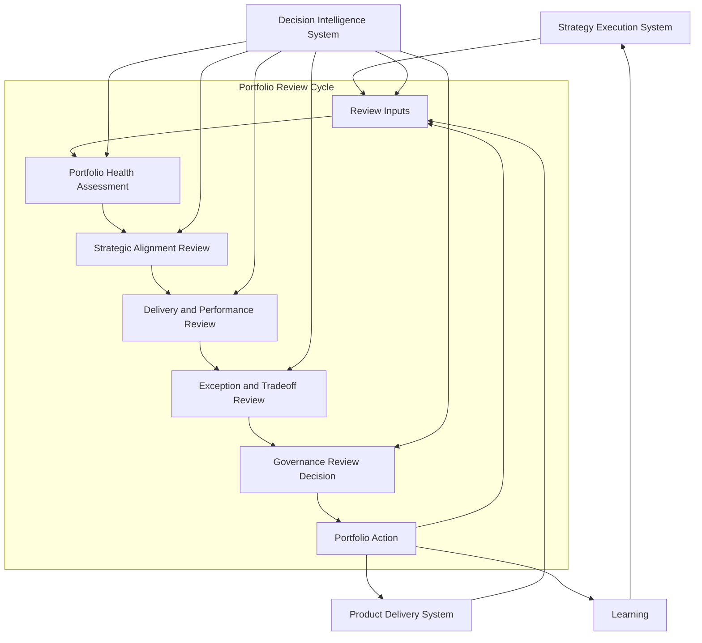
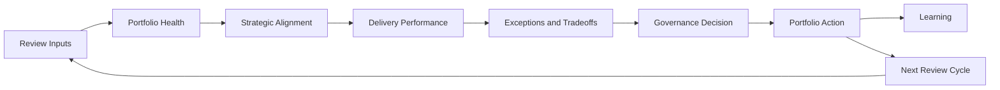

# Portfolio Review Cycle Diagram

The **Portfolio Review Cycle Diagram** defines the canonical recurring review cycle through which the **Portfolio Governance System** monitors portfolio health, evaluates active commitments, and determines when portfolio adjustments are required within the **Product Leadership Operating System (PLOS)**.

Where the **Portfolio Governance System** defines the overall governance system, and the **Portfolio Governance System Diagram** shows its structural components, this artifact visualizes the **recurring review cycle** that sustains governance after commitments have entered execution.

It explains how leaders repeatedly inspect portfolio status, assess strategic alignment, evaluate delivery signals, review evidence, identify exceptions, and determine whether the portfolio should continue as planned or be rebalanced.

---

# Purpose

The purpose of this artifact is to provide the **canonical visual model** of the recurring **portfolio review cycle**.

This diagram helps leaders understand:

- how portfolio governance continues after initial approval and commitment
- how recurring review preserves control over active investments
- how strategy, execution, and evidence are brought together in a disciplined review loop
- how review outputs lead to continuation, intervention, reprioritization, or rebalance
- how **Decision Intelligence** supports recurring governance decisions with performance signals, evidence, and analysis

This artifact is intended to anchor portfolio review as a **repeatable governance cycle**, not a status meeting or passive reporting ritual.

---

# Diagram

---

# Diagram Interpretation

The diagram shows the **Portfolio Review Cycle** as the recurring governance loop through which leaders assess the health, validity, and continued alignment of active portfolio commitments.

The cycle begins with **Review Inputs**, which consolidate the evidence required for disciplined portfolio review. These inputs typically include strategic priorities, committed portfolio scope, delivery progress, milestone confidence, performance signals, risk indicators, dependency shifts, capacity constraints, and emerging business or customer evidence. This stage creates a shared fact base so that review decisions are made from a common operating picture rather than fragmented reporting.

Those inputs then feed into **Portfolio Health Assessment**, where leaders examine the condition of the portfolio as a whole. This includes evaluating portfolio balance, execution stability, investment distribution, throughput, resource pressure, dependency exposure, and the overall governability of the active portfolio. The purpose of this stage is to assess whether the portfolio remains healthy enough to continue as currently structured.

The cycle then moves into **Strategic Alignment Review**, where leaders test whether the active portfolio still reflects current strategic direction. This is the stage where leadership examines whether priorities have shifted, new mandates have emerged, competitive conditions have changed, or executive intent has evolved in ways that should alter current commitments.

From there, the cycle advances into **Delivery and Performance Review**, where leaders inspect the execution and performance signals coming from delivery. This includes progress, milestone reliability, delivery health, dependency impact, risk movement, operational friction, and early evidence about whether investments are generating the signals expected from their original commitment rationale.

The next stage is **Exception and Tradeoff Review**, where leaders isolate the issues that require active governance intervention. These may include underperforming investments, overloaded capacity, sequencing problems, unresolved dependencies, strategic conflicts, or new opportunities that challenge the current shape of the portfolio. This stage is important because it converts review data into explicit governance questions.

Those questions then move into **Governance Review Decision**, where leadership determines whether the portfolio should continue as planned or whether corrective action is required. At this point, leaders may decide to maintain commitments, intervene operationally, change sequencing, reallocate resources, pause work, stop work, or trigger broader rebalance.

The cycle concludes with **Portfolio Action**, which applies those decisions back into the active portfolio and delivery system. Some actions preserve the current plan, while others alter the portfolio posture in response to new evidence. These actions also generate **Learning**, which feeds back into strategy, while the cycle restarts through the next recurring review interval.

The diagram also shows that the **Strategy Execution System**, **Product Delivery System**, and **Decision Intelligence System** all contribute to the review cycle. Strategy provides direction, delivery provides operating signals, and decision intelligence supports every major review stage with evidence, analysis, and decision support. In this way, the review cycle preserves the broader operating loop across PLOS.

---

# Operating Logic

The operating logic of the **Portfolio Review Cycle** is that portfolio governance must remain active after commitments have entered execution.

Organizations do not govern effectively by approving work once and then assuming those commitments remain valid indefinitely. Strategic priorities shift. Execution realities emerge. Risks accumulate. Dependencies change. Evidence strengthens or invalidates earlier assumptions. Because of this, active portfolio commitments require recurring review if leadership wants to preserve control, alignment, and adaptability.

This cycle operates through six core governance motions.

First, leaders gather **structured review inputs** so that portfolio decisions are grounded in a shared fact base rather than fragmented updates or selective escalation.

Second, leaders assess **portfolio health** so they can understand whether the committed portfolio remains balanced, executable, and governable as a system rather than merely reviewing initiatives one by one.

Third, leaders test **strategic alignment** so the active portfolio remains connected to current executive intent instead of drifting away from strategy over time.

Fourth, leaders examine **delivery and performance signals** so that governance decisions reflect execution reality rather than outdated assumptions made during initial commitment.

Fifth, leaders isolate **exceptions and tradeoffs** that require active judgment. This is essential because portfolio review fails when it becomes passive status reporting instead of decision-oriented governance.

Sixth, leaders translate review findings into **portfolio action**. This keeps review connected to real control by ensuring the organization can continue, adjust, intervene, or rebalance based on evidence.

Taken together, this means the **Portfolio Review Cycle** governs the **continued validity of active commitments**, not simply their original approval. It is therefore a recurring control loop inside the **Portfolio Governance System**, enabling governance to remain active throughout execution rather than ending at the point of commitment.

---

# Supporting Diagram

---

# Why This Matters

This artifact matters because many organizations treat portfolio review as a passive reporting exercise rather than as a true governance mechanism.

When review is weak, leadership loses the ability to determine whether active investments still reflect strategic intent, whether delivery signals justify continued commitment, and whether tradeoffs should be revisited. As a result, organizations often continue too much work for too long, tolerate unhealthy portfolio conditions, and fail to adapt when evidence changes.

The **Portfolio Review Cycle Diagram** corrects that failure by defining portfolio review as a recurring governance loop. It makes clear that review is not simply retrospective status communication. It is the mechanism through which leaders reassess active commitments, inspect portfolio health, evaluate strategic alignment, identify exceptions, and decide whether the portfolio should continue, be adjusted, or be rebalanced.

Without this cycle, portfolio governance becomes strongest at the point of approval and weakest during execution. With this cycle, governance remains active across the life of the portfolio.

---

# How To Use This

Use this artifact as the **primary visual reference** for explaining how recurring portfolio review operates inside the **Portfolio Governance System**.

It is especially useful for:

- explaining the purpose and structure of recurring portfolio review forums
- aligning leadership reviews around a decision-oriented governance cycle
- distinguishing portfolio review from routine delivery status reporting
- identifying missing review capabilities such as strategic reassessment, exception handling, or rebalance action
- supporting governance artifacts, README summaries, and pillar-level architecture references
- aligning product, engineering, finance, strategy, and operations leaders around a shared review model

This artifact should be used together with the **Portfolio Governance System** source artifact, the **Portfolio Governance System Diagram**, and the **Governance Decision Flow Diagram**. Together, these artifacts define the governance system, its structure, the movement of decisions, and the recurring review cycle that preserves active portfolio control over time.

---

# Relationship to the Operating System

This artifact belongs to **Pillar 3** of the **Product Leadership Operating System (PLOS)** and defines the canonical recurring review cycle within the **Portfolio Governance System**.

Within the broader operating system, this cycle functions as the recurring governance mechanism through which active portfolio commitments are re-examined after they have entered execution.

Its role is to:

- assess the health and validity of the active portfolio
- determine whether current commitments remain strategically justified
- review delivery and performance signals from execution
- identify exceptions, tradeoffs, and conditions requiring intervention
- trigger portfolio actions that preserve alignment, control, and adaptability

Its relationships to the other canonical systems are direct:

- it is informed by the **Strategy Execution System**, which provides strategic context and changing priorities
- it receives operating signals from the **Product Delivery System**, which provides execution evidence and delivery reality
- it is supported continuously by the **Decision Intelligence System**, which provides evidence, analysis, and decision support
- it influences downstream outcomes indirectly by shaping which investments continue, change, pause, or stop
- it contributes to **Learning**, which feeds back into strategy as part of the broader operating loop

Within the full PLOS loop:

**Strategy → Governance → Delivery → Outcomes → Learning → Strategy**

this artifact defines a core recurring control mechanism inside the **Governance** portion of the operating system.

---

# Summary

The **Portfolio Review Cycle Diagram** provides the canonical visual model of how recurring portfolio review operates within the **Portfolio Governance System**.

It shows that portfolio review is not a passive status meeting. It is a structured governance cycle that:

- gathers review inputs from strategy, delivery, and decision intelligence
- assesses overall portfolio health
- tests strategic alignment
- evaluates delivery and performance signals
- identifies exceptions and tradeoffs
- produces governance decisions and portfolio actions
- generates learning that informs future strategy and future review cycles

By making this review loop explicit, the artifact strengthens the architecture of portfolio governance and clarifies how organizations maintain active control over committed investments over time.

---

# License

This project is licensed under the MIT License. See the [LICENSE](LICENSE) file for details.
