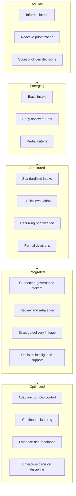

# Portfolio Governance Maturity Model

The **Portfolio Governance Maturity Model** defines the canonical maturity framework for assessing how effectively an organization governs investment decisions across the portfolio within the **Product Leadership Operating System (PLOS)**.

Where the **Portfolio Governance System** defines the target governance architecture, the **Portfolio Governance Maturity Model** defines the staged progression through which organizations evolve from fragmented, reactive governance toward disciplined, adaptive, and strategically integrated portfolio control.

It explains how portfolio governance matures across intake, evaluation, prioritization, decision-making, review, rebalance, and evidence-supported portfolio management rather than being judged only by the existence of a planning process or steering committee.

---

# Purpose

The purpose of this artifact is to provide the **canonical maturity model** for the **Portfolio Governance System**.

This framework helps leaders:

- assess the current maturity of portfolio governance practices
- identify structural weaknesses and missing governance capabilities
- distinguish between fragmented governance activity and an integrated governance system
- define the progression from reactive prioritization to governed portfolio control
- support operating model improvement, transformation planning, and leadership alignment
- evaluate how effectively **Decision Intelligence** is being used in governance decisions

This artifact is intended to serve as a diagnostic and improvement framework rather than a compliance scorecard.

---

# Diagram

---

# Diagram Interpretation

The diagram shows the **Portfolio Governance Maturity Model** as a staged progression through five maturity levels: **Ad Hoc**, **Emerging**, **Structured**, **Integrated**, and **Optimized**.

At the **Ad Hoc** level, portfolio governance is inconsistent, personality-driven, and weakly connected to strategy. Work often enters execution through informal channels, prioritization is reactive, and leaders lack a stable mechanism for evaluating tradeoffs across the portfolio. Governance exists more as local influence and escalation than as an intentional system.

At the **Emerging** level, organizations begin to introduce basic governance mechanisms such as intake processes, review forums, or early prioritization criteria. These mechanisms improve visibility, but governance remains uneven, decision logic is inconsistently applied, and portfolio control still depends heavily on particular leaders, teams, or local processes.

At the **Structured** level, governance becomes more repeatable and explicit. Intake is more standardized, evaluation criteria are clearer, prioritization becomes more comparative, and leadership forums begin making portfolio decisions through defined mechanisms rather than informal escalation alone. Governance is more stable at this stage, although it may still remain episodic or only partially connected to delivery evidence and strategic learning.

At the **Integrated** level, portfolio governance begins to operate as a connected system. Intake, evaluation, prioritization, commitment, review, and rebalance are linked into a recurring operating model. Strategic intent, delivery evidence, and portfolio decisions are more consistently connected, and **Decision Intelligence** begins to play a more meaningful role in improving decision quality.

At the **Optimized** level, governance becomes adaptive, evidence-rich, and enterprise-disciplined. Portfolio review and rebalance are continuous rather than occasional, learning is incorporated into governance improvement, and the organization can deliberately reshape the portfolio as strategy, evidence, and operating conditions change without losing control of execution.

The maturity path should not be interpreted as a simple increase in process, documentation, or ceremony. It represents increasing capability to govern investment decisions as a coherent strategic control system.

---

# Operating Logic

The operating logic of the **Portfolio Governance Maturity Model** is that governance matures through increasing levels of system coherence, decision discipline, evidence use, and adaptive control.

Organizations do not become mature simply by adding a steering committee, intake form, quarterly planning ritual, or prioritization workshop. Portfolio governance matures when the organization can repeatedly make high-quality investment decisions, translate those decisions into governed commitments, review active investments intelligently, and rebalance the portfolio when evidence or conditions change.

This progression follows five maturity stages.

**Ad Hoc** governance is characterized by fragmented demand entry, inconsistent prioritization, weak strategic linkage, and limited visibility into portfolio tradeoffs. Governance is largely informal and reactive.

**Emerging** governance introduces some formal practices, but these practices are incomplete, unevenly applied, and not yet sufficient to create dependable portfolio control. Governance becomes visible, but it is not yet reliably governable.

**Structured** governance establishes clearer mechanisms such as standard intake, explicit evaluation criteria, recurring prioritization, and formal decision forums. Governance becomes more repeatable and less dependent on individual influence, but it may still remain disconnected from learning, execution feedback, or enterprise-wide rebalance.

**Integrated** governance connects the major parts of portfolio control into a recurring operating system. Leaders can link strategy, intake, evaluation, prioritization, commitment, review, and rebalance in a coherent cycle supported by stronger evidence and clearer governance logic.

**Optimized** governance adds adaptive capability. The organization not only governs intentionally, but also improves the governance system itself over time. Review insights, evidence, and decision intelligence are used to strengthen both portfolio decisions and the quality of governance behavior.

The purpose of this maturity model is therefore not to reward complexity. It is to clarify how organizations move from fragmented governance activity toward sustained, adaptive portfolio control.

---

# Supporting Diagram

---

# Why This Matters

This artifact matters because many organizations overestimate their portfolio governance maturity by pointing to visible governance activities such as planning meetings, funding reviews, intake forms, or prioritization spreadsheets.

Those mechanisms may exist without creating real portfolio control. An organization can have recognizable governance activity and still lack disciplined intake, comparative evaluation, explicit tradeoff management, recurring review, rebalance capability, or evidence-supported decision-making.

The **Portfolio Governance Maturity Model** matters because it distinguishes between the appearance of governance and the actual capability to govern investment decisions as a system.

Without a maturity model, improvement efforts often focus on adding meetings, reports, templates, or local process adjustments. With a maturity model, leaders can instead identify which governance capabilities are missing, where the system breaks down, and what structural improvements are required to move toward integrated and adaptive portfolio control.

This makes the artifact valuable for governance diagnostics, transformation planning, operating model improvement, and executive alignment.

---

# How To Use This

Use this artifact as the **primary maturity assessment framework** for the **Portfolio Governance System**.

It is especially useful for:

- assessing current-state portfolio governance maturity
- identifying governance capabilities that are weak, missing, or inconsistently applied
- aligning leaders around a shared view of what mature portfolio governance looks like
- guiding transformation roadmaps for governance improvement
- supporting operating model diagnostics, architecture reviews, and maturity assessments
- distinguishing between visible process activity and true governance capability

This artifact is most effective when used together with the **Portfolio Governance System** source artifact, the **Portfolio Governance System Diagram**, and the **Portfolio Review Cycle Diagram**. Those artifacts define the target governance system, its structure, and its recurring control loop, while this maturity model defines the staged path through which organizations progress toward that target state.

---

# Relationship to the Operating System

This artifact belongs to **Pillar 3** of the **Product Leadership Operating System (PLOS)** and defines the canonical maturity framework for the **Portfolio Governance System**.

Within the broader operating system, it helps leaders assess how effectively the governance portion of the operating loop is functioning.

Its role is to evaluate the maturity of the organization’s ability to:

- convert strategy into governed investment choices
- prioritize across constrained capacity and competing demand
- formalize portfolio commitments
- review active investments intelligently
- rebalance the portfolio as conditions change
- use decision intelligence to improve governance quality

Its relationships to the other canonical systems are indirect but important:

- it assesses how effectively governance translates direction from the **Strategy Execution System**
- it reflects how well governance controls work entering the **Product Delivery System**
- it indicates how effectively the **Decision Intelligence System** is being used to support portfolio decisions
- it affects the organization’s ability to sustain alignment with outcomes and learning over time

Within the full PLOS loop:

**Strategy → Governance → Delivery → Outcomes → Learning → Strategy**

this artifact evaluates the maturity of the **Governance** portion of that loop.

---

# Summary

The **Portfolio Governance Maturity Model** provides the canonical staged framework for assessing how portfolio governance matures within PLOS.

It shows that governance maturity progresses from:

- **Ad Hoc**
- **Emerging**
- **Structured**
- **Integrated**
- **Optimized**

Across those stages, organizations evolve from fragmented, reactive decision-making toward disciplined, connected, and adaptive portfolio control.

By making this progression explicit, the model helps leaders diagnose current-state governance, identify missing capabilities, and define a clearer path toward mature portfolio governance as a true operating system.

---

# License

This project is licensed under the MIT License. See the [LICENSE](LICENSE) file for details.
