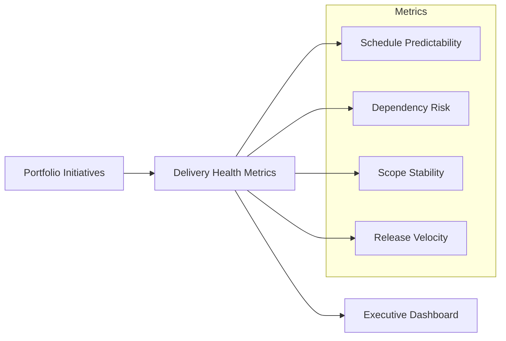

# Delivery Predictability Dashboard

The Delivery Predictability Dashboard provides leadership with a consolidated view of execution health across active portfolio initiatives.

The dashboard helps identify delivery risks early, monitor execution trends, and maintain transparency between product, engineering, and executive leadership.

---

## Example Dashboard

---

## Key Metrics

Delivery predictability dashboards typically monitor several categories of execution health.

**Schedule Predictability**

Measures whether initiatives are delivering milestones within expected timeframes.

Common signals:

- milestone completion rates  
- forecast vs actual delivery dates  
- sprint or iteration predictability  

---

**Dependency Risk**

Tracks cross-team or cross-system dependencies that may affect delivery timelines.

Examples include:

- external platform dependencies  
- integration points between services  
- vendor or partner constraints  

---

**Scope Stability**

Monitors the degree to which initiative scope changes during execution.

Frequent scope changes can indicate unclear requirements or shifting priorities.

---

**Release Velocity**

Tracks the cadence at which product increments are delivered to users or operational environments.

Velocity trends help leadership understand delivery capacity and identify execution bottlenecks.

---

## Portfolio View

Leadership dashboards often aggregate delivery signals across initiatives.

Example portfolio indicators include:

| Indicator | Description |
|---|---|
On Track | Initiative progressing within expected delivery parameters |
At Risk | Emerging issues may affect delivery timelines |
Off Track | Significant delivery issues requiring leadership attention |

These indicators help leadership focus attention where intervention may be required.

---

## Governance Use

Delivery dashboards are commonly reviewed during:

- portfolio governance reviews  
- product leadership meetings  
- engineering program reviews  
- executive delivery health updates  

They allow leadership teams to connect **investment decisions with execution outcomes**, ensuring that funded initiatives are delivering expected results.
