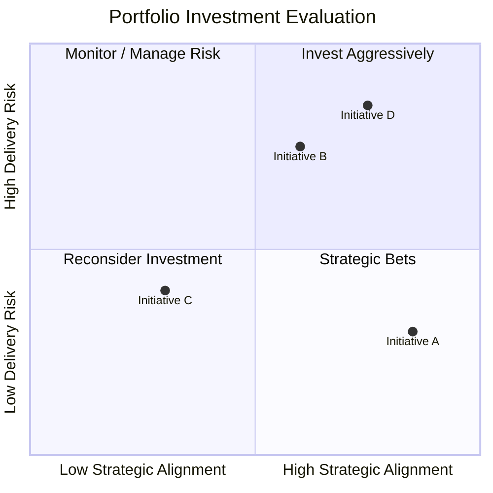

# Portfolio Heatmap Visualization

The Portfolio Heatmap is used during portfolio governance reviews to visualize proposed and active initiatives across key decision dimensions.

The visualization helps leadership evaluate tradeoffs between strategic alignment, delivery risk, and investment size when prioritizing initiatives.

---

## Example Portfolio Heatmap

---

## How to Interpret the Heatmap

Initiatives are plotted across two primary dimensions.

**Strategic Alignment**  
The degree to which an initiative supports enterprise strategic objectives, mission priorities, or portfolio themes.

**Delivery Risk**  
The level of execution risk associated with delivering the initiative, including technical complexity, cross-team dependencies, integration challenges, or operational constraints.

Together, these dimensions help leadership evaluate which initiatives should be prioritized, monitored more closely, deferred, or re-scoped.

---

## Typical Portfolio Interpretation

**Invest Aggressively**  
High strategic alignment with manageable delivery risk. These initiatives are typically strong candidates for prioritized funding and accelerated execution.

**Strategic Bets**  
High strategic alignment with elevated delivery risk. These initiatives may warrant investment, but usually require additional governance oversight, milestone controls, or dependency management.

**Monitor / Manage Risk**  
Moderate strategic alignment with higher delivery risk. These initiatives are often tracked closely to determine whether the expected value justifies the delivery complexity.

**Reconsider Investment**  
Lower strategic alignment with moderate or high delivery risk. These initiatives are commonly deferred, deprioritized, or redefined before further investment is approved.

---

## Governance Use

Portfolio heatmaps are commonly used during:

- quarterly portfolio review meetings
- strategic planning sessions
- investment prioritization discussions
- executive portfolio health reviews

They help leadership teams visualize portfolio balance, surface investment tradeoffs, and identify where additional scrutiny or intervention may be required.
